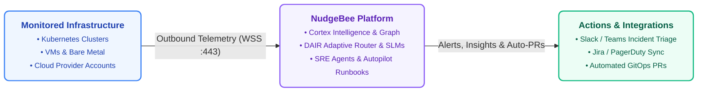
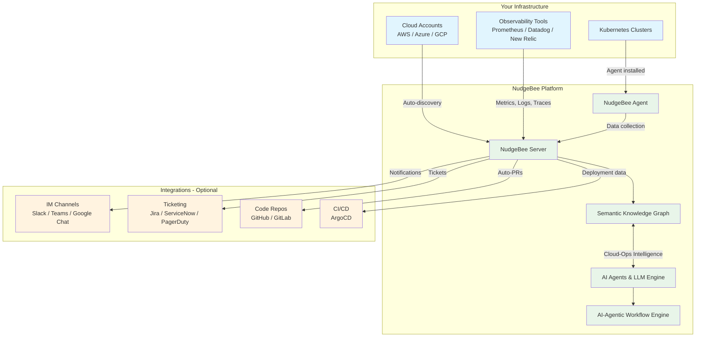

# Welcome to NudgeBee

NudgeBee is an **AI Agents & Agentic Workflow Platform for SRE, CloudOps, and Support Teams**. It combines 30+ pre-built Cloud-Ops AI agents with a customizable workflow engine to deliver faster troubleshooting, lower cloud costs, automated operations, and improved team productivity — across AWS, Azure, GCP, and on-premises Kubernetes environments.

NudgeBee's Semantic Knowledge Graph correlates logs, metrics, traces, and code to give your team Cloud-Ops Intelligence that reduces MTTR from hours to minutes. Pre-packaged but not a black box — every agent and workflow is fully extensible, modular, and controllable.

:::tip[Open Architecture & Licensing]
The **Community** edition is a free, source-available self-hosted edition containing the complete core monitoring, troubleshooting, optimization, workflow, and BYOM experience. The Server is licensed under **BSL 1.1** (converting to Apache 2.0 on its stated change date), and Agents are licensed under **Apache 2.0**. See [Editions & Capabilities](./editions.md) for the Community / Enterprise / Cloud comparison.
:::

<div style={{position: "relative", paddingBottom: "62.5%", height: 0}}><iframe src="https://www.loom.com/embed/0691f374484541468dcfb6d71fedd817?sid=970a6eb4-c0e9-40a2-b2c9-9ba145231f54" frameborder="0" webkitallowfullscreen mozallowfullscreen allowfullscreen style={{position: "absolute", top: 0, left: 0, width: "100%", height: "100%"}}></iframe></div>

---

## Choose Your Deployment Path

Select the path that matches your evaluation and security requirements:

<div style={{ display: 'grid', gridTemplateColumns: 'repeat(auto-fit, minmax(260px, 1fr))', gap: '1rem', margin: '1.5rem 0' }}>
  <div style={{ border: '1px solid #e0e0e0', borderRadius: '8px', padding: '1.25rem', backgroundColor: '#fbfbfb', display: 'flex', flexDirection: 'column', justifyContent: 'space-between' }}>
    <div>
      <h3 style={{ marginTop: 0 }}>⚡ Cloud SaaS</h3>
      <p style={{ fontSize: '0.9rem', color: '#555' }}><strong>Best for:</strong> Quickest evaluation with zero control plane infrastructure to manage.</p>
      <p style={{ fontSize: '0.85rem', color: '#666' }}><strong>Estimated time:</strong> 5–10 minutes</p>
      <ol style={{ paddingLeft: '1.2rem', fontSize: '0.9rem' }}>
        <li>Sign up at <a href="https://app.nudgebee.com">app.nudgebee.com</a>.</li>
        <li><a href="./installation/agent/installation/">Install the Agent</a> on your target Kubernetes cluster.</li>
        <li>Connect <a href="./integrations/Notifications/slack">Slack</a> and run your first NuBi investigation.</li>
      </ol>
    </div>
    <a href="https://app.nudgebee.com" className="button button--primary button--block" style={{ marginTop: '1rem' }}>Start Free Cloud Trial →</a>
  </div>

  <div style={{ border: '1px solid #e0e0e0', borderRadius: '8px', padding: '1.25rem', backgroundColor: '#fbfbfb', display: 'flex', flexDirection: 'column', justifyContent: 'space-between' }}>
    <div>
      <h3 style={{ marginTop: 0 }}>🚀 Community (Self-Hosted)</h3>
      <p style={{ fontSize: '0.9rem', color: '#555' }}><strong>Best for:</strong> Engineers testing on local or dev clusters (Kind, Minikube, EKS, GKE, AKS).</p>
      <p style={{ fontSize: '0.85rem', color: '#666' }}><strong>Estimated time:</strong> 20–30 minutes</p>
      <ol style={{ paddingLeft: '1.2rem', fontSize: '0.9rem' }}>
        <li><a href="./installation/server/">Deploy NudgeBee Server</a> using the default Helm chart.</li>
        <li>Connect your <a href="./integrations/LLM/">BYOM model provider</a> (OpenAI, Bedrock, Ollama).</li>
        <li><a href="./installation/agent/installation/">Install the Agent</a> on your monitored cluster.</li>
      </ol>
    </div>
    <a href="./installation/server/" className="button button--secondary button--block" style={{ marginTop: '1rem' }}>Community Quick Start →</a>
  </div>

  <div style={{ border: '1px solid #e0e0e0', borderRadius: '8px', padding: '1.25rem', backgroundColor: '#fbfbfb', display: 'flex', flexDirection: 'column', justifyContent: 'space-between' }}>
    <div>
      <h3 style={{ marginTop: 0 }}>🏢 Enterprise (Self-Hosted)</h3>
      <p style={{ fontSize: '0.9rem', color: '#555' }}><strong>Best for:</strong> Production-grade deployments requiring SAML SSO, high availability, and compliance.</p>
      <p style={{ fontSize: '0.85rem', color: '#666' }}><strong>Estimated time:</strong> 30–60+ minutes</p>
      <ol style={{ paddingLeft: '1.2rem', fontSize: '0.9rem' }}>
        <li>Choose bundled dependencies for evaluation, or external PostgreSQL & RabbitMQ for HA.</li>
        <li>Deploy Server with <a href="./installation/server/">Enterprise Helm values</a> and license key.</li>
        <li>Optionally configure <a href="./integrations/Authentication/SAML">SAML 2.0 SSO</a> and air-gapped SLMs.</li>
      </ol>
    </div>
    <a href="./installation/server/" className="button button--secondary button--block" style={{ marginTop: '1rem' }}>Enterprise Setup Guide →</a>
  </div>
</div>

---

## Core Concepts & Glossary

| Term | Definition | Role in Platform |
|---|---|---|
| **NuBi** | **SRE AI Agent** | Interacts in natural language via UI or Slack/Teams, investigates incidents, pulls traces/logs, and performs root cause analysis. |
| **NudgeBee Agent** | **In-Cluster Collector** | Lightweight DaemonSet & runner deployed inside monitored Kubernetes clusters to stream metrics, events, and eBPF network telemetry. |
| **NudgeBee Server** | **Control Plane** | Hosts the web dashboard, API, Semantic Knowledge Graph, database, and workflow orchestration engine. |
| **Semantic Knowledge Graph (SKG)** | **Relational Dependency Map** | Live topological graph correlating pods, nodes, cloud services, metrics, traces, git commits, and tickets. |
| **Autopilot** | **Automated Operations** | Policy-gated automated right-sizing and self-healing runbooks with configurable human approval checkpoints. |

---

## Deployment Models

NudgeBee is available in two deployment models — and self-hosted comes in two **editions** (free Community and licensed Enterprise — see [Editions & Capabilities](./editions.md)). Choose what fits your organization's requirements:

| | **Cloud SaaS** | **Self-Hosted (On-Prem)** |
|---|---|---|
| **How it works** | NudgeBee hosts and manages the server for you. You connect your infrastructure to the NudgeBee cloud. | You install the NudgeBee server on your own Kubernetes cluster. Available as the free Community edition (BSL 1.1) or the licensed Enterprise edition. |
| **Best for** | SRE, CloudOps, and Support teams that want to get started quickly without managing additional infrastructure. | Organizations with strict data residency, compliance, or air-gapped environment requirements — or anyone who wants a free, fully-functional self-hosted deployment. |
| **Security & Telemetry** | SOC 2 Type II and ISO 27001 certified. | No product analytics or phone-home telemetry is sent to NudgeBee. Operational telemetry collected from your workloads remains strictly within your self-hosted environment. See [Telemetry & Privacy](./telemetry.md). |
| **Get started** | Sign up at [app.nudgebee.com](https://app.nudgebee.com) | Follow the [Server Installation Guide](./installation/server/) |

---

## How NudgeBee Connects to Your Infrastructure

NudgeBee monitors your Kubernetes workloads by collecting metrics, events, logs, and traces from your clusters. This data feeds the Semantic Knowledge Graph and powers all of NudgeBee's troubleshooting, optimization, and automation capabilities.

NudgeBee has two components, both packaged as Helm charts that deploy natively on Kubernetes — no separate VMs, custom installers, or complex setup required:

| Component | What it does | Who installs it |
|---|---|---|
| **[NudgeBee Server](./installation/server/index.md)** | The control plane — hosts the UI, Semantic Knowledge Graph, AI agents, and workflow engine. | **Self-hosted users only.** Cloud SaaS users skip this — NudgeBee hosts it for you. |
| **[NudgeBee Agent](./installation/agent/installation/index.md)** | Lightweight collector that runs inside each cluster you want to monitor. Collects workload data and sends it to the server. | **Everyone** — both SaaS and self-hosted users. |

:::info Infrastructure Prerequisite
**Self-hosted users**: You need a Kubernetes cluster (or namespace) to run the NudgeBee Server. Sizing requires **12 GB RAM and 4 CPU cores total** with bundled dependencies (PostgreSQL, RabbitMQ, Redis), or **8 GB RAM and 2 CPU cores total** with externally managed databases. See the [Server Installation Sizing Table](./installation/server/index.md#system--sizing-requirements) for details.
:::

### Architecture at a Glance


```mermaid
flowchart LR
    classDef infra fill:#eff6ff,stroke:#3b82f6,stroke-width:2px,color:#1e40af,rx:8,ry:8;
    classDef platform fill:#f5f3ff,stroke:#8b5cf6,stroke-width:2px,color:#5b21b6,rx:8,ry:8;
    classDef integ fill:#ecfdf5,stroke:#10b981,stroke-width:2px,color:#065f46,rx:8,ry:8;

    INFRA["<b>Monitored Infrastructure</b><br/><small>• Kubernetes Clusters<br/>• VMs & Bare Metal<br/>• Cloud Provider Accounts</small>"]:::infra
    PLATFORM["<b>NudgeBee Platform</b><br/><small>• Cortex Intelligence & Graph<br/>• DAIR Adaptive Router & SLMs<br/>• SRE Agents & Autopilot Runbooks</small>"]:::platform
    INTEG["<b>Actions & Integrations</b><br/><small>• Slack / Teams Incident Triage<br/>• Jira / PagerDuty Sync<br/>• Automated GitOps PRs</small>"]:::integ

    INFRA -->|"Outbound Telemetry (WSS :443)"| PLATFORM
    PLATFORM -->|"Alerts, Insights & Auto-PRs"| INTEG
```

:::tip Deep-Dive: Platform Reference Architecture
For an in-depth breakdown of the 9-layer enterprise architecture (including the **Cortex Intelligence Layer**, **DAIR Adaptive Model Router**, in-VPC data plane, and runtime microservices), explore our dedicated **[Architecture & System Design Guide](./architecture.md)**.
:::

### Connecting Your Infrastructure

Once the server is running (or you have signed up for SaaS), connect your infrastructure:

- **1. Connect a Cloud Account (Broad Inventory & Cluster Discovery)**: Connecting [AWS](./features/Cloud/AWS.md), [Azure](./features/Cloud/Azure.md), or [GCP](./features/Cloud/GCP.md) automatically discovers cloud resources, managed Kubernetes clusters, load balancers, and billing data across your accounts.
- **2. Install the Agent (Deep Telemetry & Real-Time AI RCA)**: To enable deep workload monitoring, pod log analysis, distributed tracing, and live AI debugging on specific clusters, install the [NudgeBee Agent](./installation/agent/installation/index.md) inside each target cluster.


---

## LLM Configuration Options — BYOM (Bring Your Own Model)

NudgeBee uses flexible AI models — including modular SLMs, LLMs, and specialized agents — for AI-powered troubleshooting, root cause analysis, and agentic automation. You have three options for configuring the LLM:

| Option | Description | Best for |
|---|---|---|
| **NudgeBee-Provided LLM API** | NudgeBee manages the LLM for you. No configuration needed. | Cloud SaaS users who want zero setup. |
| **BYOM — Your Own Licensed LLM Provider** | Connect your own API key from [OpenAI](./integrations/LLM/OpenAI/), [Azure OpenAI](./integrations/LLM/Azure/azure-openai.md), [AWS Bedrock](./integrations/LLM/Aws/bedrock.md), [Google Vertex AI](./integrations/LLM/Google/vertex-ai.md), or [Gemini](./integrations/LLM/Google/gemini.md). | Teams that already have LLM provider contracts or want to control model selection. |
| **Self-Hosted / Internal LLM** | Use [Ollama](./integrations/LLM/Ollama/), [HuggingFace](./integrations/LLM/HuggingFace/), or [AWS SageMaker](./integrations/LLM/Aws/sagemaker.md) with your own models. | Organizations with data privacy requirements or custom-trained models. |

:::note
SaaS users get a NudgeBee-managed LLM by default. The [LLM integration section](./integrations/LLM/) is primarily for self-hosted users or those who want to use their own LLM provider.
:::

---

## What You Can Do with NudgeBee

NudgeBee ships with 30+ pre-built Cloud-Ops Agents and 30+ integrations. Capabilities grow as you connect more of your stack. The table below shows what each integration unlocks:

| Integration | What It Unlocks | When It's Needed |
|---|---|---|
| **[Kubernetes cluster](./installation/agent/installation/index.md)** or **[Cloud account](./features/Cloud/index.md)** | Core monitoring, [Semantic Knowledge Graph](./features/knowledge-graph.md), [cost optimizations](./features/optimizations.md) | **Required for infrastructure visibility** |
| **[Observability source](./integrations/Observability/index.md)** (Prometheus, Datadog, New Relic, etc.) | Metrics, [SLOs](./features/slo.md), alerting, [troubleshooting](./features/troubleshooting/index.md) | **Required for metrics, SLOs, and utilization graphs** |
| **[LLM connection](./integrations/LLM/index.md)** (BYOM) | NuBi AI agent, natural-language triage, [auto-runbooks](./features/autopilot/auto_runbook/index.md) | **Required for NuBi and AI-powered features** |
| **[IM channel](./integrations/Notifications/index.md)** (Slack, Teams, Google Chat) | [Notifications](./features/notifications.md), interactive alerts, ChatOps | **Optional; recommended for operational alerting** |
| **Email** | Email notifications and daily reports | Optional |
| **[GitHub](./integrations/Code%20Repository/GitHub/github-integration.md)** / **[GitLab](./integrations/Code%20Repository/GitLab/gitlab-integration.md)** | Auto-PRs for optimization recommendations, code-level troubleshooting | Optional |
| **[CI/CD system](./integrations/CICD/argocd-integration.md)** (ArgoCD) | Deployment change correlation, rollback insights | Optional |
| **[Ticketing system](./integrations/Tickets/index.md)** (Jira, ServiceNow, PagerDuty, GitHub Issues, GitLab Issues) | Ticket creation, auto-responses, similar-issue search, runbook references | Optional |
| **[Authentication provider](./integrations/Authentication/index.md)** | OAuth SSO (Google/Okta/Azure AD/Auth0) — all editions. SAML 2.0 — Enterprise/Cloud only. | Optional |

---

## Quick Start: The Fastest Way to Get Started

Follow these steps to go from zero to a working NudgeBee setup. The path differs slightly depending on whether you are using Cloud SaaS or self-hosting.

| Step | Cloud SaaS | Self-Hosted |
|---|---|---|
| **1. Get access** | [Sign up at app.nudgebee.com](https://app.nudgebee.com) — ready in seconds with zero infrastructure to manage. | [Install the NudgeBee Server](./installation/server/index.md) on a Kubernetes cluster. Takes 15–30 minutes. |
| **2. Connect AI (LLM)** | Managed LLM included by default. Nothing to configure. | [Connect your BYOM model provider](./integrations/LLM/index.md) (OpenAI, Bedrock, Ollama) under Settings → AI / LLM. |
| **3. Connect your clusters** | [Install the Agent](./installation/agent/installation/index.md) on each cluster, or [connect a cloud account](./features/Cloud/index.md). | Same — [install the Agent](./installation/agent/installation/index.md) on each monitored cluster. |
| **4. Verify observability** | Ingest metrics from the agent or connect external tools ([Prometheus, Datadog](./integrations/Observability/index.md)). | Same — verify bundled Prometheus or connect your observability stack. |
| **5. Run first investigation** | Open the **NuBi AI drawer** to run your first cluster health investigation. | Same — run your first natural-language triage investigation with NuBi. |
| **6. Configure integrations** | Connect [Slack/Teams](./integrations/Notifications/) for alerts and [GitHub/GitLab](./integrations/Code%20Repository/GitHub/github-integration.md) for auto-PRs. | Same — configure notification channels, ticketing, and GitOps repositories. |

:::tip
Steps 4–6 can be tailored to your workflow. Each integration expands platform capabilities independently.
:::

---

## First Login and Onboarding

### Accessing NudgeBee

After installation or sign-up, access the NudgeBee UI:

- **Cloud SaaS**: Go to [app.nudgebee.com](https://app.nudgebee.com) and log in with your email.
- **Self-hosted with DNS/Ingress**: Navigate to the URL you configured during server installation.
- **Self-hosted without DNS**: Use port-forwarding to access the UI locally:
  ```shell
  kubectl port-forward svc/app 3000:80 -n nudgebee
  ```
  Then open `http://localhost:3000` in your browser.

### Login Options

NudgeBee supports multiple authentication methods depending on your deployment:

- **Bootstrap Administrator Credentials**: For initial self-hosted installation, retrieve the auto-generated password from the `nudgebee` Kubernetes secret. Disable this in production after configuring SSO.
- **SSO (Single Sign-On)**: Log in with Google, Microsoft/Azure AD, Okta, or Auth0 (all editions). SAML 2.0 with IdP group mapping is supported on Enterprise and Cloud.
- **Magic Link**: Enter your email address and receive a one-time login link — no password needed (Cloud SaaS default).
- **Admin Invite**: Accept an email invitation link sent by your organization administrator.

:::info Authentication Privacy
NudgeBee Cloud uses passwordless authentication. Self-hosted installations initially create a bootstrap administrator credential, which should be disabled after configuring production authentication.
:::

---

## Progressive Capability Matrix

NudgeBee delivers value in stages as you connect components of your stack:

| Stage | Connected Component | What It Unlocks |
|:---:|---|---|
| **1** | **Server Only** | Control plane UI, admin settings, user management, and API access |
| **2** | **K8s Agent Connected** | Real-time cluster inventory, pod health, node statuses, and Kubernetes event stream |
| **3** | **Metrics & Observability** | CPU/memory utilization graphs, SLO tracking, rightsizing recommendations, and cost breakdown |
| **4** | **LLM (BYOM) Connected** | NuBi AI Assistant, natural-language cluster queries, automated incident RCA, and runbook suggestions |
| **5** | **Notifications (Slack / Teams)** | Incident alerting, interactive ChatOps triage buttons, and daily digest summaries |
| **6** | **Git Repository (GitHub / GitLab)** | Automated PR generation for resource limit changes and GitOps reconciliation |

---

## Onboarding Troubleshooting Decision Tree

If you encounter an issue during initial setup, use this decision tree to pinpoint the cause:

```text
1. Can you load the Web UI at http://localhost:3000 (or your ingress domain)?
   ├── NO  → Check server pods: `kubectl get pods -n nudgebee`
   │         See Server Troubleshooting: /docs/installation/server/#troubleshooting-installation-failures
   └── YES → Proceed to step 2

2. Does your Kubernetes cluster appear with a "Connected" badge in the UI?
   ├── NO  → Check agent runner logs: `kubectl logs -n nudgebee-agent -l component=runner`
   │         Ensure outbound TCP port 443 is permitted in your cluster NetworkPolicy.
   └── YES → Proceed to step 3

3. Are CPU and memory metric charts populating for workloads?
   ├── NO  → Verify Prometheus URL: check `globalConfig.prometheus_url` in agent values.yaml.
   └── YES → Proceed to step 4

4. Does NuBi answer natural-language cluster questions?
   ├── NO  → Verify BYOM model provider API key under Settings → AI / LLM.
   └── YES → Setup is healthy and complete!
```

---

### What to Do After Your First Login

Once you are logged in, here is what to explore first:

1. **Start saving on cloud costs** — Go to **Optimizations** to see immediate cost-saving and performance improvement recommendations. The FinOps AI-Assistant has already analyzed your resource utilization and identified right-sizing, scaling, and cleanup opportunities — most teams find actionable savings within minutes.

2. **Resolve incidents faster with AI** — Navigate to **Troubleshoot** to see real-time events across your clusters. If an LLM is connected, NuBi (the SRE AI Agent) can analyze incidents and suggest root causes in plain language — reducing your MTTR from hours to minutes.

3. **Get alerted on what matters** — Configure a [notification channel](./integrations/Notifications/index.md) (Slack, Teams, or Google Chat) so your team receives alerts for critical events, anomalies, and optimization opportunities without needing to check the dashboard.

4. **Automate repetitive operations** — Use the [Workflow Builder](./features/workflow-builder/index.md) (AI-Agentic Workflow Engine) to automate common tasks like health checks, scaling, or incident response in minutes. Choose from rule-based workflows or agentic modes with human-in-loop approvals — no coding required.

5. **Understand your infrastructure at a glance** — Navigate to **Troubleshoot > Knowledge Graph** to see how all your services, workloads, and dependencies connect. The Semantic Knowledge Graph correlates logs, metrics, traces, and code into a single visual map — it populates automatically once a cluster or cloud account is connected.

---

## Architecture Overview


```mermaid
graph TB
    subgraph Your Infrastructure
        K8S[Kubernetes Clusters]
        CLOUD[Cloud Accounts<br/>AWS / Azure / GCP]
        OBS[Observability Tools<br/>Prometheus / Datadog / New Relic]
    end

    subgraph NudgeBee Platform
        SERVER[NudgeBee Server]
        AGENT[NudgeBee Agent]
        SKG[Semantic Knowledge Graph]
        LLM_ENGINE[AI Agents & LLM Engine]
        WORKFLOW[AI-Agentic Workflow Engine]
    end

    subgraph Integrations - Optional
        IM[IM Channels<br/>Slack / Teams / Google Chat]
        TICKET[Ticketing<br/>Jira / ServiceNow / PagerDuty]
        REPO[Code Repos<br/>GitHub / GitLab]
        CICD[CI/CD<br/>ArgoCD]
    end

    K8S -->|Agent installed| AGENT
    CLOUD -->|Auto-discovery| SERVER
    OBS -->|Metrics, Logs, Traces| SERVER
    AGENT -->|Data collection| SERVER
    SERVER --> SKG
    SKG <-->|Cloud-Ops Intelligence| LLM_ENGINE
    LLM_ENGINE --> WORKFLOW
    SERVER -->|Notifications| IM
    SERVER -->|Tickets| TICKET
    SERVER -->|Auto-PRs| REPO
    SERVER -->|Deployment data| CICD

    style K8S fill:#e1f5fe
    style CLOUD fill:#e1f5fe
    style OBS fill:#e1f5fe
    style SERVER fill:#e8f5e9
    style AGENT fill:#e8f5e9
    style SKG fill:#e8f5e9
    style LLM_ENGINE fill:#e8f5e9
    style WORKFLOW fill:#e8f5e9
    style IM fill:#fff3e0
    style TICKET fill:#fff3e0
    style REPO fill:#fff3e0
    style CICD fill:#fff3e0
```
