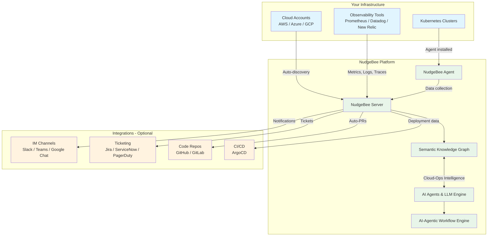

# Welcome to NudgeBee

NudgeBee is an **AI Agents & Agentic Workflow Platform for SRE, CloudOps, and Support Teams**. It combines 30+ pre-built Cloud-Ops AI agents with a customizable workflow engine to deliver faster troubleshooting, lower cloud costs, automated operations, and improved team productivity — across AWS, Azure, GCP, and on-premises Kubernetes environments.

NudgeBee's Semantic Knowledge Graph correlates logs, metrics, traces, and code to give your team Cloud-Ops Intelligence that reduces MTTR from hours to minutes. Pre-packaged but not a black box — every agent and workflow is fully extensible, modular, and controllable.

:::tip[NudgeBee is open source]
The **Community** edition is free, Apache 2.0 licensed, and fully functional — self-host it from public images on `ghcr.io/nudgebee` with no license key. See [Editions](./editions.md) for the Community / Enterprise / Cloud comparison.
:::

<div style={{position: "relative", paddingBottom: "62.5%", height: 0}}><iframe src="https://www.loom.com/embed/0691f374484541468dcfb6d71fedd817?sid=970a6eb4-c0e9-40a2-b2c9-9ba145231f54" frameborder="0" webkitallowfullscreen mozallowfullscreen allowfullscreen style={{position: "absolute", top: 0, left: 0, width: "100%", height: "100%"}}></iframe></div>

---

---

## Get Started in 3 Steps: Fork in the Road

Choose your path to get up and running:

<div style={{ display: 'grid', gridTemplateColumns: 'repeat(auto-fit, minmax(280px, 1fr))', gap: '1rem', margin: '1.5rem 0' }}>
  <div style={{ border: '1px solid #e0e0e0', borderRadius: '8px', padding: '1.25rem', backgroundColor: '#fbfbfb' }}>
    <h3 style={{ marginTop: 0 }}>⚡ Option A: Cloud SaaS (5 mins)</h3>
    <p>Zero infrastructure to manage. Evaluated and ready instantly.</p>
    <ol>
      <li>Sign up at <a href="https://app.nudgebee.com">app.nudgebee.com</a>.</li>
      <li><a href="./installation/agent/installation/">Install the Agent</a> on your cluster (or connect your cloud account).</li>
      <li>Connect <a href="./integrations/Notifications/slack">Slack</a> and start exploring AI insights.</li>
    </ol>
  </div>
  <div style={{ border: '1px solid #e0e0e0', borderRadius: '8px', padding: '1.25rem', backgroundColor: '#fbfbfb' }}>
    <h3 style={{ marginTop: 0 }}>🛡️ Option B: Self-Hosted / On-Prem</h3>
    <p>Complete data isolation inside your own Kubernetes environment.</p>
    <ol>
      <li><a href="./installation/server/">Deploy NudgeBee Server</a> on your Kubernetes cluster via Helm.</li>
      <li>Configure your <a href="./integrations/LLM/">BYOM LLM provider</a> (or local Ollama/vLLM).</li>
      <li><a href="./installation/agent/installation/">Install the Agent</a> on monitored clusters.</li>
    </ol>
  </div>
</div>

---

## Core Concepts & Glossary

| Term | Definition | Role in Platform |
|---|---|---|
| **NuBi** | **SRE AI Agent** | Interacts in natural language via UI or Slack/Teams, investigates incidents, pulls traces/logs, and performs root cause analysis. |
| **NudgeBee Agent** | **In-Cluster Collector** | Lightweight DaemonSet & runner deployed inside monitored Kubernetes clusters to stream metrics, events, and eBPF network telemetry. |
| **NudgeBee Server** | **Control Plane** | Hosts the web dashboard, API, Semantic Knowledge Graph, database, and workflow orchestration engine. |
| **Semantic Knowledge Graph (SKG)** | **Relational Dependency Map** | Live topological graph correlating pods, nodes, cloud services, metrics, traces, git commits, and tickets. |
| **Autopilot** | **Automated Operations** | Policy-gated automated right-sizing and self-healing runbooks with configurable human approval checkpoints. |

---

## Deployment Models

NudgeBee is available in two deployment models — and self-hosted comes in two **editions** (free Community and licensed Enterprise — see [Editions](./editions.md)). Choose what fits your organization's requirements:

| | **Cloud SaaS** | **Self-Hosted (On-Prem)** |
|---|---|---|
| **How it works** | NudgeBee hosts and manages the server for you. You connect your infrastructure to the NudgeBee cloud. | You install the NudgeBee server on your own Kubernetes cluster. Available as the free open-source **Community** edition or the licensed **Enterprise** edition. |
| **Best for** | SRE, CloudOps, and Support teams that want to get started quickly without managing additional infrastructure. | Organizations with strict data residency, compliance, or air-gapped environment requirements — or anyone who wants a free, fully-functional self-hosted deployment. |
| **Security** | SOC 2 Type II and ISO 27001 certified. | Full data control within your own infrastructure. No telemetry — see [Telemetry & Privacy](./telemetry.md). |
| **Get started** | Sign up at [app.nudgebee.com](https://app.nudgebee.com) | Follow the [Server Installation Guide](./installation/server/) |

---

## How NudgeBee Connects to Your Infrastructure

NudgeBee monitors your Kubernetes workloads by collecting metrics, events, logs, and traces from your clusters. This data feeds the Semantic Knowledge Graph and powers all of NudgeBee's troubleshooting, optimization, and automation capabilities.

NudgeBee has two components, both packaged as Helm charts that deploy natively on Kubernetes — no separate VMs, custom installers, or complex setup required:

| Component | What it does | Who installs it |
|---|---|---|
| **[NudgeBee Server](./installation/server/index.md)** | The control plane — hosts the UI, Semantic Knowledge Graph, AI agents, and workflow engine. | **Self-hosted users only.** Cloud SaaS users skip this — NudgeBee hosts it for you. |
| **[NudgeBee Agent](./installation/agent/installation/index.md)** | Lightweight collector that runs inside each cluster you want to monitor. Collects workload data and sends it to the server. | **Everyone** — both SaaS and self-hosted users. |

:::info Infrastructure Prerequisite
**Self-hosted users**: You need a dedicated Kubernetes cluster (or namespace) to run the NudgeBee Server before connecting your monitored clusters. Sizing typically requires a 2-node cluster with 16 GB RAM and 4 cores per node. If you do not have Kubernetes clusters to run the server on, choose **Cloud SaaS**.
:::

### Architecture at a Glance

```mermaid
flowchart LR
    classDef infra fill:#eff6ff,stroke:#3b82f6,stroke-width:2px,color:#1e40af,rx:8,ry:8;
    classDef platform fill:#f5f3ff,stroke:#8b5cf6,stroke-width:2px,color:#5b21b6,rx:8,ry:8;
    classDef integ fill:#ecfdf5,stroke:#10b981,stroke-width:2px,color:#065f46,rx:8,ry:8;

    INFRA["<b>Monitored Infrastructure</b><br/><small>• Kubernetes Clusters<br/>• VMs & Bare Metal<br/>• Cloud Provider Accounts</small>"]:::infra
    PLATFORM["<b>NudgeBee Platform</b><br/><small>• Cortex Intelligence & Graph<br/>• DAIR Adaptive Router & SLMs<br/>• SRE Agents & Autopilot Runbooks</small>"]:::platform
    INTEG["<b>Actions & Integrations</b><br/><small>• Slack / Teams Incident Triage<br/>• Jira / PagerDuty Sync<br/>• Automated GitOps PRs</small>"]:::integ

    INFRA -->|Outbound Telemetry (WSS :443)| PLATFORM
    PLATFORM -->|Alerts, Insights & Auto-PRs| INTEG
```

:::tip Deep-Dive: Platform Reference Architecture
For an in-depth breakdown of the 9-layer enterprise architecture (including the **Cortex Intelligence Layer**, **DAIR Adaptive Model Router**, in-VPC data plane, and runtime microservices), explore our dedicated **[Architecture & System Design Guide](./architecture.md)**.
:::

### Connecting Your Infrastructure

Once the server is running (or you have signed up for SaaS), connect your infrastructure:

- **1. Connect a Cloud Account (Broad Inventory & Cluster Discovery)**: Connecting [AWS](./features/Cloud/AWS.md), [Azure](./features/Cloud/Azure.md), or [GCP](./features/Cloud/GCP.md) automatically discovers cloud resources, managed Kubernetes clusters, load balancers, and billing data across your accounts.
- **2. Install the Agent (Deep Telemetry & Real-Time AI RCA)**: To enable deep workload monitoring, pod log analysis, distributed tracing, and live AI debugging on specific clusters, install the [NudgeBee Agent](./installation/agent/installation/index.md) inside each target cluster.


---

## LLM Configuration Options — BYOM (Bring Your Own Model)

NudgeBee uses flexible AI models — including modular SLMs, LLMs, and specialized agents — for AI-powered troubleshooting, root cause analysis, and agentic automation. You have three options for configuring the LLM:

| Option | Description | Best for |
|---|---|---|
| **NudgeBee-Provided LLM API** | NudgeBee manages the LLM for you. No configuration needed. | Cloud SaaS users who want zero setup. |
| **BYOM — Your Own Licensed LLM Provider** | Connect your own API key from [OpenAI](./integrations/LLM/OpenAI/), [Azure OpenAI](./integrations/LLM/Azure/azure-openai.md), [AWS Bedrock](./integrations/LLM/Aws/bedrock.md), [Google Vertex AI](./integrations/LLM/Google/vertex-ai.md), or [Gemini](./integrations/LLM/Google/gemini.md). | Teams that already have LLM provider contracts or want to control model selection. |
| **Self-Hosted / Internal LLM** | Use [Ollama](./integrations/LLM/Ollama/), [HuggingFace](./integrations/LLM/HuggingFace/), or [AWS SageMaker](./integrations/LLM/Aws/sagemaker.md) with your own models. | Organizations with data privacy requirements or custom-trained models. |

:::note
SaaS users get a NudgeBee-managed LLM by default. The [LLM integration section](./integrations/LLM/) is primarily for self-hosted users or those who want to use their own LLM provider.
:::

---

## What You Can Do with NudgeBee

NudgeBee ships with 30+ pre-built Cloud-Ops Agents and 30+ integrations. Capabilities grow as you connect more of your stack. The table below shows what each integration unlocks.

| Integration | What It Unlocks | Required? |
|---|---|---|
| **[Kubernetes cluster](./installation/agent/installation/index.md)** or **[Cloud account](./features/Cloud/index.md)** | Core monitoring, [Semantic Knowledge Graph](./features/knowledge-graph.md), [cost optimizations](./features/optimizations.md) | **Required** (one of the two) |
| **[Observability source](./integrations/Observability/index.md)** (Prometheus, Datadog, New Relic, etc.) | Metrics, [SLOs](./features/slo.md), alerting, [troubleshooting](./features/troubleshooting/index.md) | **Required** |
| **[LLM connection](./integrations/LLM/index.md)** | NuBi AI agent, AI-powered troubleshooting, pre-built agents, [auto-runbooks](./features/autopilot/auto_runbook/index.md) | Recommended |
| **[IM channel](./integrations/Notifications/index.md)** (Slack, Teams, Google Chat) | [Notifications](./features/notifications.md), interactive alerts, ChatOps | Recommended |
| **Email** | Email notifications and daily reports | Optional |
| **[GitHub](./integrations/Code%20Repository/GitHub/github-integration.md)** / **[GitLab](./integrations/Code%20Repository/GitLab/gitlab-integration.md)** | Auto-PRs for optimization recommendations, code-level troubleshooting | Optional |
| **[CI/CD system](./integrations/CICD/argocd-integration.md)** (ArgoCD) | Deployment change correlation, rollback insights | Optional |
| **[Ticketing system](./integrations/Tickets/index.md)** (Jira, ServiceNow, PagerDuty, GitHub Issues, GitLab Issues) | Ticket creation, auto-responses, similar-issue search, runbook references | Optional |
| **[Authentication provider](./integrations/Authentication/index.md)** | OAuth SSO (Google/Okta/Azure AD/Auth0) — all editions. SAML 2.0 — Enterprise/Cloud only. | Optional |

---

## Quick Start: The Fastest Way to Get Started

Follow these steps to go from zero to a working NudgeBee setup. The path differs slightly depending on whether you are using Cloud SaaS or self-hosting.

| Step | Cloud SaaS | Self-Hosted |
|---|---|---|
| **1. Get access** | [Sign up at app.nudgebee.com](https://app.nudgebee.com) — no installation needed, you are ready in seconds. | [Install the NudgeBee Server](./installation/server/index.md) on a Kubernetes cluster. Takes 15–30 minutes. |
| **2. Connect your clusters** | [Install the Agent](./installation/agent/installation/index.md) on each cluster, or [connect a cloud account](./features/Cloud/index.md) for auto-discovery. | Same — [install the Agent](./installation/agent/installation/index.md) or [connect a cloud account](./features/Cloud/index.md). |
| **3. Connect observability** | Connect your existing monitoring tools (Prometheus, Datadog, New Relic, etc.). See [Observability Integrations](./integrations/Observability/index.md). | Same — connect your monitoring tools. |
| **4. Enable AI** | Already included — a managed LLM is provided. Nothing to configure. | [Connect an LLM provider](./integrations/LLM/index.md) (BYOM) to enable NuBi and AI-powered troubleshooting. |
| **5. Set up notifications** | Connect [Slack](./integrations/Notifications/slack.md), [Teams](./integrations/Notifications/msteams.md), or [Google Chat](./integrations/Notifications/google_chat.md). | Same — connect your messaging tool. |
| **6. Explore** | You are ready! Check [Optimizations](./features/optimizations.md), [Troubleshooting](./features/troubleshooting/index.md), and the [Semantic Knowledge Graph](./features/knowledge-graph.md). | Same — start exploring the dashboard. |

:::tip
Steps 3–5 can be done in any order. Each integration adds capabilities independently — you do not need to complete everything before you start seeing value.
:::

---

## First Login and Onboarding

### Accessing NudgeBee

After installation or sign-up, access the NudgeBee UI:

- **Cloud SaaS**: Go to [app.nudgebee.com](https://app.nudgebee.com) and log in with your email.
- **Self-hosted with DNS/Ingress**: Navigate to the URL you configured during server installation.
- **Self-hosted without DNS**: Use port-forwarding to access the UI locally:
  ```shell
  kubectl port-forward svc/app 3000:80 -n nudgebee
  ```
  Then open `http://localhost:3000` in your browser.

### Login Options

NudgeBee supports multiple authentication methods:

- **SSO (Single Sign-On)**: Log in with Google, Azure, Okta, or Auth0. Available when [authentication integration](./integrations/Authentication/) is configured.
- **Magic Link**: Enter your email address and receive a one-time login link — no password needed. This is the default method when SSO is not configured.
- **Admin Invite**: If your team admin has added you, you will receive an email invitation with a login link.

:::info
NudgeBee does not store passwords. Authentication is handled through SSO providers or magic email links, keeping your login secure and simple.
:::

### What to Do After Your First Login

Once you are logged in, here is what to explore first:

1. **Start saving on cloud costs** — Go to **Optimizations** to see immediate cost-saving and performance improvement recommendations. The FinOps AI-Assistant has already analyzed your resource utilization and identified right-sizing, scaling, and cleanup opportunities — most teams find actionable savings within minutes.

2. **Resolve incidents faster with AI** — Navigate to **Troubleshoot** to see real-time events across your clusters. If an LLM is connected, NuBi (the SRE AI Agent) can analyze incidents and suggest root causes in plain language — reducing your MTTR from hours to minutes.

3. **Get alerted on what matters** — Configure a [notification channel](./integrations/Notifications/index.md) (Slack, Teams, or Google Chat) so your team receives alerts for critical events, anomalies, and optimization opportunities without needing to check the dashboard.

4. **Automate repetitive operations** — Use the [Workflow Builder](./features/workflow-builder/index.md) (AI-Agentic Workflow Engine) to automate common tasks like health checks, scaling, or incident response in minutes. Choose from rule-based workflows or agentic modes with human-in-loop approvals — no coding required.

5. **Understand your infrastructure at a glance** — Navigate to **Troubleshoot > Knowledge Graph** to see how all your services, workloads, and dependencies connect. The Semantic Knowledge Graph correlates logs, metrics, traces, and code into a single visual map — it populates automatically once a cluster or cloud account is connected.

---

## Architecture Overview


```mermaid
graph TB
    subgraph Your Infrastructure
        K8S[Kubernetes Clusters]
        CLOUD[Cloud Accounts<br/>AWS / Azure / GCP]
        OBS[Observability Tools<br/>Prometheus / Datadog / New Relic]
    end

    subgraph NudgeBee Platform
        SERVER[NudgeBee Server]
        AGENT[NudgeBee Agent]
        SKG[Semantic Knowledge Graph]
        LLM_ENGINE[AI Agents & LLM Engine]
        WORKFLOW[AI-Agentic Workflow Engine]
    end

    subgraph Integrations - Optional
        IM[IM Channels<br/>Slack / Teams / Google Chat]
        TICKET[Ticketing<br/>Jira / ServiceNow / PagerDuty]
        REPO[Code Repos<br/>GitHub / GitLab]
        CICD[CI/CD<br/>ArgoCD]
    end

    K8S -->|Agent installed| AGENT
    CLOUD -->|Auto-discovery| SERVER
    OBS -->|Metrics, Logs, Traces| SERVER
    AGENT -->|Data collection| SERVER
    SERVER --> SKG
    SKG <-->|Cloud-Ops Intelligence| LLM_ENGINE
    LLM_ENGINE --> WORKFLOW
    SERVER -->|Notifications| IM
    SERVER -->|Tickets| TICKET
    SERVER -->|Auto-PRs| REPO
    SERVER -->|Deployment data| CICD

    style K8S fill:#e1f5fe
    style CLOUD fill:#e1f5fe
    style OBS fill:#e1f5fe
    style SERVER fill:#e8f5e9
    style AGENT fill:#e8f5e9
    style SKG fill:#e8f5e9
    style LLM_ENGINE fill:#e8f5e9
    style WORKFLOW fill:#e8f5e9
    style IM fill:#fff3e0
    style TICKET fill:#fff3e0
    style REPO fill:#fff3e0
    style CICD fill:#fff3e0
```
