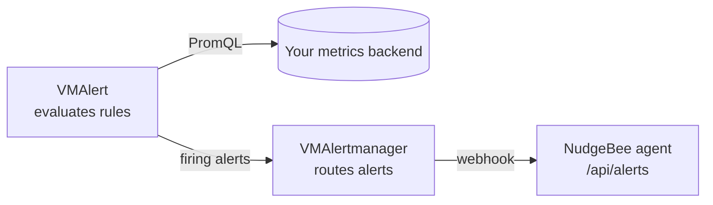
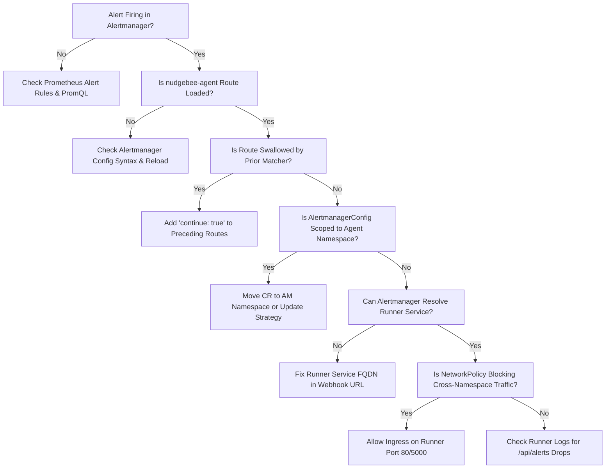

# Alert Forwarding (Alertmanager)

NudgeBee investigates the alerts you already have. To get them, your Alertmanager has to POST them to the agent. The agent Helm chart cannot set this up, because the configuration lives in your Alertmanager.

If you skip it, nothing breaks visibly. Metrics are pulled, so a bad Prometheus URL shows up right away. Alerts are pushed, so when no receiver targets the agent, all the pods stay healthy, no error is logged, and NudgeBee just never raises an alert-driven event. If your cluster shows metrics and workloads but no alerts, start here.

There are three independent checks:

| Check | What it proves | Where to diagnose |
|---|---|---|
| **Alertmanager Connected** in Agent Health | The runner can reach the configured Alertmanager `/-/healthy` endpoint. | Agent configuration, service discovery, authentication, and NetworkPolicy. |
| NudgeBee receiver appears in the loaded Alertmanager route tree | Alertmanager accepted the routing configuration. | The generated Alertmanager config and route ordering. |
| A firing alert appears in NudgeBee | Alertmanager matched the route and delivered the webhook to the correct agent/account. | Alertmanager delivery logs, receiver URL, network path, and agent logs. |

A green Agent Health status proves only the first check. It does not prove that Alertmanager is configured to send alerts to NudgeBee.

## The address alerts go to

```
http://<release>-runner.<agent-namespace>.svc/api/alerts
```

With the default install (release `nudgebee-agent` in namespace `nudgebee-agent`):

```
http://nudgebee-agent-runner.nudgebee-agent.svc/api/alerts
```

`helm install` prints the URL for your release. To look it up later:

```bash
kubectl get svc -A -l component=runner
```

The Service listens on port 80 and forwards to the runner's 5000, so the URL needs no port.

## Find your Alertmanager

```bash
kubectl get alertmanagers.monitoring.coreos.com -A
kubectl get thanosrulers.monitoring.coreos.com -A
kubectl get vmalertmanagers.operator.victoriametrics.com -A
kubectl get svc,deploy,sts -A | grep -Ei 'alertmanager|thanos-rule|thanos-quer'
```

| What you have | Section |
|---|---|
| Prometheus installed from the NudgeBee values file | [kube-prometheus-stack](#kube-prometheus-stack) |
| An `Alertmanager` CR from prometheus-operator, often next to Thanos | [Operator-managed Alertmanager](#operator-managed-alertmanager) |
| Alertmanager as a Deployment with a ConfigMap | [Plain Alertmanager](#plain-alertmanager) |
| No Alertmanager, metrics in a managed backend | [VMAlert + VMAlertmanager](#vmalert--vmalertmanager) |
| Alertmanager in another cluster or a SaaS | [External Alertmanager](#external-alertmanager) |

---

## The config to add

Every in-cluster option below adds the same route and receiver:

```yaml
route:
  routes:
    - receiver: nudgebee-agent
      group_by: ['...']
      group_wait: 1s
      group_interval: 1s
      repeat_interval: 4h
      continue: true

receivers:
  - name: nudgebee-agent
    webhook_configs:
      - url: 'http://nudgebee-agent-runner.nudgebee-agent.svc/api/alerts'
        send_resolved: true
```

Add the route to your existing `route.routes` list and the receiver to your existing `receivers` list. Do not replace either list.

`continue: true` is not optional. Without it the first matching route wins and your PagerDuty and Slack receivers stop getting alerts. That is the usual way this change breaks a working setup.

`group_by: ['...']` turns off grouping for this route. NudgeBee groups and correlates alerts on its own side, and grouping in Alertmanager first throws away the labels it needs. It also means each notification carries a single alert, so you do not need `max_alerts` — and should not set it, since it truncates rather than splits.

---

## kube-prometheus-stack

The NudgeBee values file already contains the receiver, so an install from it needs nothing extra:

```bash
helm upgrade --install nudgebee-prometheus prometheus-community/kube-prometheus-stack \
  -n nudgebee-agent --create-namespace \
  -f https://raw.githubusercontent.com/nudgebee/k8s-agent/main/kube-prometheus-stack-values.yaml
```

One catch: a values file cannot template, so the URL in it is hardcoded to `nudgebee-agent-runner.nudgebee-agent.svc`. It resolves only if your agent release is named `nudgebee-agent` in a namespace of the same name. With any other name, download the file, replace that URL with the one `helm install` printed, and install from your copy. When the URL does not resolve, Alertmanager logs the failed sends and fires `AlertmanagerFailedToSendAlerts`, but NudgeBee has no way to tell you it is missing alerts.

If you already run kube-prometheus-stack and did not install it from that file, add the route and receiver under `alertmanager.config` in your own values:

```bash
helm -n <ns> get values <release> -o yaml > /tmp/values.yaml
# add the route and receiver under alertmanager.config
helm -n <ns> upgrade <release> prometheus-community/kube-prometheus-stack -f /tmp/values.yaml
```

---

## Operator-managed Alertmanager

Most platform stacks look like this, including clusters that read metrics from Thanos: an `Alertmanager` CR runs Alertmanager, and Prometheus (usually with a Thanos sidecar) or a Thanos Ruler sends alerts to it. Thanos has no alert routing of its own, so Alertmanager is the only thing you change.

Its config lives in a Secret named `alertmanager-<CR name>`, key `alertmanager.yaml`, unless `spec.configSecret` points somewhere else:

```bash
NS=<alertmanager-namespace>; AM=<alertmanager-cr-name>

# where does the CR read its config from?
kubectl -n $NS get alertmanager $AM -o yaml | grep -E 'configSecret|alertmanagerConfiguration|ConfigSelector'

# current config
kubectl -n $NS get secret alertmanager-$AM -o jsonpath='{.data.alertmanager\.yaml}' | base64 -d > /tmp/am.yaml
```

Add the route and receiver to `/tmp/am.yaml`, then put it back:

```bash
kubectl -n $NS create secret generic alertmanager-$AM \
  --from-file=alertmanager.yaml=/tmp/am.yaml \
  --dry-run=client -o yaml | kubectl apply -f -
```

The operator rebuilds the generated Secret and the config-reloader sidecar picks it up on its own, usually within a minute. No restart needed. If Alertmanager rejects the new config it keeps serving the old one, so confirm with the [verification steps](#verify) instead of assuming it took.

Things that trip people up here:

- **The dump came back empty.** Newer operators gzip the config. Use the key `alertmanager.yaml.gz`, pipe through `gunzip` to read it and `gzip -c` to write it back.
- **The Secret does not exist.** The operator is running its built-in default config. Create the Secret with a full config: a top-level `route` with a `receiver`, a `receivers` list, and the NudgeBee entries.
- **Something manages this cluster's manifests.** Check `metadata.annotations` for `meta.helm.sh/*` or `argocd.argoproj.io/*`. If Helm, Argo CD, or Flux owns the Secret, make the change in that source repo or your `kubectl apply` gets reverted on the next sync.
- **Alertmanager is older than v0.22.** It does not understand the `matchers` list syntax. Use `match_re: { severity: ".*" }` if the route needs a matcher.

### Thanos Ruler

If a Thanos Ruler evaluates your rules instead of Prometheus, check that it sends to this Alertmanager. If it does not, the rules it evaluates never reach NudgeBee no matter how the receiver is configured:

```bash
kubectl -n <ns> get thanosruler -o yaml | grep -A8 -i alertmanager
kubectl -n <ns> get sts <thanos-ruler> -o yaml | grep -- 'alertmanagers.url'
# expected: http://alertmanager-operated.<ns>.svc:9093
```

---

## Plain Alertmanager

Alertmanager running as a Deployment or StatefulSet with its config in a ConfigMap:

```bash
kubectl -n <ns> get cm <am-configmap> -o jsonpath='{.data.alertmanager\.yml}' > /tmp/am.yml
# edit /tmp/am.yml, then
kubectl -n <ns> create configmap <am-configmap> --from-file=alertmanager.yml=/tmp/am.yml \
  --dry-run=client -o yaml | kubectl apply -f -

# reload without a restart
kubectl -n <ns> exec deploy/<am> -- wget -qO- --post-data='' http://localhost:9093/-/reload
```

A ConfigMap mounted as a volume can take a minute or two to update inside the pod, so the reload may need a second attempt.

---

## VMAlert + VMAlertmanager

Use this when the cluster has no Alertmanager at all, which is common when metrics live in a managed backend such as Chronosphere, Grafana Cloud, or Amazon Managed Prometheus. VMAlert evaluates rules against the remote datasource and VMAlertmanager routes what fires.



### 1. Store the credential VMAlert queries with

VMAlert reads your metrics backend directly, so it authenticates however that backend expects. The example below passes a bearer token, which covers most hosted Prometheus APIs:

```bash
kubectl create secret generic metrics-datasource-secret \
  --from-literal=api-token=<YOUR_API_TOKEN> \
  -n nudgebee-agent
```

If your backend uses basic auth or OAuth2 instead, VMAlert takes `datasource.basicAuth` or `datasource.oauth2` in place of the bearer token below. None of this involves the NudgeBee agent, which only receives what VMAlertmanager forwards.

### 2. Install

```bash
helm repo add vm https://victoriametrics.github.io/helm-charts/
kubectl apply -f https://raw.githubusercontent.com/VictoriaMetrics/helm-charts/refs/tags/victoria-metrics-single-0.23.0/charts/victoria-metrics-operator/charts/crds/crds/crd.yaml
helm upgrade --install vma vm/victoria-metrics-k8s-stack --version 0.57.0 -f vm-operator.yaml -n nudgebee-agent
```

### 3. `vm-operator.yaml`

Point `datasource.url` at the query endpoint the agent already uses (`globalConfig.prometheus_url`). Everything else the VictoriaMetrics stack can install is turned off here, so this release only evaluates rules and routes alerts.

```yaml
victoria-metrics-operator:
  enabled: true

defaultDashboards:
  enabled: false

defaultRules:
  create: false

vmsingle:
  enabled: false

vmcluster:
  enabled: false

alertmanager:
  enabled: true
  config:
    route:
      receiver: "blackhole"
      group_by: ["alertname"]
      group_wait: 30s
      group_interval: 5m
      repeat_interval: 12h
      routes:
        - receiver: 'nudgebee-agent'
          group_by: [ '...' ]
          group_wait: 1s
          group_interval: 1s
          repeat_interval: 4h
          matchers:
            - severity =~ ".*"
          continue: true
    receivers:
      - name: blackhole
      - name: 'nudgebee-agent'
        webhook_configs:
          - url: 'http://nudgebee-agent-runner.nudgebee-agent.svc/api/alerts'
            send_resolved: true

vmalert:
  enabled: true
  spec:
    datasource:
      url: "<your-metrics-query-endpoint>"
    notifiers:
    - url: http://vmalertmanager-vma-victoria-metrics-k8s-stack.nudgebee-agent.svc:9093
    selectAllByDefault: true
    evaluationInterval: 20s
    extraArgs:
      envflag.enable: "true"
      envflag.prefix: "VM_"
    env:
      - name: VM_datasource_bearerToken
        valueFrom:
          secretKeyRef:
            name: metrics-datasource-secret
            key: api-token

vmauth:
  enabled: false
vmagent:
  enabled: false
grafana:
  enabled: false
prometheus-node-exporter:
  enabled: false
kube-state-metrics:
  enabled: false
kubelet:
  enabled: false
kubeApiServer:
  enabled: false
kubeControllerManager:
  enabled: false
kubeDns:
  enabled: false
coreDns:
  enabled: false
kubeEtcd:
  enabled: false
kubeScheduler:
  enabled: false
kubeProxy:
  enabled: false
```

VMAlert only needs `datasource` and `notifiers` to evaluate rules and route what fires. Add `remoteWrite` and `remoteRead` pointing at your backend's remote-write and remote-read endpoints if you also want recording-rule results persisted and alert state restored across restarts; neither is required for forwarding to NudgeBee.

The token stays out of the manifest: `-envflag.enable` with prefix `VM_` makes VictoriaMetrics read `VM_datasource_bearerToken` from the environment, which comes from the Secret.

```bash
kubectl get vmalert,vmalertmanager,pods -n nudgebee-agent
```

---

## External Alertmanager

A `.svc` address only resolves inside the cluster. If Alertmanager runs somewhere else — a central Alertmanager for many clusters, Grafana Cloud, Chronosphere — send alerts to the public webhook instead.

### 1. Create the webhook in NudgeBee

Open **Admin → Integrations**, switch to the **Webhooks** tab, and click the **Prometheus AlertManager Webhook** card under *Available*.


Click **Add Prometheus Alertmanager Webhook Account**.


Give it a name you will recognise later, pick the account this cluster reports to, and save.


NudgeBee then shows the webhook URL for this integration. Copy it. The token in it is a credential — treat it like a password.


You can append your own query parameters to that URL, and every event delivered through it is tagged with them in NudgeBee. That is worth doing when more than one Alertmanager posts to the same webhook, since the alert payload itself carries no deployment context:

```
...?token=<token>&env=prod&cluster=us-east-1
```

`token` and `authorization` are reserved and stripped. If the payload already carries a label the integration extracts, the payload wins.

### 2. Point Alertmanager at it

```yaml
receivers:
  - name: nudgebee
    webhook_configs:
      - url: 'https://<your-nudgebee-domain>/api/webhooks/prometheus-alertmanager?token=<token>'
        send_resolved: true
```

To keep the token out of the URL, send it as a header instead. Both work:

```yaml
        http_config:
          authorization:
            type: Bearer
            credentials: '<token>'
```

**If one Alertmanager serves several clusters**, split the traffic rather than sending everything to one destination. Add a route per cluster matching on the external label your Prometheus or Ruler sets (`cluster`, `prometheus`, or whatever you configured), and give each route its own receiver — either the in-cluster agent for that cluster, or the same public webhook with a different `&cluster=` query label so NudgeBee can tell the events apart.

This matters most when the receiver is an in-cluster agent: the agent stamps every alert it accepts with its own cluster name, so alerts from cluster B arriving at cluster A's agent are attributed to cluster A and name resources that do not exist there.

---

## Using an AlertmanagerConfig CR

If your platform manages Alertmanager entirely through CRs, you can route to NudgeBee that way — but not by simply creating an `AlertmanagerConfig` in the agent's namespace. That is the one arrangement that quietly does the wrong thing.

The operator injects a `namespace=<the CR's own namespace>` matcher into every route it generates from an `AlertmanagerConfig`. A CR in the agent's namespace therefore forwards only alerts that originated in that namespace. NudgeBee receives a trickle, which reads as "mostly working" rather than as a broken config.

What controls this is `spec.alertmanagerConfigMatcherStrategy.type` on the `Alertmanager` resource:

| Value | Effect |
|---|---|
| `OnNamespace` (default) | Every `AlertmanagerConfig` is restricted to alerts from its own namespace. |
| `OnNamespaceExceptForAlertmanagerNamespace` | Same, except CRs living in the **Alertmanager's own namespace**, which process all alerts. Needs prometheus-operator v0.84.0 or newer. |
| `None` | No namespace matcher for anyone. Any namespace can route any alert. |

That leaves two workable CR-based routes.

**Put the CR next to the Alertmanager.** Set the strategy to `OnNamespaceExceptForAlertmanagerNamespace` and create the `AlertmanagerConfig` in the Alertmanager's namespace. Your platform CR routes cluster-wide while application teams' CRs stay scoped to their own namespaces.

```yaml
apiVersion: monitoring.coreos.com/v1
kind: Alertmanager
spec:
  alertmanagerConfigMatcherStrategy:
    type: OnNamespaceExceptForAlertmanagerNamespace
```

With kube-prometheus-stack, that lives under `alertmanager.alertmanagerSpec.alertmanagerConfigMatcherStrategy` in your values.

Then the config itself, in the same namespace as the Alertmanager:

```yaml
apiVersion: monitoring.coreos.com/v1alpha1
kind: AlertmanagerConfig
metadata:
  name: nudgebee-agent
  namespace: <alertmanager-namespace>
spec:
  route:
    receiver: nudgebee-agent
    groupBy: ['...']
    groupWait: 1s
    groupInterval: 1s
    repeatInterval: 4h
  receivers:
    - name: nudgebee-agent
      webhookConfigs:
        - url: http://nudgebee-agent-runner.nudgebee-agent.svc/api/alerts
          sendResolved: true
```

Note the field names differ from raw Alertmanager config — camelCase, and `sendResolved` rather than `send_resolved`. You do not need `continue: true` here: the operator forces it on the first-level route of every `AlertmanagerConfig`, so this route cannot swallow alerts from your other receivers.

**Or make one CR the base config.** Point `spec.alertmanagerConfiguration.name` at an `AlertmanagerConfig` in the Alertmanager's namespace. The operator generates the whole configuration from it and does not enforce a namespace label on its routes.

```yaml
spec:
  alertmanagerConfiguration:
    name: platform-alertmanager-config
```

Do not reach for `None` to fix this. It drops the namespace restriction for every `AlertmanagerConfig` in the cluster, not only yours.

---

## Troubleshooting: Why is NudgeBee Not Receiving Alerts? {#verify}

If your cluster shows healthy metrics and active workloads in the Console but NudgeBee never generates alert-driven events or incident investigations, Alertmanager webhooks are not reaching the agent.

Follow this systematic diagnostic checklist to locate and fix the blockage.



---

### Step 1: Verify the Alert is Firing in Alertmanager

Confirm that Prometheus is actually triggering alerts and pushing them to Alertmanager:

```bash
# Check active alerts in Alertmanager
kubectl -n <monitoring-namespace> exec sts/alertmanager-<name> -c alertmanager -- \
  amtool alert --alertmanager.url=http://localhost:9093
```

- If no alerts are firing, verify that your `PrometheusRule` manifests are loaded in Prometheus: `kubectl get prometheusrule -A`.
- If alerts are visible and firing in Alertmanager, proceed to Step 2.

---

### Step 2: Confirm the Route is Loaded and Not Swallowed

Alertmanager evaluates routes sequentially from top to bottom. If a route matches an alert and does **not** include `continue: true`, Alertmanager delivers to that receiver and **halts evaluation immediately**.

#### Inspect the Running Route Tree

Dump the active route hierarchy in evaluation order:

```bash
kubectl -n <monitoring-namespace> exec sts/alertmanager-<name> -c alertmanager -- \
  amtool config routes show --alertmanager.url=http://localhost:9093
```

Verify that:
1. The `nudgebee-agent` receiver appears in the route tree.
2. Any route placed **above** `nudgebee-agent` that matches the same alerts (such as default PagerDuty or Slack routes) has `continue: true`.
3. If an upstream route lacks `continue: true`, it swallows the alert before evaluation reaches NudgeBee.

---

### Step 3: Check for the `AlertmanagerConfig` CR Namespace Trap

If you configured forwarding via an `AlertmanagerConfig` Custom Resource placed in the `nudgebee-agent` namespace:

```bash
kubectl get alertmanagerconfig -A
```

By default, Prometheus Operator configures `alertmanagerConfigMatcherStrategy: OnNamespace`. The operator automatically injects an enforced matcher:
```yaml
matchers:
  - namespace: nudgebee-agent
```
into every route generated by that CR.

**Impact:** The route will **only** deliver alerts originating from workloads in the `nudgebee-agent` namespace. All alerts from `default`, `production`, `ingress`, and other application namespaces are silently discarded!

**Fix:**
1. Check the operator's strategy:
   ```bash
   kubectl get alertmanager -A -o jsonpath='{.items[*].spec.alertmanagerConfigMatcherStrategy.type}'
   ```
2. If using Prometheus Operator v0.84.0+, set:
   ```yaml
   alertmanagerConfigMatcherStrategy:
     type: OnNamespaceExceptForAlertmanagerNamespace
   ```
   and place the `AlertmanagerConfig` CR in the **Alertmanager's own namespace** (e.g. `monitoring`), not `nudgebee-agent`.
3. Alternatively, define the route directly inside the main `alertmanager.config` in Helm values, bypassing the CR restriction entirely.

---

### Step 4: Verify Webhook URL Resolution and Delivery Failures

Check Alertmanager's internal notification delivery metrics:

```bash
kubectl -n <monitoring-namespace> exec sts/alertmanager-<name> -c alertmanager -- \
  wget -qO- http://localhost:9093/metrics | grep alertmanager_notifications
```

Look for:
- `alertmanager_notifications_failed_total{receiver="nudgebee-agent"}`: If this counter is increasing, Alertmanager is attempting to send alerts to the runner but the HTTP POST is failing!
- `alertmanager_notifications_total{receiver="nudgebee-agent"}`: Total delivery attempts.

Next, inspect Alertmanager container logs for HTTP delivery errors:

```bash
kubectl logs -n <monitoring-namespace> -l app.kubernetes.io/name=alertmanager -c alertmanager --tail=100 | grep -i "notify"
```

Look for errors like:
- `dial tcp: lookup nudgebee-agent-runner...: no such host`
- `dial tcp ...: connect: connection refused`
- `context deadline exceeded`

#### Correcting the Webhook URL

The receiver URL must match your agent release name and namespace:

```
http://<release-name>-runner.<agent-namespace>.svc.cluster.local/api/alerts
```

- If Alertmanager runs in a different namespace (e.g. `monitoring`) than the agent (`nudgebee-agent`), always supply the full `.svc.cluster.local` domain.
- The runner Service listens on port **80** and routes to container port 5000. Do not append `:5000` to the Service URL.

---

### Step 5: Test Network Reachability (NetworkPolicies)

If Alertmanager logs indicate connection timeouts or refused connections, verify cross-namespace network reachability directly from the Alertmanager pod:

```bash
kubectl -n <monitoring-namespace> exec sts/alertmanager-<name> -c alertmanager -- \
  wget -S -qO- --post-data='{}' --header='Content-Type: application/json' \
  http://nudgebee-agent-runner.nudgebee-agent.svc.cluster.local/api/alerts
```

- **Expected Response**: HTTP `202 Accepted` (or a response body from the runner).
- **If the command hangs or times out**: A Kubernetes `NetworkPolicy` in `nudgebee-agent` is blocking ingress traffic from the monitoring namespace.

#### Example NetworkPolicy to Allow Ingress

If your cluster enforces default-deny ingress in `nudgebee-agent`, apply a policy allowing Alertmanager:

```yaml
apiVersion: networking.k8s.io/v1
kind: NetworkPolicy
metadata:
  name: allow-alertmanager-to-runner
  namespace: nudgebee-agent
spec:
  podSelector:
    matchLabels:
      app.kubernetes.io/name: nudgebee-agent
      component: runner
  ingress:
    - from:
        - namespaceSelector:
            matchLabels:
              kubernetes.io/metadata.name: <monitoring-namespace>
      ports:
        - protocol: TCP
          port: 5000
```

---

### Step 6: Test Runner Webhook Intake Directly

You can test the agent runner's `/api/alerts` endpoint independently of Alertmanager to confirm it processes payloads and generates findings:

1. Port-forward the runner Service:
   ```bash
   kubectl -n nudgebee-agent port-forward svc/nudgebee-agent-runner 8080:80
   ```

2. Send a synthetic Prometheus Alertmanager v4 JSON payload:
   ```bash
   curl -si -X POST http://localhost:8080/api/alerts \
     -H 'Content-Type: application/json' \
     -d '{
       "version": "4",
       "status": "firing",
       "receiver": "nudgebee-agent",
       "groupLabels": {"alertname": "TestAlert"},
       "commonLabels": {"alertname": "TestAlert", "severity": "warning", "namespace": "default"},
       "commonAnnotations": {"description": "Synthetic test alert"},
       "alerts": [
         {
           "status": "firing",
           "labels": {
             "alertname": "TestAlert",
             "severity": "warning",
             "namespace": "default",
             "pod": "test-pod"
           },
           "annotations": {
             "description": "Manual intake test alert"
           },
           "startsAt": "2026-09-05T10:00:00Z"
         }
       ]
     }'
   ```

3. The endpoint returns `HTTP 202 Accepted` immediately.

4. Inspect the runner logs to confirm receipt and forwarding:
   ```bash
   kubectl logs -n nudgebee-agent deploy/nudgebee-agent-runner -c runner --tail=50
   ```
   Look for:
   - `alertmanager: received alert`
   - `forwarding finding to backend`
   - Absence of `alertmanager: dropped alerts that failed to build`

---

### Step 7: Push an End-to-End Synthetic Alert via `amtool`

To test the entire pipeline from Alertmanager routing to NudgeBee Console:

```bash
kubectl -n <monitoring-namespace> exec sts/alertmanager-<name> -c alertmanager -- \
  amtool alert add NudgeBeeDeliveryTest severity=warning namespace=default \
    --annotation=summary='Verifying end-to-end alert delivery to NudgeBee' \
    --alertmanager.url=http://localhost:9093
```

Within 1-2 minutes, verify that the alert surfaces in the NudgeBee Console under **Events** or **Incidents**. Expire the alert when finished:

```bash
kubectl -n <monitoring-namespace> exec sts/alertmanager-<name> -c alertmanager -- \
  amtool alert expire alertname=NudgeBeeDeliveryTest --alertmanager.url=http://localhost:9093
```

