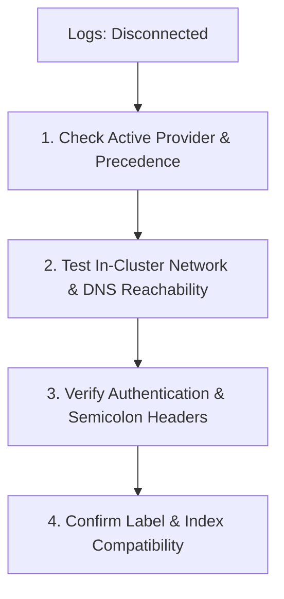

# Logging

NudgeBee integrates with your existing logging backends to provide instant log context during automated root cause analysis (RCA) and incident triage. Instead of streaming raw log streams out of your cluster to a third-party service, the NudgeBee Agent runner acts as an authenticated in-cluster query proxy, fetching only the targeted log slices needed to investigate specific alert windows.

## Supported Logging Providers

The runner natively proxies queries to standard logging engines and API-compatible platforms:

*   **[Grafana Loki](./loki.md)**: Query logs via LogQL over HTTP API. Supports monolithic, scalable, and microservices/gateway deployments.
*   **[Elasticsearch & OpenSearch (ELK Stack)](./elk.md)**: Query logs via Elasticsearch DSL (`/_search`) or OpenSearch PPL (`/_plugins/_ppl`). Supports basic auth, API keys, and custom CA certs.
*   **[SigNoz](./signoz.md)**: Query logs and autocomplete attributes via SigNoz v3 API (`/api/v3/query_range`).
*   **[Logz.io](./logz.io.md)**: OpenSearch-compatible endpoint authenticated via `X-API-TOKEN`.
*   **[Last9](./last9.md)**: Loki-compatible endpoint authenticated via Basic Auth.

---

## Provider Selection Precedence {#provider-precedence}

If multiple logging backends are defined in your `values.yaml`, the runner evaluates and activates a single primary log provider using the following strict precedence hierarchy:

```
Pinot  →  Elasticsearch / OpenSearch  →  SigNoz  →  Grafana Loki
(Highest)                                             (Lowest)
```

:::tip Precedence Rules
- **Elasticsearch over Loki**: If both `runner.es.enabled: true` and `runner.loki.url` are set, the runner selects **Elasticsearch**.
- **SigNoz over Loki**: If `runner.signoz.url` is populated, it takes precedence over `runner.loki.url`.
- **Loki as Fallback**: Loki is only evaluated when Pinot, Elasticsearch, and SigNoz are not configured.
- To switch to Loki when an Elasticsearch URL was previously configured, explicitly disable Elasticsearch (`runner.es.enabled: false`).
:::

---

## Troubleshooting Checklist {#troubleshooting}

When **Agent Health** in the NudgeBee Console displays **Logs: Disconnected**, follow this four-step diagnostic workflow:



1. **Check Active Provider & Helm Values**:
   Verify which provider is actively evaluated by checking the runner logs:
   ```bash
   kubectl logs -n nudgebee-agent deploy/nudgebee-agent-runner | grep -E 'loki enabled|elasticsearch enabled|signoz enabled'
   ```
2. **Test Network Reachability**:
   Run an in-cluster curl test from the `nudgebee-agent` namespace to confirm that CoreDNS resolves the logging service and that no `NetworkPolicy` blocks egress on the logging port (e.g. `3100` or `9200`).
3. **Verify Header Syntax**:
   Ensure multi-tenant headers and credentials in `runner.loki.headers` or `runner.es.headers` use semicolons (`;`) as delimiters, not commas.
4. **Follow Provider-Specific Diagnostic Guides**:
   - [Troubleshoot Grafana Loki](./loki.md#troubleshooting)
   - [Troubleshoot Elasticsearch & OpenSearch](./elk.md#troubleshooting)
   - [Troubleshoot SigNoz](./signoz.md#troubleshooting)