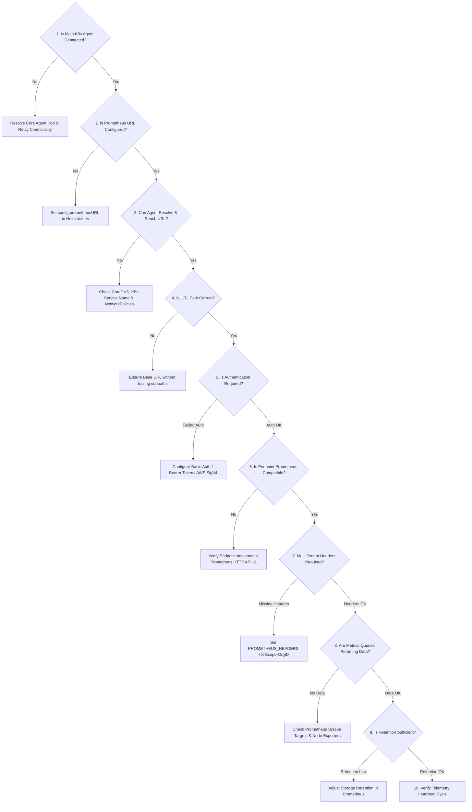

# Troubleshooting: Why is Prometheus Disconnected?

When the NudgeBee Console displays **Prometheus: Disconnected**, the agent is unable to successfully query your cluster's Prometheus-compatible metrics backend.

This guide provides a systematic **10-step decision tree** to identify and resolve the root cause.

---

## 1. How the Agent Tests Prometheus Connectivity

The NudgeBee agent does **not** rely on static HTTP checks or `/healthy` admin endpoints (which are often disabled or inaccessible in multi-tenant environments such as Chronosphere, Thanos, Grafana Mimir, or Amazon Managed Prometheus).

Instead, during each 60-second telemetry heartbeat tick, the agent runs an authenticated PromQL instant query:

```promql
vector(1)
```

- **Pass Criteria**: HTTP `200 OK` with JSON response `{"status":"success", ...}` within **5 seconds**.
- **Fail Criteria**: HTTP 4xx/5xx, connection timeout, DNS lookup failure, or non-success payload.

---

## 2. 10-Step Interactive Diagnostic Decision Tree



---

## 3. Step-by-Step Diagnostic Procedures

### Step 1: Is the Main Kubernetes Agent Connected?
If the primary agent itself is disconnected, all subsystem badges will show disconnected.
```bash
kubectl get pods -n nudgebee -l app.kubernetes.io/name=nudgebee-agent
```
*If pod is crashlooping or not running, resolve [Agent Connectivity](../operate/troubleshoot-agent-connectivity.md) first.*

---

### Step 2: Is the Prometheus URL Configured in Helm Values?
Verify what URL the agent was configured with:
```bash
helm get values nudgebee-agent -n nudgebee -o json | jq '.config.prometheusURL'
```
*If empty or null, update your `values.yaml` with your in-cluster or external Prometheus service URL.*

---

### Step 3: Can the Agent Pod Resolve and Reach the Endpoint?
Exec into the agent runner container and test direct reachability:
```bash
kubectl exec -it -n nudgebee deploy/nudgebee-agent -c runner -- \
  wget -qO- --timeout=5 http://<PROMETHEUS_SERVICE_HOST>:<PORT>/-/ready
```
**Common Failures:**
- `bad address`: CoreDNS cannot resolve the service name across namespaces. Use the Fully Qualified Domain Name (FQDN): `http://prometheus-k8s.monitoring.svc.cluster.local:9090`.
- `connection timed out`: A `NetworkPolicy` in the `monitoring` namespace is blocking ingress from namespace `nudgebee`.

---

### Step 4: Is the URL Format Correct?
The agent automatically appends `/api/v1/query` to the configured base URL.
- ✅ **Correct**: `http://prometheus-operated.monitoring.svc.cluster.local:9090`
- ❌ **Incorrect**: `http://prometheus-operated.monitoring.svc.cluster.local:9090/api/v1/query` (will result in double path `/api/v1/query/api/v1/query`).

---

### Step 5: Is Authentication Required (Bearer Token or Basic Auth)?
If your Prometheus is behind Grafana Agent, Thanos Gateway, or an OAuth2 proxy, the unauthenticated health probe will fail with `401 Unauthorized` or `403 Forbidden`.

Test with authentication headers:
```bash
kubectl exec -it -n nudgebee deploy/nudgebee-agent -c runner -- \
  curl -s -H "Authorization: Bearer <TOKEN>" \
  "http://<PROMETHEUS_HOST>:9090/api/v1/query?query=vector(1)"
```

**How to configure auth in Helm values:**
```yaml
config:
  prometheusURL: "https://thanos-querier.monitoring.svc.cluster.local:9090"
  prometheusHeaders:
    Authorization: "Bearer <YOUR_PROMETHEUS_BEARER_TOKEN>"
```

---

### Step 6: Is the Endpoint Prometheus-Compatible?
Test the exact query used by the agent probe:
```bash
kubectl exec -it -n nudgebee deploy/nudgebee-agent -c runner -- \
  curl -s "http://<PROMETHEUS_HOST>:9090/api/v1/query?query=vector(1)"
```
**Expected Response:**
```json
{"status":"success","data":{"resultType":"vector","result":[{"metric":{},"value":[1725177600,"1"]}]}}
```
*If status is not `success`, verify if the remote backend supports standard PromQL queries.*

---

### Step 7: Are Multi-Tenant Headers Required?
For multi-tenant systems like Grafana Mimir, Cortex, or Chronosphere, the `X-Scope-OrgID` header is mandatory:
```yaml
config:
  prometheusHeaders:
    X-Scope-OrgID: "tenant-primary"
    Authorization: "Basic <BASE64_CREDS>"
```

---

### Step 8: Are Metrics Actually Available for Node & Container Queries?
Verify that standard Kubernetes metrics are actively scraped and stored:
```bash
kubectl exec -it -n nudgebee deploy/nudgebee-agent -c runner -- \
  curl -s "http://<PROMETHEUS_HOST>:9090/api/v1/query?query=count(node_cpu_seconds_total)"
```
*If `result` array is empty, your Prometheus is running but node exporters or kube-state-metrics scrape targets are down.*

---

### Step 9: Is Prometheus Retention Configured?
NudgeBee displays the detected metric retention period. If retention is less than 24 hours, trend and anomaly detection will have limited historical context. Recommended minimum retention is **15 days**.

---

### Step 10: Is the UI Showing Stale Status?
Telemetry status is updated on each 60-second heartbeat. After applying changes to your Prometheus configuration or Helm values, allow up to **90 seconds** for the next heartbeat tick to register in the Console.

---

## 4. NuBi Documentation Search

Ask NuBi in chat for guided troubleshooting assistance:
- *"How do I debug a Prometheus 401 Unauthorized error in NudgeBee?"*
- *"How do I configure X-Scope-OrgID headers for Thanos or Mimir in Helm values?"*
