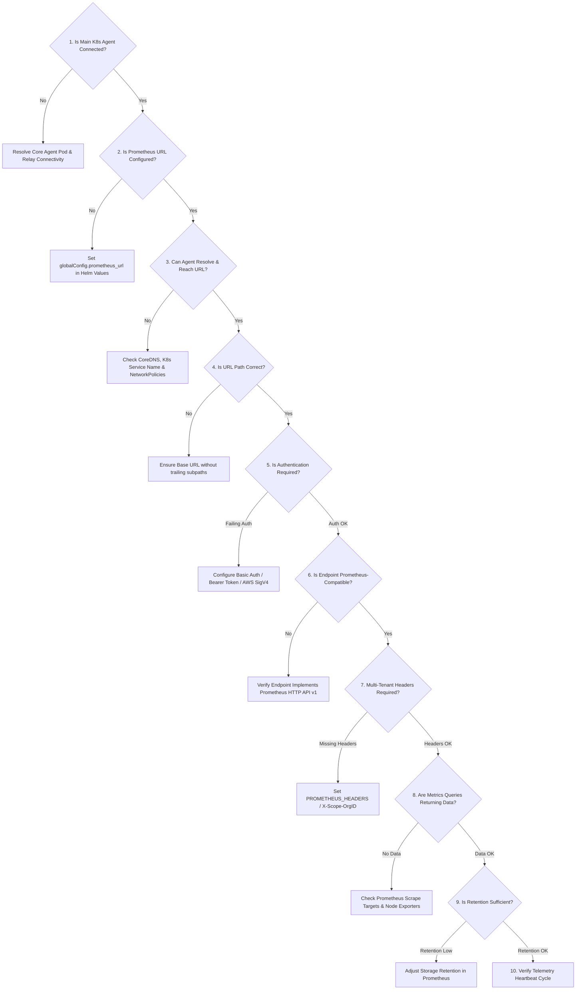

# Troubleshooting: Why is Prometheus Disconnected?

When the NudgeBee Console displays **Prometheus: Disconnected**, the runner could not successfully query the configured Prometheus-compatible backend.

This guide provides a systematic **10-step decision tree** to identify and resolve the root cause.

---

## 1. How the Agent Tests Prometheus Connectivity

During each telemetry cycle, the runner executes this PromQL instant query through the same authenticated client used for metrics operations:

```promql
vector(1)
```

The check uses `globalConfig.prometheus_headers` and managed-provider authentication under `runner.prometheus.auth`, with a five-second timeout. It reports connected only when the HTTP request succeeds, the response is valid JSON, and its Prometheus API `status` is `success`. This supports query-only endpoints such as Thanos Query, Mimir, Chronosphere, and Amazon Managed Prometheus without requiring `/-/healthy`.

---

## 2. 10-Step Interactive Diagnostic Decision Tree



---

## 3. Step-by-Step Diagnostic Procedures

### Step 1: Is the Main Kubernetes Agent Connected?
If the primary agent itself is disconnected, all subsystem badges will show disconnected.
```bash
kubectl get pods -n nudgebee-agent -l app.kubernetes.io/name=nudgebee-agent
```
*If pod is crashlooping or not running, resolve [Agent Connectivity](../operate/troubleshoot-agent-connectivity.md) first.*

---

### Step 2: Is the Prometheus URL Configured in Helm Values?
Verify what URL the agent was configured with:
```bash
helm get values nudgebee-agent -n nudgebee-agent -o json | jq '.globalConfig.prometheus_url'
```
*If empty or null, update your `values.yaml` with your in-cluster or external Prometheus service URL.*

---

### Step 3: Can the Agent Pod Resolve and Reach the Endpoint?
Exec into the agent runner container and test direct reachability:
```bash
kubectl run -n nudgebee-agent nudgebee-connectivity-check --rm -i --restart=Never \
  --image=curlimages/curl -- curl -fsS --max-time 5 \
  http://<PROMETHEUS_SERVICE_HOST>:<PORT>/-/ready
```
**Common Failures:**
- `bad address`: CoreDNS cannot resolve the service name across namespaces. Use the Fully Qualified Domain Name (FQDN): `http://prometheus-k8s.monitoring.svc.cluster.local:9090`.
- `connection timed out`: A `NetworkPolicy` in the `monitoring` namespace is blocking ingress from namespace `nudgebee`.

---

### Step 4: Is the URL Format Correct?
The agent automatically appends `/api/v1/query` to the configured base URL.
- ✅ **Correct**: `http://prometheus-operated.monitoring.svc.cluster.local:9090`
- ❌ **Incorrect**: `http://prometheus-operated.monitoring.svc.cluster.local:9090/api/v1/query` (will result in double path `/api/v1/query/api/v1/query`).

---

### Step 5: Is Authentication Required (Bearer Token or Basic Auth)?
If your Prometheus is behind Thanos Gateway, an OAuth2 proxy, or another protected endpoint, a missing or invalid query credential can fail with `401 Unauthorized` or `403 Forbidden`. Test the same query with the authentication that NudgeBee uses:

Test with authentication headers:
```bash
kubectl run -n nudgebee-agent nudgebee-connectivity-check --rm -i --restart=Never \
  --image=curlimages/curl -- curl -fsS -H "Authorization: Bearer <TOKEN>" \
  "http://<PROMETHEUS_HOST>:9090/api/v1/query?query=vector(1)"
```

**How to configure auth in Helm values:**
```yaml
globalConfig:
  prometheus_url: "https://thanos-querier.monitoring.svc.cluster.local:9090"
  prometheus_headers: "Authorization: Bearer <YOUR_PROMETHEUS_BEARER_TOKEN>"
```

---

### Step 6: Is the Endpoint Prometheus-Compatible?
Use the same simple query as the agent to confirm that the endpoint serves the Prometheus query API:
```bash
kubectl run -n nudgebee-agent nudgebee-connectivity-check --rm -i --restart=Never \
  --image=curlimages/curl -- curl -fsS \
  "http://<PROMETHEUS_HOST>:9090/api/v1/query?query=vector(1)"
```
**Expected Response:**
```json
{"status":"success","data":{"resultType":"vector","result":[{"metric":{},"value":[1725177600,"1"]}]}}
```
*If status is not `success`, verify if the remote backend supports standard PromQL queries.*

---

### Step 7: Are Multi-Tenant Headers Required?
For multi-tenant systems like Grafana Mimir, Cortex, or Chronosphere, the `X-Scope-OrgID` header is mandatory:
```yaml
globalConfig:
  prometheus_headers: "X-Scope-OrgID: tenant-primary; Authorization: Basic <BASE64_CREDS>"
```

---

### Step 8: Are Metrics Actually Available for Node & Container Queries?
Verify that standard Kubernetes metrics are actively scraped and stored:
```bash
kubectl run -n nudgebee-agent nudgebee-connectivity-check --rm -i --restart=Never \
  --image=curlimages/curl -- curl -fsS \
  "http://<PROMETHEUS_HOST>:9090/api/v1/query?query=count(node_cpu_seconds_total)"
```
*If `result` array is empty, your Prometheus is running but node exporters or kube-state-metrics scrape targets are down.*

### Prometheus is connected, but agent targets or default rules are missing

The health badge checks the query endpoint. It does not prove that Prometheus selected the monitoring objects created by the agent chart.

| Object | Purpose | Chart control |
|---|---|---|
| `ServiceMonitor` | Scrapes runner metrics | `enableServiceMonitors` |
| `PodMonitor` | Scrapes every node-agent pod | `nodeAgent.podmonitor.enabled` |
| `PrometheusRule` | Loads NudgeBee's default alert rules | `alertmanager.create_nb_default_rules` |

First check that the objects rendered and exist:

```bash
kubectl get servicemonitor,podmonitor,prometheusrule -n nudgebee-agent
```

Existence is not selection. Prometheus Operator selects these objects by metadata labels and, separately, by namespace. Compare the Prometheus resource with one agent object:

```bash
kubectl get prometheus -A -o yaml | grep -A8 -E 'serviceMonitorSelector:|podMonitorSelector:|ruleSelector:'
kubectl get podmonitor nudgebee-agent-node-agent -n nudgebee-agent -o yaml
```

For kube-prometheus-stack, the selector commonly requires `release: <prometheus-release>`. Apply that label to all monitoring objects with:

```yaml
prometheusStack:
  selectorLabels:
    release: nudgebee-prometheus
```

The Prometheus resource's `serviceMonitorNamespaceSelector`, `podMonitorNamespaceSelector`, and `ruleNamespaceSelector` must also allow the `nudgebee-agent` namespace. After upgrading, inspect Prometheus **Targets** and **Rules**; Kubernetes accepting a CR does not prove Prometheus loaded it.

---

### Step 9: Is Prometheus Retention Configured?
NudgeBee displays the detected metric retention period. If retention is less than 24 hours, trend and anomaly detection will have limited historical context. Recommended minimum retention is **15 days**.

---

### Step 10: Is the UI Showing Stale Status?
Telemetry status is updated on each periodic heartbeat tick. After applying changes to your Prometheus configuration or Helm values, allow time for the next telemetry heartbeat to register in the Console.

---

## 4. NuBi Documentation Search

Ask NuBi in chat for guided troubleshooting assistance:
- *"How do I debug a Prometheus 401 Unauthorized error in NudgeBee?"*
- *"How do I configure X-Scope-OrgID headers for Thanos or Mimir in Helm values?"*
