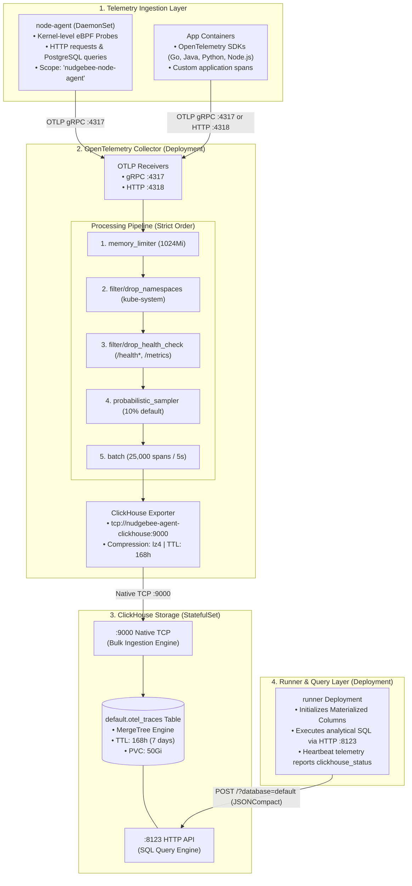

# OTel ClickHouse Tracing Architecture & Operations

<div style={{position: "relative", paddingBottom: "64.86%", height: 0}}>
  <iframe
    src="https://www.loom.com/embed/04aab9e5e77648a1aabbf159bc6d0ef5?sid=dc467079-1af2-41e3-bb7b-7bf93d226387"
    allowFullScreen
    style={{position: "absolute", top: 0, left: 0, width: "100%", height: "100%", border: 0}}
  ></iframe>
</div>

---

## 1. Overview & Pipeline Architecture

NudgeBee utilizes distributed traces to correlate latency spikes, HTTP error bursts, and database contention with the exact Kubernetes pods, deployments, and database queries causing them.

The tracing subsystem operates across a 4-tier pipeline:



---

## 2. Component Reference & Port Allocations

| Component | Workload Type | Image Repository & Tag | Ports & Interfaces | Role in Tracing Pipeline |
|---|---|---|---|---|
| **`node-agent`** | `DaemonSet` | `ghcr.io/nudgebee/node-agent` | Egress to `:4317` | Attaches eBPF probes to kernel socket buffers to trace HTTP and PostgreSQL traffic without application code changes. Sanitizes sensitive headers and emits spans under scope `nudgebee-node-agent`. |
| **`opentelemetry-collector`** | `Deployment` | `ghcr.io/nudgebee/opentelemetry-collector-contrib:0.157.0` | **`4317`** (OTLP gRPC)<br/>**`4318`** (OTLP HTTP)<br/>`8888` (Metrics) | Ingests spans, enforces admission memory limits, filters operational noise, samples traces, batches records, and exports to ClickHouse via native TCP. |
| **`clickhouse`** | `StatefulSet` | `ghcr.io/nudgebee/clickhouse:24.12.4-debian-12-r0-nb-3` | **`9000`** (Native TCP)<br/>**`8123`** (HTTP Interface) | Columnar storage engine storing trace spans in `default.otel_traces`. Applies automated data compression (`lz4`/`zstd`), partition merging, and TTL expiry. |
| **`runner`** | `Deployment` | `ghcr.io/nudgebee/nudgebee-agent` | Client to `:8123` | Inspects and creates materialized columns on `otel_traces` (`EnsureMaterializedColumns`), executes analytical queries for incident correlation, and exposes trace health status. |

---

## 3. Telemetry Ingestion: eBPF vs. Application SDKs

NudgeBee supports both transparent kernel-level tracing and explicit application SDK instrumentation simultaneously:

### 1. eBPF Kernel Tracing (`node-agent`)
- **Zero-Code Instrumentation**: Automatically captures outbound HTTP requests, inbound HTTP requests, and PostgreSQL SQL queries (`db.statement`) across all pods on the node.
- **Sensitive Data Redaction**: The node agent automatically scrubs sensitive authentication tokens and headers before emitting spans. Configured via the `SENSITIVE_HEADERS` environment variable:
  ```bash
  Authorization,Proxy-Authorization,Cookie,Set-Cookie,X-Auth-Token,X-CSRF-Token,X-Session-ID,X-JWT-Token,X-Api-Key
  ```
- **Scope Identifier**: Sets instrumentation scope `ScopeName: "nudgebee-node-agent"`.

### 2. Application OpenTelemetry SDKs
Application workloads instrumented with standard OpenTelemetry SDKs (Go, Java, Python, Node.js, .NET) can send custom spans, database calls, and business attributes directly to the in-cluster collector:

```yaml
# Example application environment configuration:
env:
  - name: OTEL_EXPORTER_OTLP_ENDPOINT
    value: "http://nudgebee-agent-opentelemetry-collector.nudgebee-agent.svc.cluster.local:4317"
  - name: OTEL_EXPORTER_OTLP_PROTOCOL
    value: "grpc"
  - name: OTEL_SERVICE_NAME
    value: "order-service"
```

---

## 4. OTel Collector Pipeline Configuration & Tuning

The collector pipeline is defined under `opentelemetry-collector.config` in Helm values.

```yaml
opentelemetry-collector:
  enabled: true
  resources:
    requests:
      cpu: 250m
      memory: 512Mi
    limits:
      memory: 1024Mi
  config:
    processors:
      # 1. Memory limiter MUST remain first in all pipelines
      memory_limiter:
        check_interval: 1s
        limit_percentage: 75
        spike_limit_percentage: 20

      # 2. Drop infrastructure and noise namespaces
      filter/drop_namespaces:
        error_mode: ignore
        traces:
          span:
            - attributes["k8s.namespace.name"] == "kube-system"

      # 3. Drop high-frequency health probes and metrics scrapes
      filter/drop_health_check:
        error_mode: ignore
        traces:
          span:
            - attributes["http.route"] == "/health"
            - attributes["http.route"] == "/healthz"
            - attributes["http.route"] == "/live"
            - attributes["http.route"] == "/ready"
            - attributes["http.route"] == "/metrics"
            - attributes["http.target"] == "/health"
            - attributes["http.target"] == "/healthz"
            - attributes["http.target"] == "/live"
            - attributes["http.target"] == "/ready"
            - attributes["http.target"] == "/metrics"
            - attributes["url.path"] == "/health"
            - attributes["url.path"] == "/healthz"
            - attributes["url.path"] == "/live"
            - attributes["url.path"] == "/ready"
            - attributes["url.path"] == "/metrics"

      # 4. Head-based probabilistic sampling (default 10%)
      probabilistic_sampler:
        sampling_percentage: 10

      # 5. Flush batching to optimize ClickHouse MergeTree ingestion
      batch:
        timeout: 5s
        send_batch_size: 25000

    exporters:
      clickhouse:
        endpoint: "tcp://nudgebee-agent-clickhouse:9000?dial_timeout=10s&compress=lz4"
        database: default
        ttl: 168h
        username: default
        password: ${env:CLICKHOUSE_PASSWORD}
        logs_table_name: otel_logs
        traces_table_name: otel_traces
        timeout: 5s
        retry_on_failure:
          enabled: true
          initial_interval: 5s
          max_interval: 30s
          max_elapsed_time: 300s

    service:
      pipelines:
        traces:
          processors: [memory_limiter, filter/drop_namespaces, filter/drop_health_check, probabilistic_sampler, batch]
          exporters: [clickhouse]
          receivers: [otlp]
```

### Critical Tuning Invariants:
1. **`memory_limiter` Ordering**:
   `memory_limiter` **must always be the first processor** in `pipelines.traces`. Helm replaces lists entirely rather than merging them. If you override `processors` in custom values without including `memory_limiter` first, the collector runs without memory backpressure and will be `OOMKilled` during traffic spikes.
2. **Batching Sizing**:
   ClickHouse is designed for bulk writes. The `batch` processor groups spans until either `25,000` spans accumulate or `5s` elapses. Never decrease `timeout` below `1s` or `send_batch_size` below `5000` on production clusters, as micro-batches will overwhelm the ClickHouse part merge thread pool.
3. **Sampling Adjustments**:
   The default `sampling_percentage: 10` retains 10% of ingested traces. In high-traffic clusters (>20,000 requests/sec), adjust `sampling_percentage` down to `1` or `2` in `user-values.yaml` to conserve disk and CPU.

---

## 5. ClickHouse Storage & Schema Mechanics

### The `otel_traces` Table
The OTel collector exporter writes spans into the `default.otel_traces` table. The table schema includes:

```sql
CREATE TABLE default.otel_traces (
    Timestamp DateTime64(9) CODEC(DoubleDelta, ZSTD(1)),
    TraceId String CODEC(ZSTD(1)),
    SpanId String CODEC(ZSTD(1)),
    ParentSpanId String CODEC(ZSTD(1)),
    TraceState String CODEC(ZSTD(1)),
    SpanName LowCardinality(String) CODEC(ZSTD(1)),
    SpanKind LowCardinality(String) CODEC(ZSTD(1)),
    ServiceName LowCardinality(String) CODEC(ZSTD(1)),
    ResourceAttributes Map(LowCardinality(String), String) CODEC(ZSTD(1)),
    SpanAttributes Map(LowCardinality(String), String) CODEC(ZSTD(1)),
    Duration Int64 CODEC(T64, ZSTD(1)),
    StatusCode LowCardinality(String) CODEC(ZSTD(1)),
    StatusMessage String CODEC(ZSTD(1)),
    Events Nested(...)
) ENGINE = MergeTree()
PARTITION BY toYYYYMMDD(Timestamp)
ORDER BY (ServiceName, SpanName, toUnixTimestamp(Timestamp), TraceId)
TTL Timestamp + toIntervalHour(168);
```

### Materialized Columns (The Fast Query Path)
Querying nested `ResourceAttributes` and `SpanAttributes` maps across millions of rows requires full table scans. To accelerate analytical queries, the NudgeBee `runner` inspects the table at startup and executes `ALTER TABLE otel_traces ADD COLUMN IF NOT EXISTS ... MATERIALIZED ...`:

| Materialized Column | Expression / Source | Purpose |
|---|---|---|
| `workload_name` | Derived from `source.workload_name`, `k8s.deployment.name`, or `service.name` | Groups latency and error metrics by Kubernetes deployment |
| `workload_namespace` | Derived from `source.workload_namespace` or `k8s.namespace.name` | Scopes traces to tenant or environment namespaces |
| `resource` | Derived from `db.statement` (for SQL queries) or `http.url` | Identifies endpoint or query string causing latency |
| `destination_workload_name` | Derived from `destination.workload_name` or `net.peer.name` | Traces cross-service dependency hops |
| `http_status_code` | `LowCardinality` string of `http.status_code` | Fast filtering for 4xx/5xx incident anomalies |
| `trace_source` | Detects `ScopeName = 'nudgebee-node-agent'` | Distinguishes eBPF kernel traces from application SDK traces |

:::tip[Performance Advantage]
When `hasMaterializedColumn` reports `true` in cluster heartbeats, NudgeBee executes SQL directly against the indexed columns. If columns have not yet materialized, NudgeBee falls back to dynamically recomputing them from raw maps on every scan.
:::

### Internal Log Table Suppression
By default, vanilla ClickHouse writes query and trace logs into internal system tables (`query_log`, `part_log`, `text_log`, `trace_log`). On edge Kubernetes clusters, these system logs can consume significant disk space.

NudgeBee suppresses these logs in `clickhouse.extraOverrides`:
```xml
<clickhouse>
  <asynchronous_metric_log remove="1"/>
  <metric_log remove="1"/>
  <query_log remove="1"/>
  <query_thread_log remove="1"/>
  <query_views_log remove="1"/>
  <part_log remove="1"/>
  <text_log remove="1"/>
  <trace_log remove="1"/>
  <opentelemetry_span_log remove="1"/>
</clickhouse>
```

---

## 6. Runner Query Integration & Telemetry Heartbeats

The `runner` pod exposes the interface between NudgeBee Server and ClickHouse:

1. **HTTP JSONCompact Protocol**:
   The runner connects to ClickHouse over HTTP (`http://<release>-clickhouse:8123`) using credentials loaded from Secret `<release>-clickhouse` (`admin-password`). Queries are executed via `POST /?database=default` requesting `FORMAT JSONCompact`.
2. **Telemetry Heartbeat**:
   The runner continuously reports datasource health in its heartbeat to NudgeBee Relay:
   - `ClickHouseStatus`: `true` if `SELECT 1` succeeds on `:8123`.
   - `hasMaterializedColumn`: `true` if all 13 materialized columns are verified in `system.columns`.
   - `TraceProvider`: Reports `otel_clickhouse` as the active provider.

---

## 7. Operational Troubleshooting Runbooks

### Issue 1: Collector Dropping Spans or Crashing (`OOMKilled`)

#### Symptoms:
- Traces are missing in the NudgeBee Console.
- Collector pod shows restarts or `OOMKilled` status in `kubectl get pods -l app.kubernetes.io/name=opentelemetry-collector`.
- Collector internal metrics report dropped spans.

#### Diagnosis:
```bash
# 1. Check collector pod restart count and exit codes
kubectl get pods --namespace nudgebee-agent -l app.kubernetes.io/name=opentelemetry-collector

# 2. Inspect collector container logs for memory limiter backpressure
kubectl logs --namespace nudgebee-agent deploy/nudgebee-agent-opentelemetry-collector -c opentelemetry-collector --tail=100 | grep -i "memory"

# 3. Check internal dropped spans metrics
kubectl exec -i deploy/nudgebee-agent-opentelemetry-collector --namespace nudgebee-agent -c opentelemetry-collector -- \
  wget -qO- http://localhost:8888/metrics | grep otelcol_processor_dropped_spans_total
```

#### Remediation:
1. **Increase Collector Memory Ceiling**:
   In high-throughput environments, bump the container memory limit in `user-values.yaml`:
   ```yaml
   opentelemetry-collector:
     resources:
       requests:
         cpu: 500m
         memory: 1024Mi
       limits:
         memory: 2048Mi
   ```
2. **Lower Sampling Rate**:
   Reduce sampling percentage to shed ingest volume:
   ```yaml
   opentelemetry-collector:
     config:
       processors:
         probabilistic_sampler:
           sampling_percentage: 5 # Reduce from 10 to 5%
   ```

---

### Issue 2: ClickHouse "Too Many Parts" Error (Code 252)

#### Symptoms:
Collector logs report failed export attempts to ClickHouse:
```text
DB::Exception: Too many parts in all data parts in table default.otel_traces (300). Merges are processing significantly slower than inserts
```

#### Root Cause:
The collector is flushing spans in small, frequent chunks. ClickHouse writes each insert as a physical directory ("part") on disk. If parts accumulate faster than ClickHouse's background merge threads can combine them, ClickHouse throttles or rejects inserts to prevent file-descriptor exhaustion.

#### Diagnosis:
```bash
# Check current active part count on the otel_traces table
kubectl exec -i sts/nudgebee-agent-clickhouse --namespace nudgebee-agent -c clickhouse -- \
  clickhouse-client -q "SELECT count() FROM system.parts WHERE table = 'otel_traces' AND active = 1"
```
*(A healthy system should stay below 100 active parts. Values above 300 trigger the exception).*

#### Remediation:
Ensure the `batch` processor is properly configured to buffer inserts:
```yaml
opentelemetry-collector:
  config:
    processors:
      batch:
        timeout: 10s           # Increase flush window from 5s to 10s
        send_batch_size: 50000 # Increase batch size from 25k to 50k
```
Apply via `helm upgrade` and allow ClickHouse merge threads 2–3 minutes to stabilize.

---

### Issue 3: ClickHouse PVC Disk Full & Storage Management

#### Symptoms:
- ClickHouse pod transitions to `CrashLoopBackOff`.
- Logs report `No space left on device` or `Filesystem is read-only`.

#### Diagnosis:
```bash
# 1. Check PVC volume capacity and utilization
kubectl exec -i sts/nudgebee-agent-clickhouse --namespace nudgebee-agent -c clickhouse -- \
  df -h /bitnami/clickhouse

# 2. Check compressed table size on disk
kubectl exec -i sts/nudgebee-agent-clickhouse --namespace nudgebee-agent -c clickhouse -- \
  clickhouse-client -q "SELECT formatReadableSize(sum(data_compressed_bytes)) FROM system.parts WHERE table = 'otel_traces' AND active = 1"
```

#### Remediation:
1. **Shorten Retention TTL**:
   Reduce trace retention from 7 days (168h) to 3 days (72h) to immediately release older partitions:
   ```bash
   kubectl exec -i sts/nudgebee-agent-clickhouse --namespace nudgebee-agent -c clickhouse -- \
     clickhouse-client -q "ALTER TABLE default.otel_traces MODIFY TTL Timestamp + toIntervalHour(72);"
   ```
   To trigger an immediate partition cleanup:
   ```bash
   kubectl exec -i sts/nudgebee-agent-clickhouse --namespace nudgebee-agent -c clickhouse -- \
     clickhouse-client -q "OPTIMIZE TABLE default.otel_traces FINAL;"
   ```
2. **Expand the ClickHouse PVC Online**:
   If your cluster's `StorageClass` supports volume expansion (`allowVolumeExpansion: true`), increase the PVC size in `user-values.yaml`:
   ```yaml
   clickhouse:
     persistence:
       size: 100Gi # Increase from 50Gi
   ```
   Apply via `helm upgrade`. Kubernetes and the cloud CSI driver will expand the underlying volume online.

---

### Issue 4: HTTP 401 Unauthorized / Authentication Desynchronization

#### Symptoms:
- Collector logs report: `failed to ping clickhouse: authentication failed`.
- Runner logs report: `clickhouse: HTTP 401: Unauthorized`.

#### Root Cause:
The ClickHouse administrator password in Secret `<release>-clickhouse` does not match the password supplied in `runner.clickhouse_password` or the collector environment variables.

#### Diagnosis:
```bash
# Verify the stored admin password in the ClickHouse secret
kubectl get secret nudgebee-agent-clickhouse --namespace nudgebee-agent -o jsonpath='{.data.admin-password}' | base64 -d
```

#### Remediation:
Test connectivity using the extracted password directly inside the cluster:
```bash
kubectl exec -i sts/nudgebee-agent-clickhouse --namespace nudgebee-agent -c clickhouse -- \
  clickhouse-client --user default --password "<PASSWORD>" -q "SELECT 1"
```
If authentication succeeds, ensure `runner` and `opentelemetry-collector` reference the correct secret name. If you override the password via `--set clickhouse.auth.password=...`, you must supply the matching `--set runner.clickhouse_password=...`.

---

### Issue 5: Verifying End-to-End Trace Ingestion

To confirm that traces are flowing properly through every stage:

```bash
# 1. Verify total span count stored in ClickHouse
kubectl exec -i sts/nudgebee-agent-clickhouse --namespace nudgebee-agent -c clickhouse -- \
  clickhouse-client -q "SELECT count() FROM default.otel_traces"

# 2. Check the timestamp of the most recent span
kubectl exec -i sts/nudgebee-agent-clickhouse --namespace nudgebee-agent -c clickhouse -- \
  clickhouse-client -q "SELECT max(Timestamp) FROM default.otel_traces"

# 3. Check distribution between eBPF spans and application SDK spans
kubectl exec -i sts/nudgebee-agent-clickhouse --namespace nudgebee-agent -c clickhouse -- \
  clickhouse-client -q "SELECT trace_source, count() FROM default.otel_traces GROUP BY trace_source"

# 4. Verify runner telemetry heartbeat
kubectl logs --namespace nudgebee-agent deploy/nudgebee-agent-runner -c runner --tail=100 | grep -i "clickhouse"
```

---

## 8. Disabling Tracing Safely (Reclaiming Resources)

Tracing is optional. If your cluster does not require distributed tracing or you need to reclaim cluster CPU and memory, you can disable ClickHouse and the OpenTelemetry Collector completely.

### Safe Helm Values Configuration:
```yaml
# 1. Tell the runner to disable ClickHouse querying and heartbeat reporting
runner:
  clickhouse_enabled: false

# 2. Disable the OpenTelemetry Collector deployment
opentelemetry-collector:
  enabled: false

# 3. Disable the bundled ClickHouse StatefulSet
clickhouse:
  enabled: false
```

Apply the change:
```bash
helm upgrade nudgebee-agent nudgebee/nudgebee-agent -f user-values.yaml --namespace nudgebee-agent
```

:::warning[Important: Leave `nodeAgent.enabled: true`]
**Do not set `nodeAgent.enabled: false`.**
The `node-agent` DaemonSet produces essential kernel-level network bandwidth, pod latency, and connection metrics that NudgeBee uses for dashboards, infrastructure maps, and incident investigations. 

When the OpenTelemetry Collector is disabled, `node-agent` simply ceases pushing trace spans to `:4317` while continuing to report Prometheus metrics without error.
:::

