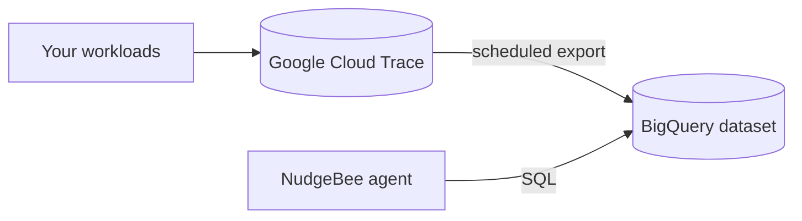

# Google Cloud Trace

Use this when your traces already live in Google Cloud Trace and you do not want a second copy in the agent's bundled ClickHouse.

## How it fits together

Cloud Trace has no query API the agent can use for this, so traces are exported from Cloud Trace to BigQuery, and the agent queries BigQuery:



Two pieces to set up: getting spans into Cloud Trace and on to BigQuery, and giving the agent read access to that dataset.

## 1. Export traces to BigQuery

Point the OpenTelemetry collector at Google Cloud with the [`googlecloud` exporter](https://github.com/open-telemetry/opentelemetry-collector-contrib/blob/main/exporter/googlecloudexporter/README.md), then set up a Cloud Trace [export sink to BigQuery](https://cloud.google.com/trace/docs/trace-export-bigquery). Note the dataset — the agent queries it by project.

## 2. Give the agent access to BigQuery

The agent authenticates with Application Default Credentials, so on GKE it picks up Workload Identity with no credentials in your values file.

### Using Workload Identity (recommended)

Enable it on the cluster and node pools:

```bash
gcloud container clusters update [CLUSTER_NAME] \
  --zone=[ZONE] \
  --workload-pool=[PROJECT_ID].svc.id.goog

gcloud container node-pools update [NODE_POOL_NAME] \
  --cluster=[CLUSTER_NAME] \
  --zone=[ZONE] \
  --workload-metadata=GKE_METADATA
```

Create a Google service account and grant it BigQuery read access:

```bash
gcloud iam service-accounts create bigquery-access \
  --description="BigQuery access for the NudgeBee agent" \
  --display-name="BigQuery Access"

gcloud projects add-iam-policy-binding [PROJECT_ID] \
  --member="serviceAccount:bigquery-access@[PROJECT_ID].iam.gserviceaccount.com" \
  --role="roles/bigquery.user"

gcloud projects add-iam-policy-binding [PROJECT_ID] \
  --member="serviceAccount:bigquery-access@[PROJECT_ID].iam.gserviceaccount.com" \
  --role="roles/bigquery.jobUser"
```

Bind it to the **agent's own** service account. Do not create a new one — the chart already has `<release>-runner-service-account`, and that is the identity the runner uses:

```bash
gcloud iam service-accounts add-iam-policy-binding \
  bigquery-access@[PROJECT_ID].iam.gserviceaccount.com \
  --role="roles/iam.workloadIdentityUser" \
  --member="serviceAccount:[PROJECT_ID].svc.id.goog[nudgebee-agent/nudgebee-agent-runner-service-account]"
```

Then annotate it and switch on the GCP integration, both through the chart:

```yaml
runner:
  serviceAccount:
    annotations:
      iam.gke.io/gcp-service-account: bigquery-access@[PROJECT_ID].iam.gserviceaccount.com
  additional_env_vars:
    - name: GCP_ENABLED
      value: "true"
    - name: GCP_PROJECT_ID
      value: "[PROJECT_ID]"
    - name: CLICKHOUSE_PORT
      value: "8123"
    - name: CLICKHOUSE_USER
      value: "default"
    - name: CLICKHOUSE_DB
      value: "default"
```

:::note
`additional_env_vars` replaces the chart's default list rather than merging with it, which is why the three `CLICKHOUSE_*` entries are repeated above. Drop them only if you have also disabled the bundled ClickHouse.
:::

Apply and restart:

```bash
helm upgrade nudgebee-agent nudgebee-agent/nudgebee-agent \
  -n nudgebee-agent --reuse-values -f values.yaml
kubectl -n nudgebee-agent rollout restart deploy/nudgebee-agent-runner
```

:::caution Requires chart 0.1.22 or newer
Earlier charts rendered `runner.serviceAccount.annotations` onto the ClusterRole instead of the ServiceAccount, so the Workload Identity binding never took effect. On an older chart, annotate the service account by hand:

```bash
kubectl -n nudgebee-agent annotate serviceaccount nudgebee-agent-runner-service-account \
  iam.gke.io/gcp-service-account=bigquery-access@[PROJECT_ID].iam.gserviceaccount.com --overwrite
```
:::

### Alternative: node service account with OAuth scopes

Where Workload Identity is not an option, grant the roles to the node pool's service account instead. This gives every pod on those nodes the same access, so prefer Workload Identity when you can.

```bash
# which service account do the nodes run as?
gcloud container clusters describe [CLUSTER_NAME] --zone=[ZONE] \
  --format="value(nodeConfig.serviceAccount)"

gcloud projects add-iam-policy-binding [PROJECT_ID] \
  --member="serviceAccount:[DEFAULT_SA_EMAIL]" \
  --role="roles/bigquery.user"

gcloud projects add-iam-policy-binding [PROJECT_ID] \
  --member="serviceAccount:[DEFAULT_SA_EMAIL]" \
  --role="roles/bigquery.jobUser"

# nodes also need the cloud-platform scope; scopes cannot be changed on an
# existing pool, so create one and move the agent to it if they are missing
gcloud container node-pools describe [NODE_POOL_NAME] \
  --cluster=[CLUSTER_NAME] --zone=[ZONE] \
  --format="value(config.oauthScopes)"
```

## Verify

Check the runner can reach BigQuery with the identity you bound:

```bash
kubectl run bigquery-test --image=google/cloud-sdk:slim -n nudgebee-agent \
  --overrides='{"spec":{"serviceAccountName":"nudgebee-agent-runner-service-account"}}' \
  --restart=Never --rm -it -- bash

# inside the pod
gcloud auth list          # should show bigquery-access@...
bq query --use_legacy_sql=false 'SELECT 1'
```

If `gcloud auth list` shows the node's default service account instead of `bigquery-access@`, the Workload Identity binding did not take — check that the annotation is on the ServiceAccount itself:

```bash
kubectl -n nudgebee-agent get sa nudgebee-agent-runner-service-account -o jsonpath='{.metadata.annotations}'
```
