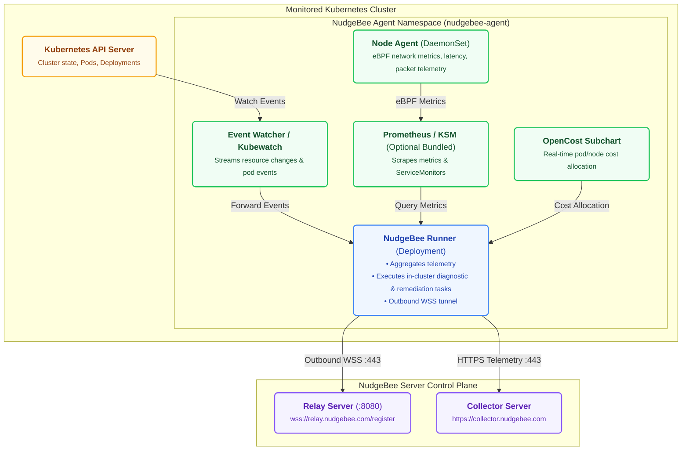

# K8s Agent

The NudgeBee Agent is a lightweight software component that runs inside your Kubernetes cluster. It collects data about workloads, performance, cost, and security, and sends it to the NudgeBee server — feeding the [Semantic Knowledge Graph](../../features/knowledge-graph.md) that powers NudgeBee's Cloud-Ops Intelligence. You need to install an agent in every cluster that you want NudgeBee to monitor. The agent supports AWS, Azure, GCP, and on-premises Kubernetes environments.

:::info
**Both Cloud SaaS and self-hosted users** need to install the agent. This is how NudgeBee gets visibility into your Kubernetes clusters, regardless of your deployment model.
:::

:::tip
If you connected a cloud account (AWS, Azure, or GCP), NudgeBee can auto-discover your Kubernetes clusters. You may still need to install the agent for deep monitoring, but cluster discovery happens automatically.
:::

### What You Will Find in This Section

- **[Installation](./installation/)** — Step-by-step guide to deploy the agent using Helm, including prerequisites and system requirements. Typically takes 5–10 minutes per cluster.
- **[Helm Values](./installation/helm_values.md)** — Complete reference for agent Helm chart configuration values.
- **[Upgrade](./installation/upgrade.md)** — How to upgrade an existing agent to a newer version.
- **[Kubernetes Provider Setup](./installation/k8s-provider/)** — Provider-specific instructions for GKE, AKS, and other managed Kubernetes services.
- **[Logging Integration](./installation/logging/)** — Connect log sources (ELK, Loki, SignalFx, etc.) to the agent.
- **[Tracing Integration](./installation/tracing/)** — Connect tracing backends (ClickHouse, GCP) for distributed tracing.
- **[Proxy Agent](../proxy-agent/)** — Deploy agents through a proxy for restricted or air-gapped environments.
- **[Local Setup](./local-setup.md)** — Run NudgeBee locally for development and testing.
- **[On-Prem Setup](./onprem-setup.md)** — Additional configuration for air-gapped or on-premises environments.

## Architecture

The NudgeBee Agent runs within your Kubernetes cluster. The main component is the Runner, which acts as a central controller — it coordinates data collection from cluster components and maintains a secure, outbound-only WebSocket connection to the NudgeBee Server.

## Components

### [Event Watcher (Forwarder)](https://github.com/robusta-dev/kubewatch) - Watch for K8s events and Forward to Runner
- Monitors Kubernetes events using the Kubernetes API server.
- Filters and processes events based on predefined criteria.
- Forwards relevant events to the Runner component.

### [Node Agent](https://github.com/nudgebee/node-agent) - Network Metrics Collection using eBPF
The Node Agent is responsible for collecting network metrics on each Kubernetes node using eBPF (Extended Berkeley Packet Filter) and publishing them to Prometheus for further analysis.

- eBPF Probe
  - Attaches eBPF probes to key networking events, such as packet transmissions and receptions.
  - Captures relevant metrics, including latency, throughput, and error rates.

- Metric Publisher
  - Aggregates collected metrics.
  - Publishes metrics to Prometheus for centralized monitoring.
  - Detects Application Errors (Logs and API Errors) and publishes these metrics to Prometheus.

### [Runner](https://github.com/nudgebee/nudgebee-agent) - Discovery and Communication with NudgeBee Server
The Runner component facilitates the discovery of Kubernetes cluster workloads and communicates with the NudgeBee server for workload synchronization.

- Workload Discovery
  - Uses the Kubernetes API to discover running workloads within the cluster.
  - Periodically updates the list of workloads.

- Communication with NudgeBee
  - Establishes a secure connection with the NudgeBee server.
  - Sends information about discovered workloads to the NudgeBee server for further processing.

### [CostModel](https://github.com/opencost/opencost) - Cost Collection
NudgeBee uses OpenCost for calculating cost metrics for Pods/Workloads etc.

### Recommendation Jobs
NudgeBee runs the following container Images on a scheduled basis as K8s Jobs for generating specific recommendations.

[Security Recommendation](https://github.com/aquasecurity/trivy)
NudgeBee Currently uses Trivy for Generating Docker Image Vulnerability related security Recommendations

[Usage Recommendation](https://github.com/robusta-dev/krr)
NudgeBee Currently uses Krr for Generating Usage related Recommendations

[Best Practices Recommendation](https://github.com/derailed/popeye)
NudgeBee Currently uses Popeye for Generating Best Practices related Recommendations

[Prometheus](https://github.com/prometheus/prometheus) (Or [VictoriaMetrics](https://victoriametrics.com/)) - Metrics Collection and alerting