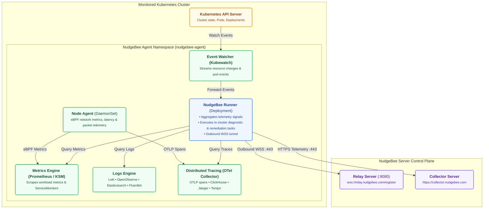

# K8s Agent

The NudgeBee Agent is a lightweight software component that runs inside your Kubernetes cluster. It collects data about workloads, performance, cost, and security, and sends it to the NudgeBee server — feeding the [Semantic Knowledge Graph](../../features/knowledge-graph.md) that powers NudgeBee's Cloud-Ops Intelligence. You need to install an agent in every cluster that you want NudgeBee to monitor. The agent supports AWS, Azure, GCP, and on-premises Kubernetes environments.

:::info
**Both Cloud SaaS and self-hosted users** need to install the agent. This is how NudgeBee gets visibility into your Kubernetes clusters, regardless of your deployment model.
:::

:::tip
If you connected a cloud account (AWS, Azure, or GCP), NudgeBee can auto-discover your Kubernetes clusters. You may still need to install the agent for deep monitoring, but cluster discovery happens automatically.
:::

### What You Will Find in This Section

- **[Installation](./installation/)** — Step-by-step guide to deploy the agent using Helm, including prerequisites and system requirements. Typically takes 5–10 minutes per cluster.
- **[Helm Values](./installation/helm_values.md)** — Complete reference for agent Helm chart configuration values.
- **[Upgrade](./installation/upgrade.md)** — How to upgrade an existing agent to a newer version.
- **[Kubernetes Provider Setup](./installation/k8s-provider/)** — Provider-specific instructions for GKE, AKS, and other managed Kubernetes services.
- **[Logging Integration](./installation/logging/)** — Connect log sources (ELK, Loki, SignalFx, etc.) to the agent.
- **[Tracing Integration](./installation/tracing/)** — Connect tracing backends (ClickHouse, GCP) for distributed tracing.
- **[Proxy Agent](../proxy-agent/)** — Deploy agents through a proxy for restricted or air-gapped environments.
- **[Local Setup](./local-setup.md)** — Run NudgeBee locally for development and testing.
- **[On-Prem Setup](./onprem-setup.md)** — Additional configuration for air-gapped or on-premises environments.

## Architecture

The NudgeBee Agent runs within your Kubernetes cluster. The main component is the Runner, which acts as a central controller — it coordinates data collection from cluster components and maintains a secure, outbound-only WebSocket connection to the NudgeBee Server.

## Components

### [Event Watcher (Forwarder)](https://github.com/robusta-dev/kubewatch) - Watch for K8s Events
- Monitors Kubernetes events using the Kubernetes API server.
- Filters and processes events based on predefined criteria.
- Forwards relevant events to the Runner component for incident triage.

### [Node Agent](https://github.com/nudgebee/node-agent) - Network & eBPF Telemetry
The Node Agent collects low-overhead network metrics and distributed trace signals on each Kubernetes node using eBPF:
- **eBPF Probes**: Attaches to socket connections and packet lifecycle events to capture latency, throughput, and connection resets.
- **Metric & Signal Publisher**: Publishes network performance signals to Prometheus and forwards distributed traces to the OpenTelemetry collector.

### [Runner](https://github.com/nudgebee/k8s-agent) - Discovery & In-Cluster Controller
The Runner facilitates workload discovery, coordinates data aggregation from metrics/logs/traces, and communicates securely with the NudgeBee Server:
- Discovers running workloads, pods, and services via Kubernetes API.
- Maintains an outbound-only WebSocket connection to the Relay Server.
- Executes diagnostic runbooks and remediation commands safely inside the cluster.

### [Logging Integration](./installation/logging/) - Log Stream Collection
Collects and aggregates application, system, and container logs from Loki, OpenObserve, Elasticsearch, CloudWatch, or Fluent Bit for AI-driven root cause analysis and anomaly detection.

### [Tracing Integration](./installation/tracing/) - Distributed Tracing & APM
Leverages the OpenTelemetry Collector and backends (ClickHouse, Jaeger, Tempo, GCP Cloud Trace) to capture distributed transaction traces, map service dependencies, and pinpoint latency bottlenecks.

### Recommendation & Diagnostic Jobs
NudgeBee runs scheduled container jobs for specialized analysis:
- **[Security Vulnerabilities](https://github.com/aquasecurity/trivy)**: Scans container images for CVEs using Trivy.
- **[Workload Rightsizing](https://github.com/robusta-dev/krr)**: Analyzes CPU and memory usage patterns for FinOps recommendations.
- **[Cluster Best Practices](https://github.com/derailed/popeye)**: Inspects Kubernetes configurations for misconfigurations and anti-patterns.
- **[Prometheus](https://github.com/prometheus/prometheus)** (or VictoriaMetrics): Scrapes and indexes real-time workload metrics.