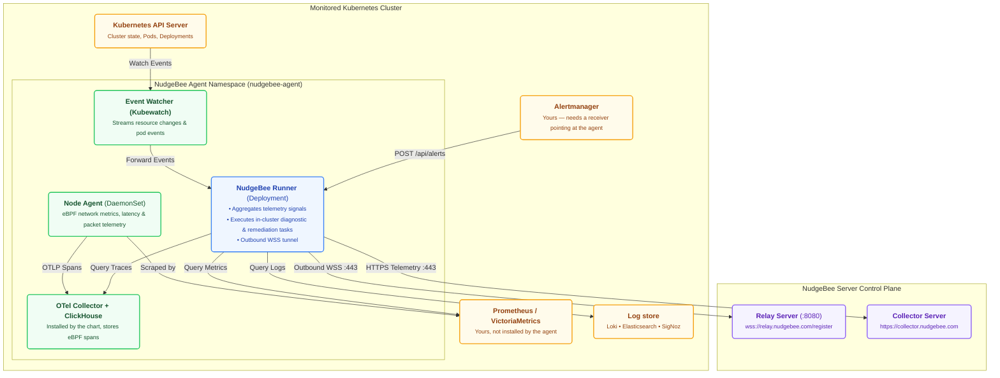

# K8s Agent

The NudgeBee Agent is a lightweight software component that runs inside your Kubernetes cluster. It collects data about workloads, performance, cost, and security, and sends it to the NudgeBee server — feeding the [Semantic Knowledge Graph](../../features/knowledge-graph.md) that powers NudgeBee's Cloud-Ops Intelligence. You need to install an agent in every cluster that you want NudgeBee to monitor. The agent supports AWS, Azure, GCP, and on-premises Kubernetes environments.

:::info
**Both Cloud SaaS and self-hosted users** need to install the agent. This is how NudgeBee gets visibility into your Kubernetes clusters, regardless of your deployment model.
:::

:::tip
If you connected a cloud account (AWS, Azure, or GCP), NudgeBee can auto-discover your Kubernetes clusters. You may still need to install the agent for deep monitoring, but cluster discovery happens automatically.
:::

### What You Will Find in This Section

**Install** — getting the agent running, 5–10 minutes per cluster.

- **[Install the agent](./installation/)** — prerequisites, Helm install, and how to verify it connected.
- **[Kubernetes providers](./installation/k8s-provider/)** — extra steps for GKE and AKS.
- **[Upgrade](./installation/upgrade.md)** — moving an existing agent to a newer version.

**Connect data sources** — what the agent reads once it is running.

- **[Alert forwarding](./connect/alertmanager.md)** — point your Alertmanager at the agent. Without this NudgeBee never sees an alert.
- **[Metrics](./connect/metrics.md)** — Prometheus, Thanos, VictoriaMetrics, Chronosphere, and other backends.
- **[Why is Prometheus Disconnected?](./connect/prometheus-troubleshooting.md)** — 10-step decision tree for debugging metrics connectivity and authentication.
- **[Logs](./connect/logging/)** — Loki, Elasticsearch, SigNoz, Last9.
- **[Traces](./connect/tracing/)** — the bundled OTel collector and ClickHouse, or Google Cloud Trace.
- **[Grafana](./connect/grafana.md)** and **[multi-tenant Prometheus](./connect/multi_tenant_metrics.md)**.

**Operate & Troubleshoot** — tuning, health monitoring, and diagnostics for a running agent.

- **[Troubleshoot Agent Connectivity](./operate/troubleshoot-agent-connectivity.md)** — diagnose disconnected agents, heartbeat staleness (60s tick / 3m timeout), flapping, and safe log bundles.
- **[Agent Health & Subsystem Probes](./operate/agent-health.md)** — field-by-field reference for Relay, Prometheus, Logs, Traces, OpenCost, and Node Agent probes.
- **[Helm values](./operate/helm_values.md)** — every value you are likely to set, including access modes and sizing.
- **[Node agent configuration](./operate/node-agent-configs.md)** — eBPF collector tuning.
- **[Cluster autoscaler](./operate/cluster-autoscaler/)** — Karpenter support.

**Other environments**

- **[Proxy Agent](../proxy-agent/)** — deploy through a proxy for restricted or air-gapped networks.
- **[Local setup](./local-setup.md)** — run against a local KinD cluster.
- **[On-prem setup](./onprem-setup.md)** — values for a self-hosted server.

## Architecture

The NudgeBee Agent runs within your Kubernetes cluster. The main component is the Runner, which acts as a central controller — it coordinates data collection from cluster components and maintains a secure, outbound-only WebSocket connection to the NudgeBee Server.

## Components

### [Event Watcher (Forwarder)](https://github.com/robusta-dev/kubewatch) - Watch for K8s Events
- Monitors Kubernetes events using the Kubernetes API server.
- Filters and processes events based on predefined criteria.
- Forwards relevant events to the Runner component for incident triage.

### [Node Agent](https://github.com/nudgebee/node-agent) - Network & eBPF Telemetry
The Node Agent collects low-overhead network metrics and distributed trace signals on each Kubernetes node using eBPF:
- **eBPF Probes**: Attaches to socket connections and packet lifecycle events to capture latency, throughput, and connection resets.
- **Metric & Signal Publisher**: Publishes network performance signals to Prometheus and forwards distributed traces to the OpenTelemetry collector.

### [Runner](https://github.com/nudgebee/k8s-agent) - Discovery & In-Cluster Controller
The Runner facilitates workload discovery, coordinates data aggregation from metrics/logs/traces, and communicates securely with the NudgeBee Server:
- Discovers running workloads, pods, and services via Kubernetes API.
- Maintains an outbound-only WebSocket connection to the Relay Server.
- Executes diagnostic runbooks and remediation commands safely inside the cluster.

### [Logs](./connect/logging/) - Read From Your Existing Log Store
The runner queries logs where they already are rather than shipping a second copy. Supported backends are Loki (including Last9, which exposes Loki APIs), Elasticsearch and OpenSearch-compatible services, SigNoz, and Google Cloud Logging.

### [Traces](./connect/tracing/) - Distributed Tracing
The node agent produces spans from eBPF and sends them to the OpenTelemetry collector the chart installs, which writes to the bundled ClickHouse. The runner can also read traces from Jaeger, Chronosphere, Apache Pinot, or Google Cloud Trace via BigQuery instead.

### Metrics
Metrics come from a Prometheus-compatible backend you already run — Prometheus, Thanos, VictoriaMetrics, Grafana Mimir, Chronosphere, Amazon Managed Prometheus, Azure Monitor. The chart does not install one; the quick-install script will add kube-prometheus-stack if the cluster has none.

### Recommendation & Diagnostic Jobs
The runner launches short-lived Jobs for analysis that needs its own tooling:
- **[Trivy](https://github.com/aquasecurity/trivy)**: scans container images for CVEs.
- **[KRR](https://github.com/robusta-dev/krr)**: analyses CPU and memory usage for rightsizing recommendations.
- **[Popeye](https://github.com/derailed/popeye)**: inspects cluster configuration for misconfigurations and anti-patterns.