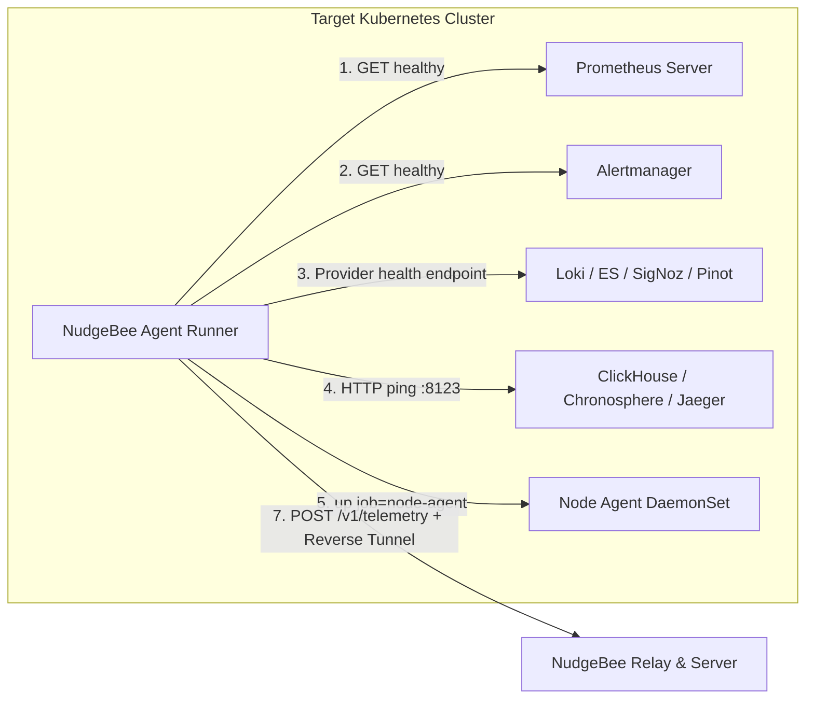

# Kubernetes Agent Health & Subsystem Status

The **Agent Health** view in the NudgeBee Console provides real-time visibility into the internal status of the NudgeBee Kubernetes Agent and all connected cluster datasources.

---

## 1. Agent Health Dashboard Overview

On each periodic telemetry tick, the agent runner executes local lightweight probes against all configured datasources and reports their state to the NudgeBee backend.



---

## 2. Field-by-Field Subsystem Reference

Below is the complete reference of every field displayed on the Agent Health card, how it is probed, and what each status means:

### 1. Relay Connection
* **Purpose**: Maintains a bidirectional WebSocket/gRPC reverse proxy tunnel between the in-cluster agent and NudgeBee Server. Allows NuBi and operators to execute live diagnostic queries, fetch pod logs, or run interactive terminal sessions without opening inbound firewall ports into the cluster.
* **Healthy State**: `Connected` (Green).
* **Probe Mechanism**: Continuous WebSocket keepalive ping.
* **Failure Causes**:
  * Outbound firewall blocks TCP port `443` to the Relay server.
  * `RELAY_SERVER_SECRET_KEY` mismatch between agent and server.
  * Intermediate reverse proxy drops long-lived WebSocket connections (missing `Upgrade: websocket` headers).

---

### 2. Agent URL (`AGENT_HTTP_URL`)
* **Purpose**: The internal ClusterIP service URL used for cluster-local inter-pod communication.
* **Healthy State**: Displays the release's internal runner Service URL (for example, `http://nudgebee-agent-runner.nudgebee-agent.svc.cluster.local`).
* **Verification**:
  ```bash
  kubectl get svc -n nudgebee-agent
  ```

---

### 3. Prometheus
* **Purpose**: Primary metrics engine for cluster CPU, memory, disk, network usage, and Kubernetes object metrics.
* **Healthy State**: `Connected` (Green), with retention duration displayed (e.g. `15d`).
* **Probe Mechanism**: The agent runs the PromQL instant query `vector(1)` through its configured authenticated Prometheus client. A valid Prometheus response with `status: success` marks it Connected.
* **Failure Causes**: Incorrect service URL, DNS or network failure, invalid static or managed-provider credentials, a timeout, or a response that is not a successful Prometheus API payload.
* **Troubleshooting Guide**: See [Why is Prometheus Disconnected?](../connect/prometheus-troubleshooting.md).

---

### 4. Alertmanager
* **Purpose**: Forwards alert definitions, active firing alerts, and alert silencing rules to NudgeBee's event triage engine.
* **Healthy State**: `Connected` (Green).
* **Probe Mechanism**: The agent sends `GET /-/healthy` to the configured Alertmanager URL on each telemetry cycle (60 seconds by default).
* **Failure Causes**:
  * Alertmanager service not reachable at configured URL.
  * In-cluster Alertmanager webhook receiver not configured to forward alerts to NudgeBee.

---

### 5. Logs Provider
* **Purpose**: Enables live log streaming, container crash logs, and AI log analysis in incident investigations.
* **Supported Providers & Probe Endpoints** (evaluated in strict precedence):
  1. **Apache Pinot**: Probes `GET <PinotURL>/health`
  2. **Elasticsearch / OpenSearch**: Probes `GET <ES_URL>/_cluster/health` (authenticated)
  3. **SigNoz**: Probes `GET <SigNozURL>/api/v1/health`
  4. **Grafana Loki**: Probes `GET <LokiURL>/ready`
* **Healthy State**: `Connected` (Green), displaying the active provider name (e.g. `Loki`, `Elasticsearch`, `SigNoz`).
* **Failure Causes**:
  * Incorrect log service URL.
  * Elasticsearch credentials missing or index pattern (`ELASTICSEARCH_LOG_INDEX`) does not match.

---

### 6. Traces
* **Purpose**: Provides distributed APM tracing for microservices latency, error spans, and bottleneck analysis.
* **Supported Backends**:
  * **ClickHouse / OTel Collector**: Probes HTTP `/ping` on port `8123` (or `CLICKHOUSE_PORT`).
  * **Chronosphere Traces / Jaeger**: Reported as enabled when their configuration and query URL are present; this status is not an end-to-end query probe.
* **Healthy State**: `Connected` (Green) or `Disabled` (Gray if tracing is not configured).
* **Failure Causes**: ClickHouse service down, credentials invalid, or `TRACES_ENABLED` set to `false`.

---

### 7. OpenCost
* **Purpose**: Collects real-time container, pod, and node cost allocations and idle waste metrics.
* **Healthy State**: `Connected` (Green).
* **Probe Mechanism**: Probes the OpenCost `/healthz` endpoint.
* **Failure Causes**: OpenCost pod not running, or agent lacks RBAC to query OpenCost service.

---

### 8. Node Agent Count
* **Purpose**: Reports the number of healthy NudgeBee Node Agent daemonset pods collecting low-level eBPF / host metrics.
* **Healthy State**: A count greater than zero marks the Node Agent connected. The Console displays the reported count; it does not compare it with the Kubernetes node count.
* **Probe Mechanism**: Evaluates the PromQL query:
  ```promql
  up{job=~"(.+/)?nudgebee(-.*)?-node-agent"}
  ```
* **Failure Causes**:
  * Node Agent DaemonSet has not been deployed or pods were rejected by Pod Security Standards (PSA/SCC).
  * Node taints or tolerations prevent Node Agent from scheduling on specific worker nodes.
  * Prometheus has not selected the PodMonitor or the node agent is scraped under a different `job` name.
  * See [Why is Prometheus Disconnected?](../connect/prometheus-troubleshooting.md#step-9-why-is-node-agent-count-zero-or-disconnected-in-agent-health) and [Troubleshooting Node Agent Failures](./node-agent-configs.md#troubleshooting-node-agent-failures).

---

### 9. Kubernetes Provider & Version
* **Purpose**: Displays the detected cloud provider runtime (`EKS`, `GKE`, `AKS`, `BareMetal`) and Kubernetes server version.
* **Detection Mechanism**: Probed automatically at startup via Kubernetes Discovery API (`ServerVersion()`) and node provider IDs.

---

### 10. Agent Version & Latest Version
* **Purpose**: Displays the currently running agent container image tag compared against the latest stable release published by NudgeBee.
* **Upgrade Recommended**: The Console asks you to update whenever the running version differs from the latest version returned by the server.

---

## 3. Subsystem Health Diagnostics & Remediation Matrix

| Subsystem | Symptom in Console | How to Verify via CLI | Corrective Helm Command / Action |
| :--- | :--- | :--- | :--- |
| **Relay** | `Relay: Disconnected` | `kubectl logs -n nudgebee-agent deploy/nudgebee-agent-runner \| grep -i relay` | Verify `runner.relay_address` and `runner.nudgebee.auth_secret_key`. Ensure egress on port 443 is open. |
| **Prometheus** | `Prometheus: Disconnected` | Query `<prometheus-url>/api/v1/query?query=vector(1)` with the configured authentication. | Verify `globalConfig.prometheus_url`, headers, and managed-provider auth. See [Prometheus Guide](../connect/prometheus-troubleshooting.md). |
| **Alertmanager** | `Alertmanager: Disconnected` | `kubectl get svc -A \| grep alertmanager` | Check configured URL and verify webhook forwarding. See [Alertmanager Troubleshooting](../connect/alertmanager.md#verify). |
| **Logs (Loki/ES)** | `Logs: Disconnected` | `kubectl run -n nudgebee-agent health-check --rm -i --restart=Never --image=curlimages/curl -- -fsS http://loki:3100/ready` | Verify `runner.loki.url`, `runner.es.url`, or `runner.signoz.url` and the relevant credentials. |
| **Traces** | `Traces: Disconnected` | `kubectl run -n nudgebee-agent health-check --rm -i --restart=Never --image=curlimages/curl -- -fsS http://clickhouse:8123/ping` | Verify ClickHouse health and trace pipeline. See [Storage, ClickHouse & OTel Guide](./storage-and-pvcs.md#2-troubleshooting-clickhouse-restart--crash-loops). |
| **OpenCost** | `OpenCost: Disconnected` | `kubectl get pods -n nudgebee-agent -l app.kubernetes.io/name=opencost` | Verify `opencost.enabled` and RBAC permissions. |
| **Node Agent** | `Node Agent: 0` | `kubectl get ds -n nudgebee-agent` | Inspect scheduling, PSA privileges, and Prometheus scrape jobs. See [Node Agent Configuration](./node-agent-configs.md#troubleshooting-node-agent-failures) and [Prometheus Scrapes](../connect/prometheus-troubleshooting.md#step-9-why-is-node-agent-count-zero-or-disconnected-in-agent-health). |

---

## 4. NuBi Documentation Search

Ask NuBi in chat for guided subsystem setup and troubleshooting:
- *"How does the Kubernetes agent probe Prometheus and Loki health?"*
- *"What does it mean when Node Agent count shows 0 in Agent Health?"*
