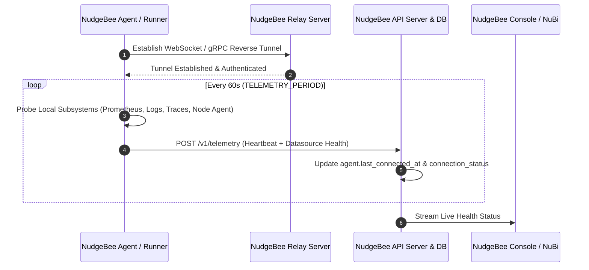
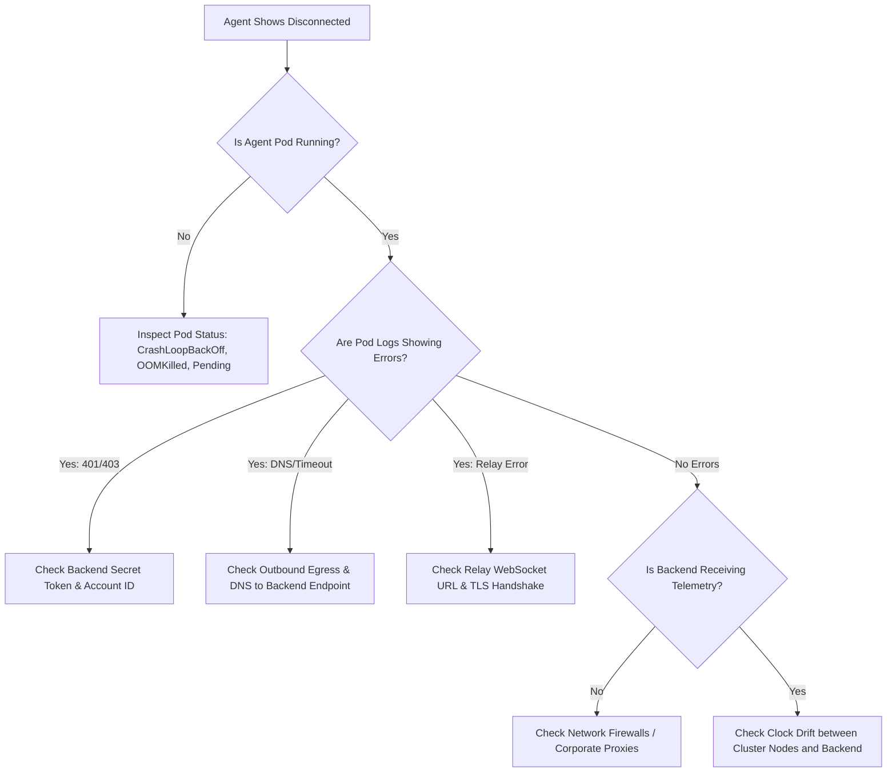

# Troubleshoot NudgeBee Agent Connectivity

This guide helps you diagnose and resolve connectivity issues between your infrastructure agents (Kubernetes Agent, Proxy Agent, or Cloud Integrations) and the NudgeBee backend platform.

---

## 1. What Agent Connectivity Status Means

NudgeBee monitors the health of all registered agents using an active telemetry heartbeat loop:



### Connectivity Status States

| Status | Badge Color | Meaning |
| :--- | :--- | :--- |
| **Connected** | 🟢 Green | The agent has sent a valid telemetry heartbeat within the last **3 minutes** and the Relay tunnel is active. |
| **Disconnected** | 🔴 Red | No telemetry heartbeat has been received for more than **3 minutes**, or the Relay connection has dropped. |
| **Degraded / Warning** | 🟡 Yellow | The core agent is connected, but one or more critical subsystems (e.g., Prometheus, Logs, Traces) failed their local health probe. |
| **Pending / Initializing** | ⚪ Gray | The agent registration has been created in the database, but the first heartbeat has not yet been received. |

---

## 2. Key Connectivity Concepts

### What Does "Last Connected" Mean?
`Last Connected` represents the exact UTC timestamp when the NudgeBee backend last received and validated a telemetry payload or heartbeat ping from the agent.

### Heartbeat Staleness & Grace Period
- **Heartbeat Interval**: By default, the Kubernetes agent posts telemetry every **60 seconds** (`TELEMETRY_PERIOD`).
- **Disconnection Threshold**: If the backend misses **3 consecutive heartbeats** (~180 seconds / 3 minutes), the cluster/account status automatically flips to `DISCONNECTED`.
- **Automatic Recovery**: As soon as the agent recovers and delivers a successful heartbeat tick, the backend automatically transitions the status back to `CONNECTED` without requiring manual intervention or cluster restarts.

### Why Does an Agent Alternate (Flap) Between Connected and Disconnected?
Frequent status toggling usually indicates one of three root causes:
1. **Pod OOMKills / Restarts**: The agent pod is repeatedly crashing and restarting due to memory pressure during large cluster discovery sweeps.
2. **Network Jitter / Proxy Timeouts**: Intermediate firewalls, HTTP proxies, or cloud NAT gateways are dropping idle WebSocket/gRPC connections before the agent's keepalive ping.
3. **Telemetry Probes Timeout**: A local datasource probe (such as a slow Prometheus query) exceeds the internal 30s probe budget, delaying the heartbeat post past the 3-minute staleness window.

### Agent vs. Proxy Agent
- **Direct Kubernetes Agent**: Runs inside your target Kubernetes cluster. It directly scrapes local endpoints (`http://prometheus-server...`) and opens an outbound connection to NudgeBee.
- **Proxy Agent**: Runs in a bastion or jump-host environment. It is designed to bridge private, air-gapped VPCs/clusters or private databases where direct outbound agent installation is restricted. See [Proxy Agent Troubleshooting](../../proxy-agent/troubleshooting.md).

### Agent Version Compatibility
NudgeBee agents maintain broad backward compatibility with NudgeBee server releases. However, older agent versions may lack probe definitions for newer features (e.g., OpenCost or custom trace providers), leading to unpopulated health fields in the UI. Upgrading your agent alongside server updates is recommended.

---

## 3. Diagnostic Decision Tree

Use this decision tree to pinpoint why your agent is disconnected:



---

## 4. Provider-Specific Verification Steps

### A. Kubernetes Agent
Run the following commands to check agent pod health and logs:

```bash
# 1. Check pod status across the nudgebee namespace
kubectl get pods -n nudgebee -o wide

# 2. Inspect recent agent pod events
kubectl describe pod -l app.kubernetes.io/name=nudgebee-agent -n nudgebee

# 3. Stream live logs from the agent runner
kubectl logs -n nudgebee -l app.kubernetes.io/name=nudgebee-agent -c runner --tail=100 -f
```

**What to look for in logs:**
- `starting telemetry poster`: Confirms heartbeat service has booted.
- `telemetry tick succeeded`: Confirms backend received the payload.
- `relay connection established`: Confirms reverse proxy tunnel is live.
- `error posting telemetry`: Indicates network egress or authentication token mismatch.

---

### B. AWS Cloud Account Synchronization
For AWS agent connections:
1. Verify that the **CloudFormation Stack** deployed in the target account is in `CREATE_COMPLETE` or `UPDATE_COMPLETE` state.
2. Confirm the cross-account IAM Role trust policy allows NudgeBee's backend IAM role (`sts:AssumeRole`).
3. Check if AWS API rate limiting is occurring (`RequestLimitExceeded`).

---

### C. Azure Cloud Account Synchronization
For Azure connections:
1. Verify that the **Enterprise Application / Service Principal** credentials (Client ID, Client Secret, Tenant ID) have not expired.
2. Ensure the Service Principal holds `Reader` and `Cost Management Reader` permissions on the target Subscription / Management Group.

---

### D. GCP Cloud Account Synchronization
For GCP connections:
1. Ensure the Service Account private key JSON is valid and not revoked.
2. Verify required roles: `Viewer`, `Billing Account Viewer`, and `BigQuery Data Viewer` (for spend exports).

---

## 5. Common Failure Modes & Solutions

### Failure 1: Invalid Backend Authentication Secret
- **Symptom**: Pod logs output `telemetry post failed: HTTP 401 Unauthorized` or `auth secret mismatch`.
- **Cause**: The `authSecretKey` in the agent's Helm release does not match the secret key configured on the NudgeBee server.
- **Remediation**:
  ```bash
  helm upgrade --install nudgebee-agent nudgebee/nudgebee-agent \
    --namespace nudgebee \
    --set config.backendEndpoint="https://api.nudgebee.yourdomain.com" \
    --set config.authSecretKey="<CORRECT_SECRET_KEY>" \
    --reuse-values
  ```

### Failure 2: Outbound Egress Blocked by NetworkPolicy or Firewall
- **Symptom**: Pod logs output `dial tcp: i/o timeout` or `no route to host`.
- **Cause**: Kubernetes cluster egress policies or perimeter firewalls block outbound HTTPS traffic on port `443` to the NudgeBee backend or relay endpoint.
- **Remediation**:
  - Whitelist the NudgeBee backend domain and relay domain on port `443` (TCP).
  - If using an outbound corporate HTTP proxy, configure `HTTP_PROXY`, `HTTPS_PROXY`, and `NO_PROXY` in the agent's `values.yaml`:
    ```yaml
    extraEnv:
      - name: HTTPS_PROXY
        value: "http://proxy.internal:8080"
      - name: NO_PROXY
        value: ".cluster.local,10.0.0.0/8,172.16.0.0/12"
    ```

### Failure 3: Memory Exhaustion (OOMKilled) on Large Clusters
- **Symptom**: Agent pod restarts frequently with `OOMKilled (Exit Code 137)`.
- **Cause**: Cluster has 10,000+ pods or hundreds of nodes, exceeding the default 512Mi memory limit during discovery sweeps.
- **Remediation**:
  Increase resource limits in `values.yaml`:
  ```yaml
  resources:
    limits:
      cpu: "1000m"
      memory: "2Gi"
    requests:
      cpu: "200m"
      memory: "512Mi"
  ```

---

## 6. Safe Support Escalation & Log Bundle

When reporting connectivity issues to support or attaching diagnostics in an issue, run the sanitized log bundle script below. It extracts relevant diagnostic indicators while automatically redacting sensitive tokens and credentials:

```bash
#!/usr/bin/env bash
# Generate sanitized NudgeBee Agent Diagnostic Bundle

OUT_FILE="nudgebee-agent-diagnostics-$(date +%s).log"
echo "=== NUDGEBEE AGENT DIAGNOSTICS ===" > "$OUT_FILE"
echo "Generated at: $(date -u)" >> "$OUT_FILE"

echo -e "\n--- CLUSTER INFO ---" >> "$OUT_FILE"
kubectl version --short >> "$OUT_FILE" 2>&1

echo -e "\n--- POD STATUS ---" >> "$OUT_FILE"
kubectl get pods -n nudgebee -o wide >> "$OUT_FILE" 2>&1

echo -e "\n--- RECENT EVENTS ---" >> "$OUT_FILE"
kubectl get events -n nudgebee --sort-by='.metadata.creationTimestamp' | tail -n 30 >> "$OUT_FILE" 2>&1

echo -e "\n--- AGENT RUNNER LOGS (SANITIZED) ---" >> "$OUT_FILE"
kubectl logs -n nudgebee -l app.kubernetes.io/name=nudgebee-agent -c runner --tail=200 2>&1 \
  | sed -E 's/(authSecretKey|secret|password|token|bearer|key)=[^ ]+/\1=[REDACTED]/gI' \
  >> "$OUT_FILE"

echo "Diagnostics saved to $OUT_FILE. Safe to share with support."
```

---

## 7. Useful NuBi Diagnostic Prompts

You can ask **NuBi** directly in the console:
- *"Why is cluster [cluster-name] showing disconnected?"*
- *"Check the latest heartbeat and relay status for agent in namespace nudgebee."*
- *"Show the last 5 error messages reported by the Kubernetes agent telemetry loop."*
