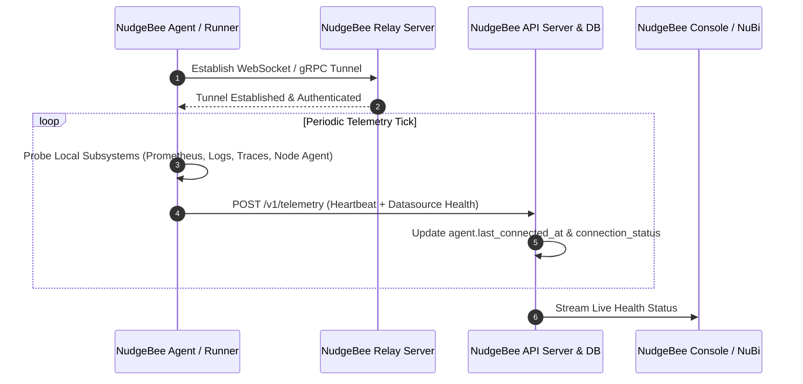
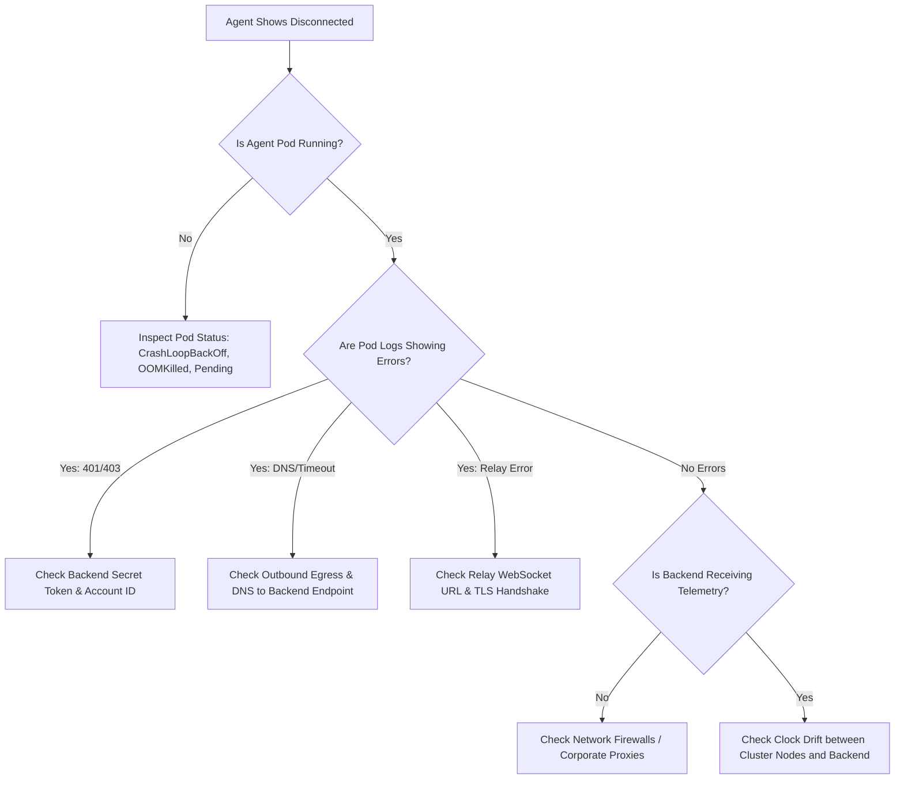

# Troubleshoot NudgeBee Agent Connectivity

This guide helps you diagnose and resolve connectivity issues between your infrastructure agents (Kubernetes Agent, Proxy Agent, or Cloud Integrations) and the NudgeBee backend platform.

---

## 1. What Agent Connectivity Status Means

NudgeBee monitors the health of all registered agents using an active telemetry heartbeat loop:



### Connectivity Status States

| Status | Badge | Meaning |
| :--- | :--- | :--- |
| **Connected** | 🟢 Green | The agent is actively reporting telemetry and sending periodic heartbeats. |
| **Not Connected** | 🔴 Red | No telemetry heartbeat has been received within the connection threshold, or the agent process is stopped. |
| **Degraded / Warning** | 🟡 Yellow | The core agent is connected, but one or more critical subsystems (e.g., Prometheus, Logs, Traces) failed their local health probe. |
| **Pending / Initializing** | ⚪ Gray | The agent registration has been created, but the initial heartbeat has not yet been received. |

---

## 2. Key Connectivity Concepts

### What Does "Last Connected" Mean?
`Last Connected` represents the exact UTC timestamp when the NudgeBee backend last received and validated a telemetry payload or heartbeat ping from the agent (`last_connected_at`).

### Heartbeat Staleness & Recovery
- **Heartbeat Interval**: The Kubernetes agent periodically posts telemetry snapshots to the backend.
- **Automatic Recovery**: As soon as the agent recovers and delivers a successful heartbeat tick, the backend automatically transitions the status back to `Connected` without requiring manual intervention or cluster restarts.

### Why Does an Agent Alternate (Flap) Between Connected and Not Connected?
Frequent status toggling usually indicates one of three root causes:
1. **Pod OOMKills / Restarts**: The agent pod is repeatedly crashing and restarting due to memory pressure during large cluster discovery sweeps.
2. **Network Jitter / Proxy Timeouts**: Intermediate firewalls, HTTP proxies, or cloud NAT gateways are dropping idle connections before the agent's keepalive ping.
3. **Telemetry Probes Timeout**: A local datasource probe (such as a slow Prometheus query) exceeds the internal probe budget, delaying the heartbeat post.

### Agent vs. Proxy Agent
- **Direct Kubernetes Agent**: Runs inside your target Kubernetes cluster. It directly scrapes local endpoints (`http://prometheus-server...`) and opens an outbound connection to NudgeBee.
- **Proxy Agent**: Runs in a bastion or jump-host environment. It is designed to bridge private, air-gapped VPCs/clusters or private databases where direct outbound agent installation is restricted. See [Proxy Agent Troubleshooting](../../proxy-agent/troubleshooting.md).

### Agent Version Compatibility
NudgeBee agents maintain broad backward compatibility with NudgeBee server releases. However, older agent versions may lack probe definitions for newer features or custom trace providers, leading to unpopulated health fields in the UI. Upgrading your agent alongside server updates is recommended.

---

## 3. Diagnostic Decision Tree

Use this decision tree to pinpoint why your agent is disconnected:



---

## 4. Provider-Specific Verification Steps

### A. Kubernetes Agent
Run the following commands to check agent pod health and logs:

```bash
# 1. Check pod status in the release namespace
kubectl get pods -n nudgebee-agent -o wide

# 2. Inspect recent agent pod events
kubectl describe deployment nudgebee-agent-runner -n nudgebee-agent

# 3. Stream live logs from the agent runner
kubectl logs -n nudgebee-agent deploy/nudgebee-agent-runner -c runner --tail=100 -f
```

**What to look for in logs:**
- `starting telemetry poster`: Confirms heartbeat service has booted.
- `telemetry tick succeeded`: Confirms backend received the payload.
- `relay connection established`: Confirms reverse proxy tunnel is live.
- `error posting telemetry`: Indicates network egress or authentication token mismatch.

---

### B. AWS Cloud Account Synchronization
For AWS agent connections:
1. Verify that the **CloudFormation Stack** deployed in the target account is in `CREATE_COMPLETE` or `UPDATE_COMPLETE` state.
2. Confirm the cross-account IAM Role trust policy allows NudgeBee's backend IAM role (`sts:AssumeRole`).
3. Check if AWS API rate limiting is occurring (`RequestLimitExceeded`).

---

### C. Azure Cloud Account Synchronization
For Azure connections:
1. Verify that the **Enterprise Application / Service Principal** credentials (Client ID, Client Secret, Tenant ID) have not expired.
2. Ensure the Service Principal holds `Reader` and `Cost Management Reader` permissions on the target Subscription / Management Group.

---

### D. GCP Cloud Account Synchronization
For GCP connections:
1. Ensure the Service Account private key JSON is valid and not revoked.
2. Verify required roles: `Viewer`, `Billing Account Viewer`, and `BigQuery Data Viewer` (for spend exports).

---

## 5. Common Failure Modes & Solutions

### Failure 1: Invalid Backend Authentication Secret
- **Symptom**: Pod logs output `telemetry post failed: HTTP 401 Unauthorized` or `auth secret mismatch`.
- **Cause**: The `authSecretKey` in the agent's Helm release does not match the secret key configured on the NudgeBee server.
- **Remediation**:
  ```bash
  helm upgrade --install nudgebee-agent nudgebee-agent/nudgebee-agent \
    --namespace nudgebee-agent \
    --set runner.nudgebee.endpoint="https://api.nudgebee.yourdomain.com" \
    --set runner.nudgebee.auth_secret_key="<CORRECT_SECRET_KEY>" \
    --reuse-values
  ```

### Failure 2: Outbound Egress Blocked by NetworkPolicy or Firewall
- **Symptom**: Pod logs output `dial tcp: i/o timeout` or `no route to host`.
- **Cause**: Kubernetes cluster egress policies or perimeter firewalls block outbound HTTPS traffic on port `443` to the NudgeBee backend or relay endpoint.
- **Remediation**:
  - Whitelist the NudgeBee backend domain and relay domain on port `443` (TCP).
  - If using an outbound corporate HTTP proxy, configure `HTTP_PROXY`, `HTTPS_PROXY`, and `NO_PROXY` in the agent's `values.yaml`:
    ```yaml
    runner:
      additional_env_vars:
      - name: HTTPS_PROXY
        value: "http://proxy.internal:8080"
      - name: NO_PROXY
        value: ".cluster.local,10.0.0.0/8,172.16.0.0/12"
    ```

### Failure 3: Memory Exhaustion (OOMKilled) on Large Clusters
- **Symptom**: Agent pod restarts frequently with `OOMKilled (Exit Code 137)`.
- **Cause**: The runner's informer cache and discovery snapshot exceed its configured memory limit. Object count matters more than request traffic.
- **Remediation**:
  Increase resource limits in `values.yaml`:
  ```yaml
  runner:
    resources:
      limits:
        cpu: "1000m"
        memory: "4Gi"
      requests:
        cpu: "200m"
        memory: "2Gi"
  ```

---

## 6. Support Escalation & Diagnostic Bundle

Collect the affected account, UTC time range, pod status, recent Kubernetes events, and relevant agent logs. Confirm your namespace and pod/container names before running the commands.

The example below requires Bash, Python 3, and kubectl. It stores diagnostics with owner-only permissions and redacts common credential formats. Redaction is best-effort: review the complete file locally before sharing it, including URLs, event messages, customer identifiers, and application-specific secrets.

```bash
#!/usr/bin/env bash
set -euo pipefail
umask 077

OUT_FILE="$(mktemp ./nudgebee-agent-diagnostics.XXXXXX)"
{
  date -u
  kubectl version --client -o yaml
  kubectl get pods -n nudgebee-agent -o wide
  kubectl get events -n nudgebee-agent --sort-by='.metadata.creationTimestamp' | tail -n 30
  kubectl logs -n nudgebee-agent deploy/nudgebee-agent-runner -c runner --tail=200
} 2>&1 | python3 -c '
import re
import sys
text = sys.stdin.read()
text = re.sub(r"(?i)\b(Bearer|Basic)\s+[^\s\"\x27,;]+", r"\1 [REDACTED]", text)
text = re.sub(
    r"(?i)([\"\x27]?(?:authorization|authSecretKey|secret|password|token|api[_-]?key|access[_-]?key|secret[_-]?key)[\"\x27]?\s*[:=]\s*)(\"[^\"]*\"|\x27[^\x27]*\x27|[^\s,;&}]+)",
    r"\1[REDACTED]", text,
)
sys.stdout.write(text)
' > "$OUT_FILE"

echo "Diagnostics saved to $OUT_FILE. Review locally before sharing."
```

If collection fails, inspect the partial output locally and correct the namespace, selector, container name, or permissions. Do not attach unreviewed raw logs as a workaround.


---

## 7. NuBi Documentation Search

Ask NuBi in chat for guided connectivity troubleshooting:
- *"How do I troubleshoot a disconnected Kubernetes agent in NudgeBee?"*
- *"How do I generate a sanitized agent diagnostic bundle for support?"*
