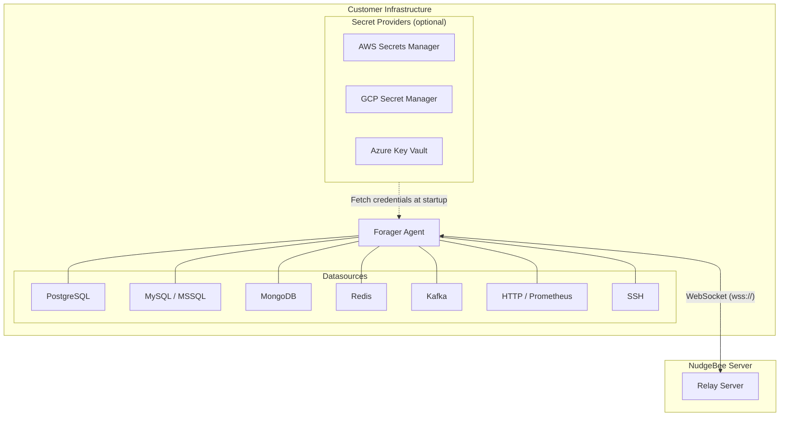

# Proxy Agent (Forager)

The NudgeBee Proxy Agent (Forager) monitors non-Kubernetes infrastructure — databases, HTTP services, SSH hosts, Redis, MongoDB, and Kafka. It runs as a single binary on a VM or container and connects to NudgeBee Server over a persistent WebSocket.

## Architecture

### How it works

1. **Connect** — Forager establishes a WebSocket connection to the NudgeBee Relay Server using your access key.
2. **Register** — On connect, it reports all configured datasources so they appear in the NudgeBee UI automatically.
3. **Proxy** — NudgeBee Server sends queries through the WebSocket; Forager proxies them to the target datasource and returns results.
4. **Health** — Forager periodically checks datasource connectivity and reports health status.
5. **Credentials** — Datasource credentials can be provided inline, pushed from NudgeBee, or fetched from cloud secret managers (AWS SM, GCP SM, Azure KV).

## Supported Datasources

| Type | Proxy | Description |
|------|-------|-------------|
| `postgresql` | DB | PostgreSQL 10+ |
| `mysql` | DB | MySQL 5.7+ / MariaDB |
| `mssql` | DB | Microsoft SQL Server |
| `clickhouse` | DB | ClickHouse |
| `oracle` | DB | Oracle Database |
| `mongodb` | MongoDB | MongoDB 4.0+ |
| `redis` | Redis | Redis 5+ |
| `kafka` | Kafka | Apache Kafka |
| `http` | HTTP | Any HTTP API |
| `prometheus` | HTTP | Prometheus-compatible endpoints |
| `ssh` | SSH | Remote hosts via SSH |

## Next Steps

- [Installation](./installation.md) — Deploy Forager on a VM, as a container, or on Kubernetes
- [Credential Sources](./credential-sources.md) — Configure how datasource credentials are provided
- [Configuration Reference](./configuration.md) — Full YAML config reference
