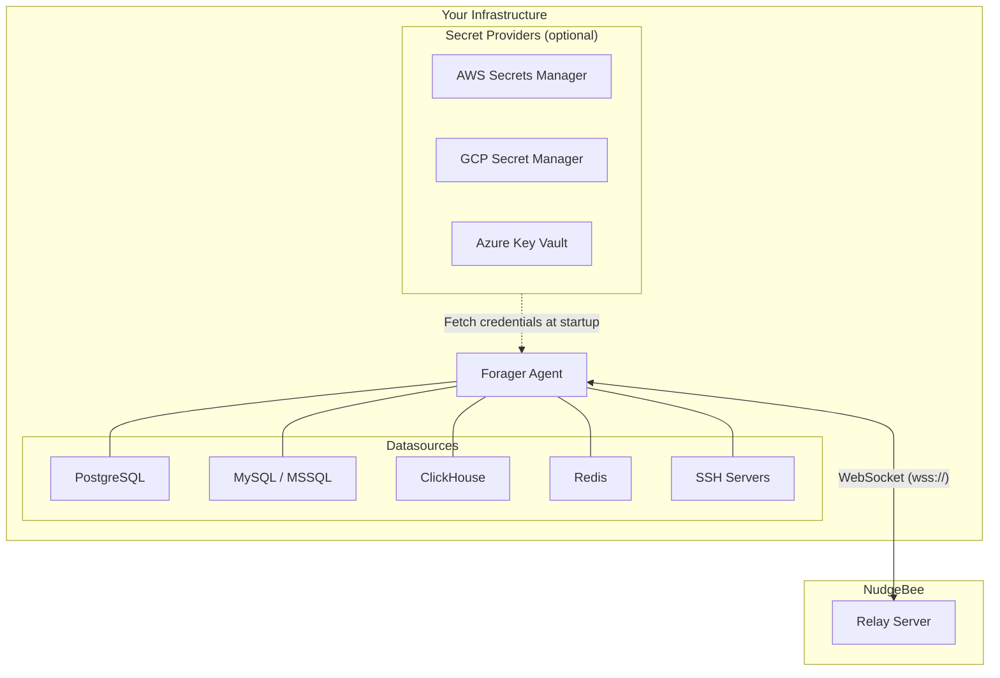

# Proxy Agent (Forager)

## When to Use

Use the Proxy Agent when you need NudgeBee to query databases, run SSH commands on servers, or access services that are **not running inside Kubernetes**, or when your infrastructure is in a private network that the NudgeBee K8s agent cannot reach.

| Scenario | Use |
|----------|-----|
| Database on a VM, bare metal, or managed service (RDS, Cloud SQL, etc.) | **Proxy Agent** |
| Run commands on Linux/Windows servers via SSH | **Proxy Agent** |
| Database running inside your Kubernetes cluster | K8s Agent (default) |
| Database or server in a private VPC with no K8s access | **Proxy Agent** |
| You already have a K8s agent but want to add non-K8s resources | **Proxy Agent** (alongside your K8s agent) |

## How It Works

The Proxy Agent (called **Forager**) is a lightweight binary that runs on a VM (Linux or Windows), container, or Kubernetes pod in your infrastructure. It connects to NudgeBee over a secure WebSocket and acts as a bridge between NudgeBee and your datasources.

1. **Connect** — Forager opens a WebSocket to the NudgeBee Relay Server using your access key.
2. **Receive Config** — On connect, the relay pushes your datasource configurations to the agent automatically.
3. **Proxy** — When NudgeBee needs to query a database or run an SSH command, it sends the request through the WebSocket. Forager executes it against the target datasource and returns results.
4. **Health Check** — Forager periodically checks each datasource and reports health status back to NudgeBee.

## Two Ways to Configure Datasources

You can configure which datasources (databases, SSH servers, etc.) the agent connects to in two ways:

### Option A: From the NudgeBee UI (Recommended)

Add datasources from the NudgeBee web interface. The configuration is pushed to the agent automatically — no config files needed on the agent side.

Best for: SaaS users, teams that want centralized management, quick setup.

→ See [Quick Start](./quick-start.md)

### Option B: Local YAML Config

Define datasources in a YAML config file on the agent. The agent registers them with NudgeBee on connect.

Best for: Self-hosted deployments, GitOps workflows, infrastructure-as-code setups.

→ See [Configuration Reference](./configuration.md)

## Supported Datasources

| Type | Description |
|------|-------------|
| `postgresql` | PostgreSQL 10+ |
| `mysql` | MySQL 5.7+ / MariaDB |
| `mssql` | Microsoft SQL Server |
| `clickhouse` | ClickHouse |
| `oracle` | Oracle Database |
| `redis` | Redis 5+ |
| `ssh` | Linux / Windows servers via SSH (OpenSSH) |
| `mcp` | Model Context Protocol servers — HTTP or stdio. See [MCP integration guide](../../integrations/MCP/index.md). |

## Next Steps

1. [**Quick Start**](./quick-start.md) — Connect your first database in 5 minutes
2. [Installation](./installation.md) — All deployment options (Linux, Windows, Docker, Helm)
3. [Configuration Reference](./configuration.md) — Full YAML config reference
4. [Credential Sources](./credential-sources.md) — Local, Cloud Push, AWS SM, GCP SM, Azure KV
5. [Troubleshooting](./troubleshooting.md) — Common issues and fixes
