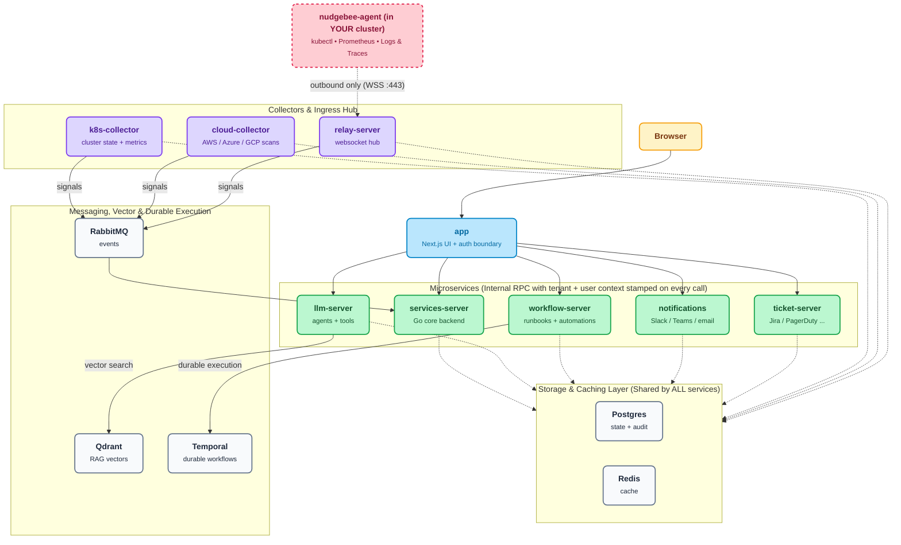

import Tabs from '@theme/Tabs';
import TabItem from '@theme/TabItem';

# Server Installation

The NudgeBee Server is the central control plane of the NudgeBee platform. It hosts the web UI, Semantic Knowledge Graph, AI agent orchestrator, and workflow execution engine. It receives data from NudgeBee Agents across your clusters and integrates with identity providers and observability tools.

:::note[Self-Hosted Only]
**Cloud SaaS users**: You do not need to install the server. It is fully managed for you at [app.nudgebee.com](https://app.nudgebee.com). Skip directly to [Agent Installation](../agent/installation/index.md).

**Infrastructure Scope**: The self-hosted NudgeBee Server requires its own Kubernetes cluster (or dedicated namespace) on Kubernetes v1.27+. If you do not operate Kubernetes infrastructure, use Cloud SaaS.
:::

:::tip[Choosing an edition]
The self-hosted server comes in two editions (see [Editions & Capabilities](../../editions.md) for the full comparison):

- **Community** <Community/> — free, source-available self-hosted edition. The Server is licensed under **BSL 1.1** (converting to Apache 2.0 on its stated change date); Agents are **Apache 2.0**. Images are pulled from the public `ghcr.io/nudgebee` registry. **No license key required.** OAuth SSO (Google, Okta, OneLogin, Azure AD / B2C, Auth0), magic-link email, and credentials login are all included.
- **Enterprise** <Enterprise/> — adds **SAML 2.0** SSO, NudgeBee's managed models (`nb-llm`, `nb-slm`), and commercial SLA support. Images are pulled from `registry.nudgebee.com` and require a license key.

The installation steps below use tabs — pick your edition in each step.
:::

## Architecture



:::tip
**Estimated time**: 15–30 minutes, depending on your cluster and infrastructure setup.
:::

### Watch the Walkthrough

<div style={{position: "relative", paddingBottom: "64.86%", height: 0}}><iframe src="https://www.loom.com/embed/dee1ca6f7d294ef2b7f2746243e67e41?sid=256e5a97-215e-46fa-974e-69b329096273" frameborder="0" webkitallowfullscreen mozallowfullscreen allowfullscreen style={{position: "absolute", top: 0, left: 0, width: "100%", height: "100%"}}></iframe></div>

---

## 1. Before You Begin

### Components & Why They Exist

The NudgeBee server relies on core backend services. You can run them bundled inside the Helm chart (simplest for quick starts) or point NudgeBee to your own externally-managed instances (recommended for high availability and production compliance).

| Component | Required? | What It Does & Why It's Needed | Bring Your Own (BYO)? |
|---|---|---|---|
| **PostgreSQL** | **Required** | Primary datastore — stores cluster workloads, workflow states, alert rules, user metadata, and configuration. **Queries and backend services fail immediately without it.** | **Yes** (e.g. AWS RDS, Azure Database for PG, Cloud SQL) |
| **RabbitMQ** | **Required** | Message bus connecting internal backend workers. **The backend will not bootstrap its event and triage consumers without it.** | **Yes** (e.g. Amazon MQ or self-managed cluster) |
| **Redis** | **Optional** | Caching layer for session state and fast query caching. **Falls back to in-memory cache if omitted** (fine for trials, Redis recommended for production). | **Yes** (e.g. AWS ElastiCache, Azure Redis) |
| **Qdrant** | **Conditional** | Vector database for Semantic Knowledge Graph embeddings and RAG retrieval. Needed when AI troubleshooting is enabled. | **Yes** (Bundled subchart or external Qdrant) |
| **Temporal** | **Conditional** | Durable execution engine for long-running runbooks, workflows, and automated remediations. | **Yes** (Bundled subchart or external Temporal cluster) |

:::important Hard Dependencies
**PostgreSQL and RabbitMQ are mandatory hard dependencies** — the server will not start without them. By default, the Helm chart deploys bundled instances of both.
:::

### System & Sizing Requirements

| Requirement | Minimum (Bundled Dependencies) | Minimum (External DBs) | Notes |
|---|---|---|---|
| **Kubernetes Cluster** | v1.27 or newer, minimum 2 nodes | v1.27 or newer, minimum 2 nodes | Sized for up to 400 monitored nodes |
| **Compute & Memory** | **12 GB RAM, 4 CPU cores** | **8 GB RAM, 2 CPU cores** | Bundled footprint includes PG, RabbitMQ, Redis, Qdrant, Temporal |
| **Persistent Storage** | 200 GB SSD storage | 100 GB SSD storage | Required for database and application state PVCs |
| **Helm** | v3.x installed and configured | v3.x installed and configured | [Install Helm](https://helm.sh/) |
| **Registry Access** | `ghcr.io/nudgebee` (Community) or `registry.nudgebee.com` (Enterprise) | Same | Air-gapped environments can mirror images internally |
| **NudgeBee License Key** | Enterprise only | Enterprise only | Community edition does not require a key |

### Preflight Cluster Validation

Before deploying, run this quick check in your terminal to verify your cluster meets the version, capacity, and storage requirements:

```bash
# 1. Verify kubectl context and Kubernetes server version (v1.27+)
kubectl config current-context
kubectl version --short 2>/dev/null || kubectl version

# 2. Verify Helm version (v3.10+)
helm version --short

# 3. Check allocatable CPU and memory across your nodes
kubectl get nodes -o custom-columns=NAME:.metadata.name,STATUS:.status.conditions[-1].type,ALLOCATABLE_CPU:.status.allocatable.cpu,ALLOCATABLE_MEM:.status.allocatable.memory

# 4. Verify default StorageClass exists for persistent volumes
kubectl get storageclass
```

### Network Requirements & Decision Rationale

Your cluster needs the following network access. Understanding why each rule exists helps you configure firewalls with least privilege:

- **Outbound to Container Registry** (`ghcr.io/nudgebee` or `registry.nudgebee.com` on port 443): **Required during install/upgrade** to pull container images. *What breaks if blocked:* Pods get stuck in `ImagePullBackOff`.
- **Internal Cluster DNS Resolution**: **Required for internal service communication**. The server pods must be able to resolve `BASE_URL` and internal service endpoints. *What breaks if blocked:* Auth callback loops and service-to-service communication failures.
- **Outbound to Integrations** (Slack, Jira, Teams, GitHub, OpenAI / Cloud APIs on port 443): **Required only for enabled integrations**. *What breaks if blocked:* Alert notifications, auto-PRs, or AI analysis queries will fail to dispatch.
- **Inbound Access** (Port 80/443 via Ingress or port-forward): **Required for user web UI access, webhook triggers, and agent telemetry reception**.

:::tip Start Simple with Port-Forwarding
**Why skip Ingress initially?** For local evaluation, testing, or sandboxes, you can run NudgeBee entirely with `kubectl port-forward` without provisioning DNS records, public IPs, or SSL certificates. Add Ingress when transitioning to team use.
:::

---

## 2. Install NudgeBee

The installation follows three steps: select your edition, configure `values.yaml`, and run `helm upgrade --install`.

### Step 1: Select Your Edition & Registry Login

:::caution[Protecting Your License & Auth Credentials]
**Keep your license / auth key secret.** This key authenticates your cluster to the NudgeBee registry and allows agents to report into your control plane. Treat it like a root password:
- Store it in a secret manager (AWS Secrets Manager, Vault) or a Kubernetes Secret.
- Never commit it to version control or paste it in shared channels.
- Avoid passing it as an inline CLI flag to prevent it from saving in your shell history (e.g. use `read -s NUDGEBEE_LICENSE_KEY` or environment files).
:::

<Tabs groupId="edition">
<TabItem value="community" label="Community (free)">

Community images are public on `ghcr.io/nudgebee` — **no registry login is required.** Just set the chart location used by the commands below:

```shell
export NUDGEBEE_CHART=oci://ghcr.io/nudgebee/charts/nudgebee
```

</TabItem>
<TabItem value="enterprise" label="Enterprise">

Log in to the NudgeBee Helm registry with your license key, then set the chart location:

```shell
# Prompt for key securely to avoid saving to shell history
read -s -p "Enter NudgeBee License Key: " NUDGEBEE_LICENSE_KEY
echo

helm registry login registry.nudgebee.com --username nudgebee --password "$NUDGEBEE_LICENSE_KEY"
export NUDGEBEE_CHART=oci://registry.nudgebee.com/nudgebee
```

</TabItem>
</Tabs>

### Step 2: Create Your `values.yaml`

Create a file called `values.yaml` with the minimum required configuration. This gets NudgeBee running with port-forwarding — the simplest setup that works.

<Tabs groupId="edition">
<TabItem value="community" label="Community (free)">

```yaml
global:
  image:
    registry: "ghcr.io/nudgebee"

# REQUIRED on a fresh Community install. The first admin and their organization
# are created during install from this address, so the deployment is complete
# when `helm install` returns. The install fails fast if it is missing.
admin:
  email: "you@example.com"

nudgebee_secret:
  BASE_URL: "http://localhost:3000"
  # 32-byte hex — generate once with `openssl rand -hex 32` and store in your
  # secret manager. Rotating after data is written makes previously-encrypted
  # DB rows unreadable, so treat it like a database master password.
  NUDGEBEE_ENCRYPTION_KEY: "<your-32-byte-hex-key>"

# The agent is installed alongside the server by default and connects the
# cluster hosting it. Name it here; set `enabled: false` to opt out.
agent:
  enabled: true
  clusterName: "nb-control-plane-k8s"

app:
  ingress:
    enabled: false
k8s-collector:
  ingress:
    enabled: false
relay-server:
  ingress:
    enabled: false
```

Generate `NUDGEBEE_ENCRYPTION_KEY` with:

```shell
openssl rand -hex 32
```

</TabItem>
<TabItem value="enterprise" label="Enterprise">

```yaml
global:
  image:
    registry: "registry.nudgebee.com"
  imagePullSecrets:
    - name: nudgebee-registry-secret

nudgebee_registry_secret:
  enabled: true

nudgebee_secret:
  BASE_URL: "http://localhost:3000"
  NUDGEBEE_ENCRYPTION_KEY: "<your-32-byte-hex-key>"   # openssl rand -hex 32
  NUDGEBEE_LICENSE: <your-license-key>

# Optional on Enterprise: the license carries its own admin address and takes
# precedence. Set it only if your license does not name one — a conflicting
# value is ignored with a warning in the services-server log.
# admin:
#   email: "you@example.com"

# The agent is installed alongside the server by default and connects the
# cluster hosting it. Name it here; set `enabled: false` to opt out.
agent:
  enabled: true
  clusterName: "nb-control-plane-k8s"

app:
  ingress:
    enabled: false
k8s-collector:
  ingress:
    enabled: false
relay-server:
  ingress:
    enabled: false
```

Replace `<your-license-key>` with your NudgeBee license key and generate
`NUDGEBEE_ENCRYPTION_KEY` with `openssl rand -hex 32`.

</TabItem>
</Tabs>

#### `admin.email` — who the first admin is {#admin-email}

The server creates the first admin user and their organization **during install**, so the deployment is usable the moment `helm install` returns rather than half-configured until somebody signs in.

| Edition | Is `admin.email` required? | Which address is used |
|---|---|---|
| **Community** <Community/> | **Yes**, on a fresh install — the chart fails with `[ERROR] admin.email is required` | The value you set |
| **Enterprise** <Enterprise/> | No, if `nudgebee_secret.NUDGEBEE_LICENSE` (or `global.existingNudgebeeSecretName`) is set | The address inside the license. A different `admin.email` is ignored and logged as a warning |

Other things worth knowing:

- **Upgrades are never checked.** An existing deployment already has an admin, so `admin.email` is only validated on `helm install` of a new release.
- **The address is validated.** A malformed address fails the install.
- **Sign in with this address** plus the generated bootstrap password — see [Access the UI](#4-access-the-ui--authenticate).

#### The bundled agent — installed by default {#bundled-agent}

`agent.enabled` defaults to **`true`**: the chart installs the [NudgeBee Agent](../agent/installation/index.md) into the same namespace and registers the cluster hosting the server. The first cluster therefore needs no second install and no copied auth key — the chart generates the agent credential and hands the same value to both sides.

| Value | Default | What it does |
|---|---|---|
| `agent.enabled` | `true` | Install the agent alongside the server and connect this cluster |
| `agent.clusterName` | `nb-control-plane-k8s` | Name this cluster appears under. Must be more than 3 characters, max 40, no special characters; `Demo` is reserved |
| `agent.accessKey` / `agent.accessSecret` | `""` | **GitOps only** — see the Argo CD / Flux caution below |
| `nudgebee-agent.*` | — | Passthrough to the agent subchart; anything the [agent chart](../agent/operate/helm_values.md) accepts can be set here |

The bundled agent runs a deliberately light subset so a first install stays small. The node agent (privileged eBPF DaemonSet), the OpenTelemetry collector, and the agent's ClickHouse are **off**; inventory, events, logs, metrics, and alerts all work. Turn them on explicitly when you want network metrics, the service map, traces, or profiles:

```yaml
nudgebee-agent:
  nodeAgent:
    enabled: true
  opentelemetry-collector:
    enabled: true
  runner:
    clickhouse_enabled: true    # must be on together with the collector above
```

:::caution[Set `agent.enabled: false` if this cluster is already monitored]
If a separately installed agent already reports this cluster, leave the bundled one off — otherwise the same cluster registers a second time under a different name:

```yaml
agent:
  enabled: false
```

This is the common case when **upgrading** an existing self-hosted deployment, where the default flips the behaviour from what you installed with.
:::

:::caution[GitOps (Argo CD, Flux): set `agent.accessKey` and `agent.accessSecret`]
Offline rendering cannot read the existing credential back from the cluster, and the chart refuses to silently regenerate it — a fresh credential paired with the old hash in Postgres would leave the agent unable to authenticate. On an upgrade rendered offline the chart fails unless you supply both explicitly. Read them from the live cluster:

```shell
kubectl get secret nudgebee-bootstrap -n nudgebee \
  -o jsonpath='{.data.LOCAL_AGENT_ACCESS_KEY}' | base64 -d; echo
kubectl get secret nudgebee-bootstrap -n nudgebee \
  -o jsonpath='{.data.LOCAL_AGENT_ACCESS_SECRET}' | base64 -d; echo
```

```yaml
agent:
  accessKey: "<existing LOCAL_AGENT_ACCESS_KEY>"
  accessSecret: "<existing LOCAL_AGENT_ACCESS_SECRET>"
```

Leave both empty for ordinary `helm install` / `helm upgrade` against a reachable cluster.
:::

:::note[The agent shares the Helm release]
`helm uninstall nudgebee` removes the bundled agent too. It also adds two pods (runner and forwarder) to the sizing figures above — and substantially more if you enable the node agent, the OpenTelemetry collector, or the agent's ClickHouse, which brings its own PVC.
:::

### Step 3: Run the Helm Install

```shell
# 1. Set your target Kubernetes context (or omit --kube-context if already using current context):
export KUBE_CONTEXT="$(kubectl config current-context)"

# 2. Deploy NudgeBee Server:
helm upgrade nudgebee $NUDGEBEE_CHART \
  -f values.yaml \
  --install \
  --namespace nudgebee \
  --create-namespace \
  --wait \
  --kube-context "$KUBE_CONTEXT"
```

To install a specific version, add `--version $CHART_VERSION` to the command. See the [Server Releases](../../releases/server/) page for available versions.

For a quick evaluation you can skip the values file entirely and pass the three values that matter on the command line (Community chart shown):

```shell
export NUDGEBEE_ENC_KEY=$(openssl rand -hex 32)   # save this — it cannot be rotated after data is written

helm install nudgebee oci://ghcr.io/nudgebee/charts/nudgebee \
  --namespace nudgebee --create-namespace \
  --set nudgebee_secret.NUDGEBEE_ENCRYPTION_KEY="$NUDGEBEE_ENC_KEY" \
  --set admin.email="you@example.com" \
  --set agent.enabled=true \
  --wait --timeout 20m
```

:::tip
**This minimal setup gets NudgeBee running with port-forwarding.** You can add Ingress, SSL, external Postgres, and other configurations later without reinstalling — just update your `values.yaml` and run `helm upgrade` again.
:::

---

## 3. Verify the Installation (What Success Looks Like)

After the Helm install completes, perform these checks to confirm your server is operating properly:

### 1. Check Pod Status

Run `kubectl get pods` in the `nudgebee` namespace:

```shell
kubectl get pods -n nudgebee
```

**Expected Pod State:**

| Pod Name Pattern | Ready State | Status | Role |
|---|---|---|---|
| `app-*` | `1/1` | `Running` | Main UI and GraphQL/REST API |
| `services-server-*` | `1/1` | `Running` | Core backend (also provisions the admin and the bundled agent's account) |
| `k8s-collector-*` | `1/1` | `Running` | Telemetry receiver for agents |
| `relay-server-*` | `1/1` | `Running` | WebSocket agent relay server |
| `postgresql-0` | `1/1` | `Running` | Core database (if bundled) |
| `rabbitmq-0` | `1/1` | `Running` | Event message bus (if bundled) |
| `postgres-migration-job-*` | `0/1` | `Completed` | Pre-install database migration job |
| `nudgebee-nudgebee-agent-runner-*` | `1/1` | `Running` | Bundled agent (only when `agent.enabled: true`, the default) |
| `nudgebee-nudgebee-agent-forwarder-*` | `1/1` | `Running` | Bundled agent's event watcher |

All active pods should show `1/1` `Running`, and migration jobs should show `Completed`. This typically takes 2–3 minutes after the Helm command finishes.

:::note[Bundled agent pod names]
The agent is a subchart of the server release, so its pods carry the release name twice (`nudgebee-nudgebee-agent-*`). There is no `node-agent` DaemonSet unless you enable it — see [the bundled agent](#bundled-agent).
:::

### 2. Verify HTTP Connectivity

Test that the web application responds on its port:

```shell
# Port-forward the app in the background or in a separate terminal:
kubectl port-forward svc/app 3000:80 -n nudgebee &

# Verify HTTP 200 / login page response:
curl -I http://localhost:3000
```

You should receive an `HTTP/1.1 200 OK` (or `307 Temporary Redirect` to `/auth/signin`).

:::caution Troubleshooting Installation Failures
**If pods are stuck in `Pending`, `CrashLoopBackOff`, or `Error`**, see the [Troubleshooting](#troubleshooting-installation-failures) section below.
:::

---

## 4. Access the UI & Authenticate

### Understanding Authentication by Deployment Mode
- **Cloud SaaS (`app.nudgebee.com`)**: Completely passwordless — users sign in using OAuth SSO (Google, GitHub, Okta, Microsoft) or email magic links. No passwords are stored or generated.
- **Self-Hosted Community & Enterprise**: The admin user and organization are created during install from [`admin.email`](#admin-email) (or the address in your Enterprise license), and a secure bootstrap password is stored in an in-cluster Kubernetes secret so that administrator can sign in, complete setup, and configure SSO.

### Accessing Without Ingress (Port-Forwarding)

Forward the NudgeBee UI to your local machine:

```shell
kubectl port-forward svc/app 3000:80 -n nudgebee
```

Then open [http://localhost:3000](http://localhost:3000) in your browser to view the login screen.

### Retrieving the Bootstrap Admin Credentials

Retrieve the auto-generated bootstrap password from the `nudgebee` secret:

```shell
kubectl get secret nudgebee -n nudgebee \
  -o jsonpath='{.data.NEXTAUTH_DUMMY_CREDS_PASSWORD}' | base64 -d
echo
```

Sign in with the address you set in `admin.email` (or the address carried by your Enterprise license) and the decoded password. That user already exists with its organization, so there is nothing to set up on first login.

:::tip[Nothing was provisioned?]
If the login screen rejects the address, check that the install actually provisioned it:

```shell
kubectl logs -n nudgebee deploy/services-server | grep -i 'first run'
```

`no admin address configured, leaving provisioning to first login` means neither `admin.email` nor a license address reached the server — the deployment falls back to provisioning whoever signs in first.
:::

:::caution Production Security
**The bootstrap credentials provider is intended for initial onboarding and evaluation only.** For production, configure an enterprise identity provider (SAML 2.0 or OAuth SSO) and disable dummy credentials. See [Authentication Integrations](../../integrations/Authentication/) for details.
:::

---

## 5. Verify Control Plane Health & Next Steps

Once logged into the dashboard, complete your initial control plane verification:

1. **Verify UI & Dashboard Navigation**: Navigate through **Kubernetes**, **Troubleshoot**, and **Optimizations** to confirm all views load without errors.
2. **Confirm the Cluster Hosting the Server Is Connected**: With the bundled agent enabled (the default), **Kubernetes** already lists this cluster under `agent.clusterName` (`nb-control-plane-k8s` unless you changed it). If it does not appear:

   ```shell
   kubectl logs -n nudgebee deploy/services-server | grep -iE 'first run|local agent'
   ```

   `no tenant yet, deferring registration to first login` means the agent registers as soon as the first admin exists. A cluster-name error (too short, reserved, or invalid characters) is reported here too — fix `agent.clusterName` and re-run `helm upgrade`.
3. **Connect an LLM Provider (BYOM)**: Navigate to **Settings → AI / LLM** and configure your API key ([OpenAI, AWS Bedrock, or Ollama](../../integrations/LLM/)) to enable NuBi AI investigations and automated RCA.
4. **Next Step: Install the Agent on Your Other Clusters**: The cluster running the server is already covered. Every **additional** cluster you want monitored needs its own agent install:

👉 **[Install the NudgeBee Agent on Your Cluster](../agent/installation/index.md)**

---

## 6. Add Ingress and SSL (Recommended for Production)

The minimal installation above works with port-forwarding, but for production use you should expose NudgeBee via Ingress with SSL. This enables:

- Public URL access for your team (no need to run `kubectl port-forward`)
- Slack and Google Chat app integrations (they need to reach your server)
- Webhook triggers for the Workflow Builder
- Magic link email authentication

### Understanding the Three Endpoints

NudgeBee exposes three services that each need their own Ingress entry:

| Service | Purpose | Example domain |
|---|---|---|
| **App** | The web UI and API | `nudgebee.yourcompany.com` |
| **Collector** | Receives data from agents running in your monitored clusters | `collector.yourcompany.com` |
| **Relay** | WebSocket connection for real-time agent communication | `relay.yourcompany.com` |

:::info
**Relay and Collector URLs for Agent Installation**: When you install agents with Ingress enabled, use:
- **Relay Server URL**: `wss://relay.yourcompany.com`
- **Collector Server URL**: `https://collector.yourcompany.com`
:::

### Sample Ingress Values File (with SSL)

The following `values.yaml` uses cert-manager for SSL. Adjust the annotations and TLS settings based on your cluster's ingress controller and certificate management setup.

Replace all `<placeholder>` values with your actual domains (and, for Enterprise, your license key).

:::note[Community edition]
The example below is for the Enterprise registry. For the **Community** edition, set `global.image.registry: "ghcr.io/nudgebee"` and remove the `imagePullSecrets`, `nudgebee_registry_secret`, and `NUDGEBEE_LICENSE` lines.
:::

```yaml
global:
  image:
    registry: "registry.nudgebee.com"
  imagePullSecrets:
    - name: nudgebee-registry-secret

nudgebee_registry_secret:
  enabled: true

nudgebee_secret:
  BASE_URL: "<NudgeBee Server Https Url>"       # e.g., https://nudgebee.yourcompany.com
  NUDGEBEE_LICENSE: <your-license-key>
  NEXTAUTH_DUMMY_CREDS_ENABLED: true

app:
  ingress:
    enabled: true
    hosts:
      - host: "<NudgeBee Base Domain>"           # e.g., nudgebee.yourcompany.com
        paths:
          - path: /
            pathType: ImplementationSpecific
    tls:
      - secretName: nudgebee-tls
        hosts:
        - "<NudgeBee Base Domain>"
    annotations:
      cert-manager.io/issuer: cert-letsencrypt-issuer
      nginx.ingress.kubernetes.io/force-ssl-redirect: "true"
      nginx.ingress.kubernetes.io/proxy-buffer-size: '32k'
      nginx.ingress.kubernetes.io/proxy-body-size: "10m"
k8s-collector:
  ingress:
    enabled: true
    hosts:
      - host: "<NudgeBee collector Base Domain>"  # e.g., collector.yourcompany.com
        paths:
          - path: /
            pathType: ImplementationSpecific
    tls:
      - secretName: nudgebee-tls
        hosts:
        - "<NudgeBee Base Domain>"
    annotations:
      cert-manager.io/issuer: cert-letsencrypt-issuer
      nginx.ingress.kubernetes.io/force-ssl-redirect: "true"
      nginx.ingress.kubernetes.io/proxy-body-size: "50m"
relay-server:
  ingress:
    enabled: true
    hosts:
      - host: "<NudgeBee relay Base Domain>"      # e.g., relay.yourcompany.com
        paths:
          - path: /
            pathType: ImplementationSpecific
    tls:
      - secretName: nudgebee-tls
        hosts:
        - "<NudgeBee Base Domain>"
    annotations:
      cert-manager.io/issuer: cert-letsencrypt-issuer
      nginx.ingress.kubernetes.io/force-ssl-redirect: "true"
```

After updating your `values.yaml`, apply the changes:

```shell
helm upgrade nudgebee $NUDGEBEE_CHART \
  -f values.yaml \
  --install \
  --namespace nudgebee \
  --wait \
  --kube-context $KUBE_CONTEXT
```

---

## 6. Advanced Configuration

These options are for teams that need to customize the installation for production requirements. You can skip this section for your initial setup and come back later.

### Managing Secrets Externally

If your organization manages Kubernetes secrets through an external tool (Vault, Sealed Secrets, etc.), you can reference pre-existing secrets instead of putting values directly in the Helm chart.

* **`global.existingNudgebeeSecretName`** — Point to an existing Kubernetes secret that holds core NudgeBee settings (`NUDGEBEE_LICENSE`, `BASE_URL`, etc.). When set, the Helm chart uses this secret and you manage the key-value pairs directly.

  ```yaml
  global:
    existingNudgebeeSecretName: 'nudgebee-v2'

  # Remove or comment out nudgebee_secret when using existingSecret:
  # nudgebee_secret:
  #    NUDGEBEE_LICENSE: YOUR_LICENSE_KEY_HERE
  ```

* **`nudgebee_registry_secret.existingSecretName`** — Reference a pre-created secret for registry credentials.
* **`postgresql.auth.existingSecret`** — Inject an existing secret containing the Postgres password.
* **`clickhouse.auth.existingSecret`** — Same usage for ClickHouse.
* **`rabbitmq.auth.existingPasswordSecret`**, **`existingErlangSecret`** — Same usage for RabbitMQ.

### Externalizing Dependencies (Bring-Your-Own Databases)

While bundled subcharts are convenient for proofs-of-concept, **running externally managed databases is strongly recommended for production**:

- **High Availability & Failover**: Managed databases (e.g. AWS Aurora PostgreSQL, Azure Database for PostgreSQL, Google Cloud SQL) provide multi-AZ failover and automated maintenance.
- **Backups & Point-in-Time Recovery**: Leverage cloud-native automated snapshots, retention policies, and disaster recovery without managing Kubernetes persistent volumes.
- **Decoupled Lifecycle**: Upgrade and scale your datastores independently of NudgeBee Helm chart upgrades.

To use an external PostgreSQL database, disable the bundled chart and supply your database connection string in `values.yaml`:

```yaml
postgresql:
  enabled: false

nudgebee_secret:
  APP_DATABASE_URL: "postgresql://<USER>:<PASSWORD>@<DB_HOST>:5432/<DB_NAME>?sslmode=require"
```

### Additional Configuration References

- **[All Configuration Options](./secret_configs.md)** — Detailed reference for all environment variables and secrets.
- **[Full Helm Values Reference](./helm_values.md)** — Complete list of every configurable value in the Helm chart.

---

## 7. Troubleshooting Installation Failures {#troubleshooting-installation-failures}

Use this diagnostic playbook if your Helm deployment encounters errors or pods fail to transition into a `Running` state.

---

### Diagnostic Quick Reference

| Error Symptom | Probable Cause | Diagnostic Command & Fix |
|---|---|---|
| **`[ERROR] admin.email is required`** (install refuses to render) | Fresh install with no admin address and no license | Set `admin.email` in `values.yaml` or `--set admin.email=you@example.com`. Enterprise installs can set `nudgebee_secret.NUDGEBEE_LICENSE` instead. See [`admin.email`](#admin-email) |
| **`admin.email is not a valid address`** | Typo in the address | Fix the address. It is validated because the organization is created from it at install time |
| **`The bundled agent's credential could not be found and will not be regenerated`** | Upgrade rendered offline (Argo CD / Flux), where `lookup` cannot read the existing Secret | Set `agent.accessKey` and `agent.accessSecret` from the live `nudgebee-bootstrap` Secret, or `agent.enabled=false`. See [the bundled agent](#bundled-agent) |
| **Same cluster appears twice after an upgrade** | `agent.enabled` defaults to `true`, and this cluster already had a standalone agent | Set `agent.enabled: false`, then delete the duplicate account under **Admin → Integrations → Kubernetes Clusters** |
| **Migration Job Timeout / `0/1 Completed`** | Database not ready before migration ran, or stale schema lock | Check logs: `kubectl logs job/nudgebee-migration -n nudgebee`<br/>Fix: Re-run `helm upgrade --wait` |
| **`error pinging postgres: lookup postgres`** | Incorrect DB hostname or bundled vs external mismatch | Check `nudgebee_secret.APP_DATABASE_URL`<br/>Bundled: `postgresql.nudgebee.svc.cluster.local:5432`<br/>External: Verify RDS / Cloud SQL endpoint |
| **RabbitMQ connection refused / CrashLoop** | RabbitMQ broker not ready or bad AMQP credentials | Check: `kubectl logs deployment/nudgebee-rabbitmq -n nudgebee`<br/>Verify `RABBIT_MQ_HOST: "rabbitmq"` and port `5672` |
| **502 Bad Gateway / WebSocket Disconnects** | Ingress missing WebSocket upgrade or timeout annotations | Add `nginx.ingress.kubernetes.io/proxy-read-timeout: "3600"` to Ingress manifest |
| **Pod Exit Code 137 (`OOMKilled`)** | Node under memory pressure or insufficient pod limit | Check: `kubectl describe pod <name> -n nudgebee`<br/>Fix: Increase RAM request/limit in `values.yaml` |

---

### Failure Scenarios & Step-by-Step Fixes

#### 1. Migration Job Timeout or CrashLoop
The most common reason for installation timeouts is the **post-installation schema migration job** failing to complete. This occurs when the database pod is still initializing when the migration begins.

**Diagnose:**
```shell
kubectl logs job/nudgebee-migration -n nudgebee
```

**Resolution:**
Ensure PostgreSQL is in a `Running` state, then re-run the Helm upgrade with the `--wait` flag to allow dependencies to stabilize:
```shell
helm upgrade nudgebee $NUDGEBEE_CHART \
  -f values.yaml \
  --install \
  --namespace nudgebee \
  --wait \
  --timeout 10m
```

#### 2. Database Connection or DNS Lookup Failure
If backend pods (`services-server`, `relay-server`) crash on startup with errors like:
```text
error pinging postgres: dial tcp: lookup postgres: no such host
```

**Resolution:**
- **If using Bundled PostgreSQL (`postgresql.enabled: true`)**: Ensure `APP_DATABASE_URL` references the in-cluster Kubernetes DNS name:
  `postgresql://nudgebee:<PASSWORD>@nudgebee-postgresql.nudgebee.svc.cluster.local:5432/nudgebee?sslmode=disable`
- **If using External PostgreSQL (`postgresql.enabled: false`)**: Ensure your Kubernetes cluster nodes have network routing and security group access to your cloud database endpoint (e.g. AWS RDS or GCP Cloud SQL) on port 5432.

#### 3. RabbitMQ Broker Connection Failure
If backend services fail to initialize task consumers and event queues:

**Diagnose:**
```shell
kubectl get pods -n nudgebee -l app.kubernetes.io/name=rabbitmq
kubectl logs deployment/nudgebee-services-server -n nudgebee | grep -i rabbit
```

**Resolution:**
Verify that `RABBIT_MQ_HOST` matches your service name (default `rabbitmq` or `nudgebee-rabbitmq`) and that the `RABBIT_MQ_PASSWORD` matches the secret generated during install.

#### 4. Ingress 502 Bad Gateway / WebSocket EOF
If the NudgeBee web UI loads but live events, agent connections, or NuBi AI chat stream disconnect unexpectedly:

**Resolution:**
Ensure your Ingress controller is configured for long-lived WebSocket connections. For NGINX Ingress, apply these annotations:
```yaml
metadata:
  annotations:
    nginx.ingress.kubernetes.io/proxy-read-timeout: "3600"
    nginx.ingress.kubernetes.io/proxy-send-timeout: "3600"
    nginx.ingress.kubernetes.io/websocket-services: "relay-server"
```

#### 5. Control Plane OOMKilled (Exit Code 137)
If pods randomly restart under heavy metric or event ingestion:

**Diagnose:**
```shell
kubectl get pods -n nudgebee -o jsonpath='{range .items[*]}{.metadata.name}{"\t"}{.status.containerStatuses[*].lastState.terminated.reason}{"\n"}{end}'
```

**Resolution:**
If `OOMKilled` appears, adjust the container memory limits in your `values.yaml`:
```yaml
services_server:
  resources:
    requests:
      cpu: "500m"
      memory: "1Gi"
    limits:
      cpu: "2"
      memory: "4Gi"
```

---

## 8. Uninstall NudgeBee

To completely remove NudgeBee from your cluster:

```shell
helm uninstall nudgebee --namespace nudgebee --kube-context $KUBE_CONTEXT
```

:::caution
This removes all NudgeBee components and data — **including the bundled agent**, which shares the same Helm release. Make sure to back up any data you need before uninstalling.
:::

---

## What's Next?

Your NudgeBee server is running, and the cluster it runs on is already connected through the bundled agent. Here is what to do next:

1. **[Install the NudgeBee Agent](../agent/installation/index.md)** on each **additional** Kubernetes cluster you want to monitor — this is how NudgeBee gets visibility into workloads outside the control-plane cluster.
2. **[Configure Integrations](../../integrations/index.md)** — connect your observability tools, notification channels, and LLM provider to unlock the full platform.
3. **[Explore the Getting Started Guide](../../features/index.md)** — see the recommended setup order and what to do after your first login.
