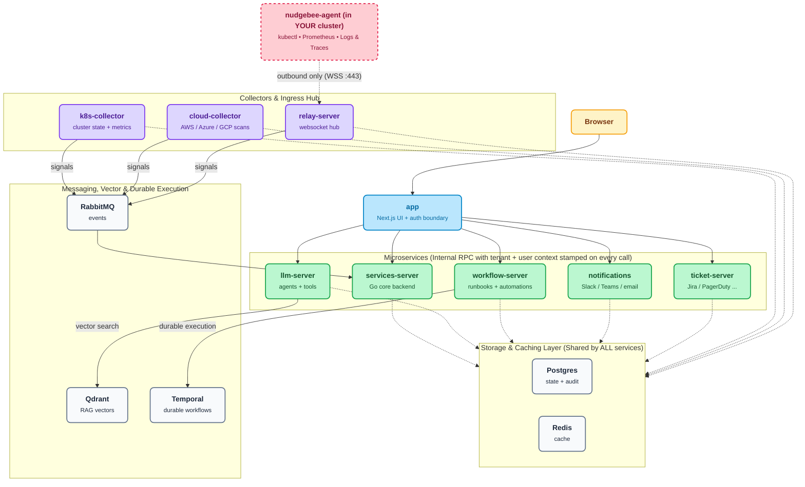

import Tabs from '@theme/Tabs';
import TabItem from '@theme/TabItem';

# Server Installation

The NudgeBee Server is the central control plane of the NudgeBee platform. It hosts the web UI, Semantic Knowledge Graph, AI agent orchestrator, and workflow execution engine. It receives data from NudgeBee Agents across your clusters and integrates with identity providers and observability tools.

:::note[Self-Hosted Only]
**Cloud SaaS users**: You do not need to install the server. It is fully managed for you at [app.nudgebee.com](https://app.nudgebee.com). Skip directly to [Agent Installation](../agent/installation/index.md).

**Infrastructure Scope**: The self-hosted NudgeBee Server requires its own Kubernetes cluster (or dedicated namespace) on Kubernetes v1.27+. If you do not operate Kubernetes infrastructure, use Cloud SaaS.
:::

:::tip[Choosing an edition]
The self-hosted server comes in two editions (see [Editions](../../editions.md) for the full comparison):

- **Community** <Community/> — free and open source (Apache 2.0), fully functional. Images are pulled from the public `ghcr.io/nudgebee` registry. **No license key required.** OAuth SSO (Google, Okta, OneLogin, Azure AD / B2C, Auth0), magic-link email, and credentials login are all included.
- **Enterprise** <Enterprise/> — adds **SAML 2.0** SSO, NudgeBee's managed models (`nb-llm`, `nb-slm`), and commercial support. Images are pulled from `registry.nudgebee.com` and require a license key.

The installation steps below use tabs — pick your edition in each step.
:::

## Architecture



:::tip
**Estimated time**: 15–30 minutes, depending on your cluster and infrastructure setup.
:::

### Watch the Walkthrough

<div style={{position: "relative", paddingBottom: "64.86%", height: 0}}><iframe src="https://www.loom.com/embed/dee1ca6f7d294ef2b7f2746243e67e41?sid=256e5a97-215e-46fa-974e-69b329096273" frameborder="0" webkitallowfullscreen mozallowfullscreen allowfullscreen style={{position: "absolute", top: 0, left: 0, width: "100%", height: "100%"}}></iframe></div>

---

## 1. Before You Begin

### Components & Why They Exist

The NudgeBee server relies on core backend services. You can run them bundled inside the Helm chart (simplest for quick starts) or point NudgeBee to your own externally-managed instances (recommended for high availability and production compliance).

| Component | Required? | What It Does & Why It's Needed | Bring Your Own (BYO)? |
|---|---|---|---|
| **PostgreSQL** | **Required** | Primary datastore — stores cluster workloads, workflow states, alert rules, user metadata, and configuration. **Queries and backend services fail immediately without it.** | **Yes** (e.g. AWS RDS, Azure Database for PG, Cloud SQL) |
| **RabbitMQ** | **Required** | Message bus connecting internal backend workers. **The backend will not bootstrap its event and triage consumers without it.** | **Yes** (e.g. Amazon MQ or self-managed cluster) |
| **Redis** | **Optional** | Caching layer for session state and fast query caching. **Falls back to in-memory cache if omitted** (fine for trials, Redis recommended for production). | **Yes** (e.g. AWS ElastiCache, Azure Redis) |
| **Qdrant** | **Conditional** | Vector database for Semantic Knowledge Graph embeddings and RAG retrieval. Needed when AI troubleshooting is enabled. | **Yes** (Bundled subchart or external Qdrant) |
| **Temporal** | **Conditional** | Durable execution engine for long-running runbooks, workflows, and automated remediations. | **Yes** (Bundled subchart or external Temporal cluster) |

:::important Hard Dependencies
**PostgreSQL and RabbitMQ are mandatory hard dependencies** — the server will not start without them. By default, the Helm chart deploys bundled instances of both.
:::

### System & Sizing Requirements

| Requirement | Minimum (Bundled Dependencies) | Minimum (External DBs) | Notes |
|---|---|---|---|
| **Kubernetes Cluster** | v1.27 or newer, minimum 2 nodes | v1.27 or newer, minimum 2 nodes | Sized for up to 400 monitored nodes |
| **Compute & Memory** | **12 GB RAM, 4 CPU cores** | **8 GB RAM, 2 CPU cores** | Bundled footprint includes PG, RabbitMQ, Redis, Qdrant, Temporal |
| **Persistent Storage** | 200 GB SSD storage | 100 GB SSD storage | Required for database and application state PVCs |
| **Helm** | v3.x installed and configured | v3.x installed and configured | [Install Helm](https://helm.sh/) |
| **Registry Access** | `ghcr.io/nudgebee` (Community) or `registry.nudgebee.com` (Enterprise) | Same | Air-gapped environments can mirror images internally |
| **NudgeBee License Key** | Enterprise only | Enterprise only | Community edition does not require a key |

### Network Requirements & Decision Rationale

Your cluster needs the following network access. Understanding why each rule exists helps you configure firewalls with least privilege:

- **Outbound to Container Registry** (`ghcr.io/nudgebee` or `registry.nudgebee.com` on port 443): **Required during install/upgrade** to pull container images. *What breaks if blocked:* Pods get stuck in `ImagePullBackOff`.
- **Internal Cluster DNS Resolution**: **Required for internal service communication**. The server pods must be able to resolve `BASE_URL` and internal service endpoints. *What breaks if blocked:* Auth callback loops and service-to-service communication failures.
- **Outbound to Integrations** (Slack, Jira, Teams, GitHub, OpenAI / Cloud APIs on port 443): **Required only for enabled integrations**. *What breaks if blocked:* Alert notifications, auto-PRs, or AI analysis queries will fail to dispatch.
- **Inbound Access** (Port 80/443 via Ingress or port-forward): **Required for user web UI access, webhook triggers, and agent telemetry reception**.

:::tip Start Simple with Port-Forwarding
**Why skip Ingress initially?** For local evaluation, testing, or sandboxes, you can run NudgeBee entirely with `kubectl port-forward` without provisioning DNS records, public IPs, or SSL certificates. Add Ingress when transitioning to team use.
:::

---

## 2. Install NudgeBee

The installation follows three steps: select your edition, configure `values.yaml`, and run `helm upgrade --install`.

### Step 1: Select Your Edition & Registry Login

:::caution[Protecting Your License & Auth Credentials]
**Keep your license / auth key secret.** This key authenticates your cluster to the NudgeBee registry and allows agents to report into your control plane. Treat it like a root password:
- Store it in a secret manager (AWS Secrets Manager, Vault) or a Kubernetes Secret.
- Never commit it to version control or paste it in shared channels.
- Avoid passing it as an inline CLI flag to prevent it from saving in your shell history (e.g. use `read -s NUDGEBEE_LICENSE_KEY` or environment files).
:::

<Tabs groupId="edition">
<TabItem value="community" label="Community (free)">

Community images are public on `ghcr.io/nudgebee` — **no registry login is required.** Just set the chart location used by the commands below:

```shell
export NUDGEBEE_CHART=oci://ghcr.io/nudgebee/charts/nudgebee
```

</TabItem>
<TabItem value="enterprise" label="Enterprise">

Log in to the NudgeBee Helm registry with your license key, then set the chart location:

```shell
# Prompt for key securely to avoid saving to shell history
read -s -p "Enter NudgeBee License Key: " NUDGEBEE_LICENSE_KEY
echo

helm registry login registry.nudgebee.com --username nudgebee --password "$NUDGEBEE_LICENSE_KEY"
export NUDGEBEE_CHART=oci://registry.nudgebee.com/nudgebee
```

</TabItem>
</Tabs>

### Step 2: Create Your `values.yaml`

Create a file called `values.yaml` with the minimum required configuration. This gets NudgeBee running with port-forwarding — the simplest setup that works.

<Tabs groupId="edition">
<TabItem value="community" label="Community (free)">

```yaml
global:
  image:
    registry: "ghcr.io/nudgebee"

nudgebee_secret:
  BASE_URL: "http://localhost:3000"
  # 32-byte hex — generate once with `openssl rand -hex 32` and store in your
  # secret manager. Rotating after data is written makes previously-encrypted
  # DB rows unreadable, so treat it like a database master password.
  NUDGEBEE_ENCRYPTION_KEY: "<your-32-byte-hex-key>"

app:
  ingress:
    enabled: false
k8s-collector:
  ingress:
    enabled: false
relay-server:
  ingress:
    enabled: false
```

Generate `NUDGEBEE_ENCRYPTION_KEY` with:

```shell
openssl rand -hex 32
```

</TabItem>
<TabItem value="enterprise" label="Enterprise">

```yaml
global:
  image:
    registry: "registry.nudgebee.com"
  imagePullSecrets:
    - name: nudgebee-registry-secret

nudgebee_registry_secret:
  enabled: true

nudgebee_secret:
  BASE_URL: "http://localhost:3000"
  NUDGEBEE_ENCRYPTION_KEY: "<your-32-byte-hex-key>"   # openssl rand -hex 32
  NUDGEBEE_LICENSE: <your-license-key>

app:
  ingress:
    enabled: false
k8s-collector:
  ingress:
    enabled: false
relay-server:
  ingress:
    enabled: false
```

Replace `<your-license-key>` with your NudgeBee license key and generate
`NUDGEBEE_ENCRYPTION_KEY` with `openssl rand -hex 32`.

</TabItem>
</Tabs>

### Step 3: Run the Helm Install

```shell
helm upgrade nudgebee $NUDGEBEE_CHART \
  -f values.yaml \
  --install \
  --namespace nudgebee \
  --create-namespace \
  --wait \
  --kube-context $KUBE_CONTEXT
```

To install a specific version, add `--version $CHART_VERSION` to the command. See the [Server Releases](../../releases/server/) page for available versions.

:::tip
**This minimal setup gets NudgeBee running with port-forwarding.** You can add Ingress, SSL, external Postgres, and other configurations later without reinstalling — just update your `values.yaml` and run `helm upgrade` again.
:::

---

## 3. Verify the Installation (What Success Looks Like)

After the Helm install completes, perform these checks to confirm your server is operating properly:

### 1. Check Pod Status

Run `kubectl get pods` in the `nudgebee` namespace:

```shell
kubectl get pods -n nudgebee
```

**Expected Pod State:**

| Pod Name Pattern | Ready State | Status | Role |
|---|---|---|---|
| `nudgebee-app-*` | `1/1` | `Running` | Main UI and GraphQL/REST API |
| `nudgebee-k8s-collector-*` | `1/1` | `Running` | Telemetry receiver for agents |
| `nudgebee-relay-server-*` | `1/1` | `Running` | WebSocket agent relay server |
| `nudgebee-postgresql-0` | `1/1` | `Running` | Core database (if bundled) |
| `nudgebee-rabbitmq-0` | `1/1` | `Running` | Event message bus (if bundled) |
| `nudgebee-schema-migration-*` | `0/1` | `Completed` | Post-install database migration job |

All active pods should show `1/1` `Running`, and migration jobs should show `Completed`. This typically takes 2–3 minutes after the Helm command finishes.

### 2. Verify HTTP Connectivity

Test that the web application responds on its port:

```shell
# Port-forward the app in the background or in a separate terminal:
kubectl port-forward svc/app 3000:80 -n nudgebee &

# Verify HTTP 200 / login page response:
curl -I http://localhost:3000
```

You should receive an `HTTP/1.1 200 OK` (or `307 Temporary Redirect` to `/auth/signin`).

:::caution Troubleshooting Installation Failures
**If pods are stuck in `Pending`, `CrashLoopBackOff`, or `Error`**, see the [Troubleshooting](#troubleshooting-installation-failures) section below.
:::

---

## 4. Access the UI & Authenticate

### Understanding Authentication by Deployment Mode
- **Cloud SaaS (`app.nudgebee.com`)**: Completely passwordless — users sign in using OAuth SSO (Google, GitHub, Okta, Microsoft) or email magic links. No passwords are stored or generated.
- **Self-Hosted Community & Enterprise**: Initializes with a secure bootstrap admin password stored in an in-cluster Kubernetes secret so administrators can complete initial setup and configure SSO.

### Accessing Without Ingress (Port-Forwarding)

Forward the NudgeBee UI to your local machine:

```shell
kubectl port-forward svc/app 3000:80 -n nudgebee --kube-context $KUBE_CONTEXT
```

Then open [http://localhost:3000](http://localhost:3000) in your browser to view the login screen.

### Retrieving the Bootstrap Admin Credentials

Retrieve the auto-generated bootstrap password from the `nudgebee` secret:

```shell
kubectl get secret nudgebee -n nudgebee \
  -o jsonpath='{.data.NEXTAUTH_DUMMY_CREDS_PASSWORD}' \
  --kube-context $KUBE_CONTEXT | base64 -d
echo
```

Use your admin email (e.g. `admin@nudgebee.local` or the email provided during install) and the decoded password to sign in.

:::caution Production Security
**The bootstrap credentials provider is intended for initial onboarding and evaluation only.** For production, configure an enterprise identity provider (SAML 2.0 or OAuth SSO) and disable dummy credentials. See [Authentication Integrations](../../integrations/Authentication/) for details.
:::

---

## 5. Verify Your First Successful Outcome with NuBi

Once logged into the dashboard, verify end-to-end intelligence by running your first AI-SRE investigation:

1. **Open the NuBi AI Drawer**: Click the **NuBi** icon in the right-hand sidebar or navigation bar.
2. **Run a Concrete Diagnostic Prompt**:
   ```text
   What workloads in this cluster have experienced restarts or OOMKills in the last 24 hours?
   ```
3. **Expected Result**: NuBi inspects live telemetry, queries the Kubernetes event stream, and responds with:
   - A structured list of affected workloads, namespaces, and pod names.
   - Exact exit codes (e.g. `137 OOMKilled` or `CrashLoopBackOff`).
   - Root cause hypothesis and recommended next steps (e.g. memory request adjustments or inspecting application stack traces).
4. **Success Verification**: When you receive a structured response with direct links to the relevant workloads, your NudgeBee Control Plane and AI engine are verified and healthy!

---

## 6. Add Ingress and SSL (Recommended for Production)

The minimal installation above works with port-forwarding, but for production use you should expose NudgeBee via Ingress with SSL. This enables:

- Public URL access for your team (no need to run `kubectl port-forward`)
- Slack and Google Chat app integrations (they need to reach your server)
- Webhook triggers for the Workflow Builder
- Magic link email authentication

### Understanding the Three Endpoints

NudgeBee exposes three services that each need their own Ingress entry:

| Service | Purpose | Example domain |
|---|---|---|
| **App** | The web UI and API | `nudgebee.yourcompany.com` |
| **Collector** | Receives data from agents running in your monitored clusters | `collector.yourcompany.com` |
| **Relay** | WebSocket connection for real-time agent communication | `relay.yourcompany.com` |

:::info
**Relay and Collector URLs for Agent Installation**: When you install agents with Ingress enabled, use:
- **Relay Server URL**: `wss://relay.yourcompany.com`
- **Collector Server URL**: `https://collector.yourcompany.com`
:::

### Sample Ingress Values File (with SSL)

The following `values.yaml` uses cert-manager for SSL. Adjust the annotations and TLS settings based on your cluster's ingress controller and certificate management setup.

Replace all `<placeholder>` values with your actual domains (and, for Enterprise, your license key).

:::note[Community edition]
The example below is for the Enterprise registry. For the **Community** edition, set `global.image.registry: "ghcr.io/nudgebee"` and remove the `imagePullSecrets`, `nudgebee_registry_secret`, and `NUDGEBEE_LICENSE` lines.
:::

```yaml
global:
  image:
    registry: "registry.nudgebee.com"
  imagePullSecrets:
    - name: nudgebee-registry-secret

nudgebee_registry_secret:
  enabled: true

nudgebee_secret:
  BASE_URL: "<NudgeBee Server Https Url>"       # e.g., https://nudgebee.yourcompany.com
  NUDGEBEE_LICENSE: <your-license-key>
  NEXTAUTH_DUMMY_CREDS_ENABLED: true

app:
  ingress:
    enabled: true
    hosts:
      - host: "<NudgeBee Base Domain>"           # e.g., nudgebee.yourcompany.com
        paths:
          - path: /
            pathType: ImplementationSpecific
    tls:
      - secretName: nudgebee-tls
        hosts:
        - "<NudgeBee Base Domain>"
    annotations: 
      cert-manager.io/issuer: cert-letsencrypt-issuer
      nginx.ingress.kubernetes.io/force-ssl-redirect: "true"
      nginx.ingress.kubernetes.io/proxy-buffer-size: '32k'
      nginx.ingress.kubernetes.io/proxy-body-size: "10m"     
k8s-collector:
  ingress:
    enabled: true
    hosts:
      - host: "<NudgeBee collector Base Domain>"  # e.g., collector.yourcompany.com
        paths:
          - path: /
            pathType: ImplementationSpecific
    tls:
      - secretName: nudgebee-tls
        hosts:
        - "<NudgeBee Base Domain>"
    annotations: 
      cert-manager.io/issuer: cert-letsencrypt-issuer
      nginx.ingress.kubernetes.io/force-ssl-redirect: "true"
      nginx.ingress.kubernetes.io/proxy-body-size: "50m"
relay-server:
  ingress:
    enabled: true
    hosts:
      - host: "<NudgeBee relay Base Domain>"      # e.g., relay.yourcompany.com
        paths:
          - path: /
            pathType: ImplementationSpecific
    tls:
      - secretName: nudgebee-tls
        hosts:
        - "<NudgeBee Base Domain>"
    annotations: 
      cert-manager.io/issuer: cert-letsencrypt-issuer
      nginx.ingress.kubernetes.io/force-ssl-redirect: "true"
```

After updating your `values.yaml`, apply the changes:

```shell
helm upgrade nudgebee $NUDGEBEE_CHART \
  -f values.yaml \
  --install \
  --namespace nudgebee \
  --wait \
  --kube-context $KUBE_CONTEXT
```

---

## 6. Advanced Configuration

These options are for teams that need to customize the installation for production requirements. You can skip this section for your initial setup and come back later.

### Managing Secrets Externally

If your organization manages Kubernetes secrets through an external tool (Vault, Sealed Secrets, etc.), you can reference pre-existing secrets instead of putting values directly in the Helm chart.

* **`global.existingNudgebeeSecretName`** — Point to an existing Kubernetes secret that holds core NudgeBee settings (`NUDGEBEE_LICENSE`, `BASE_URL`, etc.). When set, the Helm chart uses this secret and you manage the key-value pairs directly.

  ```yaml
  global:
    existingNudgebeeSecretName: 'nudgebee-v2'

  # Remove or comment out nudgebee_secret when using existingSecret:
  # nudgebee_secret:
  #    NUDGEBEE_LICENSE: YOUR_LICENSE_KEY_HERE
  ```

* **`nudgebee_registry_secret.existingSecretName`** — Reference a pre-created secret for registry credentials.
* **`postgresql.auth.existingSecret`** — Inject an existing secret containing the Postgres password.
* **`clickhouse.auth.existingSecret`** — Same usage for ClickHouse.
* **`rabbitmq.auth.existingPasswordSecret`**, **`existingErlangSecret`** — Same usage for RabbitMQ.

### Externalizing Dependencies (Bring-Your-Own Databases)

While bundled subcharts are convenient for proofs-of-concept, **running externally managed databases is strongly recommended for production**:

- **High Availability & Failover**: Managed databases (e.g. AWS Aurora PostgreSQL, Azure Database for PostgreSQL, Google Cloud SQL) provide multi-AZ failover and automated maintenance.
- **Backups & Point-in-Time Recovery**: Leverage cloud-native automated snapshots, retention policies, and disaster recovery without managing Kubernetes persistent volumes.
- **Decoupled Lifecycle**: Upgrade and scale your datastores independently of NudgeBee Helm chart upgrades.

To use an external PostgreSQL database, disable the bundled chart and supply your database connection string in `values.yaml`:

```yaml
postgresql:
  enabled: false

nudgebee_secret:
  APP_DATABASE_URL: "postgresql://<USER>:<PASSWORD>@<DB_HOST>:5432/<DB_NAME>?sslmode=require"
```

### Additional Configuration References

- **[All Configuration Options](./secret_configs.md)** — Detailed reference for all environment variables and secrets.
- **[Full Helm Values Reference](./helm_values.md)** — Complete list of every configurable value in the Helm chart.

---

## 7. Troubleshooting Installation Failures {#troubleshooting-installation-failures}

Use this diagnostic playbook if your Helm deployment encounters errors or pods fail to transition into a `Running` state.

---

### Diagnostic Quick Reference

| Error Symptom | Probable Cause | Diagnostic Command & Fix |
|---|---|---|
| **Migration Job Timeout / `0/1 Completed`** | Database not ready before migration ran, or stale schema lock | Check logs: `kubectl logs job/nudgebee-migration -n nudgebee`<br/>Fix: Re-run `helm upgrade --wait` |
| **`error pinging postgres: lookup postgres`** | Incorrect DB hostname or bundled vs external mismatch | Check `nudgebee_secret.APP_DATABASE_URL`<br/>Bundled: `postgresql.nudgebee.svc.cluster.local:5432`<br/>External: Verify RDS / Cloud SQL endpoint |
| **RabbitMQ connection refused / CrashLoop** | RabbitMQ broker not ready or bad AMQP credentials | Check: `kubectl logs deployment/nudgebee-rabbitmq -n nudgebee`<br/>Verify `RABBIT_MQ_HOST: "rabbitmq"` and port `5672` |
| **502 Bad Gateway / WebSocket Disconnects** | Ingress missing WebSocket upgrade or timeout annotations | Add `nginx.ingress.kubernetes.io/proxy-read-timeout: "3600"` to Ingress manifest |
| **Pod Exit Code 137 (`OOMKilled`)** | Node under memory pressure or insufficient pod limit | Check: `kubectl describe pod <name> -n nudgebee`<br/>Fix: Increase RAM request/limit in `values.yaml` |

---

### Failure Scenarios & Step-by-Step Fixes

#### 1. Migration Job Timeout or CrashLoop
The most common reason for installation timeouts is the **post-installation schema migration job** failing to complete. This occurs when the database pod is still initializing when the migration begins.

**Diagnose:**
```shell
kubectl logs job/nudgebee-migration -n nudgebee
```

**Resolution:**
Ensure PostgreSQL is in a `Running` state, then re-run the Helm upgrade with the `--wait` flag to allow dependencies to stabilize:
```shell
helm upgrade nudgebee $NUDGEBEE_CHART \
  -f values.yaml \
  --install \
  --namespace nudgebee \
  --wait \
  --timeout 10m
```

#### 2. Database Connection or DNS Lookup Failure
If backend pods (`services-server`, `relay-server`) crash on startup with errors like:
```text
error pinging postgres: dial tcp: lookup postgres: no such host
```

**Resolution:**
- **If using Bundled PostgreSQL (`postgresql.enabled: true`)**: Ensure `APP_DATABASE_URL` references the in-cluster Kubernetes DNS name:
  `postgresql://nudgebee:<PASSWORD>@nudgebee-postgresql.nudgebee.svc.cluster.local:5432/nudgebee?sslmode=disable`
- **If using External PostgreSQL (`postgresql.enabled: false`)**: Ensure your Kubernetes cluster nodes have network routing and security group access to your cloud database endpoint (e.g. AWS RDS or GCP Cloud SQL) on port 5432.

#### 3. RabbitMQ Broker Connection Failure
If backend services fail to initialize task consumers and event queues:

**Diagnose:**
```shell
kubectl get pods -n nudgebee -l app.kubernetes.io/name=rabbitmq
kubectl logs deployment/nudgebee-services-server -n nudgebee | grep -i rabbit
```

**Resolution:**
Verify that `RABBIT_MQ_HOST` matches your service name (default `rabbitmq` or `nudgebee-rabbitmq`) and that the `RABBIT_MQ_PASSWORD` matches the secret generated during install.

#### 4. Ingress 502 Bad Gateway / WebSocket EOF
If the NudgeBee web UI loads but live events, agent connections, or NuBi AI chat stream disconnect unexpectedly:

**Resolution:**
Ensure your Ingress controller is configured for long-lived WebSocket connections. For NGINX Ingress, apply these annotations:
```yaml
metadata:
  annotations:
    nginx.ingress.kubernetes.io/proxy-read-timeout: "3600"
    nginx.ingress.kubernetes.io/proxy-send-timeout: "3600"
    nginx.ingress.kubernetes.io/websocket-services: "relay-server"
```

#### 5. Control Plane OOMKilled (Exit Code 137)
If pods randomly restart under heavy metric or event ingestion:

**Diagnose:**
```shell
kubectl get pods -n nudgebee -o jsonpath='{range .items[*]}{.metadata.name}{"\t"}{.status.containerStatuses[*].lastState.terminated.reason}{"\n"}{end}'
```

**Resolution:**
If `OOMKilled` appears, adjust the container memory limits in your `values.yaml`:
```yaml
services_server:
  resources:
    requests:
      cpu: "500m"
      memory: "1Gi"
    limits:
      cpu: "2"
      memory: "4Gi"
```

---

## 8. Uninstall NudgeBee

To completely remove NudgeBee from your cluster:

```shell
helm uninstall nudgebee --namespace nudgebee --kube-context $KUBE_CONTEXT
```

:::caution
This removes all NudgeBee components and data. Make sure to back up any data you need before uninstalling.
:::

---

## What's Next?

Your NudgeBee server is running. Here is what to do next:

1. **[Install the NudgeBee Agent](../agent/installation/index.md)** on each Kubernetes cluster you want to monitor — this is how NudgeBee gets visibility into your workloads.
2. **[Configure Integrations](../../integrations/index.md)** — connect your observability tools, notification channels, and LLM provider to unlock the full platform.
3. **[Explore the Getting Started Guide](../../features/index.md)** — see the recommended setup order and what to do after your first login.
