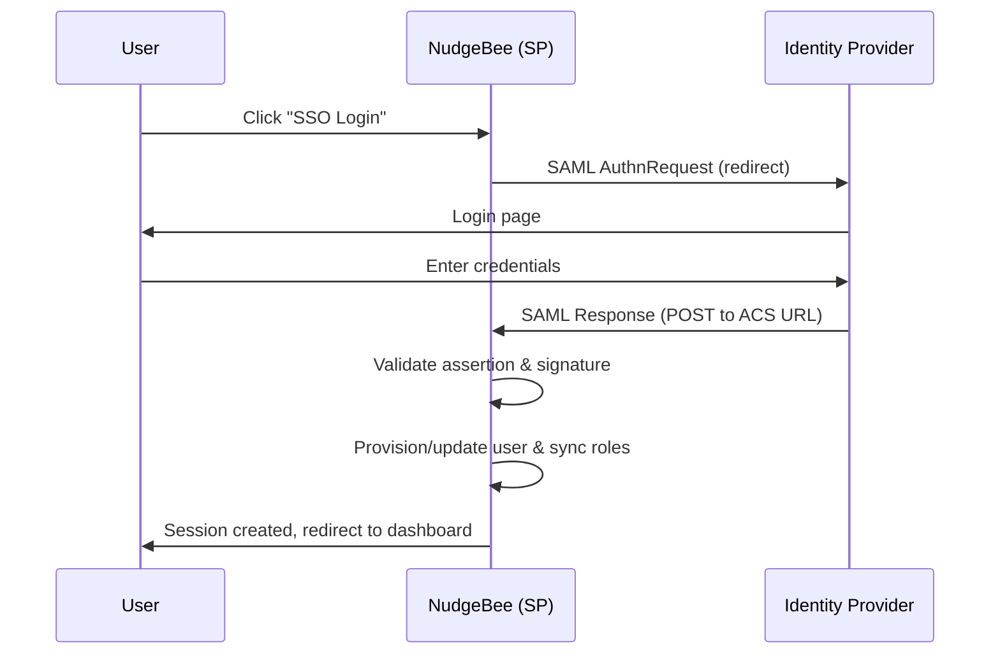

# SAML 2.0

## Description

Integrate NudgeBee with any SAML 2.0 compliant Identity Provider (IdP) to enable Single Sign-On (SSO) for your organization. This allows users to authenticate using their existing corporate credentials through providers such as Okta, Azure AD and others.

Unlike the OAuth-based integrations (e.g., Okta OAuth, Google OAuth), the SAML integration uses the SAML 2.0 protocol directly. This provides additional capabilities such as automatic user provisioning, group-to-role mapping, and role synchronization on every login.

:::info
This guide is applicable to both On-Prem and SaaS deployments.
:::

## How It Works

NudgeBee acts as a **SAML Service Provider (SP)**. When a user clicks the SSO login button, NudgeBee redirects them to your Identity Provider for authentication. After successful authentication, the IdP sends a signed SAML assertion back to nudgebee, which validates it and creates a session.



## Prerequisites

Before configuring SAML, ensure you have:

1. A SAML 2.0 compliant Identity Provider (Okta, Azure AD, OneLogin, etc.)
2. Admin access to your IdP to create a SAML application
3. Admin access to your NudgeBee deployment to set environment variables
4. The NudgeBee base URL (e.g., `https://app.yourdomain.com`)

## Configuration

### Required Environment Variables

| Variable | Description | Example |
|---|---|---|
| `SAML_ENABLED` | Enable SAML authentication. Set to `true` to activate. | `true` |
| `SAML_ENTRY_POINT` | The SSO URL of your Identity Provider (IdP login endpoint). | `https://yourorg.okta.com/app/app-id/sso/saml` |
| `SAML_ISSUER` | The Entity ID / Issuer of your Identity Provider. | `http://www.okta.com/exk1234567` |
| `SAML_CERT` | The IdP's X.509 signing certificate in PEM format. Used to verify SAML assertion signatures. | See [Certificate Setup](#certificate-setup) |
| `SAML_AUDIENCE` | The expected audience in the SAML assertion. Typically your NudgeBee base URL. | `https://app.yourdomain.com` |
| `NEXTAUTH_URL` | The base URL of your NudgeBee application. Used to construct the ACS callback URL. | `https://app.yourdomain.com` |
| `NEXTAUTH_SECRET` | A secret key used to sign session tokens. Must be a strong random string. | `N+vHVMgf0+C678HnyDR9NFBksCz...` |

### Optional Environment Variables

| Variable | Description | Default |
|---|---|---|
| `SAML_GROUP_MAPPING` | JSON object mapping IdP group names to NudgeBee roles. | `{}` (no mapping) |
| `SAML_SYNC_ROLES_ON_LOGIN` | Sync user roles from SAML groups on every login. | `true` |
| `SAML_REMOVE_OLD_ROLES` | Remove roles not present in the current SAML assertion during sync. | `true` |
| `SAML_INCLUDE_UNMAPPED_GROUPS` | Pass through IdP groups that are not in the mapping as-is. | `false` |

### Certificate Setup

The `SAML_CERT` variable should contain your IdP's X.509 signing certificate. You can provide it with or without the PEM header/footer — NudgeBee will normalize it automatically.

```env
# With PEM headers (recommended)
SAML_CERT="-----BEGIN CERTIFICATE-----
MIIDpDCCAoygAwIBAgIGAX...
-----END CERTIFICATE-----"

# Without PEM headers (also accepted)
SAML_CERT="MIIDpDCCAoygAwIBAgIGAX..."
```

You can typically download this certificate from your IdP's SAML application settings page.

## NudgeBee Service Provider Details

When creating a SAML application in your IdP, you will need to provide the following NudgeBee SP details:

| Field | Value |
|---|---|
| **ACS URL (Assertion Consumer Service)** | `{NEXTAUTH_URL}/api/auth/saml/acs` |
| **Entity ID / Audience** | Your `SAML_AUDIENCE` value (e.g., `https://app.yourdomain.com`) |
| **NameID Format** | `urn:oasis:names:tc:SAML:1.1:nameid-format:emailAddress` |
| **Sign-on URL** | `{NEXTAUTH_URL}/api/auth/saml/login` |

### Endpoints

| Endpoint | Method | Description |
|---|---|---|
| `/api/auth/saml/login` | GET | Initiates the SAML login flow (SP-initiated SSO) |
| `/api/auth/saml/acs` | POST | Assertion Consumer Service — receives the SAML response from the IdP |
| `/api/auth/saml/health` | GET | Returns SAML configuration status and certificate health |

## SAML Attribute Mapping

NudgeBee automatically extracts user attributes from the SAML assertion. The following attribute names are supported:

### Email (required)

NudgeBee looks for the user email in this order:
- `email`
- `mail`
- `nameID` (fallback)

### Display Name (optional)

- `displayName`
- `name`
- `firstName` + `lastName` (combined)

### Groups / Roles (optional)

NudgeBee checks for group information using these attribute names:
- `groups`
- `Group`
- `memberOf`
- `roles`
- `Role`
- `http://schemas.xmlsoap.org/claims/Group`
- `http://schemas.microsoft.com/ws/2008/06/identity/claims/groups`

:::tip
Configure your IdP to send one of the above group attributes in the SAML assertion to enable automatic role mapping.
:::

## Group-to-Role Mapping

NudgeBee can automatically map IdP groups to NudgeBee roles on every login. This ensures users always have the correct permissions based on their IdP group membership.

### Configuration

Set the `SAML_GROUP_MAPPING` environment variable to a JSON object where keys are IdP group names and values are NudgeBee role names:

```env
SAML_GROUP_MAPPING='{"idp-admins":"tenant_admin","idp-developers":"tenant_admin","idp-viewers":"tenant_admin_readonly"}'
```

### Available NudgeBee Roles

| Role | Description |
|---|---|
| `tenant_admin` | Full access to the tenant |
| `tenant_admin_readonly` | Read-only access to the tenant |

### Behavior Options

- **`SAML_SYNC_ROLES_ON_LOGIN=true`** (default): User roles are updated from the SAML assertion on every login. This ensures roles stay in sync with your IdP.
- **`SAML_REMOVE_OLD_ROLES=true`** (default): Roles that are no longer present in the SAML assertion are removed. Set to `false` to only add new roles without removing existing ones.
- **`SAML_INCLUDE_UNMAPPED_GROUPS=true`**: IdP groups that are not listed in `SAML_GROUP_MAPPING` are passed through as-is. Useful when your IdP group names already match NudgeBee role names.

### Example

If a user belongs to IdP groups `["developers", "viewers"]` and your mapping is:

```json
{
  "developers": "tenant_admin",
  "viewers": "tenant_admin_readonly"
}
```

## User Provisioning

SAML integration supports **automatic user provisioning** — users are created in NudgeBee on their first SAML login. No pre-registration is required.

### How Provisioning Works

1. **Existing user found by SAML account**: User is logged in directly.
2. **Existing user found by email**: The SAML account is linked to the existing user.
3. **No existing user**: A new user is created automatically.

### On-Prem Deployments

- The user is created under the tenant specified in your license.
- Set `AUTH_DEFAULT_ROLE` to control the default role assigned to new users.

### SaaS Deployments

- The user's email domain is matched to a tenant via the `allowed_domains` tenant attribute.
- The default role is determined by the `auth_default_role` tenant attribute.

## Health Check

NudgeBee provides a health check endpoint to monitor your SAML configuration and certificate status:

```
GET /api/auth/saml/health
```

**Response:**

```json
{
  "enabled": true,
  "status": "healthy",
  "certificate": {
    "expired": false,
    "expiringSoon": false,
    "expiresAt": "2025-12-01T00:00:00.000Z",
    "daysUntilExpiry": 365
  },
  "config": {
    "entryPoint": "https://yourorg.okta.com/app/.../sso/saml",
    "issuer": "http://www.okta.com/exk1234567",
    "callbackUrl": "https://app.yourdomain.com/api/auth/saml/acs"
  },
  "messages": []
}
```

**Status values:**
- `healthy` — Certificate is valid with more than 30 days remaining.
- `warning` — Certificate expires within 30 days. Renew soon.
- `error` — Certificate has expired. SAML login will fail.

## Troubleshooting

| Issue | Possible Cause | Solution |
|---|---|---|
| SAML login button does not appear | `SAML_ENABLED` is not set to `true` | Set `SAML_ENABLED=true` and restart the application |
| "SAML not configured" error | Missing required environment variables | Ensure `SAML_ENTRY_POINT`, `SAML_ISSUER`, `SAML_CERT`, and `SAML_AUDIENCE` are all set |
| Signature validation fails | Incorrect or expired IdP certificate | Download a fresh certificate from your IdP and update `SAML_CERT` |
| User gets "not allowed" error | User account is suspended in NudgeBee | Check the user's status in NudgeBee and reactivate if needed |
| Groups/roles not syncing | Group attribute not sent in assertion | Verify your IdP is configured to send group attributes (see [SAML Attribute Mapping](#saml-attribute-mapping)) |
| Groups/roles not mapping correctly | Incorrect `SAML_GROUP_MAPPING` value | Ensure the JSON is valid and the IdP group names match exactly (case-sensitive) |
| "Invalid session data" error | Session token expired (took >60 seconds) | Check network latency between IdP and NudgeBee; ensure clocks are synchronized |
| User created but wrong role | Default role misconfigured | Check `AUTH_DEFAULT_ROLE` (On-Prem) or `auth_default_role` tenant attribute (SaaS) |
| Certificate expiry warning | IdP certificate is expiring soon | Download a new certificate from your IdP and update `SAML_CERT`; use `/api/auth/saml/health` to monitor |

## Notes

- SAML authentication supports automatic user provisioning — users do not need to be pre-created in NudgeBee.
- Multiple authentication providers can be enabled alongside SAML (e.g., Google OAuth + SAML).
- The SAML integration uses SP-initiated SSO. The login flow starts from the NudgeBee sign-in page.
- If you have any issues or require more details, please contact our support.