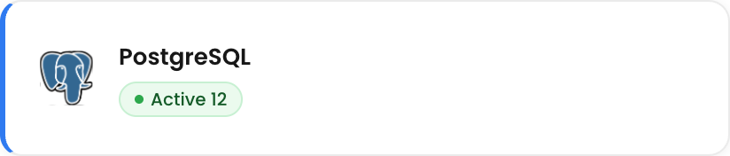
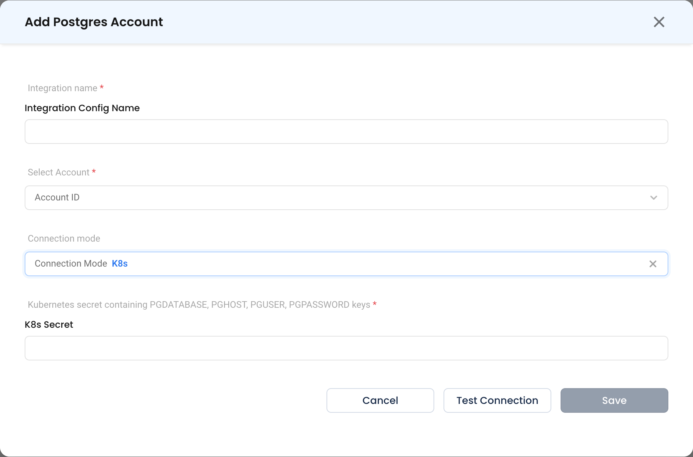
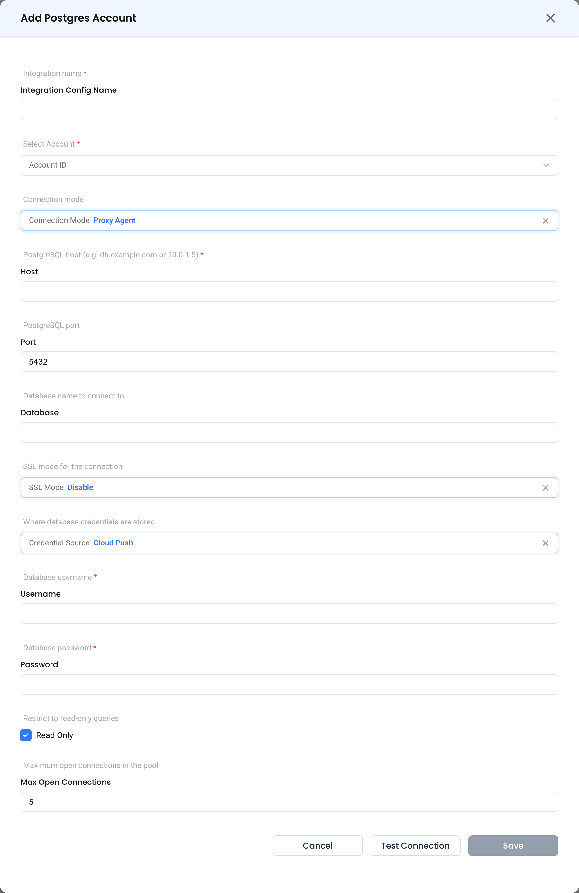

# PostgreSQL

Connect a PostgreSQL database so NudgeBee can run health checks, analyse slow queries and index usage, and query it from workflows. PostgreSQL is the most fully supported database in NudgeBee — [NuBi's database health audit](../../features/ai/use-cases/database-health.md) is built around it.

Supported: PostgreSQL 10 and later, including managed services such as Amazon RDS/Aurora, Cloud SQL and Azure Database for PostgreSQL.

---

## Prerequisites

- A PostgreSQL user NudgeBee can authenticate as, with read access to the databases you want analysed.
- `pg_stat_statements` enabled if you want slow-query analysis. Without it, health checks still run but statement-level timing is unavailable.
- Either the NudgeBee agent running in the same cluster as the database (**K8s** mode), or a reachable [Proxy Agent](../../installation/proxy-agent/index.md) (**Proxy Agent** mode).

### Recommended Grants

```sql
CREATE ROLE nudgebee LOGIN PASSWORD '<YOUR_PASSWORD>';
GRANT CONNECT ON DATABASE <your_database> TO nudgebee;
GRANT USAGE ON SCHEMA public TO nudgebee;
GRANT SELECT ON ALL TABLES IN SCHEMA public TO nudgebee;
GRANT pg_read_all_stats TO nudgebee;
```

`pg_read_all_stats` is what lets NudgeBee read other users' query text. Without it, slow-query analysis reports timings but redacts the SQL with an `insufficient privilege` error.

---

## Step 1: Open the Configuration Form

Navigate to **Admin** > **Integrations** > **Databases** and select **Postgresql**, then click **Add Postgres Account**.



## Step 2: Choose a Connection Mode

### K8s

The agent connects from inside the cluster using credentials held in a Kubernetes Secret.

* **Kubernetes secret containing PGDATABASE, PGHOST, PGUSER, PGPASSWORD keys \*** (Required)
    * The name of a Secret in the cluster. It must contain all four keys:

| Key | Value |
|-----|-------|
| `PGHOST` | Hostname or service DNS name, e.g. `postgres.databases.svc.cluster.local` |
| `PGDATABASE` | Database to connect to |
| `PGUSER` | Username |
| `PGPASSWORD` | Password |

Create one with:

```bash
kubectl create secret generic nudgebee-postgres \
  --namespace databases \
  --from-literal=PGHOST=postgres.databases.svc.cluster.local \
  --from-literal=PGDATABASE=orders \
  --from-literal=PGUSER=nudgebee \
  --from-literal=PGPASSWORD='<YOUR_PASSWORD>'
```



### Proxy Agent

Forager connects to the database over the network. Use this for RDS, Cloud SQL, Azure Database, or any database outside a connected cluster.

* **PostgreSQL host \*** (Required) — Hostname or IP, e.g. `db.example.com` or `10.0.1.5`.
* **PostgreSQL port** — Typically `5432`.
* **Database name to connect to** — The database NudgeBee opens.
* **SSL Mode** — `Disable` (default), `Require`, `Verify Ca` or `Verify Full`. Use `Require` or stronger for anything crossing a network boundary.
* **Credential Source**, **Database username \***, **Database password \***, **Read Only**, **Maximum open connections in the pool** — see [common fields](./index.md#fields-common-to-every-database).



## Step 3: Test and Save

Click **Test Connection**, then **Save**.

---

## What Gets Connected

| Capability | What NudgeBee reads |
|------------|---------------------|
| Health check | `pg_stat_activity`, `pg_locks`, connection limits, table and index bloat statistics |
| Slow queries | `pg_stat_statements` — calls, total and mean execution time, statement text |
| Index usage | `pg_stat_user_indexes`, index sizes and scan counts |
| Workflow queries | Any SQL you supply via [`dbms.query`](../../features/workflow-builder/database-tasks.md) with `dbms_type: postgresql` |

---

## Verify the Integration

1. Ask NuBi: *"Can we check the health of `<integration name>`?"* — it should return connection counts, lock state and bloat statistics.
2. Ask: *"Can we identify slow queries?"* — if statement text is redacted, grant `pg_read_all_stats`.
3. In a workflow, run a [`dbms.query`](../../features/workflow-builder/database-tasks.md) task with `SELECT 1`.

---

## Troubleshooting

See the [shared troubleshooting table](./index.md#troubleshooting) first. PostgreSQL-specific cases:

| Symptom | Likely Cause | Fix |
|---------|-------------|-----|
| `pg_stat_statements` not found | The extension is not enabled | `CREATE EXTENSION pg_stat_statements;` and add it to `shared_preload_libraries`, then restart. |
| Query text shows `insufficient privilege` | Role lacks `pg_read_all_stats` | `GRANT pg_read_all_stats TO nudgebee;` |
| `no pg_hba.conf entry for host` | The database rejects the agent's source address | Add a `pg_hba.conf` rule for the agent's network, or the Forager host. |
| SSL required by server | `SSL Mode` set to `Disable` against a server that requires TLS | Set `SSL Mode` to `Require` or stronger. |
| Bloat figures look implausible | Statistics are stale | Run `ANALYZE` on the affected tables, then re-run the health check. |

---

## Helpful Links

- [Audit database health with NuBi](../../features/ai/use-cases/database-health.md)
- [Database tasks in workflows](../../features/workflow-builder/database-tasks.md)
- [Proxy Agent configuration reference](../../installation/proxy-agent/configuration.md)
- [Credential sources](../../installation/proxy-agent/credential-sources.md)
- [PostgreSQL: pg_stat_statements](https://www.postgresql.org/docs/current/pgstatstatements.html)
