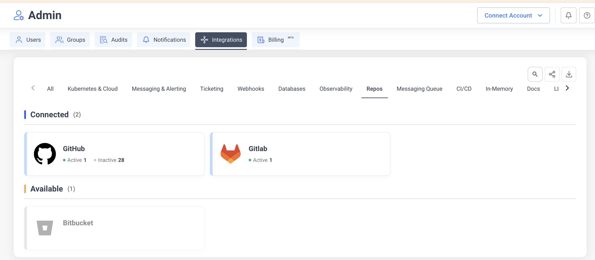
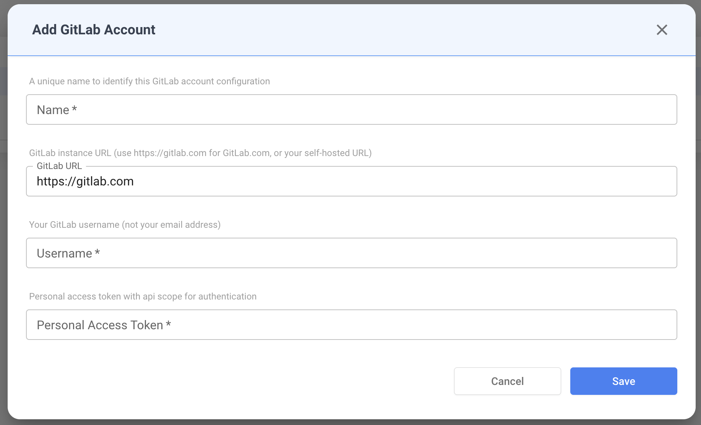
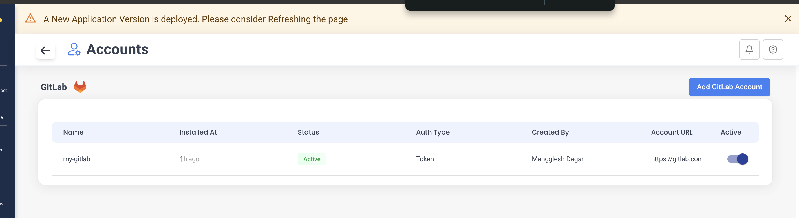
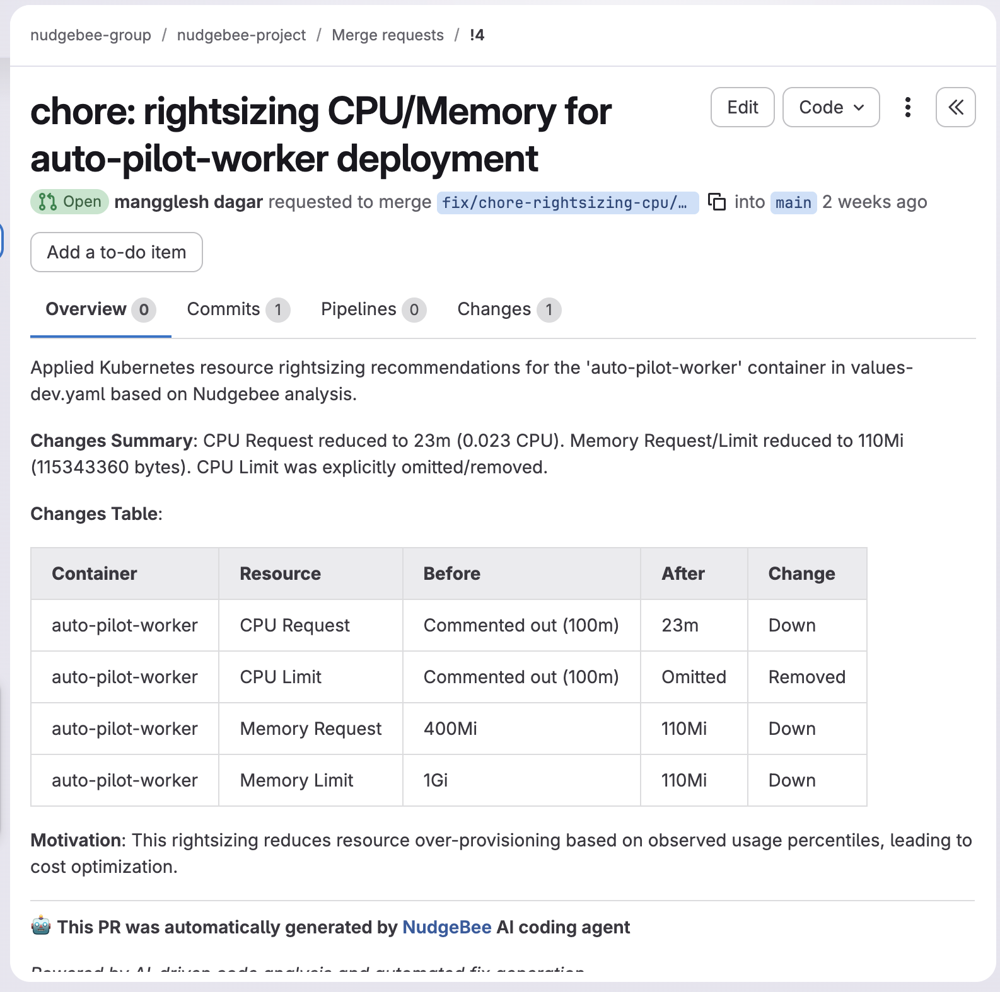

# GitLab Integration Guide

## Overview

NudgeBee's GitLab integration connects your GitLab instance — whether gitlab.com or self-hosted — to enable two core workflows:

1. **Automated Merge Requests** for Kubernetes rightsizing recommendations
2. **Issue tracking** for incident and event management

With this integration, NudgeBee can clone your infrastructure repositories, apply resource optimizations to Helm values files, and open merge requests — all without leaving the platform.

---

## Capabilities

| Feature | Description |
|---------|-------------|
| **Issue Creation** | Create GitLab issues from NudgeBee events, alerts, or manually |
| **Merge Request Automation** | Auto-generate MRs for CPU, memory, and replica rightsizing |
| **Duplicate Detection** | Adds comments to existing issues instead of creating duplicates |
| **Self-Hosted Support** | Works with both gitlab.com and on-premise GitLab instances |
| **MR Status Tracking** | Polls merge request state (`opened`, `merged`, `closed`) in real-time |

---

## Prerequisites

- A GitLab account (gitlab.com or self-hosted)
- A **Personal Access Token (PAT)** with `api` scope
- For merge request automation: Kubernetes workloads annotated with repository details

---

## Step 1: Generate a Personal Access Token

1. In GitLab, navigate to **Settings** > **Access Tokens** (or **User Settings** > **Access Tokens** for personal tokens).
2. Set a descriptive **Token name** (e.g., `nudgebee-integration`).
3. Set an **Expiration date** per your security policy.
4. Select the **`api`** scope. This grants full read/write API access required for issue creation and merge requests.
5. Click **Create personal access token**.
6. Copy the token immediately — GitLab will not show it again.

:::tip
For self-hosted GitLab instances, you can also use **Project Access Tokens** or **Group Access Tokens** to limit the scope to specific projects.
:::

---

## Step 2: Configure GitLab in NudgeBee

1. In NudgeBee, navigate to **Settings** > **Integrations** > **Repos** tab.
2. Click the **Gitlab** tile under the **Connected** or **Available** section.



3. Click **Add GitLab Account** in the top-right corner.

4. Fill in the configuration form:

| Field | Required | Description |
|-------|----------|-------------|
| **Name** | Yes | A unique name to identify this GitLab account configuration (e.g., `my-gitlab`) |
| **GitLab URL** | No | Instance URL. Defaults to `https://gitlab.com`. For self-hosted, enter your instance URL (e.g., `https://gitlab.mycompany.com`) |
| **Username** | Yes | Your GitLab username — not your email address |
| **Personal Access Token** | Yes (on create) | The PAT generated in Step 1. On edit, leave empty to keep the existing token |



5. Click **Save**. NudgeBee validates the credentials by authenticating against the GitLab API and verifying the username matches.

---

## Step 3: Verify the Connection

After saving, the GitLab account appears in the accounts table.



| Column | Description |
|--------|-------------|
| **Name** | Configuration name you provided |
| **Installed At** | Time since the integration was created |
| **Status** | Connection status (Active / Inactive) |
| **Auth Type** | Authentication method (`Token`) |
| **Created By** | User who created the integration |
| **Account URL** | GitLab instance URL |
| **Active** | Toggle to enable/disable the integration without deleting it |

---

## Issue Management

Once connected, NudgeBee can create and manage GitLab issues.

### How Issues Are Created

NudgeBee creates issues in your GitLab projects when:
- An event or alert triggers automatic ticket creation
- A user manually creates a ticket from the NudgeBee UI
- An autopilot runbook is configured to raise tickets

### Issue Fields

| Field | Description |
|-------|-------------|
| **Project** | Target GitLab project (format: `group/project` or `group/subgroup/project`) |
| **Title** | Issue title |
| **Description** | Markdown-formatted issue body with workload details |
| **Assignee** | GitLab user assigned to the issue (looked up by username) |
| **Labels** | Project labels — NudgeBee automatically adds a `nudgebee` label |

### Duplicate Handling

NudgeBee tracks issues by reference ID. If an issue already exists for the same event:
- A **comment** is added to the existing issue instead of creating a duplicate
- The comment includes the new occurrence timestamp and context

### Example: Rightsizing Issue

Below is a GitLab issue created by NudgeBee for a resource rightsizing recommendation. It includes workload details (namespace, container name), current resource values, recommended values, and estimated savings.

<!--  -->

Key details visible in the issue:
- **Labels**: `kubernetes` and `nudgebee` are automatically applied
- **Description**: Contains container name, namespace, existing vs. recommended CPU/memory values, and estimated savings
- **Status**: Tracks the issue lifecycle within GitLab

---

## Automated Merge Requests for Rightsizing

NudgeBee can automatically apply Kubernetes resource optimizations by creating merge requests against your infrastructure repository.

### How It Works

```text
[NudgeBee monitors workload resource usage]
         |
         v
[Generates rightsizing recommendation]
         |
         v
[Clones GitLab repo using PAT]
         |
         v
[Updates Helm values file]
         |
         v
[Creates branch: fix/chore-rightsizing-cpu-...]
         |
         v
[Opens Merge Request with change summary]
         |
         v
[Tracks MR status: opened → merged/closed]
```

### Required Kubernetes Annotations

Add these annotations to your Deployment, StatefulSet, or DaemonSet to enable automated MRs:

```yaml
apiVersion: apps/v1
kind: Deployment
metadata:
  name: my-service
  annotations:
    # Required: GitLab repository URL (HTTPS format)
    ci.nudgebee.com/git.repo: "https://gitlab.com/your-group/your-project.git"

    # Required: Path to Helm values file (relative to repo root)
    ci.nudgebee.com/helm.values.filePath: "values-prod.yaml"

    # Optional: Target branch (defaults to "main")
    ci.nudgebee.com/git.branch: "main"

    # Optional: Current deployed commit SHA
    ci.nudgebee.com/git.hash: "abc123def456"
spec:
  # ...
```

### Annotation Reference

| Annotation | Required | Default | Description |
|------------|----------|---------|-------------|
| `ci.nudgebee.com/git.repo` | Yes | — | HTTPS URL to your GitLab repository |
| `ci.nudgebee.com/helm.values.filePath` | Yes | `values.yaml` | Path to Helm values file relative to repo root |
| `ci.nudgebee.com/git.branch` | No | `main` | Branch to target for merge requests |
| `ci.nudgebee.com/git.hash` | No | — | Git commit SHA of the deployed version |
| `ci.nudgebee.com/helm.values.rootPath` | No | — | JSON path prefix for values (e.g., `app.resources`) |

### Example: Rightsizing Merge Request

Below is a merge request created by NudgeBee's AI coding agent. It includes a changes summary, a before/after comparison table, and a motivation section explaining why the changes were recommended.

<!--  -->

The MR contains:
- **Title**: Describes the workload and type of change (e.g., `chore: rightsizing CPU/Memory for auto-pilot-worker deployment`)
- **Changes Table**: Per-container breakdown of each resource (CPU Request, CPU Limit, Memory Request, Memory Limit) with before/after values and direction of change
- **Motivation**: Explains the reasoning — resource over-provisioning detected based on observed usage percentiles
- **Branch**: Auto-created feature branch (e.g., `fix/chore-rightsizing-cpu-...`) targeting `main`

### MR Status Tracking

NudgeBee polls the merge request status and maps it to internal states:

| GitLab MR State | NudgeBee Status |
|-----------------|-----------------|
| `opened` | In Progress |
| `merged` | Success |
| `closed` | Failed |
| `locked` | In Progress |

---

## Self-Hosted GitLab

NudgeBee fully supports self-hosted GitLab instances.

### Configuration

Set the **GitLab URL** field to your instance URL when adding the integration:

```
https://gitlab.mycompany.com
```

All API calls, repository clones, and merge request operations will use this base URL.

### Clone URL Format

For self-hosted instances, NudgeBee constructs clone URLs as:

```
https://oauth2:<token>@gitlab.mycompany.com/group/project.git
```

Ensure your GitLab instance allows HTTPS cloning with token authentication.

---

## CI/CD: Automating Annotations

### GitLab CI

```yaml
deploy:
  stage: deploy
  script:
    - sed -i "s|ci.nudgebee.com/git.hash:.*|ci.nudgebee.com/git.hash: \"$CI_COMMIT_SHA\"|g"
        k8s/deployment.yaml
    - kubectl apply -f k8s/deployment.yaml
  only:
    - main
```

### Helm Install

```bash
helm install myapp ./chart \
  --set annotations.nudgebee.gitHash=$(git rev-parse HEAD) \
  --set annotations.nudgebee.gitRepo="https://gitlab.com/group/project.git"
```

---

## Non-Standard Helm Structures

If your `values.yaml` uses custom paths instead of the standard `resources.requests.cpu` layout, provide explicit JSON path annotations:

```yaml
annotations:
  ci.nudgebee.com/git.repo: "https://gitlab.com/group/project.git"
  ci.nudgebee.com/helm.values.filePath: "values-prod.yaml"

  # Custom paths for non-standard Helm structure
  ci.nudgebee.com/helm.values.cpuRequestJsonPath: "app.compute.cpuReq"
  ci.nudgebee.com/helm.values.cpuLimitJsonPath: "app.compute.cpuMax"
  ci.nudgebee.com/helm.values.memoryRequestJsonPath: "app.compute.memoryReq"
  ci.nudgebee.com/helm.values.memoryLimitJsonPath: "app.compute.memoryMax"
  ci.nudgebee.com/helm.values.replicaJsonPath: "app.scaling.instances"
```

| Annotation | Default Path |
|------------|-------------|
| `helm.values.cpuRequestJsonPath` | `resources.requests.cpu` |
| `helm.values.cpuLimitJsonPath` | `resources.limits.cpu` |
| `helm.values.memoryRequestJsonPath` | `resources.requests.memory` |
| `helm.values.memoryLimitJsonPath` | `resources.limits.memory` |
| `helm.values.replicaJsonPath` | `replicaCount` |

---

## Troubleshooting

### "Failed to Add GitLab Account"

**Cause:** Invalid credentials or network issue.

**Fix:**
1. Verify your PAT has `api` scope
2. Confirm the username matches the token owner (`Settings` > `Account` > `Username`)
3. For self-hosted: confirm the URL is reachable from NudgeBee's network

### Merge Request Not Created

**Possible causes:**

| Issue | Solution |
|-------|----------|
| Missing annotations | Verify `ci.nudgebee.com/git.repo` and `helm.values.filePath` are set on the workload |
| Invalid repo URL | Must be HTTPS format ending in `.git` |
| File not found | Confirm `helm.values.filePath` exists in the repository at the specified branch |
| Permission denied | PAT needs `api` scope (includes `write_repository`) |

```bash
# Verify annotations on your workload
kubectl get deployment <name> -o jsonpath='{.metadata.annotations}' | jq .
```

### Issue Creation Fails

- Confirm the project path format: `group/project` or `group/subgroup/project`
- Verify the PAT owner has at least **Developer** role on the target project
- Check that the assignee username exists as a project member

---

## Security Best Practices

- **Rotate tokens regularly** — set expiration dates on PATs and rotate before they expire
- **Use minimal scope** — `api` scope is required, but consider project-scoped tokens for limited access
- **Separate tokens per environment** — use different PATs for production vs. staging integrations
- **Never commit tokens** — store credentials only through the NudgeBee UI (encrypted at rest)
- **Use HTTPS URLs** — SSH clone URLs are not supported

```yaml
# Correct
ci.nudgebee.com/git.repo: "https://gitlab.com/group/project.git"

# Incorrect — SSH not supported
ci.nudgebee.com/git.repo: "git@gitlab.com:group/project.git"
```

---

## Related Documentation

- [Jira Integration](../Tickets/jira)
- [GitHub Integration](../GitHub/github-integration)
- [GitHub Issues](../Tickets/github_issues)
- [Kubernetes Annotations Reference](../../installation/agent/installation/installation)
