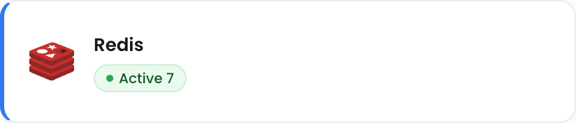
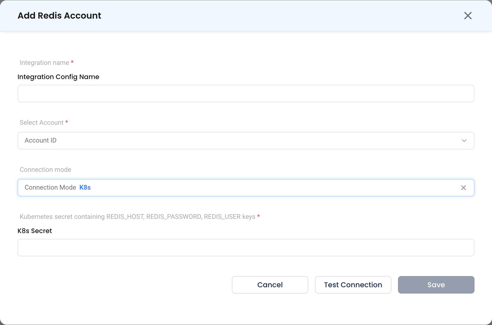
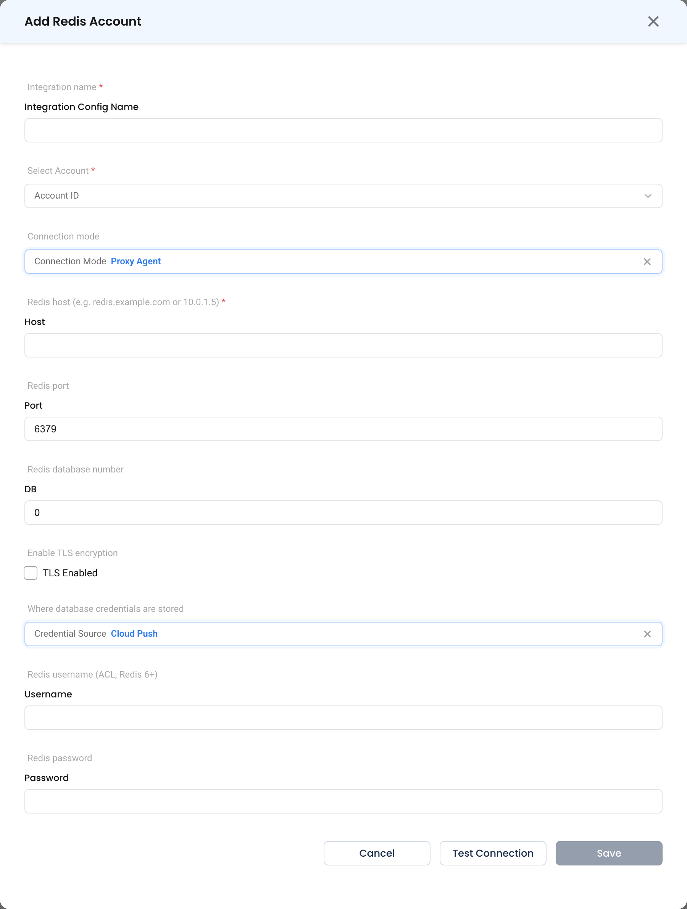

# Redis

Connect a Redis instance so NudgeBee can inspect its state and run commands against it from workflows. Redis is listed under **In-Memory** in the integrations catalog.

Supported: Redis 5 and later.

---

## When Do You Need This?

This integration is **optional**. Connect Redis when you want to:

- Inspect memory usage, key counts, eviction and client state while troubleshooting a service that depends on the cache.
- Run Redis commands from an automation using the [`dbms.redis.cli` task](../../features/workflow-builder/database-tasks.md#dbmsrediscli) — for example clearing a poisoned key as a remediation step, or reading `INFO memory` as evidence in a runbook.

---

## Step 1: Open the Configuration Form

Navigate to **Admin** > **Integrations** > **In-Memory** and select **Redis**, then click **Add Redis Account**.



* **Integration name \*** (Required) — How this instance is identified elsewhere in NudgeBee, e.g. `session-cache-prod`.
* **Select Account \*** (Required) — The NudgeBee account this connection belongs to.

## Step 2: Choose a Connection Mode

### K8s

The agent connects from inside the cluster using credentials held in a Kubernetes Secret.

* **Kubernetes secret containing REDIS_HOST, REDIS_PASSWORD, REDIS_USER keys \*** (Required)

| Key | Value |
|-----|-------|
| `REDIS_HOST` | Hostname or service DNS name, e.g. `redis-master.cache.svc.cluster.local` |
| `REDIS_USER` | ACL username. Use `default` on instances without ACLs. |
| `REDIS_PASSWORD` | Password |

```bash
kubectl create secret generic nudgebee-redis \
  --namespace cache \
  --from-literal=REDIS_HOST=redis-master.cache.svc.cluster.local \
  --from-literal=REDIS_USER=default \
  --from-literal=REDIS_PASSWORD='<YOUR_PASSWORD>'
```



### Proxy Agent

The [Proxy Agent (Forager)](../../installation/proxy-agent/index.md) connects over the network. Use this for ElastiCache, Memorystore, Azure Cache for Redis, or any instance outside a connected cluster.

* **Redis host \*** (Required) — Hostname or IP, e.g. `redis.example.com` or `10.0.1.5`.
* **Redis port** — Typically `6379`.
* **DB** — Redis database number. Leave empty for `0`.
* **TLS Enabled** — Turn on for managed services and anything crossing a network boundary.
* **Credential Source** — `Cloud Push` (default), `AWS Sm`, `Gcp Sm`, `Azure Kv` or `Local`. See [credential sources](../../installation/proxy-agent/credential-sources.md).
* **Username** — ACL username, Redis 6 and later. Leave empty on older instances.
* **Password** — Optional if the instance has no password set.



## Step 3: Test and Save

Click **Test Connection**, then **Save**.

---

## Automatically Discovered Instances

Redis running inside a connected cluster may be registered automatically by the NudgeBee agent. Those entries appear in the list with `agent` as the creator.

---

## Verify the Integration

1. Click **Test Connection** on the form — it should succeed before you save.
2. In a workflow, run a [`dbms.redis.cli`](../../features/workflow-builder/database-tasks.md#dbmsrediscli) task with the command `PING`. The output should be `PONG`.
3. Try `INFO memory` to confirm the user can read server statistics.

---

## Troubleshooting

| Symptom | Likely Cause | Fix |
|---------|-------------|-----|
| `NOAUTH Authentication required` | No password supplied | Set the password, or `REDIS_PASSWORD` in the secret. |
| `WRONGPASS invalid username-password pair` | ACL username is wrong | On instances without ACLs the username is `default`. |
| `ERR unknown command 'AUTH'` with a username | Username sent to a Redis older than 6 | Leave **Username** empty for Redis 5. |
| Connection resets on a managed service | TLS required | Turn on **TLS Enabled**. |
| Commands are rejected | The ACL restricts the command set | Grant the NudgeBee user the commands your workflows use, or a read-only ACL such as `+@read +info`. |
| Reads return nothing on a cluster | Connected to a replica or the wrong shard | Point the connection at the primary endpoint. |

---

## Helpful Links

- [Database tasks in workflows](../../features/workflow-builder/database-tasks.md)
- [Proxy Agent configuration reference](../../installation/proxy-agent/configuration.md)
- [Credential sources](../../installation/proxy-agent/credential-sources.md)
