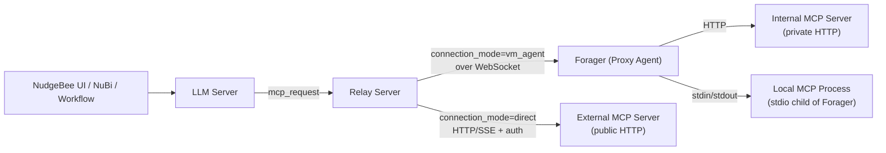

# MCP (Model Context Protocol)

NudgeBee can call tools exposed by any [Model Context Protocol](https://modelcontextprotocol.io/) server. MCP tools become available to NudgeBee AI tasks (`llm.mcp_call`, `llm.investigate`, `llm.event_investigate`, Ask NuBi) once the integration is configured.

There are **two ways to connect** to an MCP server. Pick the one that matches where the server runs.

## Choosing a Connection Mode

| | **Direct** | **VM Agent (Forager)** |
|---|---|---|
| MCP server reachable from NudgeBee's cloud over the public internet? | Yes | No — it runs in your private network |
| Where the JSON-RPC traffic originates | NudgeBee Relay | Forager Proxy Agent inside your VPC |
| Transports supported | `http` (Streamable HTTP, with SSE auto-detect) | `http`, `stdio` |
| Auth handled by | Relay (none / bearer / basic / api_key / custom_header / OAuth 2.0) | Forager (HTTP auth) or the local process (stdio) |
| Setup effort | Low — paste URL + creds | Requires [Proxy Agent](../../installation/proxy-agent/index.md) installed |
| Best for | Public/SaaS MCP services (e.g. hosted MCP gateways) | On-prem MCP servers, dockerized local servers, internal company tooling |

> **Stdio is only available via VM Agent.** The cloud cannot spawn local processes, so `transport: stdio` requires Forager. The integration form will reject this combination if you pick Direct + Stdio.

## Setting Up an Integration

In the NudgeBee UI, open **Integrations**, switch to the **LLM** tab, and add a new **MCP** integration.

Fields are dynamic — what you see changes based on the **Connection Mode** and **Transport** you pick.

### Direct Mode (HTTP)

Use this when the MCP server is reachable from the public internet.

Set **Connection Mode** to `direct` and **Transport** to `http` (the only option in direct mode). Provide the full server **URL** (e.g. `https://mcp.example.com/v1`) and pick an **Auth Type**. Optionally add **LLM Instructions** — free-text guidance for NuBi on when to use this server's tools.

Auth Type drives which credential fields appear:

- `none` — no extra fields.
- `bearer` — Bearer Token.
- `basic` — Username, Password.
- `api_key` / `custom_header` — Custom Header Name, Custom Header Value.
- `oauth2` — Token URL, Client ID, Client Secret, Scope (optional), Audience (optional). Uses the `client_credentials` grant.

Tokens, passwords, client secrets, and custom-header values are stored encrypted at rest.

### VM Agent Mode (HTTP)

Use this when the MCP server runs **inside your network** but speaks HTTP — for example, a self-hosted MCP gateway on a private VM or behind your VPN.

**Prerequisite:** [Proxy Agent (Forager)](../../installation/proxy-agent/index.md) installed on a host that can reach the MCP server.

Set **Connection Mode** to `vm_agent`, **Transport** to `http`, and provide a **URL** that is reachable **from the Forager host** (e.g. `http://10.0.1.42:8000/mcp`). Auth credentials use the same shape as direct mode and are forwarded to Forager.

The **Credential Source** field controls where those credentials live:

- `cloud_push` — credentials entered in the UI are pushed to Forager over the WebSocket.
- `local` — Forager reads credentials from its own YAML or a cloud secret manager (AWS SM / GCP SM / Azure KV). See [Credential Sources](../../installation/proxy-agent/credential-sources.md).

### VM Agent Mode (Stdio)

Use this when the MCP server is a **local process** that speaks JSON-RPC over stdin/stdout — typical for dockerized reference servers (`mcp/fetch`, `mcp/filesystem`, etc.) or `npx`-launched servers.

**Prerequisite:** [Proxy Agent (Forager)](../../installation/proxy-agent/index.md) installed on a host that can run the command.

Set **Connection Mode** to `vm_agent` and **Transport** to `stdio`. **Command** is the absolute path to the executable Forager will run (e.g. `/usr/local/bin/docker`); **Args** are space-separated arguments — **not** shell-parsed, so quoting is not honored. If you need pipes, redirects, or arguments containing spaces, point **Command** at a small shell-script wrapper instead.

> Forager spawns the process **lazily on first request** and reuses the same process across calls. The process is terminated when Forager shuts down or the integration is removed.

#### Stdio Examples

**Docker-based MCP server** (recommended for portability):

```
Command: /usr/local/bin/docker
Args:    run --rm -i mcp/fetch
```

**Native binary (npx)** — works only if `npx` is on the PATH for the user Forager runs as:

```
Command: /usr/local/bin/npx
Args:    -y @modelcontextprotocol/server-filesystem /var/data/exposed
```

**Custom Python server**:

```
Command: /opt/myorg/mcp-tools/.venv/bin/python
Args:    -m myorg.mcp_server --config /etc/myorg/mcp.yaml
```

Stdio caveats:

- Use `docker run -i`, **not** `-it`. A TTY breaks the line-delimited JSON-RPC framing Forager uses.
- Always pass the **absolute path** in `Command`. Forager's `PATH` is minimal; tool-version managers (nvm, pyenv) are not inherited.
- If the spawned process needs environment variables (API keys, `HOME`, etc.), set them via Forager's local YAML config rather than the UI — the integration form does not currently expose `env` or `working_dir`. See [Advanced: Local YAML datasource](#advanced-local-yaml-datasource-on-forager) below.
- For Docker on macOS dev machines, Forager must be running under a user that can reach the Docker Desktop socket. Running Forager as a system root daemon while Docker Desktop runs in user space can fail.

## Using an MCP Integration

Once the integration is saved and reports **Connected**, two things happen:

1. **Tool discovery.** NudgeBee calls `tools/list` on the server (cached for 30 minutes per account). Each discovered tool becomes available to NuBi and to workflow `llm.mcp_call` tasks.
2. **Tool invocation.** When the LLM or a workflow picks a tool, NudgeBee sends `tools/call` through the same path (cloud → relay → server, or cloud → relay → forager → server).

In the [`llm.mcp_call`](../../features/workflow-builder/ai-tasks.md#llmmcp_call) workflow task, set **Connection Mode = Integration** and pick the integration from the dropdown. The tool name dropdown is then populated from the live `tools/list` response.

For one-off use without a saved integration, use **Connection Mode = Direct** in the task and supply URL/auth inline. Note: this only supports HTTP and skips Forager.

## How It Works



Protocol details (informational):

- All calls use MCP protocol version `2024-11-05`.
- Sequence: `initialize` → `notifications/initialized` → `tools/list` (discovery) or `tools/call` (execution).
- For Direct HTTP, the relay caches the MCP session (`Mcp-Session-Id`) for 30 minutes per (URL, account) pair to avoid re-initializing on every call.
- The relay auto-detects `Content-Type: text/event-stream` on the response and parses SSE frames transparently. You don't pick SSE vs HTTP in the UI.
- For Stdio, Forager keeps one long-lived process per integration; messages are line-delimited JSON.

## Auth Type Support Matrix

| Auth | Direct (HTTP) | VM Agent (HTTP) | VM Agent (Stdio) |
|---|:---:|:---:|:---:|
| `none` | ✅ | ✅ | n/a |
| `bearer` | ✅ | ✅ | n/a — auth is the process's responsibility |
| `basic` | ✅ | ✅ | n/a |
| `api_key` / `custom_header` | ✅ | ✅ | n/a |
| `oauth2` (client_credentials) | ✅ | ✅ | n/a |

For stdio, any authentication the MCP server needs (API tokens, cloud credentials) must be provided to the spawned process via environment variables on the Forager host — the relay does not inject auth into stdio requests.

## Advanced: Local YAML Datasource on Forager

If you manage Forager via local YAML rather than the NudgeBee UI (GitOps / on-prem), you can declare an MCP datasource directly. This is also the only way to set `env` and `working_dir` for stdio:

```yaml
datasources:
  - name: fetch-mcp
    type: mcp
    transport: stdio
    command: /usr/local/bin/docker
    args: "run --rm -i -e API_TOKEN mcp/example"
    working_dir: /var/lib/nudgebee
    env:
      API_TOKEN: "<your-token>"
    credential_source: local
```

For a fully UI-managed integration, use the form instead — Forager registers the datasource automatically when the relay pushes the config.

## Troubleshooting

| Symptom | Likely cause |
|---|---|
| Integration saves but **Connected: No** | Direct mode: URL unreachable / TLS error / auth rejected. VM Agent: Forager not connected to relay, or Forager host can't reach the MCP server / can't run the command. |
| Tool list empty after save | `tools/list` returned 0 tools, or the server requires a non-default `protocolVersion`. Check Forager / relay logs. |
| Stdio integration fails on first call | Command path wrong or not executable as Forager's user; Docker daemon down; image not pulled (first-call cold start can also exceed timeout — pre-pull). |
| `robots.txt` errors from `mcp/fetch` | The fetch server respects robots.txt by default. Test against `httpbin.org` or `example.com`. |
| Stale tool list after server change | Tool list is cached 30 minutes per account. Edit and resave the integration to force a refresh. |

For Forager-side diagnostics, see the [Proxy Agent troubleshooting guide](../../installation/proxy-agent/troubleshooting.md).
