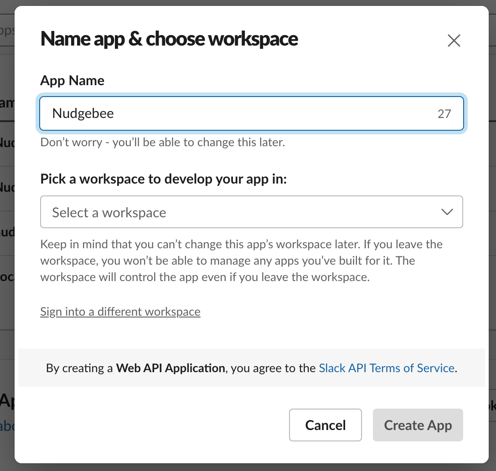
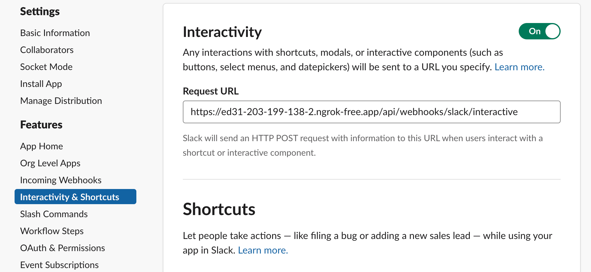
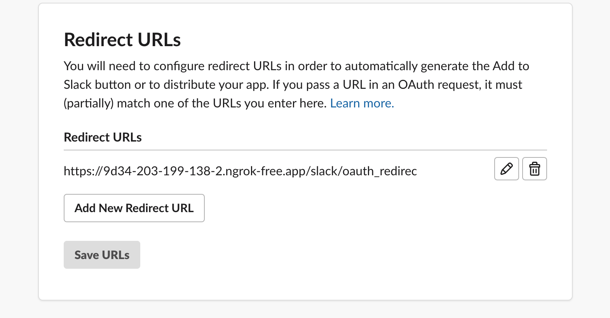
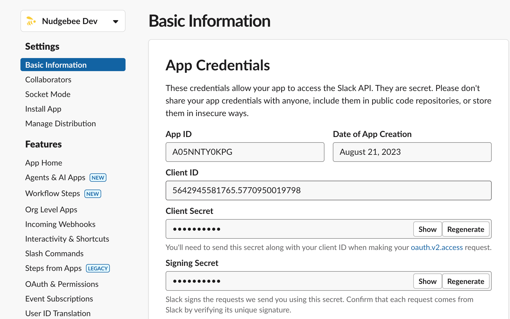

# Slack

## How to configure Slack in your Nudgebee Account 

- This loom below shows how to configure Slack in your account for notifications.

<div style={{position: "relative", paddingBottom: "55.93750000000001%", height: 0}}>
    <iframe src="https://www.loom.com/embed/60bc60343e574abc879ee67ba0795bda?sid=1dc122fc-6d91-447b-bae2-cee012dd6e41" frameborder="0" allowfullscreen style={{position: "absolute", top: 0, left: 0, width: "100%", height: "100%"}}></iframe>
</div>

## How to configure Slack in your on-prem Nudgebee

To use Slack integration in your on-prem nudgebee, you’ll need to create a Slack app. 
To create a new Slack app, navigate to Your Apps on https://api.slack.com/apps and click Create new App.



After naming your app and connecting your workspace, navigate to Basic Information. Here you’ll find your Client ID, Client Secret, and Signing Secret that lets your app access the Slack API.

Here’s where you’ll connect your on-premise Nudgebee instance to your newly created Slack app. Copy your Client ID, Client Secret, and Signing Secret to your secrets in your nudgebee server.

Now that you’ve created your app and updated your Nudgebee config, you can navigate to Interactivity & Components under Features.

Click Enable Interactive Components, and you’ll be able to enter your Request URL (this is the location of your on-premise Nudgebee) and Options Load URL:

```Request URL: https://www.your-nudgebee-server.com/api/webhooks/slack/interactive```



Click Save Changes and Slack will confirm if the HTTP request to the URL you entered succeeds or fails.

Navigate to OAuth & Permissions under Features to configure the Redirect URLs.

Click Add New Redirect URL, enter the URL, and click Add. The URL will look like:

```Callback URL: https://www.your-nudgebee-server.com/api/slack/oauth_redirect```



On the same page under Scopes in the Bot Token Scopes, click on Add an OAuth Scope and select the following from the dropdown menu:

```
channels:read
chat:write
chat:write.public
files:write
groups:read
mpim:read
```

Below are few additional scopes that you will need to enable AI conversations on slack:

```
app_mentions:read
channels:history
groups:history
users:read
users:read.email
```

Click on **Allow** to authorize and install the Nudgebee Slack app to your workspace.

Once You’ve installed the app, you’ll need to add client/signin secrets. Copy this token and paste it into your Nudgebee secrets.

Navigate to your Nudgebee secrets and add the following:

```
SLACK_CLIENT_SECRET: The Client Secret for the Slack application integration.
SLACK_SIGNING_SECRET: The Signing Secret for the Slack application.
SLACK_CLIENT_ID: The Client ID for the slack app.
```

You can see the in basic information of your Slack app.



If your on-prem has no public access, and can not do OAuth, add following to your secrets:

```
SLACK_AUTH_TYPE: "token"  #should always be 'token' for non-public setups only
SLACK_BOT_TOKEN: The bot token for the slack app. Can be found in Oauth & Permissions.
SLACK_CHANNEL_ID: The Slack channel ID to send notifications to.
```