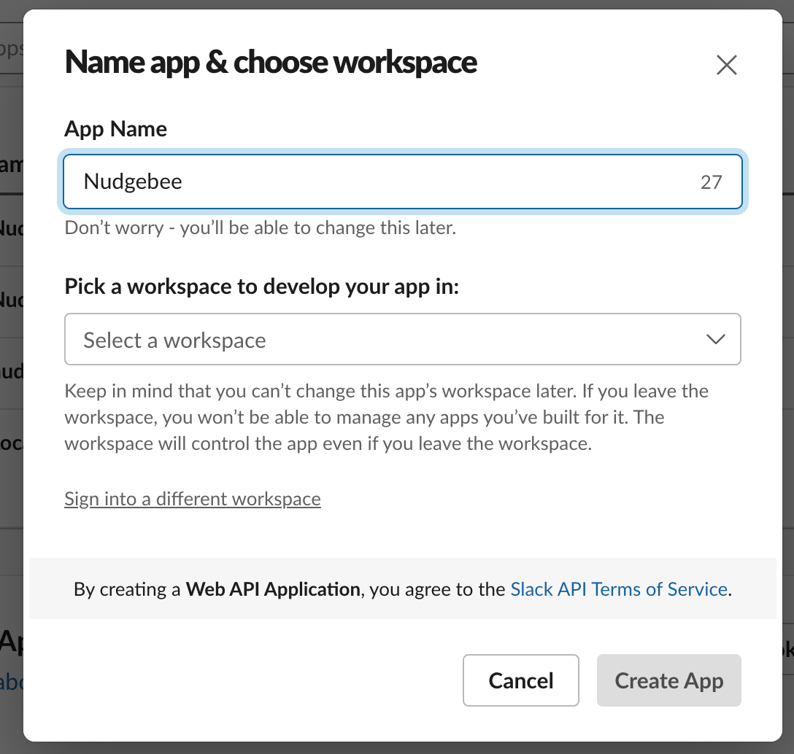
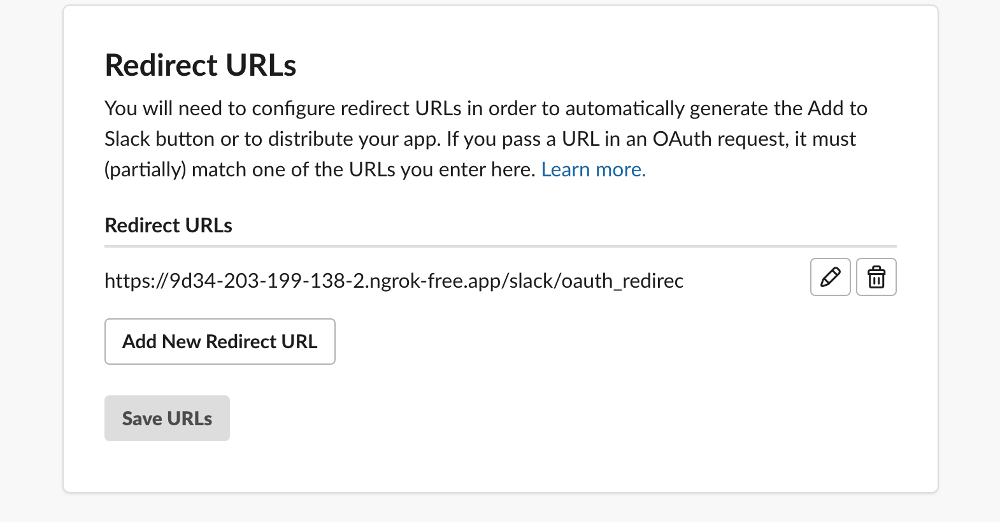
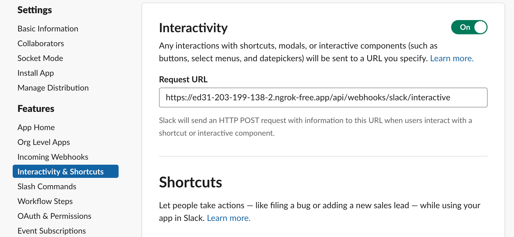
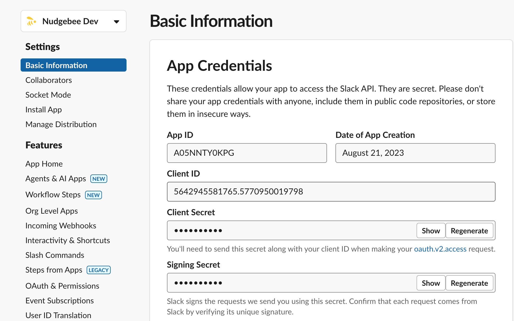

# Slack

## How to configure Slack in your NudgeBee Account 

- This loom below shows how to configure Slack in your account for notifications.

<div style={{position: "relative", paddingBottom: "55.93750000000001%", height: 0}}>
    <iframe src="https://www.loom.com/embed/60bc60343e574abc879ee67ba0795bda?sid=1dc122fc-6d91-447b-bae2-cee012dd6e41" frameborder="0" allowfullscreen style={{position: "absolute", top: 0, left: 0, width: "100%", height: "100%"}}></iframe>
</div>

## How to configure Slack in your on-prem NudgeBee

To use Slack integration in your on-prem NudgeBee, you’ll need to create a Slack app.

**Step 1.** To create a new Slack app, navigate to Your Apps on https://api.slack.com/apps and click Create new App.



After naming your app and connecting your workspace, navigate to Basic Information. Here you’ll find your Client ID, Client Secret, and Signing Secret that lets your app access the Slack API.

Here’s where you’ll connect your on-premise NudgeBee instance to your newly created Slack app. Copy your Client ID, Client Secret, and Signing Secret to your secrets in your nudgebee server.

**Step 2.** Now that you’ve created your app and updated your NudgeBee config, you’ll need to set up the OAuth Redirect URL.

Navigate to OAuth & Permissions under Features to configure the Redirect URLs.

Click Add New Redirect URL, enter the URL, and click Add. The URL will look like:

```Callback URL: https://www.your-nudgebee-server.com/api/slack/oauth_redirect```



**Step 3.** On the same page under Scopes in the Bot Token Scopes, click on Add an OAuth Scope and select the following from the dropdown menu:

```
channels:read
chat:write
chat:write.public
files:write
groups:read
mpim:read
```

**Step 4.** Also, to enable interaction with bot, navigate to Interactivity & Components under Features. (**This step can be skipped if you don’t want to use interactive features in Slack.**)

Click Enable Interactive Components, and you’ll be able to enter your Request URL (this is the location of your on-premise NudgeBee) and Options Load URL:

```Request URL: https://www.your-nudgebee-server.com/api/webhooks/slack/interactive```



Click Save Changes and Slack will confirm if the HTTP request to the URL you entered succeeds or fails.

**Step 5.** Save changes and click on **Allow** to authorize and install the NudgeBee Slack app to your workspace.

**Step 6.** Once you’ve installed the app, you’ll need to add your Slack app's credentials (Client ID, Client Secret, and Signing Secret, typically found on its 'Basic Information' page) to your NudgeBee secrets.

Navigate to your NudgeBee secrets and add the following:

```
SLACK_CLIENT_SECRET: The Client Secret for the Slack application integration.
SLACK_SIGNING_SECRET: The Signing Secret for the Slack application.
SLACK_CLIENT_ID: The Client ID for the slack app.
```

You can see the in basic information of your Slack app.



---

## Troubleshooting Slack Integration

### 1. `channel_not_found` / Alerts Not Sent to Private Channels
* **Symptom**: Notifications send to `#general` or public channels, but fail for private incident channels with error `channel_not_found`.
* **Root Cause**: The `@NudgeBee` bot user has not been added as a member of the private channel.
* **Remediation**:
  1. Open the private Slack channel.
  2. Type `/invite @NudgeBee` and press Enter.
  3. Re-test sending a notification from **Settings $\rightarrow$ Notification Rules**.

---

### 2. `not_in_channel` / Missing Scopes
* **Symptom**: Slack API returns `not_in_channel` error when posting to public channels.
* **Root Cause**: The Slack app is missing the `chat:write.public` OAuth scope, or the bot token was revoked.
* **Remediation**:
  1. In the Slack App Dashboard $\rightarrow$ **OAuth & Permissions**, ensure `chat:write.public` and `chat:write` are listed under **Bot Token Scopes**.
  2. If adding scopes, click **Reinstall to Workspace** at the top of the page to apply the new permissions.

---

### 3. Interactive Buttons / Approvals Fail (`dispatch_failed`)
* **Symptom**: Clicking **Acknowledge**, **Snooze**, or **Approve Execution** in a Slack message returns a red `⚠️ We had trouble sending your response` warning.
* **Root Cause**: Slack cannot reach the **Interactivity Request URL** on your NudgeBee server (due to firewall, ingress mismatch, or invalid SSL certificate).
* **Remediation**:
  1. In Slack App Dashboard $\rightarrow$ **Interactivity & Shortcuts**, verify the **Request URL** is accessible from the internet:
     ```
     https://<your-public-nudgebee-domain>/api/webhooks/slack/interactive
     ```
  2. Ensure your reverse proxy / Ingress controller preserves the `X-Slack-Signature` and `X-Slack-Request-Timestamp` HTTP headers.
  3. Verify that `SLACK_SIGNING_SECRET` configured in NudgeBee exactly matches the Signing Secret in the Slack App Basic Information page.