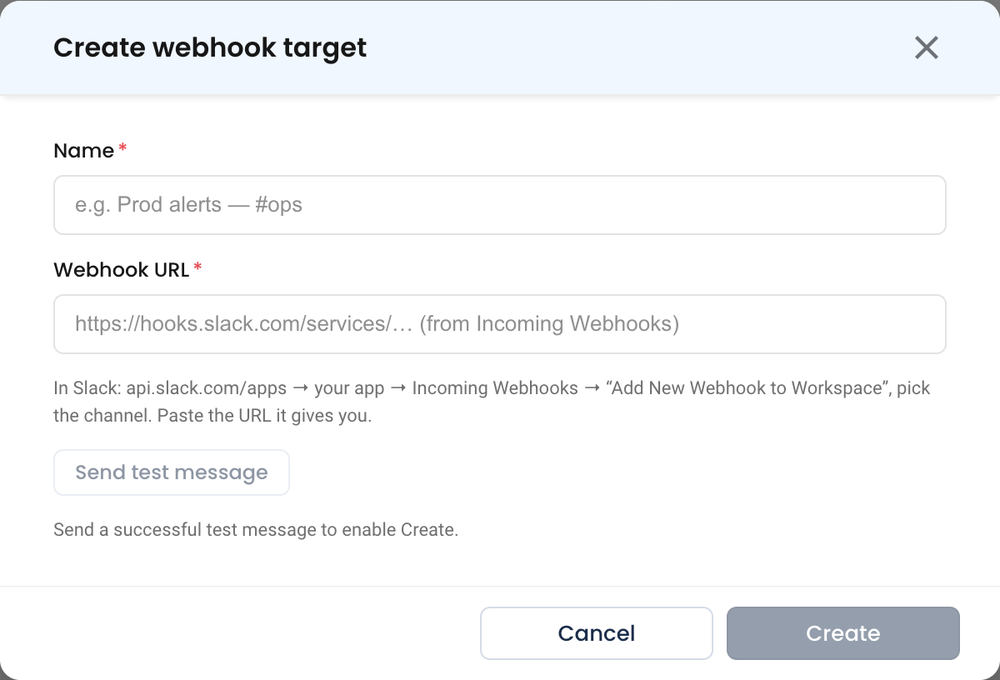
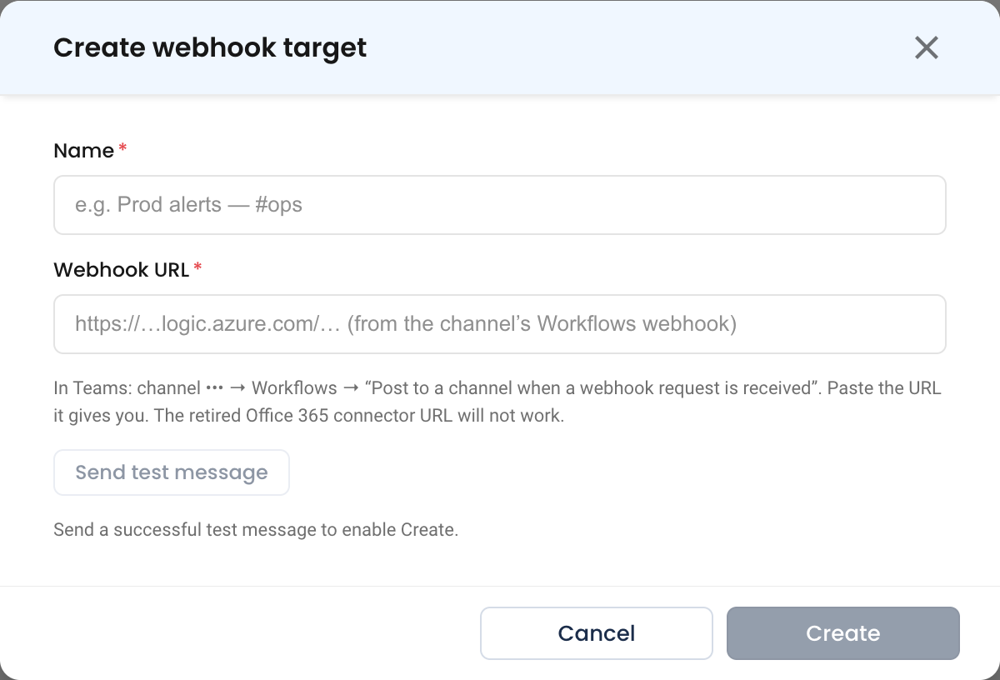
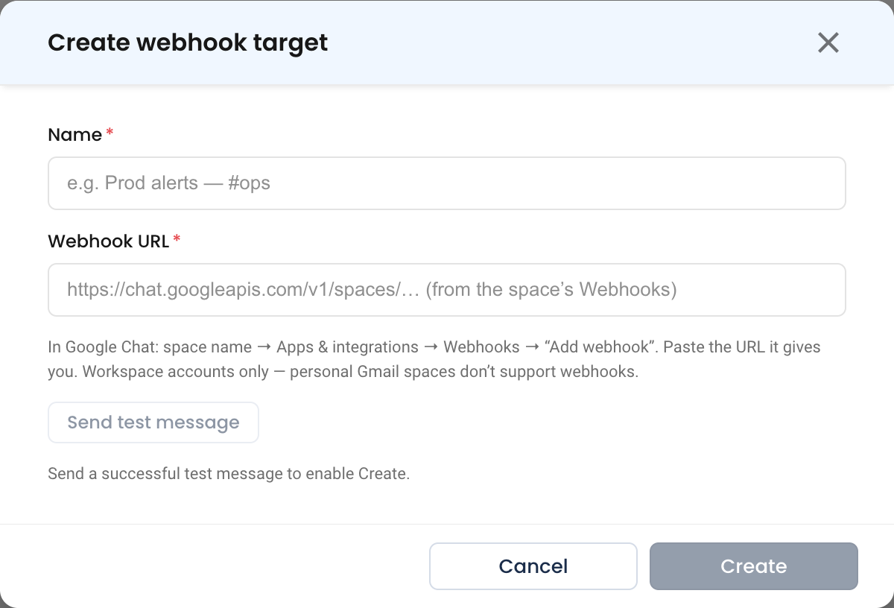
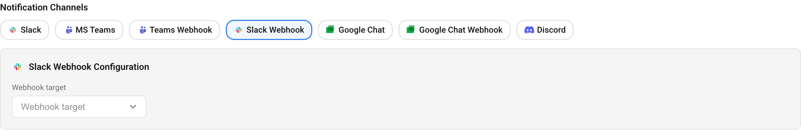

# Webhook Targets (Slack, Teams, Google Chat)

A **webhook target** posts NudgeBee notifications to a Slack channel, a Microsoft Teams channel, or a Google Chat space through that tool's **incoming webhook**:

- You paste one URL. There is no app to install, and no workspace admin approval or consent.
- Delivery is **one-way**. People can read the notification and open its links, but cannot reply to NudgeBee, chat with nubi, or press action buttons.
- You can create as many targets as you need, for example one per team channel.

Each target is tied to the single channel or space its URL was created for. A target receives only the notifications that a [notification rule](../../features/notifications.md) routes to it.

---

## Webhook Target or App?

The [Slack](./slack.md), [Microsoft Teams](./msteams.md), and [Google Chat](./google_chat.md) apps connect NudgeBee to your workspace. Webhook targets trade that interactivity for a setup anyone can do in a minute.

| | App integration | Webhook target |
|---|---|---|
| Setup | OAuth install, or a service account, often with admin approval | Paste one URL |
| Direction | Two-way: replies, chat with nubi, action buttons | One-way: link buttons only |
| Channels | Choose any channel the app can see | Exactly one channel or space per URL |
| Default channel | Yes | No. Only rules deliver to a target. |
| Threaded updates and resolved replies | Slack app only | No |
| Retries when rate-limited | Slack and Teams apps | No |
| How many | One installation per workspace | As many as you need |

Use the app if your team wants to act on alerts from chat. Use a webhook target when you only need alerts to land in a channel, or when installing an app is not an option.

---

## Step 1: Create the Webhook in Your Chat Tool

### Slack

1. Go to [api.slack.com/apps](https://api.slack.com/apps). Open an app you own, or create one with **Create New App** > **From scratch**.
2. Open **Incoming Webhooks** and switch **Activate Incoming Webhooks** on.
3. Click **Add New Webhook to Workspace**, pick the channel, and click **Allow**.
4. Copy the webhook URL. It starts with `https://hooks.slack.com/services/`.

> **Reference:** [Sending messages using incoming webhooks](https://api.slack.com/messaging/webhooks)

### Microsoft Teams

1. In Teams, open the channel, click **•••** next to the channel name, and choose **Workflows**.
2. Pick the template **Send webhook alerts to a channel**. Older Teams clients, and the hint in NudgeBee's dialog, call it **Post to a channel when a webhook request is received**.
3. Choose the team and channel, then click **Save**.
4. On the workflow's details page, copy the webhook URL. It is an HTTPS URL on a Power Automate host, such as one ending in `.logic.azure.com` or `.powerplatform.com`.

:::caution Use Workflows, not the Office 365 connector
Microsoft has retired the classic **Incoming Webhook** connector for Office 365. Create new targets from **Workflows**, as above. The Workflows URL keeps working after the connector shuts down.
:::

> **Reference:** [Send messages in Teams using incoming webhooks](https://support.microsoft.com/en-us/office/create-incoming-webhooks-with-workflows-for-microsoft-teams-8ae491c7-0394-4861-ba59-055e33f75498)

### Google Chat

1. In Google Chat, open the space and click the space name at the top.
2. Choose **Apps & integrations** > **Webhooks** > **Add webhook**.
3. Give it a name, for example `NudgeBee`, and click **Save**.
4. Copy the URL. It starts with `https://chat.googleapis.com/v1/spaces/`.

Incoming webhooks are available only in Google Workspace spaces. Spaces on personal Gmail accounts do not support them.

> **Reference:** [Send messages to Google Chat with incoming webhooks](https://developers.google.com/workspace/chat/quickstart/webhooks)

---

## Step 2: Add the Target in NudgeBee

1. Navigate to **Admin** > **Integrations** > **Messaging & Alerting**, and select **Slack**, **Microsoft Teams**, or **Google Chat**.
2. Find the **Webhook targets** section:
   * **Slack** and **Microsoft Teams**: if the app is installed, open the **Webhook targets** tab. If it is not, the **Webhook targets** section appears below the prompt to connect the app. You do not need to connect the app.
   * **Google Chat**: it sits below the spaces table.
3. Click **Create webhook**.
4. Fill in the dialog:
   * **Name \*** (Required): how the target appears in notification rules, for example `Prod alerts — #ops`. Names must be unique within a provider.
   * **Webhook URL \*** (Required): the URL from Step 1.
5. Click **Send test message**. NudgeBee posts a short test message to the channel. When the dialog shows **✓ Test delivered**, the **Create** button is enabled.
6. Click **Create**.

The Microsoft Teams and Google Chat dialogs have the same two fields. Only the URL hint and the instructions under it differ:

Webhook targets belong to the whole tenant, not to one account. Any notification rule can use a target, whatever account the rule covers. The webhook URL is stored encrypted and is never shown again after you save it.

Creating and editing targets requires permission to manage messaging integrations. Users without it see the list but not the **Create webhook** button.

---

## Step 3: Route a Notification Rule to the Target

A new target receives nothing until a rule points at it.

1. Navigate to **Admin** > **Notification Rules**, and create or edit a rule.
2. Under **Notification Channels**, click **Slack Webhook**, **Teams Webhook**, or **Google Chat Webhook**. A badge appears once at least one target of that type exists.
3. In **Webhook target**, pick the target by name.
4. Save the rule.

Some rules to keep in mind:

- **One target per type per rule.** To post the same notifications to two Slack channels, create two rules, or create one rule per channel.
- **Every matching rule delivers.** A target receives a notification if any matching rule names it.
- **Webhook badges are not offered on the Daily Email tab.** They are available on the other rule tabs, such as Troubleshooting, Optimization, SLO, Cloud, Automation, and Weekly Digest.

---

## What the Notification Looks Like

Webhook targets use the same message templates as the matching app, minus anything interactive:

- **Slack**: the same alert card the Slack app posts, with the severity colour, title, evidence, cluster, resource, and priority. It keeps the **View Details** link. The **Ask nubi** button and the **Suppress** menu are removed, because Slack cannot send their clicks back through a webhook.
- **Microsoft Teams**: the same Adaptive Card the Teams app posts, with the alert, namespace, account, status, and evidence, and a **View** button that opens the event in NudgeBee.
- **Google Chat**: a text message with the alert, reported time, namespace, account, status, and evidence, and a **View Details** link.

Each target receives the same types of notification as its app. Every repeat of an alert is posted as a new message. Webhooks cannot thread replies under an earlier message.

---

## Manage Targets

Each target's row menu in the **Webhook targets** section offers three actions:

- **Test** sends a test message to the saved URL. Use it to check that a target still works.
- **Edit** renames the target, or replaces its URL. To keep the current URL, leave **Webhook URL** blank. A new URL must pass **Send test message** before you can save it. A rename alone does not need a test.
- **Delete** removes the target. Rules that routed to it stop delivering there. The next time such a rule is saved, NudgeBee removes the deleted target from it and tells you so.

---

## Troubleshooting

| Symptom or Message | Cause | Fix |
|--------------------|-------|-----|
| `webhook_url host "…" is not a Slack incoming webhook host` | The URL is not a `hooks.slack.com` URL | Copy the URL from the Slack app's **Incoming Webhooks** page |
| `webhook_url host "…" is not a Microsoft Teams / Power Automate webhook host` | The URL is not from a Teams workflow | Create the URL from **Workflows** > **Send webhook alerts to a channel** |
| `webhook_url host "…" is not a Google Chat incoming webhook host` | The URL is not a `chat.googleapis.com` URL | Copy the URL from the space's **Apps & integrations** > **Webhooks** |
| `webhook_url must be https` | The URL starts with `http://` | Use the `https://` URL exactly as issued |
| `could not reach the … webhook` | NudgeBee could not connect to the URL: a mistyped host, or a DNS or network problem | Re-copy the URL from the chat tool |
| `the … webhook returned 403` or `404` | The webhook was revoked or deleted, or the Teams workflow is turned off | Turn the Teams workflow back on, or create a new webhook, then **Edit** the target and paste the new URL |
| `A webhook target with this name already exists.` | Another target of this type has the same name | Choose another name |
| The target shows **Active**, but nothing arrives | No notification rule routes to it | Add the target to a rule, as in [Step 3](#step-3-route-a-notification-rule-to-the-target) |
| Messages stopped arriving, and the target still shows **Active** | The webhook was revoked. NudgeBee does not retry failed deliveries, and does not disable a failing target. | Use **Test** on the target's row. If it fails, create a new webhook and edit the target. |

---

## Helpful Links

- [Notification rules](../../features/notifications.md)
- [Notifications overview](./index.md)
- [Slack app](./slack.md) · [Microsoft Teams app](./msteams.md) · [Google Chat](./google_chat.md)
