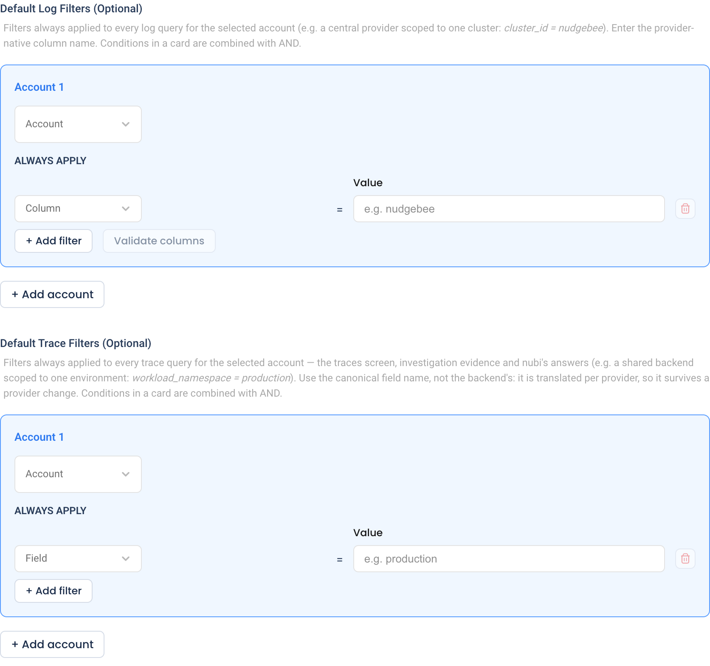
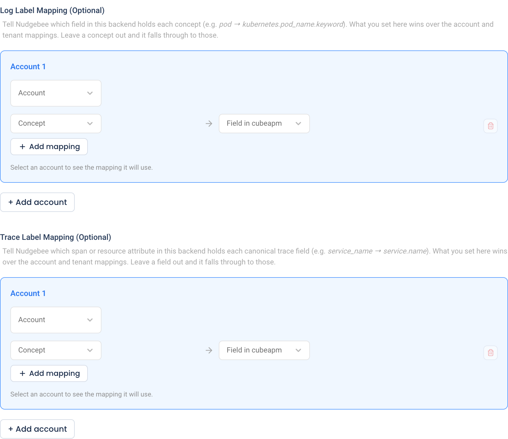
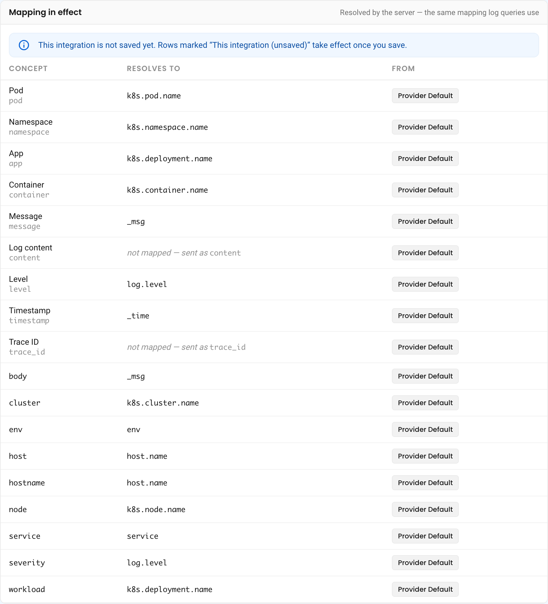

# Advanced Settings: Default Filters and Field Mapping

Log and trace integrations have an **Advanced Settings** section at the bottom of their configuration form. It holds four optional settings. Each one is set **per NudgeBee account**, so accounts that share one backend can be scoped and mapped differently.

| Setting | What it does | Use it when |
|---|---|---|
| [Default Log Filters](#default-log-filters) | Adds conditions to every log query for an account | One log backend holds several clusters or environments, and each account should see only its own |
| [Default Trace Filters](#default-trace-filters) | Adds conditions to every trace query for an account | The same, for a shared trace backend |
| [Log Label Mapping](#log-and-trace-label-mapping) | Tells NudgeBee which backend field holds each log concept, such as pod or namespace | Your log shipper names fields differently from the provider's defaults |
| [Trace Label Mapping](#log-and-trace-label-mapping) | Tells NudgeBee which span attribute holds each trace field, such as service name | Your tracing pipeline names attributes differently from the provider's defaults |

Getting these right is the difference between a filter on `namespace = payments` returning that namespace's logs, and returning nothing at all with no error.

---

## Opening Advanced Settings

1. Navigate to **Admin** > **Integrations**, and open the log or trace integration you want to configure.
2. Add a new integration, or choose **Edit** from an existing one's row menu.
3. Scroll to the bottom of the form and expand **Advanced Settings**.

On a new integration, fill in the connection fields and click **Test Connection** first. Until the test passes, each card shows a message such as *Run Test Connection to load the backend's columns and configure default filters*, because the cards list field names that come from the backend. When you edit an integration that is already saved, the cards are open straight away. If you change a connection field, test again. Integrations with no **Test Connection** button, such as the Loki and Elasticsearch integrations the agent creates, open the cards straight away too.

Every card works the same way:

- Click **Add account** to add a card, and choose the **Account** it applies to.
- Use **one card per account**. If two cards name the same account, only the first one is used. To add conditions or mappings, add rows to the existing card instead.
- Rows with an empty field or value are ignored when you save.
- Changes take effect for new queries as soon as you save the integration.

Which cards appear depends on the provider:

| Card | Shown for |
|---|---|
| Default Log Filters | Elasticsearch, Loki, SigNoz, Apache Pinot, OpenObserve, CubeAPM, Splunk Enterprise, Datadog, Dynatrace |
| Default Trace Filters, Trace Label Mapping | OTel ClickHouse, Jaeger, Elasticsearch, OpenObserve, CubeAPM, Splunk Enterprise, Datadog, Dynatrace, Chronosphere, New Relic, SolarWinds, Azure Application Insights, Splunk Observability Cloud |
| Log Label Mapping | Every integration NudgeBee reads logs from |

Chronosphere's form also shows the Default Log Filters card, but NudgeBee does not read logs from Chronosphere, so a filter there has no effect.

Elasticsearch integrations also have a **Per-Account Index** card here. It maps each account to its own log, metrics, and trace index on a shared cluster.

---

## Default Log Filters

A default log filter is a condition NudgeBee adds to every log query it **builds from filters** for the selected account. That covers searches from the Logs tab's query builder, log evidence on events, and the filtered log searches nubi runs while it investigates. The typical case is a central log backend that holds several clusters: give each account a filter such as `cluster_id = prod-eu`, so it only ever sees its own cluster.

1. In **Default Log Filters (Optional)**, choose the **Account**.
2. Under **ALWAYS APPLY**, pick or type a **Column**, and enter a **Value**.
   - Use the backend's own column name, exactly as it appears in the backend, for example `kubernetes.namespace_name` or `cluster_id`. This is **not** a NudgeBee concept name such as `namespace`: default log filters are applied after label mapping, so they are sent verbatim.
   - The column list suggests the fields NudgeBee found in the account's logs. You can also type a column that is not listed.
3. Click **Add filter** for another condition. Conditions in one card are combined with **AND**.
4. Click **Validate columns**. NudgeBee checks each column against the log fields of the account's **current default log integration**, and marks any it does not know with *Not a known log column for this account*. On a new integration, or one that is not the account's default, it checks a different backend, so save first and check with a real search. If NudgeBee cannot list any fields, every column passes.
5. Save the integration.

Keep in mind:

- **Equality only.** Each row matches `column = value`. There are no "not equal", "contains", or wildcard filters here.
- **Elasticsearch matches exact terms.** An equality filter on Elasticsearch is a term query. On a field mapped as `text`, such as `message`, an exact value only matches through its `.keyword` subfield, for example `message.keyword`. Fields that are already keywords, such as Fluent Bit's `kubernetes.namespace_name`, need no suffix. The **Column** list offers `.keyword` only where it exists.
- **Value suggestions are not filtered.** The value dropdowns in the Logs query builder can still offer values from outside the filter.

:::caution Queries in the provider's own language are not filtered
A query written in the provider's own language runs exactly as written. The default log filter is not added to it, and unlike a [default trace filter](#default-trace-filters), NudgeBee does not refuse it either. That applies to:
- queries you type in the Logs **Code** tab;
- queries nubi or an event action sends in the provider's own query language.

On **Datadog**, the Logs tab only has a **Code** mode, so its queries are never filtered. Do not rely on a default log filter as the only thing keeping one account's logs away from another.
:::

---

## Default Trace Filters

A default trace filter is a condition NudgeBee adds to **every trace query** for the selected account:

- the Traces screen, including its counts, grouped view, and **By Traces** view
- trace evidence on events
- nubi's answers

Use it when one trace backend holds several environments, for example `workload_namespace = production`.

1. In **Default Trace Filters (Optional)**, choose the **Account**.
2. Under **ALWAYS APPLY**, pick a **Field** and enter a **Value**. Conditions in one card are combined with **AND**.
3. Save the integration.

Unlike log filters, trace filters use **NudgeBee's canonical trace field names**, not the backend's. NudgeBee translates them through the trace label mapping for each provider, so a filter keeps working if you move to a different trace backend. The fields are:

`service_name`, `workload_name`, `workload_namespace`, `span_name`, `duration_ns`, `status_code`, `trace_id`, `http_status_code`, `resource`, `destination_workload_name`, `destination_workload_namespace`

:::caution Hand-written trace queries are refused
A query written in the provider's own language has no place for NudgeBee to add the filter. That includes raw ClickHouse SQL and a native Datadog or Chronosphere query, whether a person or nubi wrote it. When an account has a default trace filter, NudgeBee refuses such queries instead of running them unscoped. The error names the filter: *this account has a standing trace filter (…) configured on its trace integration, and a raw provider query cannot be scoped to it*. Accounts without a default trace filter are not affected.
:::

If a filter makes the Traces screen come back empty, check the filter first. The trace evidence on an event records the query that ran, including the filter.

---

## Log and Trace Label Mapping

NudgeBee filters logs and traces by **concepts**, such as `pod`, `namespace`, and `service_name`. Each provider stores those under its own field names. For example, the pod is `k8s.pod.name` in CubeAPM and `kubernetes.pod_name` in a typical Elasticsearch shipper. Label mapping tells NudgeBee which field to use.

1. In **Log Label Mapping (Optional)** or **Trace Label Mapping (Optional)**, choose the **Account**.
2. Pick a **Concept**, then pick or type the **Field in** *provider* that holds it. For logs, the field list is loaded from the account's logs. For traces, type the attribute name.
3. Click **Add mapping** for each concept you want to change. Leave a concept out, and it keeps its current value from a lower tier.
4. Check **Mapping in effect** under the card, and save the integration.

Log mappings and trace mappings are stored separately. An integration that serves both logs and traces, such as Datadog or Elasticsearch, needs each one set on its own card.

**Log concepts:** `pod`, `namespace`, `app`, `container`, `message`, `content`, `level`, `timestamp`, `trace_id`. You can also type other concepts a provider uses, such as `node` or `service`.

**Trace fields:** the same eleven canonical fields listed under [Default Trace Filters](#default-trace-filters).

### Mapping in Effect

Once you choose an account, the card shows the mapping NudgeBee will actually use for it. The server resolves it the same way it resolves real queries. Keep to one card per account: a second card for the same account previews its own rows, but queries use only the first card.

- **Concept** is the NudgeBee concept, with its canonical name underneath.
- **Resolves to** is the backend field it becomes. *not mapped — sent as …* means no tier maps it, so the concept name itself is sent. On Elasticsearch, an unmapped `pod`, `namespace`, `container` or `app` is searched across the field names common shippers use. See the caution below.
- **From** names the tier that decided it.

Rows you have typed but not saved appear as **This integration (unsaved)**, so you can check a change before saving it. When a higher tier overrides a lower one, the value it replaced is shown struck through.

### Which Mapping Wins

A concept's field can be set in five places. The highest tier that sets a concept wins, and a concept no tier sets keeps the provider default.

| Tier (as shown in **From**) | Where it is set | Applies to |
|---|---|---|
| **This Integration** *(highest)* | This card, under Advanced Settings | One account, on this integration only |
| **Provider Settings** | Column fields in the Apache Hive and Apache Pinot forms (logs only) | That integration |
| **Account** | **Admin** > **Integrations** > **Kubernetes Clusters** > the cluster's row menu > **Settings** > **Log Label Mapper** / **Trace Label Mapper** | One account, on every integration |
| **Tenant** | **Admin** > **Tenant Settings** > **Label Mapping** > **Logs** / **Traces** | Every account |
| **Provider Default** *(lowest)* | Built into NudgeBee for each provider | Every account using that provider |

The account and tenant screens offer the most common concepts:
- Logs: Pod, Namespace, and App.
- Traces: Service name, Workload name, Span name, Duration (ns), and Status code, with the rest under **advanced trace fields**.

Use this card when accounts that share one integration need different mappings, or when you want the mapping to live with the integration it describes.

:::caution Elasticsearch: a mapping narrows the search
Without a mapping, an Elasticsearch filter on a concept such as `pod` checks every common spelling of that field that shippers use. With a mapping, it checks only the field you mapped. Map only to a field that every document in the account's index carries.
:::

---

## Troubleshooting

| Symptom | Likely Cause | Fix |
|---|---|---|
| Cards say *Run Test Connection to …* | The connection has not been tested since the form opened, or since a connection field changed | Click **Test Connection** |
| *Select an account to apply these filters* (or *mappings*) | A card has rows but no account | Choose the **Account**, or remove the card |
| Every log query for an account returns nothing | A default log filter uses a column or value that does not exist in that account's logs | Click **Validate columns**. On Elasticsearch, check whether the field needs `.keyword`. |
| The Traces screen is empty for one account only | A default trace filter excludes everything | Check the filter value against a trace from that account, and remove the filter to confirm |
| nubi or a workflow reports that a *raw provider query cannot be scoped* | The account has a default trace filter, and the query was provider-native | Query with the trace builder instead, or remove the filter if the account should see the whole backend |
| A log filter on `pod` or `namespace` finds nothing, but the logs exist | The concept resolves to a field your backend does not use | Open **Mapping in effect**, check **Resolves to**, and map the concept to the right field |
| A mapping you set on the account or tenant has no effect | A higher tier sets the same concept | Look at **From** in **Mapping in effect**. The higher tier wins. |

---

## Related

- [Observability integrations](./index.md)
- [Tenant Settings: Label Mapping](../../features/tenant-settings.md#label-mapping)
