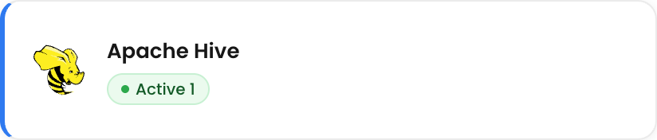
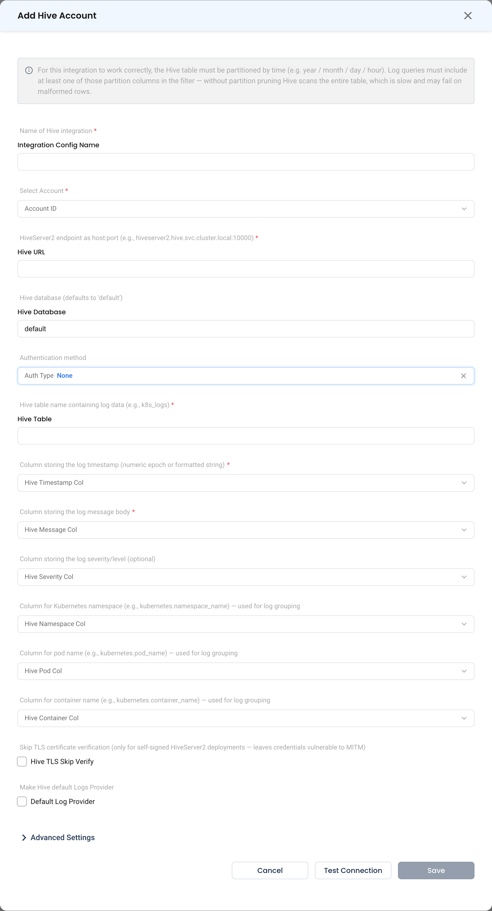

# Apache Hive

Connect Apache Hive so NudgeBee can query logs stored in a Hive table. Hive is a **log-only** source.

:::caution
For this integration to work correctly, the Hive table must be **partitioned by time** (year / month / day / hour), and your filter must include at least one of those partition columns. Without partition pruning, Hive scans the entire table — queries are slow and may fail outright on malformed rows.
:::

---

## Prerequisites

- A **HiveServer2** endpoint reachable from NudgeBee, in `host:port` form, e.g. `hiveserver2.hive.svc.cluster.local:10000`.
- A Hive table holding log data, partitioned by time.
- The column names for the log timestamp and the log message body.

---

## Step 1: Configure the Integration in NudgeBee

Navigate to **Admin** > **Integrations** > **Observability**, select **Apache Hive**, then click **Add Hive Account**.

* **Integration Config Name \*** (Required) — a name for this Hive integration, e.g. `app-logs-hive`.
* **Account ID \*** (Required) — the NudgeBee account to link.
* **Hive URL \*** (Required) — the HiveServer2 endpoint as host and port, e.g. `hiveserver2.hive.svc:10000`.
* **Hive Database** — the database to connect to. Defaults to `default`.
* **Auth Type** — the authentication method. Defaults to `None`.
* **Hive Table \*** (Required) — the table containing log data, e.g. `logs.app_logs`.
* **Hive Timestamp Col \*** (Required) — the column storing the log timestamp, as a numeric epoch or a formatted string.
* The column storing the log message body is also required.

## Step 2: Test and Save

Click **Test Connection**, then **Save**.

---

## Verify the Integration

1. Click **Test Connection** on the form — it should succeed before you save.
2. Open **Clusters**, select a cluster, and go to **Monitoring** > **Logs** > **Query Log**.
3. Confirm log rows from Hive appear. Include a time range so partition pruning applies.

---

## Troubleshooting

| Symptom | Likely Cause | Fix |
|---------|-------------|-----|
| Queries are very slow or time out | The filter does not include a partition column | Ensure the table is partitioned by time and that queries include the partition column. |
| Query fails on some rows | Malformed rows in the table | Hive scans without pruning will surface bad rows; fix the source data or narrow the partition range. |
| Connection refused | Wrong HiveServer2 port | HiveServer2 usually listens on `10000`; confirm the port your deployment uses. |
| No results despite data existing | Wrong timestamp column, or a format mismatch | Confirm **Hive Timestamp Col** and whether it stores epoch values or formatted strings. |
| Authentication errors | **Auth Type** does not match the server | Set the authentication method your HiveServer2 requires. |

---

## Helpful Links

- [Observability overview](./index.md)
- [Apache Hive documentation](https://cwiki.apache.org/confluence/display/Hive/Home)
