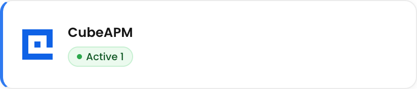
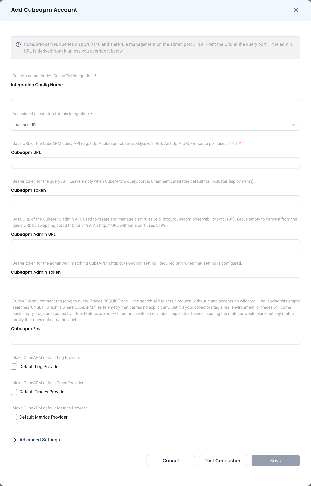

# CubeAPM

NudgeBee integrates with **CubeAPM** to query **logs**, **metrics**, and **traces** from your CubeAPM deployment. It reads them through the APIs CubeAPM exposes on its query port:

- **Logs**: LogsQL
- **Metrics**: PromQL, through the Prometheus-compatible HTTP API
- **Traces**: LogsQL trace search, plus a Jaeger-compatible API for the span waterfall

CubeAPM's **admin** port serves alert-rule management. NudgeBee uses it to manage alert rules in CubeAPM.

---

## Prerequisites

Before configuring the integration, ensure you have:

- A **CubeAPM** deployment whose **query port** (`3140` by default) is reachable from NudgeBee
- The **query API token**, if your CubeAPM requires one. In-cluster deployments usually leave the query port unauthenticated.
- *(Optional, for alert rules)* The **admin port** (`3199` by default) reachable from NudgeBee, and the admin token if CubeAPM's `http-token-admin` setting is configured
- *(Optional)* The CubeAPM **environment** (`env`) tag your collectors write, if you want to restrict NudgeBee to one environment

:::caution Use the query port, not the web UI
CubeAPM's web UI and its query API listen on different ports. Point NudgeBee at the query port. The web UI answers API calls with `401 Unauthorized`, so a UI URL looks like a token problem even when no token is needed.
:::

---

## Step 1: Configure the Integration in NudgeBee

Navigate to **Admin** > **Integrations** > **Observability** and select **CubeAPM**. Click **Add Cubeapm Account** to open the configuration form.

### Configuration Fields

The form labels these fields with "Cubeapm" in the name, for example **Cubeapm URL**.

* **Integration Config Name**
    * A descriptive label for this integration, for example `Production CubeAPM`.

* **Account ID**
    * The NudgeBee account or accounts whose workloads this CubeAPM holds data for.

* **Cubeapm URL \*** *(Required)*
    * The base URL of the CubeAPM **query** API. For example: `http://cubeapm.observability.svc:3140`.
    * An `http://` URL without a port uses `3140`. An `https://` URL is used as entered, because it is assumed to sit behind a TLS proxy.
    * Enter the host and port only. A URL with a path after the host is rejected.

* **Cubeapm Token**
    * The bearer token for the query API, sent as `Authorization: Bearer <token>`. It is stored encrypted.
    * Leave it empty when the query port is unauthenticated.

* **Cubeapm Admin URL**
    * The base URL of the CubeAPM **admin** API, used to create and manage alert rules. For example: `http://cubeapm.observability.svc:3199`.
    * Leave it empty to derive it from the query URL by swapping port `3140` for `3199`. That works only when the query URL is on port `3140`. On any other port, enter the admin URL explicitly.

* **Cubeapm Admin Token**
    * The bearer token for the admin API. It must match CubeAPM's `http-token-admin` setting.
    * It is required only when that setting is configured.

* **Cubeapm Env**
    * The CubeAPM environment tag (`env`) to query.
    * **Leave it empty to search every environment.** Set it to restrict logs and traces to one environment, for example `production`.
    * Metrics ignore this setting. To narrow a metrics query, filter on the `env` label in the query itself.
    * The hint under this field in the form still says that an empty value searches `UNSET`. That is out of date: an empty value applies no environment filter.

* **Default Log Provider**
    * Makes CubeAPM the default log source for the linked accounts.

* **Default Traces Provider**
    * Makes CubeAPM the default trace source.

* **Default Metrics Provider**
    * Makes CubeAPM the default metrics source.

### Test and Save

1. Click **Test Connection**. NudgeBee first runs a trivial PromQL query (`1`) against `/api/metrics/api/v1/query`. It then checks that the trace search API at `/api/traces/select/logsql/query` exists. On success you see **Cubeapm connection successful**.
2. *(Optional)* Expand **Advanced Settings** to set **Default Log Filters**, **Default Trace Filters**, **Log Label Mapping**, and **Trace Label Mapping**. See [Advanced Settings](./advanced-settings.md) for what each one does. These cards unlock after a successful test.
3. Click **Save**. It stays disabled until a test succeeds.

Test Connection checks the query URL and token only. It does not contact the admin API, so a wrong admin URL or admin token shows up only when NudgeBee manages an alert rule.

If the test fails, the message tells you what to fix:

| Message starts with | Cause | Fix |
|---|---|---|
| `failed to connect to CubeAPM at …` | Nothing is listening, or the port is not the query port | Check the host, and use port `3140` |
| `CubeAPM rejected the request at … (HTTP 401)` | The token is wrong, **or** the URL points at the web UI | Use the query port. If it already does, check **Cubeapm Token** |
| `insufficient permissions for CubeAPM (HTTP 403)` | The token lacks access | Use a token that can query |
| `CubeAPM /api/metrics/api/v1/query not found …` | The URL is not the query port | Point **Cubeapm URL** at port `3140` |
| `CubeAPM at … does not serve the trace query API …` | This CubeAPM version has no LogsQL trace search | Upgrade CubeAPM. Logs and metrics still work, but traces cannot be shown |
| `cubeapm_url must be the base URL only …` | The URL includes a path | Remove everything after the host and port |

---

## What Gets Connected

| Signal | CubeAPM API (query port) | Query language |
|--------|--------------------------|----------------|
| Logs | `/api/logs/select/logsql/query` | LogsQL |
| Metrics | `/api/metrics/api/v1/query`, `/query_range`, `/labels` | PromQL |
| Traces | `/api/traces/select/logsql/query`, plus `/api/traces/api/v1/traces/{traceId}` for the waterfall | LogsQL |
| Alert rules | `/api/alerts/api/v1/rules` (admin port) | — |

### Logs

- The Logs page offers **Builder**, **Code**, and **AI** modes, and opens in **Code** mode. In Code mode you write LogsQL directly, for example: `{env="prod"} k8s.namespace.name:="prod" AND log.level:=error | sort ("_time" desc) | limit 100`
- A Code-mode query is sent exactly as written. **Cubeapm Env** is not added to it.
- Searches cover the last hour unless you choose another time range.
- They return 100 records by default and 10,000 at most.
- **Contains** filters match case-insensitively. Equality on the log level also ignores case, so `error` matches `ERROR`.

**Log field mappings.** Override them per account in **Log Label Mapping**.

| NudgeBee Field | CubeAPM Field |
|----------------|--------------|
| `timestamp` | `_time` |
| `message` | `_msg` |
| `namespace` | `k8s.namespace.name` |
| `pod` | `k8s.pod.name` |
| `container` | `k8s.container.name` |
| `node` | `k8s.node.name` |
| `workload` | `k8s.deployment.name`, or `service` when a record has no deployment name |
| `cluster` | `k8s.cluster.name` |
| `host` | `host.name` |
| `service` | `service` |
| `severity` | `log.level` or `level` |
| `env` | `env` |

**Log Groups** are supported. They cluster error-level records into patterns, and leave out sidecar and proxy containers such as `istio-proxy`, `linkerd-proxy`, and `envoy`.

### Metrics

CubeAPM exposes a Prometheus-compatible API, so NudgeBee treats it like any PromQL provider:

- The metrics query builder, Code-mode PromQL, and AI query generation all work.
- nubi can discover and query metrics.
- Rightsizing and utilisation read from it.

:::info Kubernetes metrics must be in CubeAPM
NudgeBee's Kubernetes charts, utilisation, and rightsizing read the standard cAdvisor, kube-state-metrics, and node-exporter metric families, such as `container_cpu_usage_seconds_total` and `kube_pod_container_resource_requests`. CubeAPM also generates span-derived metrics named `cube_apm_*`. You can query those in PromQL, but NudgeBee's built-in charts do not use them. If your CubeAPM ingests only traces and logs, the Kubernetes charts will be empty.
:::

- NudgeBee assumes one CubeAPM integration covers one cluster, so metrics queries are not filtered by cluster.
- **Cubeapm Env** is not applied to metrics.

### Traces

NudgeBee searches span records (`event.domain="span"`). When **Cubeapm Env** is set, it also filters on that environment.

| NudgeBee Filter | CubeAPM Field |
|-----------------|--------------|
| Service / workload | `service` |
| Namespace | `k8s.namespace.name` or `service.namespace` (resource attributes) |
| Destination | `peer.service`, `server.address`, `net.peer.name` |
| Span name | `span_name` |
| Span kind | `span_kind` |
| Status | `status_code` (a `STATUS_CODE_ERROR` filter matches CubeAPM's `ERROR`) |
| HTTP status | `http.response.status_code`, `http.status_code`, `rpc.grpc.status_code` |
| Resource | `http.route`, `http.target`, `url.path`, `url.full`, `db.statement` |

Three limits apply to traces:

- A trace list returns up to 1,000 spans per page.
- Trace counts come from NudgeBee's own query, so they may not match the totals on CubeAPM's search screen.
- In Code mode, a query that contains `|` cannot be shown in the grouped view.

---

## Verify the Integration

1. Click **Test Connection** on the saved integration, from its row menu. Confirm it succeeds.
2. Open a **Kubernetes workload** in NudgeBee and go to the **Logs** tab. Confirm that its logs from CubeAPM appear.
3. Open the **Traces** tab and confirm that spans appear.
4. Open the **Metrics** tab and run a PromQL query, for example `sum(rate(container_cpu_usage_seconds_total[5m])) by (namespace)`. If it returns nothing, your CubeAPM is not ingesting Kubernetes metrics. See the note under [Metrics](#metrics).

---

## Troubleshooting

| Symptom | Likely Cause | Fix |
|---------|-------------|-----|
| Test fails with HTTP 401, but no token is configured on CubeAPM | **Cubeapm URL** points at the web UI | Change the port to the query port, `3140` |
| Traces are empty, but logs work | **Cubeapm Env** names an environment your spans do not carry | Clear **Cubeapm Env**, or set it to the `env` your collectors write |
| Logs from other environments appear | **Cubeapm Env** is empty, so every environment is searched | Set **Cubeapm Env** to the environment you want |
| Kubernetes CPU and memory charts are empty | CubeAPM holds no cAdvisor or kube-state-metrics data | Scrape those into CubeAPM, or connect another metrics provider |
| `CubeAPM alert-rule management needs the admin API …` | **Cubeapm Admin URL** is empty, and the query URL is not on port `3140` | Set **Cubeapm Admin URL** explicitly |
| `CubeAPM admin API rejected the credentials (HTTP 401)` | **Cubeapm Admin Token** does not match `http-token-admin` | Set the admin token to match |
| `CubeAPM admin API not found at …` | The admin server is disabled on this deployment | Enable CubeAPM's admin server (`http-host-admin`), or correct the admin URL |
| `only one 'cubeapm' integration per account is supported` | The account already has a CubeAPM integration | Edit the existing one, or remove it first |

---

## Notes

- **One per account.** Each NudgeBee account can link one CubeAPM integration.
- **No cluster filter.** NudgeBee does not filter CubeAPM logs, metrics, or traces by cluster. If one CubeAPM holds data from several clusters, workloads with the same namespace and name in different clusters are mixed together.
- To receive **CubeAPM alerts as NudgeBee events**, set up the [CubeAPM Webhook](../Webhooks/cubeapm_webhook.md).

---

## Helpful Links

- [CubeAPM documentation](https://docs.cubeapm.com/)
- [LogsQL reference](https://docs.victoriametrics.com/victorialogs/logsql/)
- [CubeAPM Webhook](../Webhooks/cubeapm_webhook.md)
- [Observability integrations overview](./index.md)
