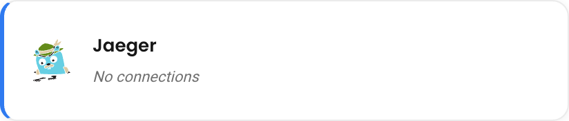
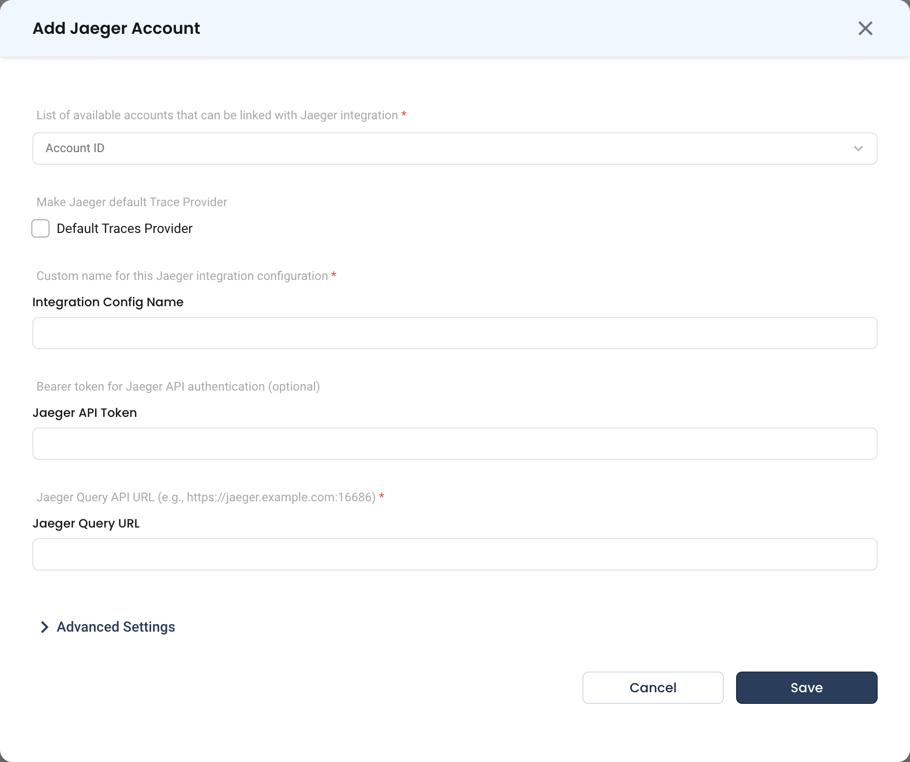

# Jaeger

Connect Jaeger so NudgeBee can read distributed traces and correlate latency and error spikes with the workloads behind them.

---

## Prerequisites

- A reachable **Jaeger Query** service. NudgeBee reads traces through the Query API, not the collector.
- The Query API URL, typically on port `16686`.
- A bearer token, if your Jaeger deployment is behind authentication.

---

## Step 1: Configure the Integration in NudgeBee

Navigate to **Admin** > **Integrations** > **Observability**, select **Jaeger**, then click **Add Jaeger Account**.

* **Account ID \*** (Required)
    * The NudgeBee account or accounts to link this Jaeger integration with.
* **Default Traces Provider**
    * Enable to make Jaeger the default trace source for the selected accounts. Only one trace provider can be the default per cluster.
* **Integration Config Name \*** (Required)
    * A custom name for this configuration, e.g. `jaeger-prod`.
* **Jaeger API Token**
    * Bearer token for Jaeger API authentication. Optional — leave empty for an unauthenticated Query service.
* **Jaeger Query URL \*** (Required)
    * The Query API endpoint, e.g. `https://jaeger.example.com:16686`. For an in-cluster deployment this is usually the Query service DNS name, e.g. `http://jaeger-query.observability.svc.cluster.local:16686`.

**Advanced Settings** holds optional tuning for this integration.

## Step 2: Save

Click **Save**.

---

## What Gets Connected

| Signal | Source |
|--------|--------|
| Traces | Jaeger Query API — service and operation lists, trace search, and individual trace retrieval |

Jaeger is a **trace-only** source. Pair it with a metrics source such as [Prometheus](../../installation/agent/connect/metrics.md) and a log source such as [Loki](../../installation/agent/connect/logging/loki.md) for full troubleshooting context.

---

## Verify the Integration

1. Open **Clusters**, select a cluster, and go to **Monitoring** > **Traces**.
2. Confirm spans appear for a service you know is receiving traffic.
3. If the list is empty, check that the integration is enabled and set as the default trace provider for that cluster.

---

## Troubleshooting

| Symptom | Likely Cause | Fix |
|---------|-------------|-----|
| No traces appear | Not set as the default trace provider | Enable **Default Traces Provider** for the cluster, or check which source currently holds it. |
| Connection fails | Collector endpoint used instead of Query | NudgeBee reads from Jaeger **Query** (typically `16686`), not the collector (`14268`/`4317`). |
| `401` or `403` | Query API is behind auth | Supply a bearer token in **Jaeger API Token**. |
| Services list is empty | Traces are not reaching Jaeger, or the retention window has expired | Confirm your applications are exporting spans and that Jaeger's storage retains them. |
| Traces found but not linked to workloads | Span resource attributes do not identify the Kubernetes workload | Ensure your instrumentation sets `service.name` to match the workload name. |

---

## Helpful Links

- [Traces integration overview](../../installation/agent/connect/tracing/index.md)
- [Jaeger Query API](https://www.jaegertracing.io/docs/latest/apis/)
- [Observability overview](./index.md)
