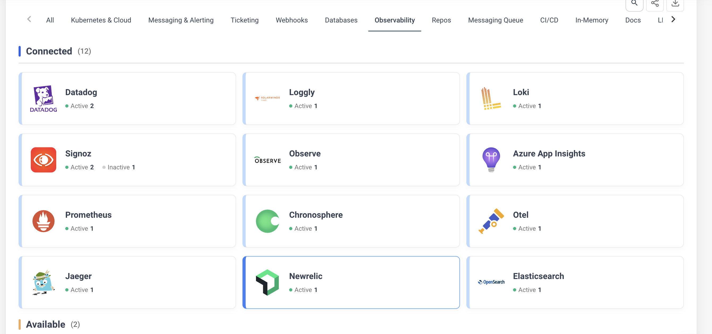
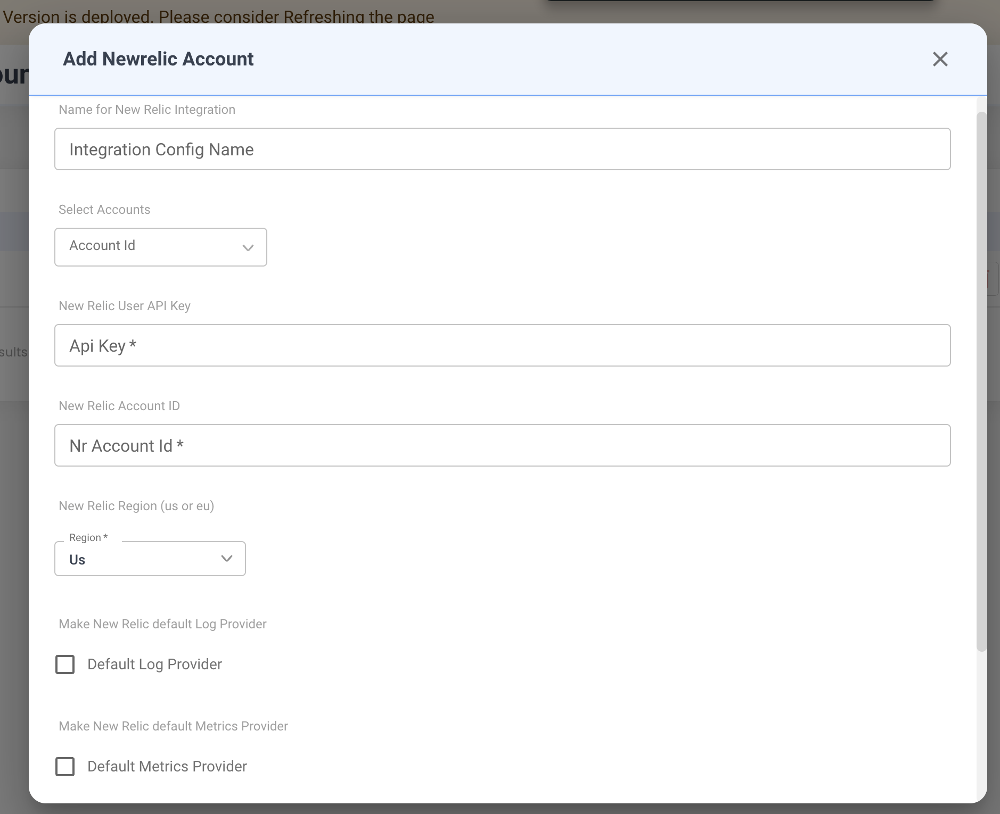

# New Relic

## Prerequisites

Before configuring the integration, ensure you have the following from your New Relic account:

- A **User API Key** (not a License Key or Ingest Key)
- Your **New Relic Account ID**
- Your account's **region** (US or EU)

---

## New Relic Integration Configuration

Navigate to **Integrations** > **Observability** tab and select **New Relic** to open the configuration form.

### Configuration Fields

* **Integration Config Name**
    * A descriptive name for this integration (e.g., `Production New Relic`).
    * Used to identify this configuration when multiple New Relic integrations exist.

* **Account Id**
    * Select the NudgeBee account to link with this New Relic integration from the dropdown.

* **API Key \*** (Required)
    * Your New Relic **User API Key**.
    * To generate one: open New Relic, click your user menu (bottom-left) > **API Keys** > **Create a key** > select **User** as the key type.
    * This key is used to query logs, traces, and metrics via the NerdGraph (GraphQL) API.

* **New Relic Account ID \*** (Required)
    * Your numeric New Relic Account ID.
    * To find it: click your user menu > **Account Settings**. The Account ID is displayed at the top, and also appears in the URL (e.g., `https://one.newrelic.com/nr1-core?account=1234567`).

* **Region \*** (Required)
    * The data center region of your New Relic account. Select from the dropdown:
        * `us` — United States datacenter (`api.newrelic.com`)
        * `eu` — European Union datacenter (`api.eu.newrelic.com`)
    * If unsure, check your New Relic login URL: `one.newrelic.com` = US, `one.eu.newrelic.com` = EU.

* **Default Log Provider**
    * Enable this to set New Relic as the default source for log queries across NudgeBee.

* **Default Metrics Provider**
    * Enable this to set New Relic as the default source for metric queries.

* **Default Traces Provider**
    * Enable this to set New Relic as the default source for distributed trace queries.

---

## What Gets Connected

Once configured, NudgeBee queries your New Relic account using NRQL (New Relic Query Language) via the NerdGraph GraphQL API:

| Signal  | NRQL Event Type | Example |
|---------|-----------------|---------|
| Logs    | `Log`           | `SELECT * FROM Log WHERE service.name = 'checkout' SINCE 1 hour ago` |
| Traces  | `Span`          | `SELECT * FROM Span WHERE service.name = 'api-gateway' SINCE 30 minutes ago` |
| Metrics | `Metric`        | `SELECT average(k8s.container.cpuCoresUtilization) FROM Metric TIMESERIES` |

NudgeBee supports the full range of NRQL operators for filtering: `=`, `!=`, `LIKE`, `IN`, `BETWEEN`, `>`, `<`, and more.

**Credential validation**: on save, NudgeBee runs `SELECT count(*) FROM Transaction SINCE 1 minute ago` against your account to verify the API key, Account ID, and region are correct.

---

## Verify the Integration

1. Save the configuration. If credentials are valid, the integration is created without errors.
2. Navigate to any Kubernetes workload in NudgeBee.
3. Open the **Logs** or **Traces** tab.
4. Confirm that data from New Relic appears in the query results.

---

## Notes

- New Relic traces support a **14-day** lookback window (vs. minutes for eBPF-based traces).
- Log queries are limited to 2000 results per request. Use filters to narrow results.
- Metric queries support both instant and time-series modes with configurable intervals.
- Field names from Fluent Bit, Fluentd, and New Relic's own K8s integration are all supported automatically.
