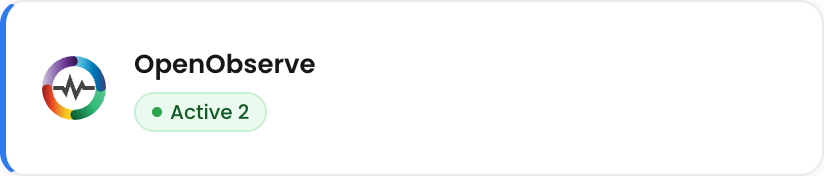
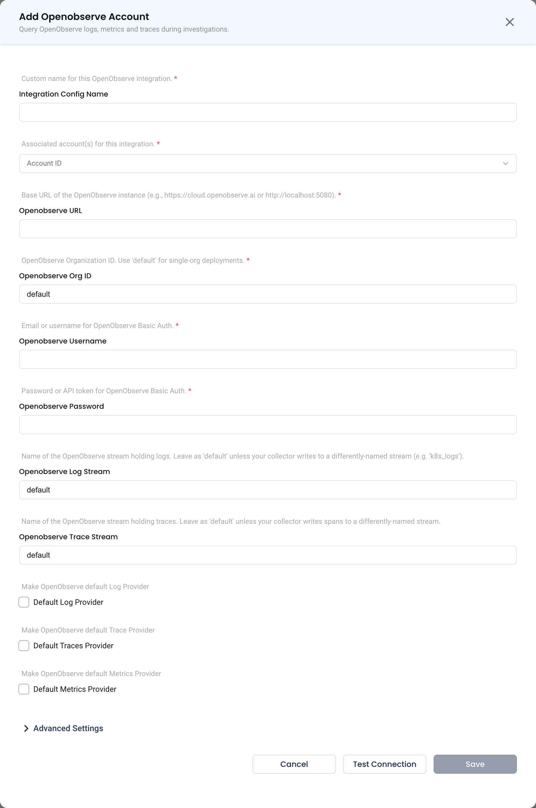

# OpenObserve

NudgeBee integrates with **OpenObserve** to query **logs**, **metrics**, and **traces** from your OpenObserve organization:

- **Logs**: SQL over OpenObserve's search API, on your log stream
- **Metrics**: PromQL, through OpenObserve's Prometheus-compatible API
- **Traces**: SQL over the search API, on your trace stream

NudgeBee reads what your OpenObserve organization already holds. It does not write to OpenObserve or create alerts in it.

---

## Prerequisites

Before configuring the integration, ensure you have:

- An **OpenObserve** instance that NudgeBee's backend can reach directly, served at the root of its host.
- An OpenObserve **user**, with its email or username, and a **password or API token**. NudgeBee signs in with HTTP Basic auth.
- The **organization ID** that holds your data. Single-organization deployments use `default`. The ID also appears in the OpenObserve web UI's URL as `org_identifier=…`.
- Telemetry from the OpenTelemetry Collector:
  - **Logs** in a log stream (default name: `default`)
  - *(Optional)* **Traces** in a trace stream (default name: `default`)
  - *(Optional)* **Kubernetes metrics**, for the metrics features

:::caution Enter the base URL only
Use the address of the OpenObserve server itself, for example `https://openobserve.example.com` or `http://openobserve.observability.svc:5080`. A URL with a path, such as one copied from the browser (`https://openobserve.example.com/web/logs`), is rejected. An OpenObserve served under a path prefix cannot be connected.
:::

---

## Step 1: Configure the Integration in NudgeBee

Navigate to **Admin** > **Integrations** > **Observability** and select **OpenObserve**. Click **Add Openobserve Account** to open the configuration form.

### Configuration Fields

The form labels these fields with "Openobserve" in the name, for example **Openobserve URL**.

* **Integration Config Name \*** *(Required)*
    * A descriptive label for this integration, for example `Production OpenObserve`.

* **Account ID \*** *(Required)*
    * The NudgeBee account or accounts whose workloads this OpenObserve holds data for.

* **Openobserve URL \*** *(Required)*
    * The base URL of the OpenObserve instance, for example `https://cloud.openobserve.ai` or `http://localhost:5080`.
    * A trailing `/` is ignored. A path after the host is rejected.

* **Openobserve Org ID \*** *(Required)*
    * The OpenObserve organization to query. Default: `default`.

* **Openobserve Username \*** *(Required)*
    * The email or username NudgeBee signs in with.

* **Openobserve Password \*** *(Required)*
    * The user's password or API token. It is stored encrypted.

* **Openobserve Log Stream**
    * The stream that holds your logs. Default: `default`.
    * Change it if your collector writes logs to another stream, for example `k8s_logs`.

* **Openobserve Trace Stream**
    * The stream that holds your spans. Default: `default`.

* **Default Log Provider**
    * Makes OpenObserve the default log source for the linked accounts.

* **Default Traces Provider**
    * Makes OpenObserve the default trace source.

* **Default Metrics Provider**
    * Makes OpenObserve the default metrics source.

Stream names may contain only letters, digits, and underscores. Neither Test Connection nor Save checks this: a name with any other character saves, and then every log or trace query fails with `invalid openobserve_log_stream …` or `invalid openobserve_trace_stream …`.

### Test and Save

1. Click **Test Connection**. NudgeBee calls `GET /api/<org>/streams` with a 15-second timeout. On success you see **Openobserve connection successful**.
2. *(Optional)* Expand **Advanced Settings** to set **Default Log Filters**, **Default Trace Filters**, **Log Label Mapping**, and **Trace Label Mapping**. See [Advanced Settings](./advanced-settings.md) for what each one does. These cards unlock after a successful test.
3. Click **Save**. It stays disabled until a test succeeds.

Test Connection checks the URL, the organization, and the credentials. It does **not** check that the log or trace stream exists. A misspelled log stream saves without error and then shows no logs.

If the test fails, the message tells you what to fix:

| Message starts with | Cause | Fix |
|---|---|---|
| `failed to connect to OpenObserve at …` | Nothing is listening at that address, or it is not reachable from NudgeBee | Check the host and port, and any network policy between them |
| `invalid OpenObserve credentials (HTTP 401)` | Wrong username, password, or API token | Correct the credentials |
| `insufficient permissions for OpenObserve (HTTP 403)` | The user cannot list the organization's streams | Give the user access to the organization |
| `OpenObserve /api/<org>/streams not found …` | The URL is not the OpenObserve API, or the organization ID is wrong | Check **Openobserve URL** and **Openobserve Org ID** |
| `openobserve_url must be the base URL only …` | The URL includes a path | Remove everything after the host and port |

---

## What Gets Connected

| Signal | OpenObserve API | Query language |
|--------|-----------------|----------------|
| Logs | `POST /api/<org>/_search` on the log stream | SQL |
| Metrics | `/api/<org>/prometheus/api/v1/query_range` and `/query` | PromQL |
| Traces | `POST /api/<org>/_search?type=traces` on the trace stream | SQL |

### Logs

:::caution Use the Builder in Query Log
To search logs yourself, open the Kubernetes cluster's page and choose **Monitoring** > **Query Log**. It opens in **Code** mode, with an SQL example as the placeholder, but for OpenObserve the SQL you type in the Code tab is **ignored**:
- NudgeBee returns the newest logs in the stream, filtered only by any [Default Log Filters](./advanced-settings.md#default-log-filters).
- The query line under the editor still repeats your SQL, so it looks as if the SQL ran.

Switch to **Builder** and add at least one filter.
:::

A workload's own **Logs** tab needs no query. It loads that workload's logs automatically, by filtering on its namespace and app.

- Searches cover the last hour unless you choose another time range.
- They return the newest 100 rows by default, and 10,000 at most.
- The Builder's field list shows the stream's own column names, such as `k8s_namespace_name` rather than `namespace`. It is built from the newest 100 rows in the time window, so a field that none of those rows carry is not offered.
- To search the log message, add a filter on `body`, for example `body` **contains** `ERROR`.

**Filter operators**, as the Builder labels them:

| Operator | How it matches |
|---|---|
| `=` / `!=` | Exact value |
| `in` / `not in` | Any value in a comma-separated list |
| `<`, `<=`, `>`, `>=` | Numbers and timestamps |
| `contains` | Case-sensitive substring |
| `LIKE` / `NOT LIKE` | SQL pattern. Add `%` wildcards yourself, as in `%timeout%` |
| `ILIKE` | Case-insensitive SQL pattern. Also needs `%` wildcards |
| `is null` | The field has no value. An empty string is not null. |

Regular-expression filters, and case-insensitive `icontains` filters, are not supported for OpenObserve. Use `ILIKE` with `%` wildcards instead.

**Log field mappings.** The defaults match the OpenTelemetry Collector's field names. Override them per account in [Log Label Mapping](./advanced-settings.md#log-and-trace-label-mapping). A Fluent Bit pipeline writes `kubernetes_namespace_name` and similar names instead, and needs that mapping.

Map each concept to the stream's real column name. A mapping has **no effect** if its target column has one of NudgeBee's own field names, because NudgeBee translates those names a second time. Those names are `timestamp`, `body`, `message`, `namespace`, `pod`, `container`, `node`, `workload`, `app`, `cluster`, `host`, `hostname`, `service`, `severity`, and `level`. For example, mapping `severity` to a column named `level` has no effect, because `level` is translated back to `severity`.

| NudgeBee Field | OpenObserve Field |
|----------------|-------------------|
| `timestamp` | `_timestamp` |
| `message` | `body` |
| `namespace` | `k8s_namespace_name` |
| `pod` | `k8s_pod_name` |
| `container` | `k8s_container_name` |
| `node` | `k8s_node_name` |
| `workload` | `k8s_deployment_name` |
| `app` | `k8s_deployment_name` |
| `cluster` | `k8s_cluster` |
| `host` | `host_name` |
| `service` | `service_name` |
| `severity` | `severity` |

The OpenTelemetry Collector sets `k8s_deployment_name` only for pods owned by a Deployment. For StatefulSet, DaemonSet, and Job workloads, the workload **Logs** tab can be empty until you map `app` to the column your pipeline uses for those workloads.

Depending on how your collector writes logs, `severity` can hold the numeric OpenTelemetry severity instead of a level name. If a filter on a level name such as `ERROR` finds nothing, check which column holds the level name in your stream, often `severity_text`. Then map `severity` to that column in Log Label Mapping.

**Log Groups** are supported. They group error-level logs that have identical message text, and leave out containers named `nudgebee-agent`, `prometheus`, and `grafana`.

### Metrics

OpenObserve serves a Prometheus-compatible API, so NudgeBee treats it like a PromQL provider:

- The metrics query builder, Code-mode PromQL, and nubi's metric discovery all work.
- The **Instant** query option is not offered for OpenObserve.
- The Utilization & Health cards read from it. NudgeBee uses the first metric family it finds:
  - Cluster and node cards try node-exporter and cAdvisor metrics, then NudgeBee's agent metrics, then OpenTelemetry `k8s_node_*` metrics.
  - Pod and workload cards try cAdvisor metrics, then the OpenTelemetry collector's `container_*` metrics.

Two limits apply:

- **OpenObserve's PromQL is a subset of Prometheus's.** NudgeBee's built-in cards already work around this, but PromQL you write in **Monitoring** > **Query Metrics** can return nothing where Prometheus would return data:
  - `A or B` returns nothing when `B` is empty.
  - Arithmetic between series, such as `sum(A) - sum(B)`, returns nothing.
  - `quantile()` returns nothing.
  - A subquery that contains `or` fails with HTTP 400.
- **No cluster filter.** NudgeBee treats one OpenObserve organization as one cluster, and does not filter metrics by cluster. If one organization holds several clusters, cluster totals add them together. Keep each cluster in its own organization.

### Traces

| NudgeBee Filter | OpenObserve Field |
|-----------------|-------------------|
| Workload (service) | `service_name` |
| Namespace | `service_k8s_namespace_name` |
| Destination | `net_peer_name` |
| Span name | `operation_name` |
| Status | `status_code` |
| HTTP status | `http_status_code` |
| Resource | `http_target` |
| Trace ID / span ID | `trace_id` / `span_id` |

What the Traces page supports with OpenObserve:

- The trace list, the **By Traces** view, the span waterfall, and the service map are supported.
- **Trace grouping is not supported.** The grouped view shows *Trace Grouping not supported*.
- A trace search returns up to 10,000 spans.
- You cannot filter by the destination workload's namespace, because spans do not record it.

---

## Verify the Integration

1. Click **Test Connection** on the saved integration, from its row menu. Confirm it succeeds.
2. Open a **Kubernetes workload** in NudgeBee and go to its **Logs** tab. Confirm the workload's logs appear.
3. On the cluster's page, choose **Monitoring** > **Query Log**, switch to **Builder**, and add a filter on `k8s_namespace_name`. Confirm matching logs appear.
4. Open the workload's **Traces** tab and confirm spans appear.
5. Choose **Monitoring** > **Query Metrics**, and run a PromQL query your organization holds data for.

---

## Troubleshooting

| Symptom | Likely Cause | Fix |
|---------|-------------|-----|
| No logs at all, but the test passes | **Openobserve Log Stream** names a stream that does not exist | Set it to the stream your collector writes logs to |
| A workload's **Logs** tab is empty, but its logs are in OpenObserve | Your pipeline uses different field names, such as Fluent Bit's `kubernetes_namespace_name`, or the workload is not a Deployment | Map `namespace` and `app` in **Advanced Settings** > **Log Label Mapping** |
| SQL typed in the Query Log **Code** tab has no effect | Code-mode SQL is ignored for OpenObserve | Use the **Builder** |
| Builder says *Please select at least one label filter* | The Builder needs at least one filter | Add a filter, for example on `k8s_namespace_name` |
| A `LIKE` or `ILIKE` filter finds nothing | The pattern has no `%` wildcards, so it must match the whole value | Write `%value%` |
| A Log Label Mapping has no effect | Its target column has one of NudgeBee's own field names, such as `level` or `service` | Map to a column with any other name. See the list under [Logs](#logs). |
| `invalid openobserve_log_stream …` or `invalid openobserve_trace_stream …` | The stream name has a character other than letters, digits, or `_` | Rename the stream setting to match OpenObserve's stream name |
| The Traces view shows an error | **Openobserve Trace Stream** names a stream that does not exist, or the time range holds no spans | Widen the time range first. If the error persists, set the stream to the one your collector writes spans to. |
| `only one 'openobserve' integration per account is supported` | The account already has an OpenObserve integration | Edit the existing one, or remove it first |

---

## Notes

- **Direct connection only.** NudgeBee connects to OpenObserve from its backend. There is no option to route through the NudgeBee agent, and no TLS settings, so a self-signed certificate must be trusted by NudgeBee's backend.
- **One per account.** Each NudgeBee account can link one OpenObserve integration.
- **Alerts are separate.** This integration reads telemetry. To receive OpenObserve alerts as NudgeBee events, set up the [OpenObserve Webhook](../Webhooks/openobserve_webhook.md).

---

## Helpful Links

- [OpenObserve documentation](https://openobserve.ai/docs/)
- [OpenObserve Webhook](../Webhooks/openobserve_webhook.md)
- [Advanced Settings: default filters and field mapping](./advanced-settings.md)
- [Observability integrations overview](./index.md)
