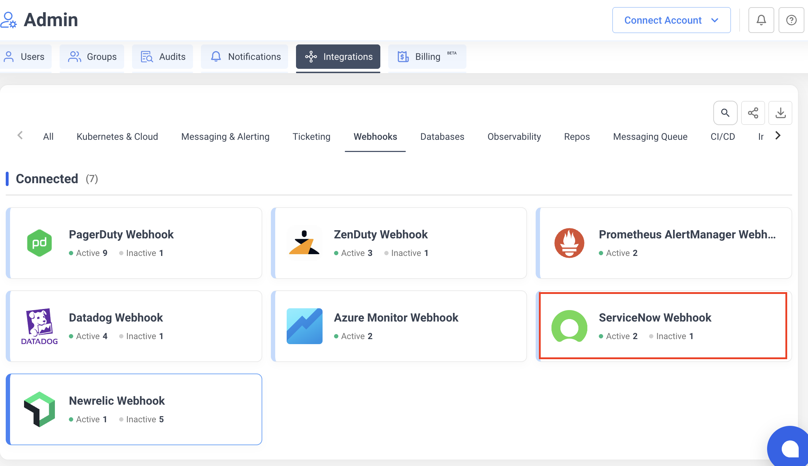
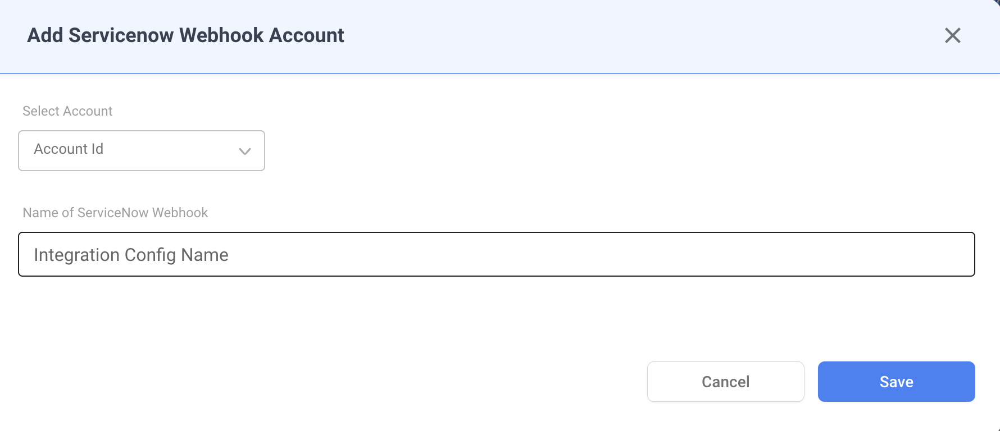
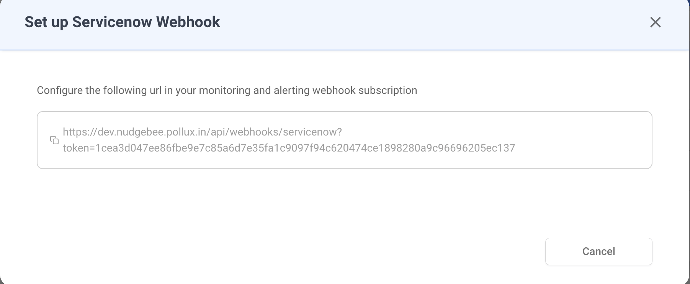

# ServiceNow Webhook

Receive ServiceNow incident notifications directly into NudgeBee. When an incident is created or updated in ServiceNow, NudgeBee automatically creates an event enriched with incident details.

---

## Step 1: Create the Webhook in NudgeBee

1. Navigate to **Integrations** > **Webhooks** tab.
2. Click the **ServiceNow Webhook** card.



3. Fill in the configuration:
   - **Account** — select the NudgeBee account to receive events.
   - **Integration Config Name** — a descriptive name for this webhook (e.g., `Production Incidents`).



4. Click **Save**. NudgeBee generates a unique webhook URL.

5. **Copy the webhook URL** from the dialog. It follows this format:

```
https://<your-nudgebee-domain>/api/webhooks/servicenow?token=<generated-token>
```



Keep this URL — you will configure it in ServiceNow in the next step.

---

## Step 2: Configure ServiceNow Outbound REST Message

1. In ServiceNow, navigate to **System Web Services** > **Outbound** > **REST Message**.
2. Click **New** to create a new REST message.
3. Configure the REST message:
   - **Name**: enter a descriptive name (e.g., `NudgeBee Webhook`).
   - **Endpoint**: paste the NudgeBee webhook URL from Step 1.
4. Under **HTTP Methods**, create a new **POST** method:
   - **Name**: `POST`
   - **Endpoint**: paste the same NudgeBee webhook URL.
   - **HTTP Headers**: add `Content-Type: application/json`.
5. Click **Save**.

---

## Step 3: Create a Business Rule to Trigger the Webhook

1. In ServiceNow, navigate to **System Definition** > **Business Rules**.
2. Click **New** to create a new business rule.
3. Configure the business rule:
   - **Name**: enter a descriptive name (e.g., `NudgeBee Incident Webhook`).
   - **Table**: select `Incident [incident]`.
   - **When to run**: select **after** insert and/or update, depending on when you want to notify NudgeBee.
4. In the **Advanced** tab, add a script that calls the REST message created in Step 2 with the incident details as the JSON payload.
5. Click **Save**.

> For more details on ServiceNow outbound integrations, see [ServiceNow's REST Message documentation](https://docs.servicenow.com/bundle/latest/page/integrate/outbound-rest/concept/c_OutboundRESTMessage.html).

---

## How It Works

When ServiceNow sends a webhook payload to NudgeBee, the following processing occurs:

### State Mapping

| ServiceNow State | NudgeBee Status |
|------------------|-----------------|
| `New`, `In Progress`, `On Hold` | **Firing** |
| `Resolved` | **Resolved** |
| `Closed` | **Resolved** |

### Priority Mapping

| ServiceNow Urgency | NudgeBee Priority |
|---------------------|-------------------|
| 1 - High | High |
| 2 - Medium | Medium |
| 3 - Low | Low |

### Event Deduplication

Events are deduplicated using a fingerprint derived from the incident `sys_id`. Repeated webhook calls for the same incident update the existing event instead of creating duplicates.

---

## Verify the Integration

1. In ServiceNow, create or update a test incident that matches the business rule criteria.
2. In NudgeBee, navigate to **Events** and verify the incident appears with:
   - Correct title and priority
   - Incident details evidence attached

---

## Troubleshooting

| Issue | Resolution |
|-------|------------|
| Webhook URL returns 401 | Verify the `token` query parameter in the URL is correct. Regenerate the integration if needed. |
| Events not appearing at all | Check that the ServiceNow business rule is active and the REST message endpoint URL is correct. |
| Duplicate events | Expected behavior — NudgeBee deduplicates by `sys_id`. State updates (e.g., In Progress → Resolved) update the existing event. |
