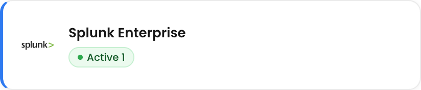
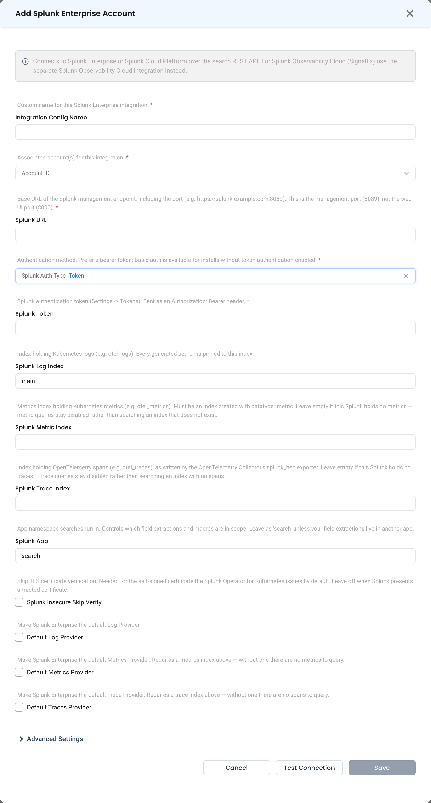

# Splunk Enterprise

NudgeBee integrates with **Splunk Enterprise** and **Splunk Cloud Platform** to query **logs**, **metrics**, and **traces** with SPL, over Splunk's search REST API. NudgeBee reads what your Splunk indexes already hold. It does not move data out of Splunk or install anything in it.

:::note Splunk Enterprise is not Splunk Observability Cloud
This page covers the Splunk platform you query with SPL: Splunk Enterprise, or Splunk Cloud Platform. **Splunk Observability Cloud** (formerly SignalFx) is a different product with a different API, and this integration does not connect to it.
:::

---

## Prerequisites

Before configuring the integration, ensure you have:

- A **Splunk Enterprise** or **Splunk Cloud Platform** deployment whose **management port** (usually `8089`) is reachable from NudgeBee. The web UI port (`8000`) will not work.
- Either an **authentication token**, or a **username and password**, for a Splunk user that has the `search` capability.
- Kubernetes telemetry in Splunk, written by the OpenTelemetry Collector:
  - **Logs** in an events index, for example `otel_logs`
  - *(Optional)* **Metrics** in a metrics index, created with `datatype=metric`, for example `otel_metrics`
  - *(Optional)* **Traces** in an events index, written by the Collector's `splunk_hec` exporter, for example `otel_traces`

:::tip Splunk Cloud Platform
On Splunk Cloud Platform, the REST API on port `8089` is only reachable from IP addresses on your deployment's search-head API allow list. Add NudgeBee's egress address to that list before testing the connection.
:::

---

## Step 1: Create a Search-Only User and Token in Splunk

NudgeBee only reads from Splunk. Give it a dedicated role that can search the indexes it needs, and nothing else.

1. In Splunk Web, go to **Settings** > **Roles** > **New Role**, for example `nudgebee_reader`.
   - Under **Capabilities**, grant `search`.
   - Under **Indexes**, allow only the log, metric, and trace indexes you will configure in Step 2.
2. Go to **Settings** > **Users** > **New User**. Create a service user, for example `nudgebee`, and assign it only the `nudgebee_reader` role.
3. Go to **Settings** > **Tokens**.
   - If token authentication is disabled, click **Enable Token Authentication**.
   - Click **New Token**, set **User** to the service user, and copy the token value.

If token authentication is not available on your deployment, skip step 3 and use the service user's username and password with **Basic** authentication.

:::caution Scope the role, not just the form
When you write SPL yourself in the Logs **Code** tab, NudgeBee sends the query as you typed it. It does **not** add the configured log index to it. NudgeBee blocks commands that write, execute, or send data (`delete`, `collect`, `outputlookup`, `sendemail`, `rest`, `map`, and similar), but the Splunk role decides which indexes a query can read. Do not paste an admin token into this integration.
:::

> **Reference:** [Create authentication tokens](https://docs.splunk.com/Documentation/Splunk/latest/Security/CreateAuthTokens) · [Create and manage roles](https://docs.splunk.com/Documentation/Splunk/latest/Security/Addandeditroles)

---

## Step 2: Configure the Integration in NudgeBee

Navigate to **Admin** > **Integrations** > **Observability** and select **Splunk Enterprise**. Click **Add Splunk Enterprise Account** to open the configuration form.





### Configuration Fields

* **Integration Config Name**
    * A descriptive label for this integration, for example `Production Splunk`.

* **Account ID**
    * The NudgeBee account or accounts whose workloads this Splunk holds data for.

* **Splunk URL \*** *(Required)*
    * The base URL of the Splunk **management** endpoint, including the port. For example: `https://splunk.example.com:8089`.
    * Enter the host and port only. A URL with a path after the host is rejected.

* **Splunk Auth Type \*** *(Required)*
    * **Token** *(default)*: sends the token as an `Authorization: Bearer` header. Use this where token authentication is enabled.
    * **Basic**: sends a username and password.

* **Splunk Token** *(Required when Auth Type is **Token**)*
    * The token from Step 1. It is stored encrypted.

* **Splunk Username** / **Splunk Password** *(Required when Auth Type is **Basic**)*
    * The service user's credentials. The password is stored encrypted.

* **Splunk Log Index**
    * The events index that holds Kubernetes logs. Default: `main`.
    * NudgeBee pins every search it generates to this index.

* **Splunk Metric Index**
    * A metrics index (`datatype=metric`) that holds Kubernetes metrics. Default: empty.
    * Leave it empty if this Splunk holds no metrics. Metric queries then report that metrics are not configured instead of returning an empty result.

* **Splunk Trace Index**
    * The events index that holds OpenTelemetry spans. Default: empty.
    * Leave it empty if this Splunk holds no traces.

* **Splunk App**
    * The app namespace searches run in, which controls which field extractions and macros apply. Default: `search`.
    * Change it only if your field extractions live in another app.

* **Splunk Insecure Skip Verify**
    * Skips TLS certificate verification. The Splunk Operator for Kubernetes issues a self-signed certificate by default, and this setting is needed for it.
    * Leave it off when Splunk presents a trusted certificate.

* **Default Log Provider**
    * Makes Splunk Enterprise the default log source for the linked accounts.

* **Default Metrics Provider**
    * Makes Splunk Enterprise the default metrics source. It requires **Splunk Metric Index** to be set.

* **Default Traces Provider**
    * Makes Splunk Enterprise the default trace source. It requires **Splunk Trace Index** to be set.

Index and app names may contain only letters, digits, underscores, and hyphens.

### Test and Save

1. Click **Test Connection**. NudgeBee calls `GET /services/server/info` on the Splunk URL, with a 15-second timeout. On success you see **Splunk Enterprise connection successful**.
2. *(Optional)* Expand **Advanced Settings** to set **Default Log Filters**, **Default Trace Filters**, **Log Label Mapping**, and **Trace Label Mapping**. See [Advanced Settings](./advanced-settings.md) for what each one does. These cards unlock after a successful test, because they need the field names Splunk returns.
3. Click **Save**. It stays disabled until a test succeeds.

If the test fails, the message tells you what to fix:

| Message starts with | Cause | Fix |
|---|---|---|
| `failed to connect to Splunk at …` | The host refused the connection, or a tunnel died | Check that the host and port are reachable from NudgeBee |
| `TLS verification failed for Splunk at …` | Splunk presents a self-signed certificate | Install a trusted certificate, or turn on **Splunk Insecure Skip Verify** |
| `splunk rejected the token (HTTP 401)` | The token is wrong or expired, or token authentication is disabled | Re-create the token, and check that token authentication is enabled |
| `invalid Splunk credentials (HTTP 401)` | Wrong username or password (Basic auth) | Correct the credentials |
| `insufficient Splunk permissions (HTTP 403)` | The user lacks the `search` capability | Add `search` to the user's role |
| `splunk /services/server/info not found …` | The URL points at the web UI port | Use the management port, usually `8089` |
| `splunk_url must be the base URL only …` | The URL includes a path | Remove everything after the host and port |

---

## What Gets Connected

| Signal | Requires | How NudgeBee reads it |
|--------|----------|-----------------------|
| Logs | Splunk Log Index | `search index="<log index>" …` through a oneshot search job |
| Metrics | Splunk Metric Index | `| mstats` and `| mcatalog` against the metrics index |
| Traces | Splunk Trace Index | Span events searched in the trace index |

Every search runs as a oneshot job on `POST /servicesNS/-/<app>/search/v2/jobs`.

### Logs

When you use the query builder, or when nubi builds the query, NudgeBee generates:

```
search index="<log index>" <filters> | head <limit> | fields *
```

- Searches cover the last hour unless you choose another time range.
- They return 100 events by default and 10,000 at most.
- The builder supports equals, not-equals, and contains filters. Contains filters match case-insensitively.
- The Logs page offers **Builder**, **Code**, and **AI** modes, and opens in **Code** mode. In Code mode you write SPL directly, for example `search index="otel_logs" k8s.namespace.name="prod" severity_text="ERROR"`.
- A Code-mode query cannot start with `|`, because a leading generating command would skip the index scope.
- Code-mode queries do not apply **Default Log Filters**.

**Log field mappings.** The default mappings use OpenTelemetry Collector field names. Override them per account in **Log Label Mapping**.

| NudgeBee Field | Splunk Field |
|----------------|-------------|
| `timestamp` | `_time` |
| `message` | `_raw` |
| `namespace` | `k8s.namespace.name` |
| `pod` | `k8s.pod.name` |
| `container` | `k8s.container.name` |
| `node` | `k8s.node.name` |
| `workload` | `k8s.deployment.name` |
| `cluster` | `k8s.cluster.name` |
| `host` | `host.name` |
| `service` | `service.name` |
| `severity` | `severity_text` |

**Log Groups** are supported. They cluster error-level events into patterns.

### Metrics

Metrics need **Splunk Metric Index**, and it must be a `datatype=metric` index. NudgeBee reads metrics with `| mstats`, and it discovers metric names and dimensions with `| mcatalog`. Dimensions use the same OpenTelemetry names as logs, such as `k8s.namespace.name` and `k8s.pod.name`.

What uses Splunk metrics:

- **nubi.** For accounts whose metrics provider is Splunk Enterprise, nubi uses a dedicated Splunk metrics agent. The agent writes `mstats` SPL, not PromQL. nubi can list the metrics a workload emits and read their values. With no metric index configured, nubi answers that Splunk metrics are not configured, not that there is no data.
- **Event evidence.** On workload alerts, NudgeBee finds a CPU metric in the index, such as `k8s.pod.cpu.usage` or `container.cpu.usage`, and charts it for the affected pods.

A hand-written metrics query must follow three rules:

- It must start with `| mstats` or `| mcatalog`.
- It must include `index="<metric index>"` literally.
- It must name the value `AS nb_value`, as in `| mstats avg(k8s.pod.cpu.usage) AS nb_value WHERE index="otel_metrics" AND k8s.namespace.name="prod" span=1m BY k8s.pod.name`. Rows without an `nb_value` column are dropped.

### Traces

Traces need **Splunk Trace Index**, which must hold spans written by the OpenTelemetry Collector's `splunk_hec` exporter. NudgeBee accepts several spellings of each span field, because exporter versions and pipelines name them differently:

| NudgeBee Field | Splunk Fields Checked (first one present wins) |
|----------------|-------------------------------------------|
| Trace ID | `trace_id`, `traceId`, `traceID` |
| Span ID | `span_id`, `spanId`, `spanID` |
| Parent span | `parent_span_id`, `parentSpanId`, `parent_id` |
| Span name | `name`, `span_name`, `operation_name` |
| Service | `service.name`, `service_name`, `resource.service.name` |
| Namespace | `k8s.namespace.name`, `resource.k8s.namespace.name`, `kubernetes.namespace_name` |
| Status | `status.code`, `status_code`, `otel.status_code` |
| Start / end | `start_time` / `end_time` (or the `*UnixNano` forms) |
| HTTP status | `attributes.http.status_code`, `attributes.http.response.status_code` |

What the Traces page supports with Splunk Enterprise:

- The trace list, trace grouping, and the span waterfall are supported.
- **The service map is not available.** A Splunk span names the service it called, but not that service's namespace. A map drawn from names alone would merge same-named services in different namespaces.
- For the same reason, you cannot filter by the destination workload's namespace.

---

## Verify the Integration

1. Click **Test Connection** on the saved integration, from its row menu in **Admin** > **Integrations** > **Observability** > **Splunk Enterprise**. Confirm it succeeds.
2. Open a **Kubernetes workload** in NudgeBee and go to the **Logs** tab. Confirm that its logs from Splunk appear.
3. If you set a trace index, open the **Traces** tab and confirm that spans appear.
4. If you set a metric index, ask nubi, for example: *"Which metrics does the checkout deployment in the prod namespace emit?"*

---

## Troubleshooting

| Symptom | Likely Cause | Fix |
|---------|-------------|-----|
| Logs tab is empty, but the test passes | **Splunk Log Index** is still `main`, or it names the wrong index | Set it to the index your Collector writes logs to |
| Logs appear, but filtering by namespace or pod finds nothing | Your pipeline uses different field names, for example Splunk Connect for Kubernetes' `kubernetes.namespace_name` | Map the fields in **Advanced Settings** > **Log Label Mapping** |
| `splunk query may not start with a generating command` | A Code-mode logs query begins with `\|` | Start with `search index="…"` instead |
| `splunk command "…" is not permitted` | The query uses a write, exec, or send command | Rewrite the query to read only |
| `splunk enterprise metrics are not configured for this account` | **Splunk Metric Index** is empty | Set it to a `datatype=metric` index |
| `splunk metric query must be scoped to the configured metrics index` | A metrics query does not name the configured index | Add `index="<metric index>"` to the `WHERE` clause |
| Metrics query returns rows but no series | The value is not aliased `AS nb_value` | Add `AS nb_value` after the aggregation |
| `no trace index configured for this account` | **Splunk Trace Index** is empty | Set it to the index your `splunk_hec` exporter writes spans to |
| Log Groups time out | The time range holds too many events | Narrow it to a specific namespace or workload |

---

## Notes

- **One per account.** Each NudgeBee account can link one Splunk Enterprise integration.
- **No cluster filter.** NudgeBee does not add a cluster filter to the searches it generates. If one Splunk holds data from several clusters, workloads with the same namespace and name in different clusters are mixed together.
- **One provider, three signals.** Logs, metrics, and traces each have their own index setting. You can connect only logs, and add metrics and traces later.
- **Read-only.** NudgeBee never writes to Splunk. It blocks write and send commands in any query it runs, but the Splunk role is the real control.
- **Telemetry only.** This integration reads logs, metrics, and traces. It does not turn Splunk alerts into NudgeBee events.

---

## Helpful Links

- [Splunk REST API reference: search endpoints](https://docs.splunk.com/Documentation/Splunk/latest/RESTREF/RESTsearch)
- [Splunk authentication tokens](https://docs.splunk.com/Documentation/Splunk/latest/Security/CreateAuthTokens)
- [Splunk metrics indexes and `mstats`](https://docs.splunk.com/Documentation/Splunk/latest/SearchReference/Mstats)
- [OpenTelemetry Collector `splunk_hec` exporter](https://github.com/open-telemetry/opentelemetry-collector-contrib/tree/main/exporter/splunkhecexporter)
- [Observability integrations overview](./index.md)
