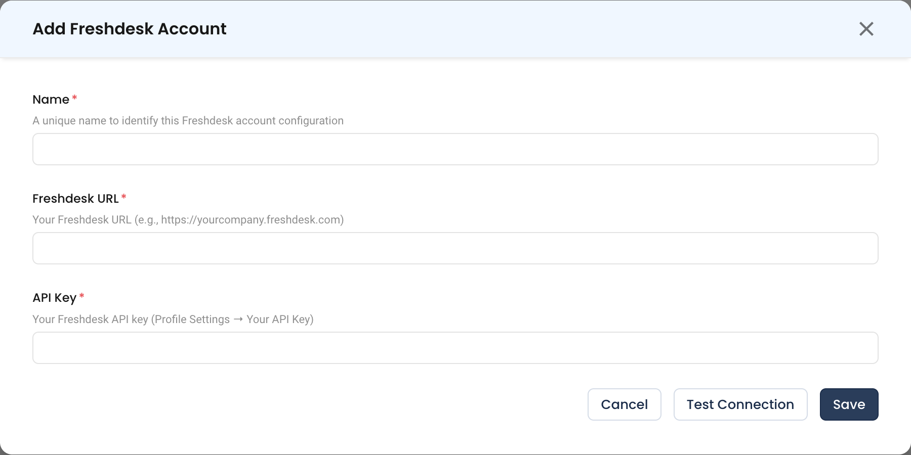

# Freshdesk

Connect Freshdesk so NudgeBee can create and track support tickets from events, recommendations and automations.

---

## Prerequisites

- A Freshdesk account NudgeBee can authenticate as, with permission to create and read tickets.
- That account's **API key**, found in Freshdesk under **Profile Settings → Your API Key**.

:::tip
Use a dedicated agent account rather than a personal one. Tickets NudgeBee raises are attributed to whichever account the key belongs to, and a personal key stops working when that person's access changes.
:::

---

## Step 1: Configure the Integration in NudgeBee

Navigate to **Admin** > **Integrations** > **Ticketing**, select **Freshdesk**, then click **Add Freshdesk Account**.

* **Name \*** (Required)
    * A unique name to identify this Freshdesk account configuration, e.g. `support-prod`.
* **Freshdesk URL \*** (Required)
    * Your Freshdesk domain, e.g. `https://yourcompany.freshdesk.com`.
* **API Key \*** (Required)
    * The API key from **Profile Settings → Your API Key** in Freshdesk.

## Step 2: Test and Save

Click **Test Connection**, then **Save**.

---

## What You Can Do Once Connected

- Create Freshdesk tickets manually from errors, events, recommendations and logs.
- Have [Autopilot](../../features/optimizations/autopilot/autopilot.md) open tickets automatically from pre-configured rules.
- Create tickets from an automation with the [ticket tasks](../../features/workflow-builder/ticket-tasks.md).

---

## Verify the Integration

1. Click **Test Connection** on the form — it should succeed before you save.
2. Create a ticket from a NudgeBee event and confirm it appears in Freshdesk.
3. Confirm the ticket is attributed to the expected agent account.

---

## Troubleshooting

| Symptom | Likely Cause | Fix |
|---------|-------------|-----|
| `401 Unauthorized` | Wrong API key, or the key belongs to a deactivated agent | Regenerate the key under **Profile Settings → Your API Key** and update the integration. |
| Connection test fails on the URL | Domain entered without scheme, or with a trailing path | Use the bare domain with `https://`, e.g. `https://yourcompany.freshdesk.com`. |
| Tickets are created but fields are empty | Required custom fields on the ticket form are not being supplied | See the [ticketing diagnostic guide](./ticket-integrations-troubleshooting.md). |
| `403 Forbidden` on create | The agent lacks ticket-creation permission | Grant the agent a role that permits creating tickets in the target group. |

---

## Helpful Links

- [Tickets overview](./index.md)
- [Troubleshoot ticketing integrations](./ticket-integrations-troubleshooting.md)
- [Ticket tasks in workflows](../../features/workflow-builder/ticket-tasks.md)
