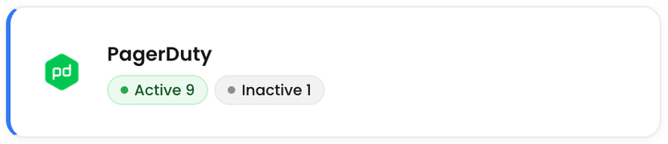
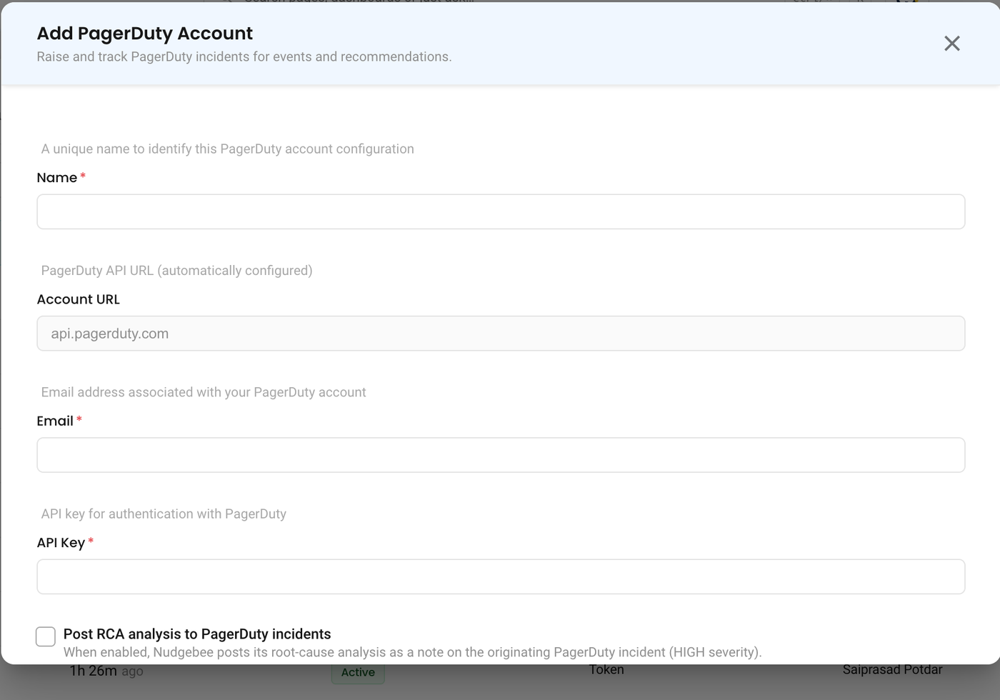

# PagerDuty

## Overview

NudgeBee integrates with PagerDuty for incident management. Events and alerts can automatically create PagerDuty incidents, triggering your on-call workflows and escalation policies.

---

## Prerequisites

Before configuring the integration, ensure you have:

- A **PagerDuty** account
- A PagerDuty **API key** (v2 REST API key)
- At least one **service** configured in PagerDuty

---

## Generate a PagerDuty API Key

1. In PagerDuty, navigate to **Integrations** > **Developer Tools** > **API Access Keys**.
2. Click **Create New API Key**.
3. Enter a description (e.g., `NudgeBee Integration`) and click **Create Key**.
4. Copy the API key — it will not be shown again.

:::note
Use a **General Access REST API Key** (not a read-only key). NudgeBee needs write access to create incidents and add notes.
:::

---

## PagerDuty Integration Configuration

Navigate to **Settings** > **Integrations** > **Tickets** tab and select **PagerDuty** to open the configuration form.

### Configuration Fields

* **API Key \*** (Required)
    * Your PagerDuty **REST API key** (v2).
    * This value is stored encrypted in NudgeBee.

* **URL**
    * PagerDuty API URL. Default: `api.pagerduty.com`.
    * Only change this if you have a custom PagerDuty endpoint.

* **Username**
    * Your PagerDuty username or email. Used as the "From" header when creating incidents.

**Credential validation**: on save, NudgeBee tests the connection by listing your PagerDuty services. If authentication fails, verify your API key is correct and has sufficient permissions.

---

## Capabilities

Once configured, NudgeBee can perform the following operations with PagerDuty:

| Operation | Description |
|-----------|-------------|
| **Create Incident** | Create incidents linked to a specific PagerDuty service |
| **Add Note** | Add notes to existing incidents |
| **Query Metadata** | Fetch available services and users for form population |

### Supported Incident Fields

| Field | Description |
|-------|-------------|
| **Title** | Incident title |
| **Description** | Incident body with event context |
| **Service** | Target PagerDuty service for the incident |

---

## Creating Incidents

Incidents can be created from NudgeBee in two ways:

- **Automatically** — from events, alerts, or autopilot runbook actions
- **Manually** — from the NudgeBee event detail view by clicking the ticket icon

When an incident is created, it triggers PagerDuty's on-call schedule, notifications, and escalation policies for the selected service.

---

## Verify the Integration

1. Save the configuration. If credentials are valid, the integration is created without errors.
2. Navigate to any event in NudgeBee.
3. Click the ticket creation option and select **PagerDuty**.
4. Verify the incident is created in your PagerDuty account under the selected service.

---

## Notes

- PagerDuty incidents are created in a **triggered** state, which activates on-call notifications.
- The username/email field is used as the `From` header in PagerDuty API calls (required by PagerDuty for incident creation).
- PagerDuty also supports a separate **webhook integration** for receiving PagerDuty alerts into NudgeBee. See the webhook configuration in **Integrations** > **Webhooks**.

---

## Troubleshooting PagerDuty Integration

### 1. `400 Bad Request: 'From' header is required`
* **Symptom**: Incident creation fails with a missing `From` header error.
* **Root Cause**: The PagerDuty REST API v2 requires the email address of a registered PagerDuty user in the `From` header for write operations.
* **Remediation**:
  1. Go to **Settings $\rightarrow$ Integrations $\rightarrow$ Tickets $\rightarrow$ PagerDuty**.
  2. Verify that the **Username / Email** field is populated with a valid user email that exists in your PagerDuty account.

---

### 2. `401 Unauthorized: Invalid Token`
* **Symptom**: Connection test returns `401 Unauthorized`.
* **Root Cause**: The API key is a scoped or user personal token that was revoked, or an Events API Integration Key was provided instead of a REST API Key.
* **Remediation**:
  1. Ensure you generated a **General Access REST API Key** (v2) from **Integrations $\rightarrow$ Developer Tools $\rightarrow$ API Access Keys**, not a service-specific Events API routing key.
  2. If your organization uses European PagerDuty service data residency, set the URL to `api.eu.pagerduty.com`.

---

### 3. Incident Not Triggering Escalation Policy
* **Symptom**: Incident appears in PagerDuty but on-call engineers are not alerted.
* **Remediation**:
  1. In PagerDuty, open the target **Service**.
  2. Verify that the service is linked to an active **Escalation Policy** and not in `Maintenance Mode`.
  3. Ensure the service's Incident Creation setting is set to **Create Incidents** (not alerts only).
