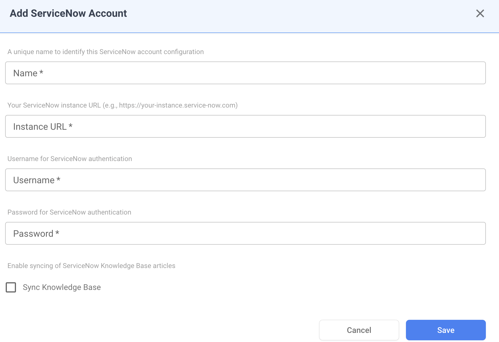

# ServiceNow

## Overview

NudgeBee integrates with ServiceNow for incident management. Events and alerts can automatically create ServiceNow incidents, and updates are synced as work notes.

---

## Prerequisites

Before configuring the integration, ensure you have:

- A **ServiceNow** instance (e.g., `yourinstance.service-now.com`)
- A ServiceNow **username** and **password** with permissions to create incidents
- Access to the **incident** table in your ServiceNow instance

---

## ServiceNow Integration Configuration

Navigate to **Settings** > **Integrations** > **Tickets** tab and select **ServiceNow** to open the configuration form.

<!--  -->

### Configuration Fields

* **URL \*** (Required)
    * Your ServiceNow instance URL (e.g., `yourinstance.service-now.com`).
    * Do not include `https://` — just the hostname.

* **Username \*** (Required)
    * A ServiceNow user account with permissions to create and update incidents.

* **Password \*** (Required)
    * The password for the ServiceNow user account.
    * This value is stored encrypted in NudgeBee.

* **Authentication Type**
    * The authentication method to use. Default: `token`.

* **Sync Knowledge Base**
    * Enable this to sync your ServiceNow knowledge base articles into NudgeBee for AI-assisted troubleshooting.

<!--  -->

**Credential validation**: on save, NudgeBee tests the connection by querying the incident table. If authentication fails, verify your URL, username, and password are correct.

---

## Capabilities

Once configured, NudgeBee can perform the following operations with ServiceNow:

| Operation | Description |
|-----------|-------------|
| **Create Incident** | Create incidents with title, description, and urgency |
| **Add Work Notes** | Add internal work notes to existing incidents |

### Supported Incident Fields

| Field | Description |
|-------|-------------|
| **Short Description** | Incident title |
| **Description** | Detailed incident description with event context |
| **Urgency** | Mapped from NudgeBee priority |

### Priority Mapping

| NudgeBee Priority | ServiceNow Urgency |
|--------------------|---------------------|
| High | 1 - High |
| Medium | 2 - Medium |
| Low | 3 - Low |

---

## Knowledge Base Sync

When **Sync Knowledge Base** is enabled, NudgeBee imports your ServiceNow knowledge base articles. These articles are then used by the AI engine to provide context-aware troubleshooting recommendations based on your organization's documented procedures and solutions.

---

## Creating Incidents

Incidents can be created from NudgeBee in two ways:

- **Automatically** — from events, alerts, or autopilot runbook actions
- **Manually** — from the NudgeBee event detail view by clicking the ticket icon

Each incident includes:
- A short description derived from the event title
- A detailed description with full event context
- Urgency set based on the event priority

---

## Verify the Integration

1. Save the configuration. If credentials are valid, the integration is created without errors.
2. Navigate to any event in NudgeBee.
3. Click the ticket creation option and select **ServiceNow**.
4. Verify the incident is created in your ServiceNow instance with the correct fields.

---

## Notes

- ServiceNow integration is focused on the **incident** table. Other ServiceNow tables (change requests, problems, etc.) are not currently supported.
- Work notes are used for comments (internal notes visible to IT staff), not customer-facing comments.
- The auto-generated incident URL uses the `sys_id` for direct linking back to ServiceNow.
