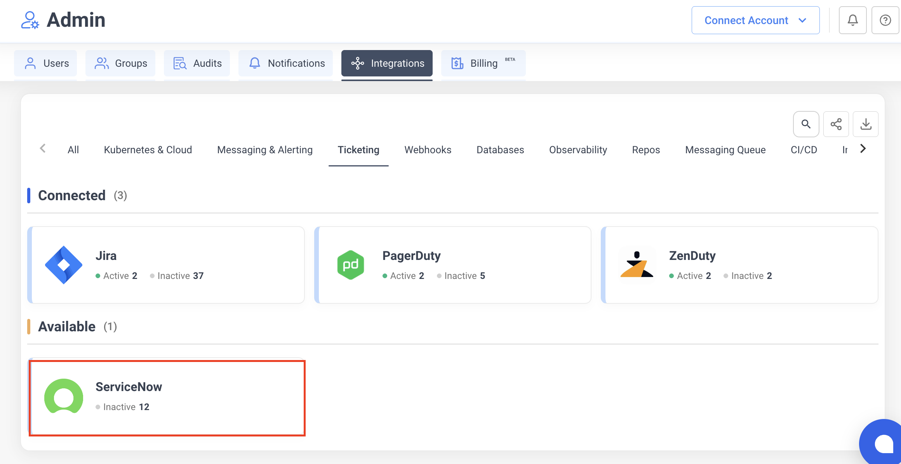

# ServiceNow

Integrate NudgeBee with ServiceNow for ticket management. Create ServiceNow incidents directly from NudgeBee events, and optionally sync your ServiceNow Knowledge Base articles for AI-assisted troubleshooting.

---

## Prerequisites

Before configuring the integration, ensure you have:

- A **ServiceNow** instance (e.g., `https://your-instance.service-now.com`)
- A ServiceNow **username** and **password** with permissions to create incidents
- Access to the **incident** table in your ServiceNow instance

---

## Step 1: Add the ServiceNow Account in NudgeBee

1. Navigate to **Settings** > **Integrations** > **Ticketing** tab.
2. Click the **ServiceNow** card.

3. Fill in the configuration:

   - **Name** — a unique name to identify this ServiceNow account configuration (e.g., `Production ServiceNow`).
   - **Instance URL** — your ServiceNow instance URL (e.g., `https://your-instance.service-now.com`).
   - **Username** — a ServiceNow user account with permissions to create and update incidents.
   - **Password** — the password for the ServiceNow user account. This value is stored encrypted in NudgeBee.
   - **Sync Knowledge Base** — enable this checkbox to sync your ServiceNow Knowledge Base articles into NudgeBee for AI-assisted troubleshooting.

4. Click **Save**.

**Credential validation**: on save, NudgeBee tests the connection by querying the incident table. If authentication fails, verify your instance URL, username, and password are correct.

---

## Step 2: Create Incidents from NudgeBee

Incidents can be created from NudgeBee in two ways:

- **Automatically** — from events, alerts, or autopilot runbook actions.
- **Manually** — from the NudgeBee event detail view by clicking the ticket icon and selecting **ServiceNow**.

Each incident includes:
- A **short description** derived from the event title.
- A **detailed description** with full event context.
- **Urgency** set based on the event priority.

---

## How It Works

### Capabilities

Once configured, NudgeBee can perform the following operations with ServiceNow:

| Operation | Description |
|-----------|-------------|
| **Create Incident** | Create incidents with title, description, and urgency |
| **Add Work Notes** | Add internal work notes to existing incidents |

### Supported Incident Fields

| Field | Description |
|-------|-------------|
| **Short Description** | Incident title |
| **Description** | Detailed incident description with event context |
| **Urgency** | Mapped from NudgeBee priority |

### Priority Mapping

| NudgeBee Priority | ServiceNow Urgency |
|--------------------|---------------------|
| High | 1 - High |
| Medium | 2 - Medium |
| Low | 3 - Low |

### Knowledge Base Sync

When **Sync Knowledge Base** is enabled, NudgeBee imports your ServiceNow Knowledge Base articles. These articles are then used by the AI engine to provide context-aware troubleshooting recommendations based on your organization's documented procedures and solutions.

---

## Verify the Integration

1. Save the configuration. If credentials are valid, the integration is created without errors.
2. Navigate to any event in NudgeBee.
3. Click the ticket creation option and select **ServiceNow**.
4. Verify the incident is created in your ServiceNow instance with the correct fields.

---

## Troubleshooting

| Issue | Resolution |
|-------|------------|
| Authentication fails on save | Verify your instance URL, username, and password are correct. Ensure the user has permissions to query the incident table. |
| Incidents not being created | Confirm the ServiceNow integration is active and the user account has `incident_create` permissions. |
| Knowledge Base articles not syncing | Ensure the **Sync Knowledge Base** checkbox is enabled and the user has read access to the Knowledge Base tables. |
| Work notes not appearing | Verify the user account has permissions to update incidents and add work notes. |
