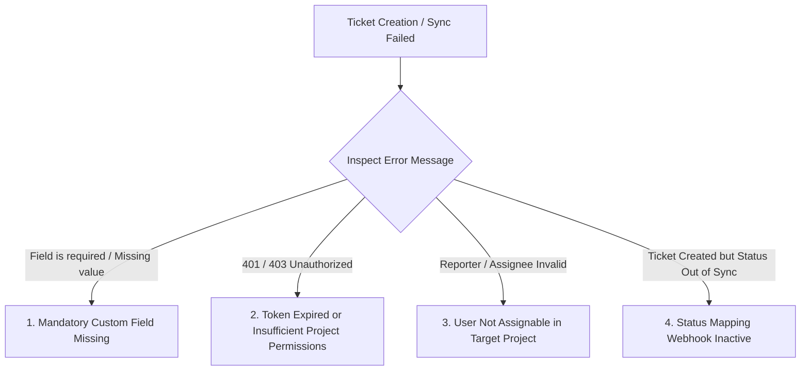

# Troubleshoot Ticketing Integrations & Ticket Creation Failures

NudgeBee integrates with **Jira**, **ServiceNow**, **GitHub Issues**, **GitLab**, and **PagerDuty** to automate incident creation and bidirectional status tracking. This guide diagnoses common ticket creation failures, custom field mapping errors, and sync issues.

---

## 1. Diagnostic Decision Tree for Ticket Failures

---

## 2. Five Common Ticket Creation Failures & Solutions

---

### Failure 1: Mandatory Jira Custom Fields Missing
* **Symptom**: Ticket creation fails with `Jira API Error 400: Field '<field_name>' is required`.
* **Cause**: Your Jira project has required fields (e.g. *Component/s*, *Root Cause Category*, *Environment*, *Team*) that were not filled in NudgeBee's default ticket template.
* **Remediation**:
  1. In NudgeBee Console, go to **Settings $\rightarrow$ Integrations $\rightarrow$ Tickets $\rightarrow$ Jira**.
  2. Click **Edit Ticket Field Mapping**.
  3. Map the required Jira fields to template variables (e.g. map `Environment` $\rightarrow$ `{{ event.annotations.environment }}` or provide a static fallback value).
  4. Save changes and retry ticket creation.

---

### Failure 2: ServiceNow Incident Creation Fails (`Table Not Found` or `403 Forbidden`)
* **Symptom**: ServiceNow returns `403 Forbidden: User not authorized to insert into table incident`.
* **Cause**: The ServiceNow integration service account lacks the `itil` or `incident_manager` role, or Access Control Lists (ACLs) restrict API writes to the `incident` table.
* **Remediation**:
  In ServiceNow Admin Console, assign the `itil` role and ensure REST API write access is enabled on the target table.

---

### Failure 3: Reporter or Assignee is Not Assignable
* **Symptom**: `Jira API Error: User '<email>' cannot be assigned issues in project '<PROJ>'`.
* **Cause**: In Jira Project Settings $\rightarrow$ Permissions, the user account associated with the NudgeBee API token lacks the **Assignable User** permission.
* **Remediation**:
  Grant the integration user **Assignable User** and **Create Issues** permissions in the target project's permission scheme.

---

### Failure 4: Bidirectional Status Synchronization Not Updating
* **Symptom**: When a ticket is closed in Jira or ServiceNow, the corresponding NudgeBee incident remains `OPEN`.
* **Cause**: The incoming webhook from Jira/ServiceNow back to NudgeBee is either not configured or blocked by a corporate firewall.
* **Remediation**:
  1. In Jira Settings $\rightarrow$ System $\rightarrow$ Webhooks, verify that the NudgeBee Webhook URL is configured with the `jira:issue_updated` event filter.
  2. Verify that status mapping rules are configured (e.g. `Done / Closed` $\rightarrow$ `RESOLVED`).

---

## 3. NuBi Prompts for Ticketing Diagnostics

Ask NuBi in chat:
- *"Diagnose why ticket creation failed for incident [incident-id]."*
- *"Show the raw API error returned by Jira during the last ticket creation attempt."*
- *"Test ticket creation in project PROD using the Jira integration."*
