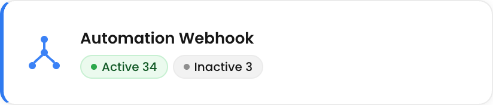
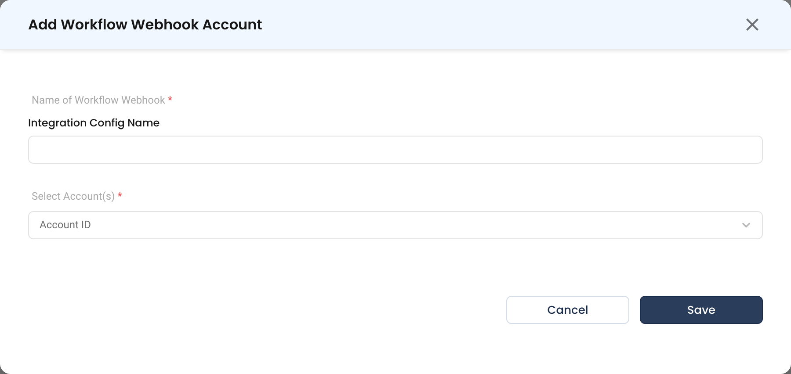

# Automation Webhook

The Automation Webhook turns any system that can send an HTTP request into a trigger for a NudgeBee [workflow](../../features/workflow-builder/index.md). CI pipelines, deployment tools, internal scripts, ticketing systems and provider alerting can all start an automation this way, and the request body is available to every task in the run.

In saved workflow JSON this integration type appears as `workflow_webhook`.

:::info
This is different from the provider webhooks on this page. [Datadog](./datadog_webhook.md), [Dynatrace](./dynatrace_webhook.md) and the rest parse a known alert format and create an **enriched event or incident**. An Automation Webhook parses nothing — it **runs a workflow** and hands it the raw payload.
:::

---

## How It Works

```
External system (CI, script, alerting tool)
        │
        ▼
HTTP POST to the generated webhook URL
        │
        ▼
NudgeBee matches the URL to a workflow_webhook integration
        │
        ├── Evaluates the trigger's filter expression (if set)
        └── Starts the linked workflow, exposing the body as webhook_payload
```

---

## Step 1: Create the Integration

You can create it up front, or let the workflow editor create it for you.

**From the integrations page** — Navigate to **Admin** > **Integrations** > **Webhooks**, select **Automation Webhook**, then click **Add Workflow Webhook Account**.



* **Name of Workflow Webhook \*** (Required)
    * The integration name, also used by the workflow's trigger. Must match `^[a-zA-Z0-9._-]+$` — letters, numbers, dots, hyphens and underscores only, maximum 200 characters.
    * Name it after the source system, e.g. `github_ci_webhook` or `jira-service-desk-wb`.
* **Select Account(s) \*** (Required)
    * One or more NudgeBee accounts this webhook serves. Selecting several lets a single endpoint fan out across clusters.

**From the workflow editor** — Add a [Webhook trigger](../../features/workflow-builder/triggers.md#webhook-trigger) to a workflow and enter an integration name in the sidebar. NudgeBee creates the integration for you, named `wf-<workflow-id>-<name>`.



## Step 2: Copy the Webhook URL

The URL is generated once the integration is **linked to a workflow**, and is shown in that workflow's Webhook trigger configuration — click the copy icon beside it. There is no URL to copy on the integrations page itself, because the endpoint is bound to the workflow, not to the integration alone.

## Step 3: Configure the Sender

Point your external system at the copied URL with an HTTP `POST` and a JSON body. Any JSON shape is accepted; NudgeBee does not require a schema.

## Step 4: Filter Which Requests Run the Workflow

A webhook that fires on every request usually runs too often. Set a **Filter Expression** on the trigger — a template expression evaluated against the request body, which runs the workflow only when it renders to `true` or `1`. The body is available as `webhook_payload`, and the expression is limited to 500 characters.

| Expression | Behavior |
|-----------|----------|
| `{{ webhook_payload.action == "opened" }}` | Only when the payload's `action` is `opened` |
| `{{ webhook_payload.repository.name == "my-repo" }}` | Only for a specific repository |
| `{{ webhook_payload.status == "failure" }}` | Only for failed CI runs |

See [workflow triggers](../../features/workflow-builder/triggers.md#webhook-trigger) for the full trigger reference.

---

## Using the Payload in Tasks

The request body is exposed to the run as `webhook_payload`, so tasks can read fields from it directly — for example `{{ webhook_payload.repository.full_name }}` in a [notification task](../../features/workflow-builder/notification-tasks.md), or as an input to a [ticket task](../../features/workflow-builder/ticket-tasks.md). See [templating](../../features/troubleshooting/templating.md) for expression syntax.

---

## Verify the Integration

1. Save the workflow with its Webhook trigger linked, so the URL is generated.
2. Send a test request from your machine or the sending system:

   ```bash
   curl -X POST '<generated-webhook-url>' \
     -H 'Content-Type: application/json' \
     -d '{"action":"opened","repository":{"name":"my-repo"}}'
   ```

3. Open the workflow's run history. A run should appear within a few seconds.
4. Open the run and confirm the tasks that read `webhook_payload` received the fields you sent.

:::tip
Test with the filter expression removed first. If the run appears without a filter and not with one, the expression is the problem, not the endpoint.
:::

---

## Troubleshooting

| Symptom | Likely Cause | Fix |
|---------|-------------|-----|
| No webhook URL is shown | The integration is not linked to a workflow yet | Save the workflow with the integration selected in its Webhook trigger; the URL appears afterwards. |
| Request accepted, workflow never runs | The filter expression did not render `true` | Remove the filter and retry. Then check the expression against the payload you actually send — a missing key renders empty, not `true`. |
| Integration name is rejected | Name contains a space or another disallowed character | Use only letters, numbers, dots, hyphens and underscores, up to 200 characters. |
| Tasks see an empty `webhook_payload` | The request had no JSON body, or the wrong content type | Send `Content-Type: application/json` with a JSON object body. |
| Workflow runs twice per event | Two integrations, or two workflows, are bound to the same sender | Check whether the workflow editor auto-created a `wf-...` integration alongside one you made yourself, and disable the one you do not want. |
| Requests never arrive | The NudgeBee URL is not reachable from the sender | Confirm the endpoint is reachable from the sending system's network. |

---

## Helpful Links

- [Workflow triggers — Webhook trigger](../../features/workflow-builder/triggers.md#webhook-trigger)
- [Workflow builder overview](../../features/workflow-builder/index.md)
- [Templating reference](../../features/troubleshooting/templating.md)
- [Create an event automation](../../features/workflow-builder/create-event-automation.md)
