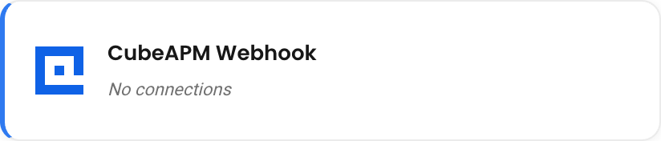
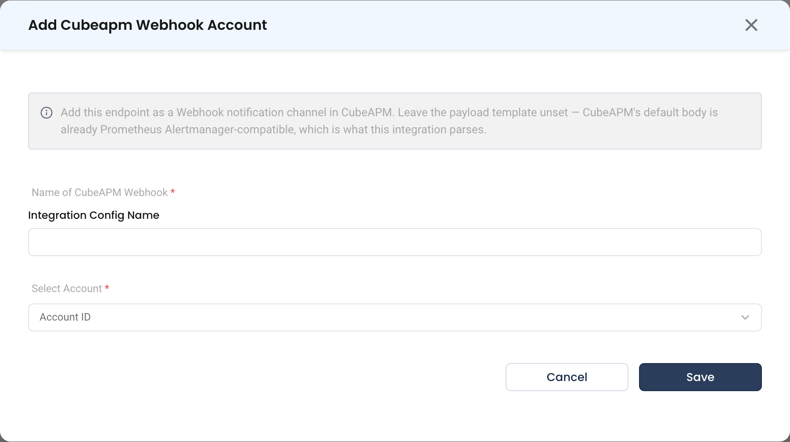

# CubeAPM Webhook

The CubeAPM webhook integration lets CubeAPM push alerts into NudgeBee. Each alert becomes a NudgeBee event that you can triage, correlate with cluster telemetry, and use to trigger automations. When the alert resolves in CubeAPM, NudgeBee closes the event.

CubeAPM sends its webhook notifications in the Prometheus Alertmanager format, and NudgeBee reads that format directly. No custom payload template is needed.

---

## Step 1: Create the Webhook in NudgeBee

1. Navigate to **Admin** > **Integrations** > **Webhooks**.
2. Select **CubeAPM Webhook** and click **Add Cubeapm Webhook Account**.
3. Fill in the form:
   * **Integration Config Name \*** (Required): a descriptive name, for example `cubeapm-prod`.
   * **Account ID \*** (Required): the NudgeBee account that should receive these events.
4. Click **Save**.
5. Back on the CubeAPM Webhook list, find the new row and copy the webhook URL from its **URL** column, using the copy button.





The URL has this form:

```
https://<your-nudgebee-domain>/api/webhooks/cubeapm?token=<generated-token>
```

:::caution
The `token` query parameter authenticates the sender. Treat the full URL as a secret: anyone who holds it can create events in your tenant. If it leaks, delete the integration and create a new one to rotate the token.
:::

:::tip Add context with query parameters
Any extra query parameter you append to the URL becomes a label on every event it delivers, for example `&env=production&cluster=eu-west-1`. Labels that CubeAPM already sets take precedence. The `token` parameter is never copied into a label.
:::

---

## Step 2: Point CubeAPM at the URL

In CubeAPM, add a **Webhook** notification channel and set its URL to the NudgeBee webhook URL from Step 1, token included.

- **Leave the payload template unset.** CubeAPM's default body is already Alertmanager-compatible, and that is what NudgeBee parses. A custom template that drops the `alerts` array makes every delivery fail.
- Route the alert rules whose notifications you want in NudgeBee to this channel.
- Make sure CubeAPM also sends **resolved** notifications to the channel, so that NudgeBee can close events.

> **Reference:** [CubeAPM documentation](https://docs.cubeapm.com/)

---

## How Alerts Are Mapped

Each entry in the payload's `alerts` array becomes one event. The payload's shared labels and annotations are merged into each alert, but they never overwrite the alert's own values.

| NudgeBee Event Field | Taken From |
|----------------------|-----------|
| Title | `annotations.summary`, else the `alertname` label |
| Description | `annotations.description` |
| Event type / rule name | `alertname` |
| Severity | The `severity` label (default: `warning`). See the table below. |
| Status | `firing` or `resolved` |
| Deduplication key | The alert's `fingerprint` |
| Link | `generatorURL`, else `externalURL` |
| Tags | The `cluster`, `namespace`, `service`, `job`, and `env` labels |

| `severity` Label | NudgeBee Priority |
|------------------|-------------------|
| `critical`, `high` | High |
| `warning`, `warn`, `medium` | Medium |
| `low` | Low |
| `info`, `none` | Info |
| `debug` | Debug |
| anything else | Low |

**Workload linking.** NudgeBee links the event to a workload using the standard Kubernetes labels on the alert:

- The workload comes from `deployment`, `statefulset`, `daemonset`, `cronjob`, `pod`, or `service`, among others.
- The namespace comes from `namespace`.
- When an alert carries a `service` label, the event is linked to that service, even if the alert also names a pod.

**Evidence.** Each event carries a **CubeAPM alert** table of the alert's labels. When CubeAPM includes them in the payload, the event also carries:

- **CubeAPM Sample Log**: the matching log line
- **CubeAPM Alert Chart**: the rendered chart image

**Alert rules.** Every alert name NudgeBee receives is also registered as an event rule, with the source `cubeapm_webhook`. CubeAPM alerts therefore appear in rule management next to your other alert sources.

**Repeats and resolution:**

- A repeat notification for the same `fingerprint` updates the existing event. It does not create a new one.
- A `resolved` notification closes the event.

---

## Step 3: Verify

1. Trigger a test notification from CubeAPM, or wait for a real alert to fire.
2. In NudgeBee, open **Troubleshoot** > **Events**. The event should appear within a few seconds.
3. Open it and confirm that the alert name and severity carried across, and that the affected workload is linked.
4. If nothing appears, open the integration's row menu in **Admin** > **Integrations** > **Webhooks** > **CubeAPM Webhook** and choose **Activity Log**. It lists every delivery the webhook received, and marks the ones that failed or were skipped.

---

## Troubleshooting

| Symptom | Likely Cause | Fix |
|---------|-------------|-----|
| No event appears, and the Activity Log is empty | CubeAPM cannot reach the NudgeBee URL | Confirm that the NudgeBee endpoint is reachable from CubeAPM, and check egress rules on both sides |
| HTTP `400` with `webhook validation failed` | The `token` is missing or wrong, or the integration is disabled | Re-copy the full URL from the **URL** column. The token is part of the query string and is easy to drop when pasting. |
| The Activity Log shows `payload has no 'alerts' array` | The channel uses a custom payload template | Remove the template so that CubeAPM sends its default body |
| Event appears, but no workload is linked | The alert carries no workload or namespace labels | Add `namespace` plus `deployment` (or `service`) labels to the CubeAPM alert rule |
| Events never close | CubeAPM sends only firing notifications | Enable resolved notifications on the channel |
| `only one 'cubeapm_webhook' integration per account is supported` | The account already has a CubeAPM Webhook | Reuse the existing webhook's URL, or remove it first |

---

## Helpful Links

- [Webhooks overview](./index.md)
- [CubeAPM integration (logs, metrics, traces)](../Observability/cubeapm.md)
- [Workflow triggers](../../features/workflow-builder/triggers.md)
