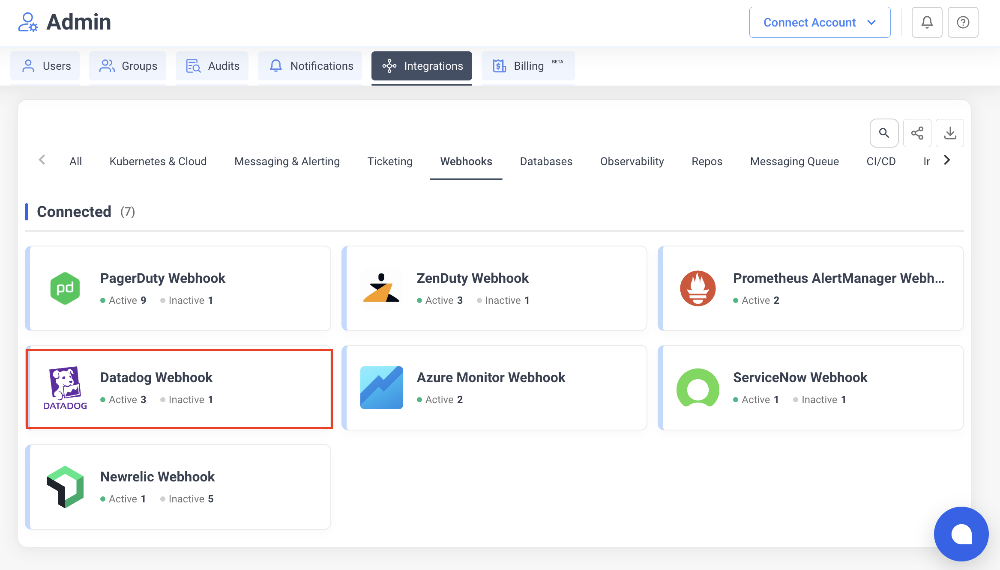
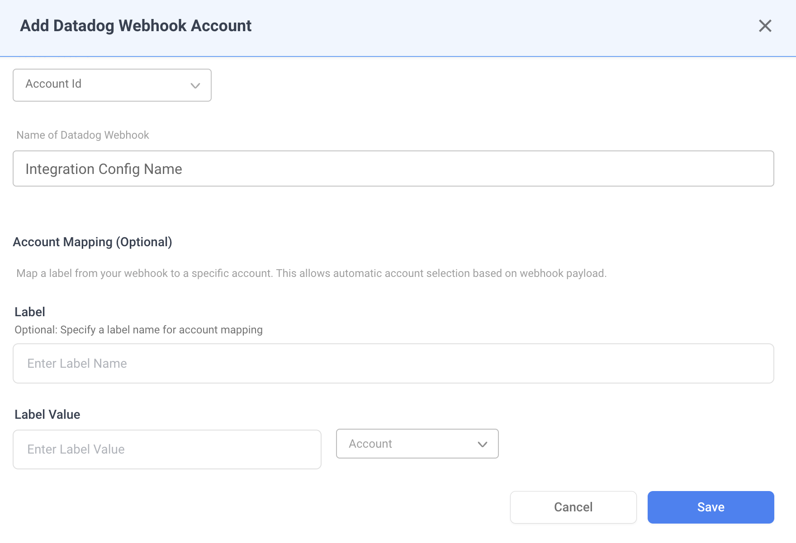
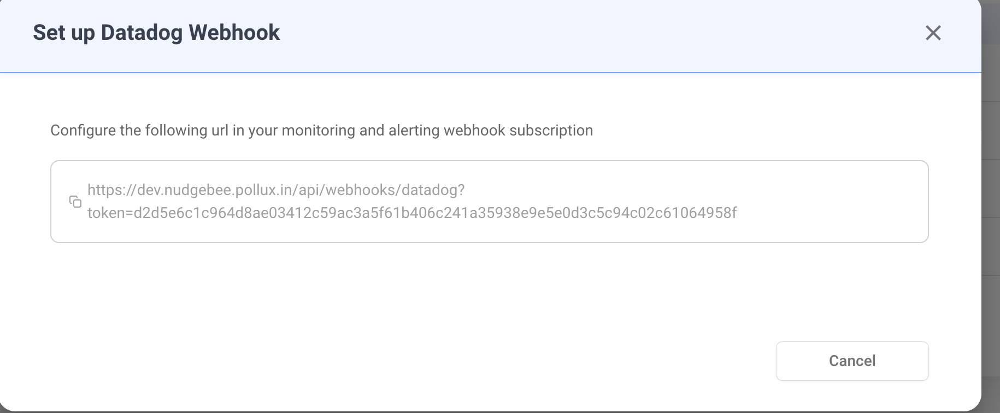

# Datadog Webhook

Receive Datadog monitor alert notifications directly into NudgeBee. When a monitor triggers, NudgeBee automatically creates an event enriched with related logs, traces, and metric details from your Datadog account.

---

## Step 1: Create the Webhook in NudgeBee

1. Navigate to **Integrations** > **Webhooks** tab.
2. Click the **Datadog Webhook** card.



3. Fill in the configuration:
   - **Integration Config Name** — a descriptive name (e.g., `Production Alerts`).
   - **Account** — select the NudgeBee account to receive events.



4. Click **Save**. NudgeBee generates a unique webhook URL.

5. **Copy the webhook URL** from the dialog. It follows this format:

```
https://<your-nudgebee-domain>/api/webhooks/datadog?token=<generated-token>
```



Keep this URL — you will paste it into Datadog in the next step.

---

## Step 2: Configure Datadog Webhook Integration

1. In Datadog, go to **Integrations** and search for **Webhooks**.
2. Click on the **Webhooks** integration tile and then click **New**.
3. Configure the webhook:
   - **Name**: enter a descriptive name (e.g., `nudgebee`).
   - **URL**: paste the NudgeBee webhook URL from Step 1.
   - **Custom Headers**: none required (authentication is handled via the `token` query parameter).

4. Set the **Payload** to the following JSON:

```json
{
    "id": "$ID",
    "last_updated": "$LAST_UPDATED",
    "event_type": "$EVENT_TYPE",
    "title": "$EVENT_TITLE",
    "date": "$DATE",
    "org": {
        "id": "$ORG_ID",
        "name": "$ORG_NAME"
    },
    "body": "$EVENT_MSG",
    "alert": {
        "alert_id": "$ALERT_ID",
        "alert_metric": "$ALERT_METRIC",
        "alert_query": "$ALERT_QUERY",
        "alert_status": "$ALERT_STATUS",
        "alert_scope": "$ALERT_SCOPE",
        "alert_transition": "$ALERT_TRANSITION",
        "alert_type": "$ALERT_TYPE",
        "alert_metric_namespace": "$METRIC_NAMESPACE"
    },
    "incident": {
        "incident_public_id": "$INCIDENT_PUBLIC_ID",
        "incident_severity": "$INCIDENT_SEVERITY",
        "incident_status": "$INCIDENT_STATUS",
        "incident_url": "$INCIDENT_URL",
        "incident_uuid": "$INCIDENT_UUID",
        "incident_message": "$INCIDENT_MSG",
        "incident_title": "$INCIDENT_TITLE",
        "incident_slack_channel_id": "#inc-$INCIDENT_PUBLIC_ID-$INCIDENT_TITLE",
        "incident_integrations": $INCIDENT_INTEGRATIONS,
        "incident_fields": $INCIDENT_FIELDS
    },
    "event": {
        "aggreg_key": "$AGGREG_KEY",
        "event_id": "ID",
        "event_url": "$LINK"
    }
}
```

5. Click **Save** to create the webhook.

---

## Step 3: Add the Webhook to a Monitor

1. In Datadog, go to **Monitors** > **Manage Monitors**.
2. Create a new monitor or edit an existing one.
3. In the **Notify your team** section, add the webhook by typing `@webhook-<name>` (e.g., `@webhook-nudgebee`).
4. Save the monitor.

> For more details on Datadog webhook integrations, see [Datadog's documentation](https://docs.datadoghq.com/integrations/webhooks/).

---

## How It Works

When Datadog sends a webhook payload to NudgeBee, the following processing occurs:

### State Mapping

| Datadog Alert Transition | NudgeBee Status |
|--------------------------|-----------------|
| `Triggered`, `Re-Triggered` | **Firing** |
| `Warn` | **Firing** |
| `Recovered` | **Resolved** |
| `No Data` | **Firing** |

### Priority Mapping

| Datadog Priority | NudgeBee Priority |
|------------------|-------------------|
| `P1`, `P2` | High |
| `P3` | Medium |
| `P4`, `P5` | Low |

### Automatic Evidence Collection

If a [Datadog observability integration](../Observability/datadog) is also configured for the same account, NudgeBee automatically enriches each alert event with:

1. **Related Logs** — fetched from Datadog for the impacted host or service, covering a 30-minute window before and after the alert trigger time.
2. **Related Traces** — APM traces for the impacted service in the same time window.
3. **Metric Details** — metric data related to the alert query, including:
   - For APM services: error rate, latency, and request throughput.
   - For infrastructure hosts: CPU, memory, and disk utilization.

### Event Deduplication

Events are deduplicated using a fingerprint derived from the monitor ID and aggregation key (`<monitorId>-<aggregKey>`). Repeated webhook calls for the same alert update the existing event instead of creating duplicates.

---

## Verify the Integration

1. In Datadog, trigger a test alert (or use **Test Notifications** from the monitor edit page).
2. Confirm the monitor is configured with the `@webhook-nudgebee` notification.
3. In NudgeBee, navigate to **Events** and verify the alert appears with:
   - Correct title and priority
   - Alert details evidence attached
   - Related logs and traces (if observability integration is configured)

---

## Troubleshooting

| Issue | Resolution |
|-------|------------|
| Webhook URL returns 401 | Verify the `token` query parameter in the URL is correct. Regenerate the integration if needed. |
| Events created but no logs/traces attached | Ensure a [Datadog observability integration](../Observability/datadog) is configured for the same NudgeBee account. |
| Events not appearing at all | Check that the Datadog monitor includes `@webhook-<name>` in its notification settings and that the webhook integration is active. |
| Duplicate events | Expected behavior — NudgeBee deduplicates by `monitorId-aggregKey`. State updates (e.g., Triggered → Recovered) update the existing event. |
