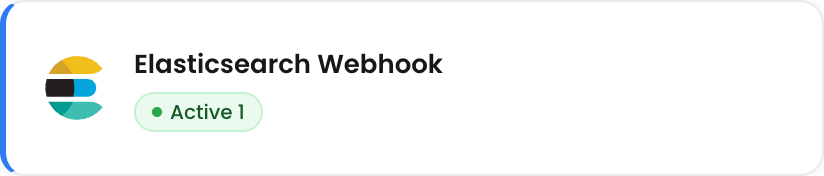
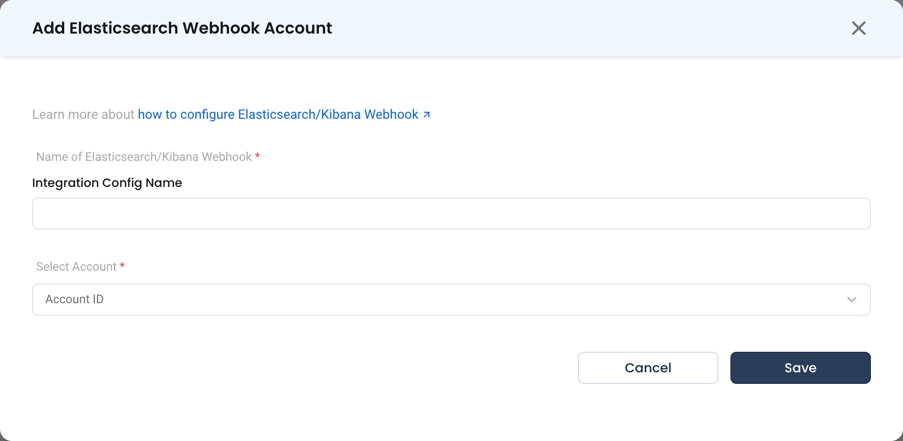

# Elasticsearch / Kibana Webhook

The Elasticsearch / Kibana webhook integration lets Elasticsearch / Kibana push alerts into NudgeBee. Each alert becomes a NudgeBee event that can be triaged, correlated with cluster telemetry, and used to trigger automations.

---

## Step 1: Create the Webhook in NudgeBee

1. Navigate to **Admin** > **Integrations** > **Webhooks**.
2. Select **Elasticsearch Webhook** and click **Add Elasticsearch Webhook Account**.
3. Fill in the form:
   * **Name of Elasticsearch / Kibana Webhook \*** (Required) — a descriptive name, e.g. `elasticsearch / kibana-prod`.
   * **Select Account \*** (Required) — the NudgeBee account that should receive these events.
4. Click **Save**.

NudgeBee generates a unique webhook URL for the integration, in the same form used by the other inbound webhooks:

```
https://<your-nudgebee-domain>/api/webhooks/elasticsearch?token=<generated-token>
```

Copy the URL exactly as the integration shows it. The path segment is the provider name — lowercase, no `_webhook` suffix — and nothing may follow it. `elasticsearch_webhook` is the integration type NudgeBee stores internally, not a URL you can post to; a URL that does not match the route above is answered by the NudgeBee web app with a 404 and never reaches the alert pipeline.

5. **Copy the webhook URL.** You will paste it into Elasticsearch / Kibana in the next step.

:::caution
The `token` query parameter authenticates the sender. Treat the full URL as a secret — anyone holding it can create events in your tenant. If it leaks, delete the integration and create a new one to rotate the token.
:::

---





## Step 2: Point Elasticsearch / Kibana at the URL

Kibana has no fixed alert format: a webhook action sends exactly the body you give it. Setting this up is two parts — a connector, and an action with a JSON body on each rule.

### Create the connector

In Kibana, open **Stack Management** > **Connectors** and create a **Webhook** connector:

- **Method**: `POST`
- **URL**: the NudgeBee webhook URL from Step 1, token included
- **Authentication**: none — the token in the URL authenticates the request
- **Header**: `Content-Type: application/json`

### Add the actions to each rule

On every rule whose alerts you want in NudgeBee, add the connector as an action twice.

**1. When the rule fires.** Set the action frequency to **For each alert**, run it on **Query matched** (or the rule type's own active action group), and paste this body:

```json
{
  "rule": {
    "id": "{{rule.id}}",
    "name": "{{rule.name}}",
    "type": ".es-query",
    "url": "{{rule.url}}"
  },
  "alert": {
    "id": "{{alert.id}}",
    "uuid": "{{alert.uuid}}",
    "action_group": "{{alert.actionGroup}}"
  },
  "status": "firing",
  "severity": "high",
  "title": "{{rule.name}}",
  "message": "{{context.message}}",
  "value": "{{context.value}}",
  "conditions": "{{context.conditions}}",
  "link": "{{context.link}}",
  "timestamp": "{{date}}",
  "tags": "{{rule.tags}}"
}
```

**2. When the rule recovers.** Add a second action on **Recovered** with the same body and `"status": "resolved"`. Without it, alerts stay open in NudgeBee.

The same body works for every rule. Only `severity` is yours to choose per rule.

| Field | Required | What NudgeBee does with it |
|-------|----------|----------------------------|
| `rule.name` | Yes | Shown as the alert's rule, and used to find the rule in NudgeBee. |
| `rule.id`, `alert.id` | Yes | Together they identify one alert. They must be identical in the firing and the recovered body, or the recovery closes nothing. |
| `alert.uuid` | No | Kibana's id for one firing of the alert: it changes each time the alert recovers and fires again. Include it so NudgeBee can tell a new firing from a repeat of the same one. Available from Kibana 8.8. |
| `status` | Yes | `firing` or `resolved`. If left out, a `recovered` action group counts as resolved. |
| `severity` | No | `critical` or `high`, `warning` or `medium`, `low`, `info`. Defaults to `low`. |
| `title`, `message`, `value`, `conditions` | No | Shown on the event. `conditions` becomes the rule's expression. |
| `link` | No | Link back to Kibana. Kept only when it is a full URL — see the note below. |
| `timestamp` | No | When the alert fired. Defaults to the time of arrival. |
| `tags` | No | The rule's tags. |
| `rule.type` | No | `.es-query` lists the rule as a log rule. Leave it out for other rule types. |
| `labels` | No | An object of extra labels, for example `{ "namespace": "prod" }`. |

:::note
Kibana only produces full URLs when `server.publicBaseUrl` is set in `kibana.yml`. Without it `{{rule.url}}` is empty and `{{context.link}}` is a path, so the event carries no link.
:::

### How the workload is found

`{{alert.id}}` holds the values the rule is grouped by, and NudgeBee looks each one up in the cluster inventory:

- **Grouped by pod name** — the alert is linked to the pod's workload and namespace.
- **Grouped by container or service name** — the alert is linked to the workload with that name.
- **Grouped by several fields** — every value is tried, so a rule grouped by container and pod is linked through the pod.
- **Not grouped** — there is nothing to look up. Name the workload with a label instead.

Two cases need a label:

- **The same name exists in more than one namespace.** Add `"labels": { "namespace": "<namespace>" }`, otherwise the alert is not tied to a namespace.
- **You want to name the workload yourself.** Add one of `pod`, `deployment`, `statefulset` or `daemonset` to `labels`. A label naming a workload wins over the group values.

:::note
On older server releases the rule is shown by its Kibana rule ID, and a rule grouped by several fields is not linked to a workload. Upgrade to get the behavior described here.
:::

> **Reference:** [Kibana webhook connector](https://www.elastic.co/guide/en/kibana/current/webhook-action-type.html) · [Kibana rule action variables](https://www.elastic.co/guide/en/kibana/current/rule-action-variables.html)

---

## Step 3: Verify

1. Trigger a test notification from Elasticsearch / Kibana, or wait for a real alert to fire.
2. In NudgeBee, open **Troubleshoot** > **Events**. The event should appear within a few seconds.
3. Open it and confirm the alert name and severity carried across, and that the impacted workload is linked where the payload identifies one.

---

## Troubleshooting

| Symptom | Likely Cause | Fix |
|---------|-------------|-----|
| No event appears | Elasticsearch / Kibana cannot reach the NudgeBee URL | Confirm the NudgeBee endpoint is reachable from Elasticsearch / Kibana's notification sender. Check egress rules on both sides. |
| `401` or `403` from the endpoint | The `token` parameter is missing or wrong | Re-copy the full URL from the integration — the token is part of the query string, and is easy to drop when pasting. |
| The rule shows as an ID instead of its name | The body carries no `rule.name` | Use the body from Step 2. |
| Event appears with no workload linked | The rule is not grouped by a pod, container or service name, or the name exists in more than one namespace | Group the rule by one of those fields, or add a `namespace` or workload label as described in Step 2. |
| Duplicate events for one alert | Two notification rules point at the same URL | Consolidate them in Elasticsearch / Kibana, or use separate integrations per environment. |
| Alerts never resolve in NudgeBee | The rule has no **Recovered** action, or its body uses a different `rule.id` or `alert.id` | Add the recovered action with the same body and `"status": "resolved"`. |
| The event has no link back to Kibana | Kibana sent a path instead of a full URL | Set `server.publicBaseUrl` in `kibana.yml`. |

---

## Helpful Links

- [Webhooks overview](./index.md)
- [Kibana webhook connector documentation](https://www.elastic.co/guide/en/kibana/current/webhook-action-type.html)
- [Kibana rule action variables](https://www.elastic.co/guide/en/kibana/current/rule-action-variables.html)
- [Workflow triggers](../../features/workflow-builder/triggers.md)
