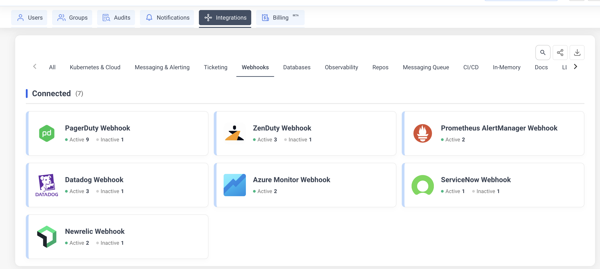
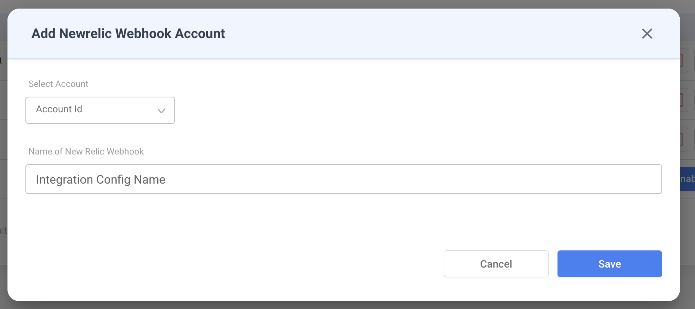
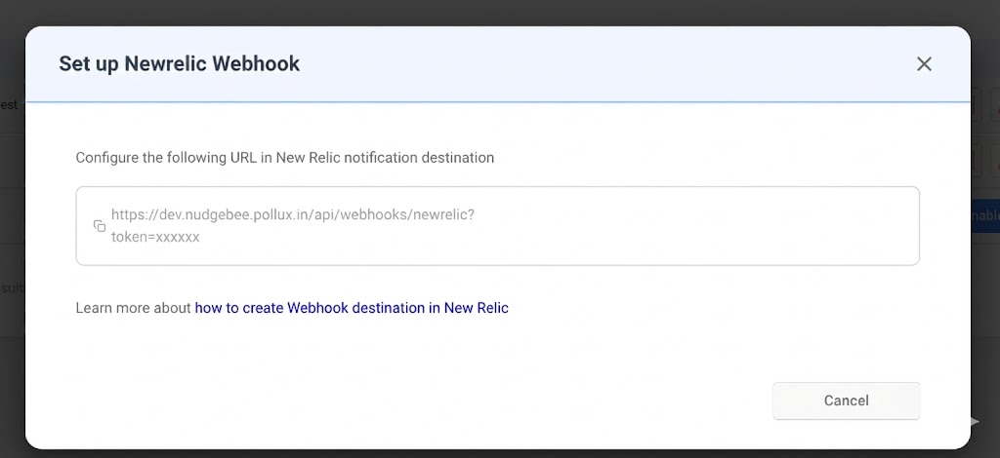

# New Relic Webhook

Receive New Relic alert notifications directly into NudgeBee. When an alert fires, NudgeBee automatically creates an event enriched with related logs, traces, and entity details from your New Relic account.

---

## Step 1: Create the Webhook in NudgeBee

1. Navigate to **Integrations** > **Webhooks** tab.
2. Click the **New Relic Webhook** card.



3. Fill in the configuration:
   - **Integration Config Name** — a descriptive name (e.g., `Production Alerts`).
   - **Account** — select the NudgeBee account to receive events.



4. Click **Save**. NudgeBee generates a unique webhook URL.

5. **Copy the webhook URL** from the dialog. It follows this format:

```
https://<your-nudgebee-domain>/api/webhooks/newrelic?token=<generated-token>
```



Keep this URL — you will paste it into New Relic in the next step.

---

## Step 2: Configure New Relic Workflow

1. In New Relic, go to **Alerts & AI** > **Workflows**.
2. Click **Add a workflow** (or edit an existing one).
3. Configure the workflow filter to select which issues trigger the webhook.
4. Under **Notify**, click **Webhook** as the notification channel.
5. Create a new **Webhook destination**:
   - **Endpoint URL**: paste the NudgeBee webhook URL from Step 1.
   - **Custom Headers**: none required (authentication is handled via the `token` query parameter).

6. Set the **payload template** to the following JSON:

```json
{
  "id": {{ json issueId }},
  "issueId": {{ json issueId }},
  "issueUrl": {{ json issuePageUrl }},
  "title": {{ json annotations.title.[0] }},
  "priority": {{ json priority }},
  "state": {{ json state }},
  "activatedAt": {{ json activateAt }},
  "closedAt": {{ json closedAt }},
  "acknowledgedAt": {{ json acknowledgedAt }},
  "createdAt": {{ json createdAt }},
  "updatedAt": {{ json updatedAt }},
  "conditionFamilyId": {{ json conditionFamilyId }},
  "conditionName": {{ json accumulations.conditionName.[0] }},
  "conditionId": {{ json entitiesData.ids }},
  "entityGuids": {{ json entitiesData.ids }},
  "entityNames": {{ json entitiesData.names }},
  "impactedEntities": {{ json entitiesData.entities }},
  "sources": {{ json accumulations.source }},
  "labels": {{ json labels }},
  "annotations": {{ json annotations }},
  "policyName": {{ json accumulations.policyName.[0] }},
  "policyId": {{ json labels.policyIds.[0] }},
  "incidentIds": {{ json incidentIds }},
  "totalIncidents": {{ json totalIncidents }},
  "accountId": {{ json nrAccountId }},
  "accountName": {{ json accumulations.origins }},
  "workflowId": {{ json workflowId }},
  "workflowName": {{ json workflowName }},
  "description": {{ json annotations.description.[0] }},
  "violationChartUrl": {{ json violationChartUrl }}
}
```

7. Click **Save** to activate the workflow.

> For more details on New Relic webhook destinations, see [New Relic's documentation](https://docs.newrelic.com/docs/alerts/get-notified/notification-integrations/#webhook).

---

## How It Works

When New Relic sends a webhook payload to NudgeBee, the following processing occurs:

### State Mapping

| New Relic State | NudgeBee Status |
|-----------------|-----------------|
| `CREATED`, `ACTIVATED`, `OPEN` | **Firing** |
| `ACKNOWLEDGED` | **Acknowledged** |
| `CLOSED`, `RESOLVED` | **Resolved** |

### Priority Mapping

| New Relic Priority | NudgeBee Priority |
|--------------------|-------------------|
| `CRITICAL`, `HIGH` | High |
| `MEDIUM` | Medium |
| `LOW`, `INFO` | Low |

### Automatic Evidence Collection

If a [New Relic observability integration](../Observability/newrelic) is also configured for the same account, NudgeBee automatically enriches each alert event with:

1. **Related Logs** — fetched from New Relic for the impacted entity, covering a 30-minute window before and after the alert activation time.
2. **Related Traces** — distributed traces for the impacted service in the same time window.
3. **Entity Details** — metadata fetched via the entity GUID, including:
   - For APM applications: error rate, average response time, throughput.
   - For infrastructure hosts: CPU, memory, and disk utilization.

### Event Deduplication

Events are deduplicated using a fingerprint derived from the condition ID and issue ID (`<conditionId>-<issueId>`). Repeated webhook calls for the same issue update the existing event instead of creating duplicates.

---

## Verify the Integration

1. In New Relic, trigger a test alert (or use an existing alert condition that fires on test data).
2. Confirm the workflow is configured to send to the NudgeBee webhook destination.
3. In NudgeBee, navigate to **Events** and verify the alert appears with:
   - Correct title and priority
   - Alert details evidence attached
   - Related logs and traces (if observability integration is configured)

---

## Troubleshooting

| Issue | Resolution |
|-------|------------|
| Webhook URL returns 401 | Verify the `token` query parameter in the URL is correct. Regenerate the integration if needed. |
| Events created but no logs/traces attached | Ensure a [New Relic observability integration](../Observability/newrelic) is configured for the same NudgeBee account. |
| Events not appearing at all | Check that the New Relic Workflow is active and the filter matches your alert conditions. |
| Duplicate events | Expected behavior — NudgeBee deduplicates by `conditionId-issueId`. State updates (e.g., ACTIVATED → CLOSED) update the existing event. |
