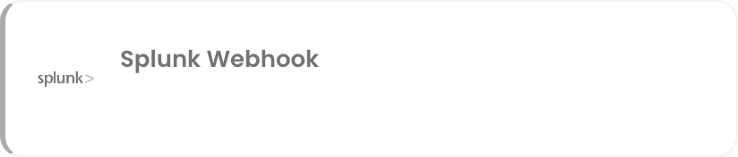

# Splunk Webhook

The Splunk webhook integration lets Splunk push alerts into NudgeBee. Each alert becomes a NudgeBee event that can be triaged, correlated with cluster telemetry, and used to trigger automations.

---

## Step 1: Create the Webhook in NudgeBee

1. Navigate to **Admin** > **Integrations** > **Webhooks**.
2. Select **Splunk Webhook** and click **Add Splunk Webhook Account**.
3. Fill in the form:
   * **Name of Splunk Webhook \*** (Required) — a descriptive name, e.g. `splunk-prod`.
   * **Select Account \*** (Required) — the NudgeBee account that should receive these events.
4. Click **Save**.

NudgeBee generates a unique webhook URL for the integration, in the same form used by the other inbound webhooks:

```
https://<your-nudgebee-domain>/api/webhooks/splunk_webhook?token=<generated-token>
```

5. **Copy the webhook URL.** You will paste it into Splunk in the next step.

:::caution
The `token` query parameter authenticates the sender. Treat the full URL as a secret — anyone holding it can create events in your tenant. If it leaks, delete the integration and create a new one to rotate the token.
:::

---



## Step 2: Point Splunk at the URL

Create a Splunk webhook alert action in Splunk and set its destination to the URL from Step 1:

- **Method**: `POST`
- **Content-Type**: `application/json`
- **URL**: the NudgeBee webhook URL, token included

Then attach it to the alert rules whose notifications you want in NudgeBee. Send a test notification if Splunk offers one.

> **Reference:** [Splunk webhook alert action documentation](https://docs.splunk.com/Documentation/Splunk/latest/Alert/Webhooks)

---

## Step 3: Verify

1. Trigger a test notification from Splunk, or wait for a real alert to fire.
2. In NudgeBee, open **Troubleshoot** > **Events**. The event should appear within a few seconds.
3. Open it and confirm the alert name and severity carried across, and that the impacted workload is linked where the payload identifies one.

---

## Troubleshooting

| Symptom | Likely Cause | Fix |
|---------|-------------|-----|
| No event appears | Splunk cannot reach the NudgeBee URL | Confirm the NudgeBee endpoint is reachable from Splunk's notification sender. Check egress rules on both sides. |
| `401` or `403` from the endpoint | The `token` parameter is missing or wrong | Re-copy the full URL from the integration — the token is part of the query string, and is easy to drop when pasting. |
| Event appears with no workload linked | The payload carries no identifier NudgeBee can match | Include the resource, host or service name in the alert payload so it can be matched to a workload. |
| Duplicate events for one alert | Two notification rules point at the same URL | Consolidate them in Splunk, or use separate integrations per environment. |
| Alerts never resolve in NudgeBee | Only firing notifications are being sent | Configure Splunk to send resolution notifications to the same destination. |

---

## Helpful Links

- [Webhooks overview](./index.md)
- [Splunk webhook alert action documentation](https://docs.splunk.com/Documentation/Splunk/latest/Alert/Webhooks)
- [Workflow triggers](../../features/workflow-builder/triggers.md)
