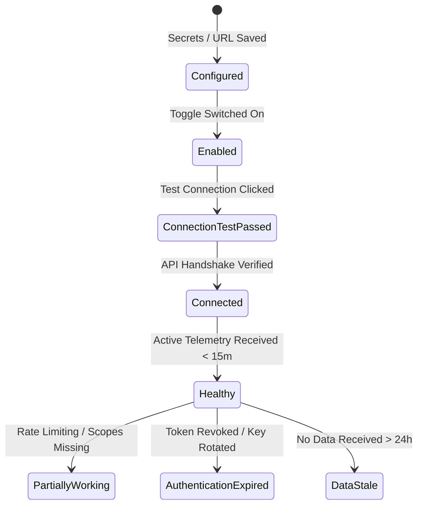

# Integrations

NudgeBee ships with **30+ integrations** that connect to the tools and platforms you already use — observability systems, notification channels, ticketing systems, code repositories, CI/CD pipelines, and LLM providers. No need to manually code connectors; each integration is ready to configure and extends NudgeBee's Cloud-Ops Intelligence.

You do not need to set up all integrations at once. Start with the essentials (observability and notifications), then add more as needed.

:::info
Some integrations are **required** for NudgeBee to function (Kubernetes cluster and observability source). Others are **optional** and unlock additional capabilities. See the [capability map](../features/) for a full breakdown of what each integration enables.
:::

## Available Integrations

* **[Observability](./Observability/)** — Connect your existing monitoring tools (Prometheus, Datadog, New Relic, Azure Monitor, etc.) so NudgeBee can access metrics, logs, and traces for troubleshooting and analysis. **Required** for core functionality.

* **[Notifications](./Notifications/)** — Configure notification channels ([Slack](./Notifications/slack.md), [Microsoft Teams](./Notifications/msteams.md), [Google Chat](./Notifications/google_chat.md)) to receive alerts, event summaries, and optimization recommendations. **Recommended**.

* **[NudgeBee AI / LLM — BYOM](./LLM/)** — Integrate LLM models to power [NuBi](../features/ai/) and the pre-built AI agents for troubleshooting, root cause analysis, and agentic automation. SaaS users get a managed LLM by default; self-hosted users bring their own model (BYOM). **Recommended**.

* **[MCP (Model Context Protocol)](./MCP/)** — Connect external or on-prem MCP servers so their tools become available to NudgeBee AI tasks (`llm.mcp_call`, NuBi). Supports direct HTTP and Forager-proxied (HTTP or stdio) modes. **Optional**.

* **[Tickets](./Tickets/)** — Connect ticketing systems ([Jira](./Tickets/jira.md), [ServiceNow](./Tickets/servicenow.md), [PagerDuty](./Tickets/pagerduty.md), [GitHub Issues](./Tickets/github_issues.md), [GitLab Issues](./Tickets/gitlab.md)) to create, track, and auto-respond to incidents. **Optional**.

* **[GitHub](./Code%20Repository/GitHub/github-integration.md)** — Connect GitHub for code analysis and automated pull requests for optimization recommendations. **Optional**.

* **[GitLab](./Code%20Repository/GitLab/gitlab-integration.md)** — Connect GitLab for issue tracking and automated merge requests. **Optional**.

* **[CI/CD - ArgoCD](./CICD/argocd-integration.md)** — Connect ArgoCD for deployment change correlation and rollback insights. **Optional**.

* **[Authentication](./Authentication/)** — Integrate NudgeBee with an existing identity provider — OAuth SSO (Google, Okta, OneLogin, Azure AD / B2C, Auth0), LDAP, Teleport, or SAML 2.0. OAuth SSO and friends are available in every edition; SAML 2.0 is **Enterprise** and **Cloud** only. **Optional**.

---

## Integration Health States & Lifecycle

In the NudgeBee Console under **Settings $\rightarrow$ Integrations**, each configured integration displays an operational status badge:

### Health State Definitions

| State | Badge Color | Meaning & Criteria | Operational Implication |
| :--- | :--- | :--- | :--- |
| **Configured** | ⚪ Gray | Credentials and endpoints have been saved, but the integration is not yet enabled for active workloads. | Inactive; no traffic is routed. |
| **Enabled** | 🔵 Blue | The integration is turned on, but an active health check has not yet completed. | Initializing. |
| **Connection Test Passed** | 🟢 Green | An explicit interactive test (`Test Connection`) succeeded against the vendor's API. | Credentials and network routes are valid. |
| **Connected** | 🟢 Green | Continuous bidirectional communication or polling is active. | Normal baseline operations. |
| **Healthy** | 🟢 Green | Telemetry or events have been actively received within the expected window (last 15 minutes). | Full end-to-end functionality working. |
| **Partially Working** | 🟡 Yellow | Basic authentication succeeded, but secondary features failed due to missing sub-scopes. | Partial degradation. Inspect permission scopes. |
| **Authentication Expired** | 🔴 Red | API key revoked, OAuth token expired, or private key rejected (`401 Unauthorized`). | Action required immediately: re-authenticate. |
| **Data Stale** | 🟠 Orange | Credentials are valid, but no new telemetry has arrived for over 24 hours. | Check source telemetry pipeline. |

---

## Step-by-Step Credential Rotation & Reconnection

When rotating credentials or recovering an expired integration:

1. Navigate to **Settings $\rightarrow$ Integrations**.
2. Locate the failing integration and click the **Three Dots Menu (...) $\rightarrow$ Edit Configuration**.
3. Enter the updated API key, client secret, or upload the new JSON service key.
4. Click **Test Connection** to verify connectivity.
5. Click **Save Changes**. The backend immediately queues a validation run and clears any `Authentication Expired` status badge.

---

## Provider-Specific Troubleshooting Guides

For troubleshooting specific integration providers, refer directly to the provider documentation:

- **Observability**: [Datadog](./Observability/datadog.md#troubleshooting-datadog-integration), [New Relic](./Observability/newrelic.md#troubleshooting-new-relic-integration), [Dynatrace](./Observability/dynatrace.md#troubleshooting-dynatrace-integration)
- **Notifications**: [Slack](./Notifications/slack.md#troubleshooting-slack-integration), [MS Teams](./Notifications/msteams.md#troubleshooting-ms-teams-integration), [Google Chat](./Notifications/google_chat.md#troubleshooting-google-chat-integration)
- **Tickets**: [Jira](./Tickets/jira.md#troubleshooting-jira-integration), [ServiceNow](./Tickets/servicenow.md#troubleshooting-servicenow-integration), [PagerDuty](./Tickets/pagerduty.md#troubleshooting-pagerduty-integration), [Ticketing Diagnostic Guide](./Tickets/ticket-integrations-troubleshooting.md)
- **Cloud**: [AWS](../features/Cloud/AWS.md#troubleshooting-aws-integration), [Azure](../features/Cloud/Azure.md#troubleshooting-azure-integration), [GCP](../features/Cloud/GCP.md#troubleshooting-gcp-integration), [Cloud Sync Troubleshooting](../features/Cloud/troubleshooting.md)
- **LLM**: [OpenAI](./LLM/OpenAI/index.md#troubleshooting-openai-integration), [AWS Bedrock](./LLM/Aws/bedrock.md#troubleshooting-amazon-bedrock-integration)

:::tip
**Recommended setup order**: Observability source first, then a notification channel, then an LLM provider. This gives you monitoring, alerts, and AI-powered insights right away.
:::
