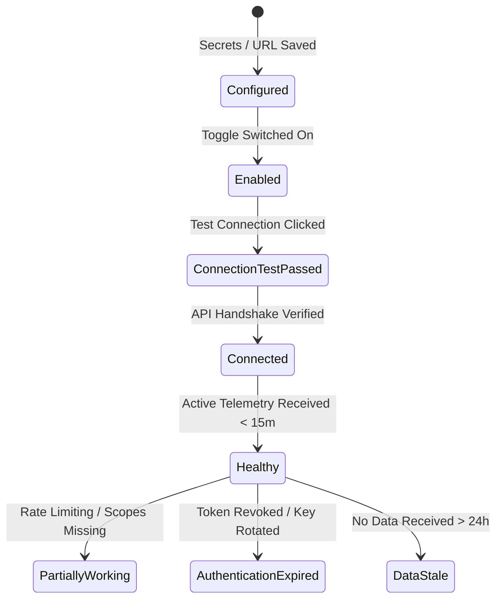

# Troubleshoot Integrations & Health States

NudgeBee integrates with your existing DevOps, Observability, Ticketing, and Cloud toolchain. This guide establishes the shared **Operational Health Model** across all integration types and details how to diagnose failing integrations using built-in tests and the `nudgebee_integration_diagnose` engine.

---

## 1. The Unified Integration Health State Taxonomy

In the NudgeBee Console under **Settings $\rightarrow$ Integrations**, each integration displays an operational status badge:



### Health State Definitions

| State | Badge Color | Meaning & Criteria | Operational Implication |
| :--- | :--- | :--- | :--- |
| **Configured** | ⚪ Gray | Credentials and endpoints have been saved, but the integration is not yet enabled for active workloads. | Inactive; no traffic is routed. |
| **Enabled** | 🔵 Blue | The integration is turned on, but an active health check has not yet completed. | Initializing. |
| **Connection Test Passed** | 🟢 Green | An explicit interactive test (`Test Connection`) succeeded against the vendor's API. | Credentials and network routes are valid. |
| **Connected** | 🟢 Green | Continuous bidirectional communication or polling is active. | Normal baseline operations. |
| **Healthy** | 🟢 Green | Telemetry or events have been actively received within the expected window (last 15 minutes). | Full end-to-end functionality working. |
| **Partially Working** | 🟡 Yellow | Basic authentication succeeded, but secondary features (e.g. creating tickets, fetching trace spans) failed due to missing sub-scopes. | Partial degradation. Inspect permission scopes. |
| **Authentication Expired** | 🔴 Red | API key revoked, OAuth token expired, or private key rejected (`401 Unauthorized`). | Action required immediately: re-authenticate. |
| **Data Stale** | 🟠 Orange | Credentials are valid, but no new telemetry has arrived for over 24 hours. | Check source telemetry pipeline. |

---

## 2. Diagnostics by Integration Family

---

### A. Observability Integrations (Datadog, Dynatrace, New Relic, Chronosphere)
* **Required Permissions**: Read-only API tokens with Metrics, Query, and Infrastructure Read scopes.
* **Connection Test Behavior**: Queries vendor API for a single host or metric query (`/api/v1/validate` or `/v1/metrics`).
* **Common Errors**:
  * `403 Forbidden`: Token lacks Query or APM permissions.
  * `Regional Endpoint Mismatch`: Using `api.datadoghq.com` (US1) instead of `api.datadoghq.eu` (EU) or `us3.datadoghq.com`.
* **Verification**: In Troubleshoot view, verify that metric evidence cards appear when investigating an incident.

---

### B. Ticketing Integrations (Jira, ServiceNow, PagerDuty, GitHub Issues)
* **Required Permissions**:
  * **Jira**: Project Issue Create, Issue Edit, Add Comments, Browse Projects.
  * **ServiceNow**: `incident_manager` or custom integration role with write access to `incident` table.
* **Connection Test Behavior**: Fetches project metadata and issue types.
* **Common Errors**:
  * `Mandatory Custom Field Missing`: Jira project requires a mandatory field (e.g., "Environment", "Team") not mapped in NudgeBee ticket configuration.
  * `Token Revoked`: User API token expired or user changed password.

---

### C. Notification Integrations (Slack, MS Teams, Google Chat)
* **Required Scopes**:
  * **Slack**: `chat:write`, `channels:read`, `groups:read`, `im:write`, `chat:write.customize`.
* **Connection Test Behavior**: Sends an ephemeral or test verification card to the designated test channel.
* **Common Errors**:
  * `channel_not_found`: Private channel where the `@NudgeBee` app was not invited (`/invite @NudgeBee`).
  * `not_in_channel`: Bot lacks write permissions in restricted enterprise channels.

---

### D. LLM Integrations (OpenAI, Azure OpenAI, AWS Bedrock, GCP Vertex AI)
* **Required Permissions**: Model execution permissions (`bedrock:InvokeModel`, `aiplatform.endpoints.predict`).
* **Connection Test Behavior**: Issues a 1-token dry-run prompt (`"ping"`) to verify latency and model quota.
* **Common Errors**:
  * `QuotaExceeded (429)`: Token/minute limits exhausted on OpenAI/Azure deployment.
  * `ModelNotProvisioned`: Selected model (e.g. `claude-3-5-sonnet`, `gpt-4o`) is not deployed in the configured region.

---

## 3. Step-by-Step Credential Rotation & Reconnection

When rotating credentials or recovering an expired integration:

1. Navigate to **Settings $\rightarrow$ Integrations**.
2. Locate the failing integration and click the **Three Dots Menu (...) $\rightarrow$ Edit Configuration**.
3. Enter the updated API key, client secret, or upload the new JSON service key.
4. Click **Test Connection**:
   - Verify that the test outputs `Connection successful`.
5. Click **Save Changes**.
6. The backend immediately queues a validation run and clears the `Authentication Expired` status badge.

---

## 4. NuBi Diagnostics with `nudgebee_integration_diagnose`

When diagnosing an unhealthy integration, NuBi automatically runs automated diagnostic probes:

```bash
# Example NuBi Diagnostic Command
nubi diagnose integration --name="jira-production"
```

**NuBi Evaluates**:
1. Network round-trip latency to vendor endpoint.
2. HTTP status code and response payload.
3. Token scope validation against required feature capabilities.
4. Last 5 errors recorded in the integration audit log.

### NuBi Prompts for Integration Triage
- *"Diagnose why the Jira integration cannot create tickets."*
- *"Test connectivity to all configured LLM providers."*
- *"Why is Datadog observability integration showing Data Stale?"*
