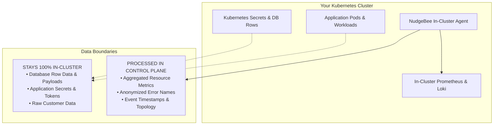

# Telemetry & Data Privacy

## Does self-hosted NudgeBee phone home?

**No.** The self-hosted NudgeBee Server and Agent do **not** send usage
analytics, telemetry, or "phone-home" data back to NudgeBee. There is nothing
to opt out of, because nothing is collected.

Your operational data — metrics, logs, traces, events, and the Semantic
Knowledge Graph built from them — stays within your own infrastructure.

## Zero-Telemetry & Data Isolation Architecture

### Data Boundary Classification

| Data Category | Where It Stays | Is It Sent to External LLMs? |
|---|---|---|
| **Database Row Data & Payloads** | **100% In-Cluster** | **No** — Never accessed or transmitted. |
| **Kubernetes Secrets & Certificates** | **100% In-Cluster** | **No** — Metadata names may be inspected; secret values are never read. |
| **Pod Logs & Traces** | **In-Cluster Observability** | **Sanitized Only** — Only selected log snippets during an active incident triage prompt. |
| **Resource Metrics (CPU/RAM/Disk)** | NudgeBee Server | **No** — Evaluated via deterministic statistical algorithms for right-sizing. |
| **Topology & Dependency Graph** | NudgeBee Server | **No** — Stored in local PostgreSQL / Qdrant instance. |

---

## Where your data goes

NudgeBee only makes outbound connections to the services **you explicitly
configure**:

| Connection | When it happens | What it's for |
|---|---|---|
| **Container registry** | During install/upgrade only | Pulling images — `ghcr.io/nudgebee` (Community) or `registry.nudgebee.com` (Enterprise). |
| **Your LLM provider** | When you use AI features | If you configure [BYOM](./integrations/LLM/index.md), prompts and context are sent to the provider you chose (OpenAI, Bedrock, a self-hosted model, etc.). With a self-hosted model (e.g. Ollama), this stays inside your network. |
| **Integrations you connect** | When you use them | Slack, Jira, GitHub, observability backends, etc. — only the integrations you set up, only to their endpoints. |
| **Cloud provider pricing APIs** | For cost analysis | AWS / Azure / GCP public pricing endpoints, used by cost optimization. |

:::info Air-gapped Deployments
Because there is no telemetry, the Community and Enterprise editions run fully offline once images are mirrored to an internal registry and you use a self-hosted LLM (e.g. Ollama or vLLM). See the [Server Installation Guide](./installation/server/index.md) for mirroring guidance.
:::

## NudgeBee Cloud (SaaS)

When you use [NudgeBee Cloud](https://app.nudgebee.com) <Cloud/>, NudgeBee hosts
and operates the server on your behalf, so the data you connect is processed by
the managed service. The hosted offering is SOC 2 Type II and ISO 27001
certified. This page describes the **self-hosted** editions; the SaaS data
handling is covered by your NudgeBee Cloud agreement.
